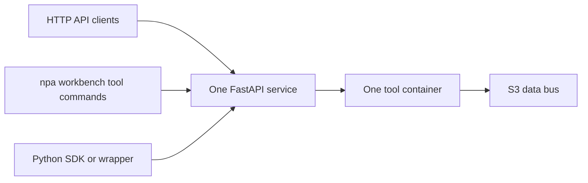

# Contributing Workbench Tools
## Scope
This document covers adding a new Workbench tool to Nebius Physical AI.

It is about the tool layer:

- A deployable tool container.
- A tool HTTP service or documented service endpoint.
- A `npa workbench ...` CLI surface.
- A Python-callable wrapper or SDK surface.
- Tests, docs, workflow hooks, and agent skill files.

It does not define platform orchestration internals, the agentic layer, or new
cross-tool composition systems. Those are separate layers. The current repo
architecture is indexed in `docs/architecture/contributor-context.md` and
`skills/atomic/architecture/SKILL.md`.

The strongest full-tool reference is LeRobot:

- `npa/src/npa/cli/workbench/lerobot.py`
- `npa/src/npa/workbench/lerobot/__init__.py`
- `npa/docker/workbench/lerobot/Dockerfile`
- `skills/tools/lerobot/SKILL.md`
- `npa/tests/cli/test_lerobot_cli.py`

The cleanest service, CLI, and compatibility SDK reference is detection
training:

- `npa/src/npa/workbench/detection_training/service.py`
- `npa/src/npa/workbench/detection_training/schemas.py`
- `npa/src/npa/cli/workbench/detection_training.py`
- `npa/src/npa/sdk/workbench/detection_training.py`
- `npa/tests/workbench/test_detection_training.py`

Detection training is not one of the 8 validated tools listed in the
architecture context. It is a BDD100K pipeline workbench service. Use it for the
three-access implementation shape, not as evidence that the 8-tool list has
changed.
## Workbench Tool Architecture
The intended Workbench pattern is one tool capability exposed through three
access modes:

- HTTP API, the source of truth for service behavior.
- CLI, the operator-facing client under `npa workbench`.
- Python SDK or wrapper, the programmable client.

Do not duplicate core training, inference, import, status, or conversion logic
separately across layers. Put behavior in the service or a shared implementation
module, then make the CLI and SDK call that surface.

Current code is mixed. Detection training follows this most directly:

- FastAPI app in `npa/src/npa/workbench/detection_training/service.py`.
- Pydantic request and response models in `npa/src/npa/workbench/detection_training/schemas.py`.
- CLI commands in `npa/src/npa/cli/workbench/detection_training.py`.
- Compatibility SDK functions in `npa/src/npa/sdk/workbench/detection_training.py`.

LeRobot is the main full-tool exemplar, but much of its current training path is
implemented as CLI orchestration over VM, container, or serverless runtime
helpers in `npa/src/npa/cli/workbench/lerobot.py`. Treat that as current code,
not as a reason to add new duplication.



For new tools, keep the container as the deployment unit and the service
endpoint as the invocation unit. The Workbench tool pattern is documented in
`skills/tools/workbench-tool/SKILL.md`.
## Required Interfaces
Every new Workbench tool needs a coherent HTTP, CLI, and Python-callable
surface. The exact workload verbs are tool-specific, but the management verbs
must be predictable.
### HTTP API
For a new first-party wrapper service, start from:

- `npa/src/npa/workbench/detection_training/service.py`
- `npa/src/npa/workbench/detection_training/schemas.py`
- `npa/src/npa/workbench/lancedb/server.py`

Required minimum for new first-party services:

- `GET /health`, returns a machine-checkable status.
- `GET /status`, when the service owns jobs, runs, or lifecycle state.
- `GET /system-info`, when the service owns runtime hardware or dependency state.
- A list endpoint for service-managed objects. Prefer `GET /list` for new
  services, unless the domain has a clearer noun path.
- One or more capability endpoints, for example `POST /train`, `POST /eval`,
  `POST /serve`, `POST /infer`, `POST /import-bdd100k`, or `POST /backfill`.

Use Pydantic schemas for request and response bodies, following
`npa/src/npa/workbench/detection_training/schemas.py`. For domain-specific
datasets, keep schema governance explicit. The BDD100K label-map pattern in
`docs/workbench-yaml-guide.md` exists because generic flexibility would push
mapping code back onto customers.

Current services do not all match the minimum endpoint set. See
`Known Deviations` before copying an existing service wholesale.
### CLI
Register the CLI under `npa workbench` through
`npa/src/npa/cli/workbench/__init__.py`.

The current common management commands are:

- `deploy`
- `status`
- `list`

Most named tools also expose `system-info`; new tools should include it.

Workload verbs are chosen by domain:

- LeRobot: `train`, `eval`, `serve`, `infer`, `list-checkpoints`.
- FiftyOne: `launch`, `load-dataset`, `curate`, `eval`, `open`.
- Genesis: `train-teacher`, `generate-demos`, `eval-teacher`, `diagnose`, `tune`.
- Isaac Lab: `train`, `eval`, `export-lerobot`.
- Cosmos: `serve`, `train`, `finetune`, `optimize`, `infer`.
- GR00T: `download`, `finetune`, `eval`, `serve`, `infer`, `convert`.
- LanceDB: `import-bdd100k`, `backfill`, `create-mv`, `query-table`.
- SONIC: `train`, `serve`.

The actual command implementations are in:

- `npa/src/npa/cli/workbench/lerobot.py`
- `npa/src/npa/cli/fiftyone/__init__.py`
- `npa/src/npa/cli/genesis/__init__.py`
- `npa/src/npa/cli/isaac_lab/__init__.py`
- `npa/src/npa/cli/cosmos/__init__.py`
- `npa/src/npa/cli/groot/__init__.py`
- `npa/src/npa/cli/workbench/lancedb/cli.py`
- `npa/src/npa/cli/workbench/sonic/cli.py`

`--input-path` and `--output-path` are the public cross-tool handoff flags.
Validate them with the shared path contract in
`npa/src/npa/cli/path_contract.py`.

The rule is:

- `--input-path` reads an `s3://` URI.
- Some read-side commands may also accept a Hugging Face dataset or checkpoint
  identifier when the tool explicitly opts in.
- `--output-path` writes an `s3://` URI.
- Public CLI handoff paths must not require VM-local paths, local files,
  `file://` URIs, or plain HTTP URLs.

LeRobot shows the path contract in `train`, `eval`, `serve`, and `infer` in
`npa/src/npa/cli/workbench/lerobot.py`. Detection training shows compatibility
aliases for older flags in `npa/src/npa/cli/workbench/detection_training.py`.
### Python SDK Or Wrapper
There are two Python-callable layers in the current repo.

The compatibility namespace is:

- `npa/src/npa/sdk/workbench/__init__.py`
- `npa/src/npa/sdk/workbench/detection_training.py`
- `npa/src/npa/sdk/workbench/lancedb/__init__.py`

The broader current wrapper layer is:

- `npa/src/npa/_sdk.py`
- `npa/src/npa/workbench/lerobot/__init__.py`
- `npa/src/npa/workbench/fiftyone/__init__.py`
- `npa/src/npa/workbench/genesis/__init__.py`
- `npa/src/npa/workbench/isaac_lab/__init__.py`
- `npa/src/npa/workbench/cosmos/__init__.py`
- `npa/src/npa/workbench/groot/__init__.py`
- `npa/src/npa/workbench/lancedb/__init__.py`

For a new tool, add a Python-callable wrapper in the `npa.workbench` namespace.
If the tool is a first-party HTTP service with stable request and response
models, also add it to the compatibility namespace used by detection training
and LanceDB.

The SDK surface should not contain a second implementation of the workload. It
should call the service or shared implementation layer.
## Containerization
Every Workbench tool needs a container image under `npa/docker/workbench/`. Use the
existing Dockerfiles as the reference set, especially
`npa/docker/workbench/lerobot/Dockerfile`, `npa/docker/workbench/fiftyone/Dockerfile`,
`npa/docker/workbench/lancedb/Dockerfile`, and
`npa/docker/workbench/detection-training/Dockerfile`.

Base image and tag conventions are backed by:

- `npa/docker/workbench/tags.yaml`
- `npa/docker/workbench/check_tag_consistency.py`
- `docs/security/image-reproducibility.md`
- `.github/workflows/image-security-scan.yml`

The current tag-family strategy is `cuda12` for production CUDA 12.x images and
`cuda13-b300` for B300 and future Blackwell images. The latter remains blocked
or vendor-paced for much of the stack.

LeRobot has both a CUDA 12 image and a B300-specific Dockerfile:

- `npa/docker/workbench/lerobot/Dockerfile`
- `npa/docker/workbench/lerobot/Dockerfile.b300`

Do not invent a third tag family in a new contribution. If a tool genuinely
needs a new family, update `npa/docker/workbench/tags.yaml`,
`npa/docker/workbench/check_tag_consistency.py`, and `docs/security/image-reproducibility.md`
in a separate design change.

Use a Nebius registry prefix supplied by configuration. Current code uses
`NPA_REGISTRY` as a full prefix and resolves images through
`npa/src/npa/deploy/images.py` and `npa/src/npa/clients/config.py`. The registry
shape is:

```text
cr.eu-north1.nebius.cloud/${NPA_REGISTRY_ID}/npa-tool:${TAG}
```

Build scripts should follow the `--registry` and `--push` shape used by:

- `npa/docker/workbench/lerobot/build.sh`
- `npa/docker/workbench/groot/build.sh`
- `npa/docker/workbench/base/cuda13-b300/build.sh`

Keep image entrypoints explicit. LeRobot runs `python -m npa.server.app`;
FiftyOne intentionally uses `/bin/bash` because the CLI launches the app command
from `npa/src/npa/cli/fiftyone/__init__.py`.
## Runtime Modes
The repo supports several runtime modes. A new tool should support only the
modes that the existing code can actually exercise for that kind of workload.
### VM
VM runtime provisions or reuses a Nebius VM, then manages the tool over SSH.
This is the mature path for tools with hard host requirements or large stacks.
Examples:

- `npa/src/npa/cli/workbench/lerobot.py`
- `npa/src/npa/cli/fiftyone/__init__.py`
- `npa/src/npa/cli/genesis/__init__.py`
- `npa/src/npa/cli/isaac_lab/__init__.py`
- `npa/src/npa/cli/cosmos/__init__.py`
- `npa/src/npa/cli/groot/__init__.py`

Terraform, config, and SSH helpers live in `npa/src/npa/deploy/`,
`npa/src/npa/clients/config.py`, and `npa/src/npa/clients/ssh.py`.
### Container On VM Or BYOVM
Container runtime runs the Workbench image on a VM. It is useful for repeatable
application deploys while keeping SSH and Docker control.

Examples are LeRobot and FiftyOne container deploy paths in their CLI files, and
BYOVM registration commands in `npa/src/npa/cli/cosmos/__init__.py`,
`npa/src/npa/cli/fiftyone/__init__.py`, and `npa/src/npa/cli/groot/__init__.py`.
If a tool supports BYOVM, preserve the config shape in
`npa/src/npa/clients/config.py`.
### Kubernetes Workbench Service
Kubernetes service mode is used for persistent services on the NPA cluster.

Examples are detection training deploy in
`npa/src/npa/cli/workbench/detection_training.py`, LanceDB deploy in
`npa/src/npa/cli/workbench/lancedb/deploy.py`, and FiftyOne Kubernetes deploy in
`npa/src/npa/cli/fiftyone/__init__.py`. Use the `workbench` namespace for
deployed services, as documented in `skills/tools/nebius-infra/SKILL.md`.
### Serverless
Serverless Jobs and Endpoints are the target for batch and serving workloads
when the tool can run without hard host assumptions.

Shared helpers:

- `npa/src/npa/clients/serverless.py`
- `npa/src/npa/serverless_common/subnet.py`
- `npa/src/npa/serverless_common/output.py`
- `npa/src/npa/serverless_common/platform.py`

Use `resolve_subnet` from `npa/src/npa/serverless_common/subnet.py`; do not add
new per-tool subnet discovery logic. Use
`build_serverless_output_upload_cmd` from `npa/src/npa/serverless_common/output.py`
for S3 output upload snippets.

Serverless is not universal. FiftyOne deploy rejects it, while FiftyOne
`load-dataset`, `curate`, and `eval` can submit serverless jobs. Isaac Lab
serverless exists for training but still depends on RT-core routing.
### SkyPilot Workflows
Workflow orchestration uses SkyPilot managed jobs, not Argo.

Shared code:

- `npa/src/npa/orchestration/skypilot/workflow.py`
- `npa/src/npa/orchestration/skypilot/_bin.py`
- `npa/src/npa/orchestration/skypilot/controller.py`
- `npa/src/npa/orchestration/skypilot/cleanup.py`

SkyPilot must be invoked through `NPA_SKYPILOT_BIN`, as resolved in
`npa/src/npa/orchestration/skypilot/_bin.py`. Do not rely on `sky` from `PATH`.
## Composition Contract
Cross-tool data flow is S3-only. Tools should not call each other directly to
move datasets, checkpoints, videos, embeddings, or metrics.

Use these references:

- `npa/src/npa/cli/path_contract.py`
- `npa/src/npa/clients/storage.py`
- `npa/src/npa/serverless_common/output.py`
- `docs/workbench-yaml-guide.md`
- `npa/workflows/workbench/skypilot/bdd100k-pipeline.yaml`

The public handoff flags are:

- `--input-path`, for source artifacts.
- `--output-path`, for result artifacts.

Typical S3 shapes:

```text
s3://${NPA_S3_BUCKET}/bdd100k-pipeline/${NPA_PIPELINE_RUN_ID}/lancedb/
s3://${NPA_S3_BUCKET}/bdd100k-pipeline/${NPA_PIPELINE_RUN_ID}/training/view-name/
s3://${NPA_S3_BUCKET}/isaac-lab-rl/${NPA_ISAAC_LAB_RUN_ID}/
```

Credentials are configured outside the repo. The user-facing template is
`docs/credentials.yaml.example`; the runtime loader is
`npa/src/npa/clients/credentials.py`.

The primary storage endpoint for the current cluster is:

```text
storage.eu-north1.nebius.cloud
```

The historical `storage.uk-south1.nebius.cloud` default is wrong for the
primary cluster. Deploy commands that support endpoint overrides should accept
`NPA_STORAGE_ENDPOINT` and pass the resolved URL through as `AWS_ENDPOINT_URL`
or `NEBIUS_S3_ENDPOINT`. See `docs/workbench/getting-started.md`,
`npa/src/npa/clients/credentials.py`, and
`npa/src/npa/cli/workbench/lancedb/deploy.py`.

Backing services are encapsulated. A pipeline stage should receive an S3 URI,
call a tool endpoint, and write the next S3 URI. The BDD100K pipeline in
`npa/workflows/workbench/skypilot/bdd100k-pipeline.yaml` is the worked example.
## Workflow YAML Conventions
Add a SkyPilot YAML only when a tool needs a repeatable pipeline or reference
workflow. Do not add Argo workflows.

References:

- `docs/workbench-yaml-guide.md`
- `npa/workflows/workbench/skypilot/bdd100k-pipeline.yaml`
- `npa/workflows/workbench/skypilot/isaac-lab-rl-train.yaml`
- `npa/workflows/workbench/skypilot/isaac-lab-rl-sweep.yaml`
- `npa/scripts/run_bdd100k_pipeline.py`
- `npa/scripts/run_isaac_lab_rl.py`

Current YAML rules:

- Use a multi-document SkyPilot YAML.
- Start with a workflow document containing `name` and `execution`.
- Add one task document per stage.
- Use `resources.cloud: kubernetes`.
- Use explicit `image_id` placeholders in committed YAML.
- Put per-run paths, service URLs, and domain schema values in `envs`.
- Build JSON request bodies with `jq` in `run`.
- Check `/health` before state-changing HTTP requests.
- Add a render-only, mock-endpoint, or snapshot validation path.

SkyPilot 0.12.2 does not support self-referencing interpolation inside the same
`envs` block. The BDD100K label-map block in `docs/workbench-yaml-guide.md` and
`npa/workflows/workbench/skypilot/bdd100k-pipeline.yaml` is the current pattern.

Training workflows must run headless. Isaac Lab shows the required `--headless`
flag in `npa/workflows/workbench/skypilot/isaac-lab-rl-train.yaml`.

Use `image_id` overrides for customer containers when the tool contract is
preserved. Isaac Lab documents this pattern in `docs/workbench-yaml-guide.md`
and the runner supports image rewriting through `npa/scripts/run_isaac_lab_rl.py`.
## GPU Routing
Use the shared GPU alias table in `npa/src/npa/serverless_common/platform.py`.

Current verified routing:

- H100 is the default choice for general training, CLIP embedding, and
  detection-training workflow stages. The BDD100K workflow requests H100 in
  `npa/workflows/workbench/skypilot/bdd100k-pipeline.yaml`.
- H200 is used by several serving or training defaults, including LeRobot and
  Cosmos serverless paths in their CLI files.
- L40S or RTX Pro 6000 is required for Isaac Lab simulation paths that need RT
  cores. The code enforces this in `npa/src/npa/cli/isaac_lab/__init__.py`, and
  the SkyPilot workflows request L40S.
- FiftyOne is CPU-first for the app, but curate and eval serverless paths allow
  H100 or RTX6000 and intentionally exclude L40S in
  `npa/src/npa/cli/fiftyone/__init__.py`.
- LanceDB CLIP backfill routes to H100 in the BDD100K workflow and
  `skills/tools/lancedb/SKILL.md`.
- B300 support is not a general default. `npa/docker/workbench/tags.yaml`,
  `docs/security/image-reproducibility.md`, and `docs/b300-validation-matrix.md`
  show B300 as validated for the base image and LeRobot ACT smoke training, with
  broader support still blocked or vendor-paced.

SONIC has a current code-vs-skill routing conflict. The skills say route SONIC
to H100, while the CLI defaults to L40S and warns for non-RT-core platforms.
Treat this as a known deviation, not as a pattern for new tools.

Do not add GPU routing rules only in prose. Encode routing in CLI defaults,
serverless platform resolution, workflow YAML resources, and the tool skill
file.
## Configuration And Secrets
Do not commit credentials, tokens, live project IDs, tenant IDs, bucket names,
or concrete registry IDs.

References:

- `SECURITY.md`
- `docs/credentials.yaml.example`
- `docs/workbench/getting-started.md`
- `npa/src/npa/clients/credentials.py`
- `npa/src/npa/clients/config.py`

Use environment variables and placeholders:

- `NEBIUS_PROJECT_ID`
- `NEBIUS_TENANT_ID`
- `NPA_REGISTRY`
- `NPA_REGISTRY_ID`
- `NPA_S3_BUCKET`
- `NPA_STORAGE_ENDPOINT`
- `AWS_ENDPOINT_URL`
- `NEBIUS_S3_ENDPOINT`
- `NPA_SKYPILOT_BIN`

Committed examples should use placeholders such as:

```text
<your-project-id>
<your-tenant-id>
<your-registry-id>
<your-bucket>
```

Secrets belong in the user credentials file described by
`docs/credentials.yaml.example`, not in source, docs, tests, or workflow YAMLs.

CI currently verifies tests, image security, and secret regression through:

- `.github/workflows/test.yml`
- `.github/workflows/image-security-scan.yml`
- `.github/workflows/gitleaks.yml`

Gitleaks runs the custom Nebius-pattern rules in `.gitleaks.toml` on pull
requests and pushes to `main`.
## Testing Requirements
Use the repo virtualenv for validation:

```bash
npa/.venv/bin/python -m pytest npa/tests/ --ignore=npa/tests/e2e --timeout=120 -q
```

Do not use bare `python` for repo validation.

Test layout:

- `npa/tests/cli/`
- `npa/tests/workbench/`
- `npa/tests/workflows/`
- `npa/tests/serverless_common/`
- `npa/tests/orchestration/skypilot/`
- `npa/tests/smoke/`
- `npa/tests/e2e/`

For a new tool, add focused tests for:

- CLI registration and help output.
- `deploy`, including dry-run or mocked infrastructure paths.
- Every management command: `status`, `system-info`, and `list`.
- Every capability command, for example `train`, `eval`, `serve`, `infer`,
  `load-dataset`, `backfill`, or `download`.
- Every HTTP endpoint success path.
- At least one failure path per endpoint.
- S3 path validation for `--input-path` and `--output-path`.
- Serverless command construction if the tool supports serverless.
- Container image naming or registry override behavior if the tool deploys an
  image.

Use `typer.testing.CliRunner` against `npa.cli.main:app`, as shown throughout
`npa/tests/cli/`.

Workflow YAMLs need programmatic checks. The current examples are:

- `npa/tests/workflows/test_bdd100k_pipeline.py`
- `npa/tests/workflows/test_isaac_lab_rl.py`

Required workflow checks include:

- Task order or execution grouping.
- Resource blocks.
- `image_id` placeholders.
- S3 output path construction.
- Mock endpoint or render-only validation.
- Snapshot hash when the workflow is intentionally stable.

E2E tests live under `npa/tests/e2e/` and are gated by
`NPA_INTEGRATION_E2E=1`. The gate is implemented in `npa/tests/e2e/conftest.py`.

Smoke tests live under `npa/tests/smoke/` or tool-specific CLI test files. Heavy
smoke tests must skip unless their environment variable is set. See
`docs/testing/smoke-tests.md`.

The current expected non-e2e baseline from
`skills/atomic/testing-conventions/SKILL.md` is:

```text
1242+ passed, 21 skipped, 1 xpassed, 0 failures
```

Promotion criteria must be evidence-based. Use numeric thresholds,
programmatic assertions, emitted JSON, artifact checks, and exact error messages.
Subjective inspection is not enough.
## Registration Steps
Register the CLI parent in `npa/src/npa/cli/workbench/__init__.py`, the
Python-callable namespace in `npa/src/npa/workbench/__init__.py`, and the
compatibility SDK namespace in `npa/src/npa/sdk/workbench/__init__.py` when the
tool has stable schemas. If the tool owns a published image, update
`npa/src/npa/deploy/images.py`.

Use `npa/src/npa/cli/workbench/lerobot.py` for a rich CLI reference,
`npa/src/npa/cli/workbench/lancedb/cli.py` for a modular CLI package,
`npa/src/npa/workbench/detection_training/service.py` for a first-party FastAPI
service, and `npa/src/npa/sdk/workbench/detection_training.py` for compatibility
SDK request handling.

Add an agent skill under `skills/tools/`; examples are
`skills/tools/lerobot/SKILL.md`, `skills/tools/fiftyone/SKILL.md`, and
`skills/tools/isaac-lab/SKILL.md`. Update `skills/atomic/architecture/SKILL.md`
only when the platform architecture changes.
## Documentation Requirements
A new tool needs human docs and agent docs.

Human docs should cover the tool role, upstream project, runtime modes, GPU
routing, image build path, credentials, input and output formats, S3 handoff
paths, CLI examples, Python wrapper examples, workflow YAML usage, known
limitations, and evidence required before promotion.

Put operator runbooks under `docs/workbench/cookbooks/`. Existing examples include
`docs/workbench/cookbooks/bdd100k-pipeline.md`,
`docs/workbench/cookbooks/lancedb-deploy-runbook.md`,
`docs/workbench/cookbooks/lancedb-vector-search.md`,
`docs/workbench/cookbooks/serverless-tools-coverage.md`, and
`docs/workbench/cookbooks/sonic-whole-body-control.md`. Put architecture rationale under
`docs/architecture/` only when it applies beyond one tool.

Do not create a templates directory for a new tool. Point contributors at a
worked implementation instead.
## Agent Skill Files
Agent skill files are instructions for coding agents, not marketing docs.

Existing examples are `skills/tools/lerobot/SKILL.md`,
`skills/tools/fiftyone/SKILL.md`, `skills/tools/genesis/SKILL.md`,
`skills/tools/isaac-lab/SKILL.md`, `skills/tools/cosmos/SKILL.md`,
`skills/tools/lancedb/SKILL.md`, `skills/tools/groot/SKILL.md`, and
`skills/tools/sonic/SKILL.md`.

The skill should include when to use it, the tool role, CLI and API contract,
input and output data contract, GPU routing, runtime modes, known issues,
validation status, and integration patterns with other tools. Write direct
instructions, not broad prose an agent must reinterpret.

Update `AGENTS.md` only if the skill list or root index changes.
## Commit And PR Conventions
Keep commits small and logical.

Commit messages use an imperative subject, subject length <=72 characters, and
one logical change per commit. Do not mix a tool addition with unrelated
infrastructure cleanup.

Examples:

```text
Add Isaac Lab workbench service
Fix CLIP GPU dispatch batch size
Update BDD100K label map for real data
```

Before review, a PR should pass the non-e2e test suite:

```bash
npa/.venv/bin/python -m pytest npa/tests/ --ignore=npa/tests/e2e --timeout=120 -q
```

Run focused tests for the touched surface as well. Documentation-only changes
can use `pytest -x --collect-only` as a smoke check. Parallel agent or operator
runs use scope-specific commit lock directories under `/tmp/npa-commit-lock/`;
remove the lock after commit and push.

When 3 or more commits land from an agent run, trigger the Claude Code review
pattern described in `skills/atomic/super-prompt-patterns/SKILL.md`. A
two-commit documentation run does not trigger that review rule.
## Design Principles
The core promise is to remove glue code. Contributions should avoid bespoke
adapters, path mapping scripts, and one-off orchestration logic that customers
must maintain. Prefer domain-specific schemas over generic catch-all fields when
the domain is known, as shown by the BDD100K label-map pattern in
`docs/workbench-yaml-guide.md`.

Use S3 as the data bus. Let customers bring their own containers when that is
the practical path, using the `image_id` override pattern in
`docs/workbench-yaml-guide.md` and `npa/scripts/run_isaac_lab_rl.py`. Prove
behavior with code, tests, or run artifacts.
## Where To Start
For setup, start with `docs/workbench/getting-started.md`,
`docs/credentials.yaml.example`, and `docs/orchestration/skypilot-setup.md`.
For known operational failure modes, read
`docs/workbench/troubleshooting/known-footguns.md`.
For the main full-tool reference, read `npa/src/npa/cli/workbench/lerobot.py`,
`npa/src/npa/workbench/lerobot/__init__.py`, `npa/docker/workbench/lerobot/Dockerfile`,
and `skills/tools/lerobot/SKILL.md`.

For the clean HTTP service, CLI, and SDK pattern, read
`npa/src/npa/workbench/detection_training/service.py`,
`npa/src/npa/workbench/detection_training/schemas.py`,
`npa/src/npa/cli/workbench/detection_training.py`, and
`npa/src/npa/sdk/workbench/detection_training.py`.

For workflow composition, read `docs/workbench-yaml-guide.md`,
`npa/workflows/workbench/skypilot/bdd100k-pipeline.yaml`,
`npa/workflows/workbench/skypilot/isaac-lab-rl-train.yaml`,
`npa/tests/workflows/test_bdd100k_pipeline.py`, and
`npa/tests/workflows/test_isaac_lab_rl.py`. For deeper rationale, read
`docs/architecture/contributor-context.md` and
`skills/atomic/architecture/SKILL.md`.
## Known Deviations
The repo is in active development. These are real current divergences, not new
patterns to copy.
### Top-level CLI registrations mix namespaces and platform utilities
FIXME(solutions): `npa/src/npa/cli/main.py` currently registers both the
`workbench` solution namespace and legacy platform-level utility commands
(`adapter`, `cluster`, `convert`, `demo`, `network`, `rerun`, `skypilot`, and
`viz`). These utilities predate the solutions model and remain top-level for
compatibility until a future migration moves them to appropriate namespaces.

New commands should be registered under a solution namespace, not as additional
top-level entries.
### First-party HTTP APIs are incomplete across the 8 tools
Appendix A says every validated tool exposes `/health`, `/status`,
`/system-info`, and `/list` as HTTP endpoints. Current code does not.

Detection training has `/health`, `/system-info`, `/runs`, `/train`, `/eval`,
and `/status` in `npa/src/npa/workbench/detection_training/service.py`.
LanceDB has `/health`, `/tables`, and domain endpoints in
`npa/src/npa/workbench/lancedb/server.py`. Cosmos and GR00T embed FastAPI
server source in their CLI files. FiftyOne uses the stock app surface.

New tools should implement the first-party service pattern, but do not claim all
existing tools already do.
### SDK namespace coverage is mixed
`npa/src/npa/sdk/workbench/__init__.py` exports only detection training and
LanceDB. Most named tools expose Python-callable wrappers through
`npa/src/npa/workbench/` and `npa/src/npa/_sdk.py`.

New tools should add a wrapper in `npa/src/npa/workbench/` and use the
compatibility SDK namespace when they have stable request and response schemas.
### SONIC is not registered in the workbench Python namespace
SONIC is registered in the CLI parent through
`npa/src/npa/cli/workbench/__init__.py`, and it has Docker and skill files.
However, `npa/src/npa/workbench/__init__.py` does not export `sonic`, and there
is no Sonic sibling directory under `npa/src/npa/workbench/`.

New tools should register both CLI and Python-callable surfaces.
### LanceDB and SONIC do not expose CLI system-info
Most named tools expose `system-info`. LanceDB's modular CLI registration in
`npa/src/npa/cli/workbench/lancedb/cli.py` does not include it, and SONIC's
registration in `npa/src/npa/cli/workbench/sonic/cli.py` does not include it.

New tools should include `system-info`.
### Registry variable naming is split
The infra skill uses `${NPA_REGISTRY_ID}` to describe the registry ID. Current
code uses `NPA_REGISTRY` as the full registry prefix in
`npa/src/npa/deploy/images.py` and `npa/src/npa/clients/config.py`.

Committed examples may use either a full `NPA_REGISTRY` prefix or a
`<your-registry-id>` placeholder. Do not commit a concrete registry ID.
### Detection training is a service, not one of the 8 named tools
`npa/src/npa/workbench/detection_training/` exists and is a strong service
reference. It is not in the 8-tool architecture list in
`skills/atomic/architecture/SKILL.md` or `docs/architecture/contributor-context.md`.

Use it to understand implementation mechanics. Use LeRobot or FiftyOne for
validated Workbench tool shape.
