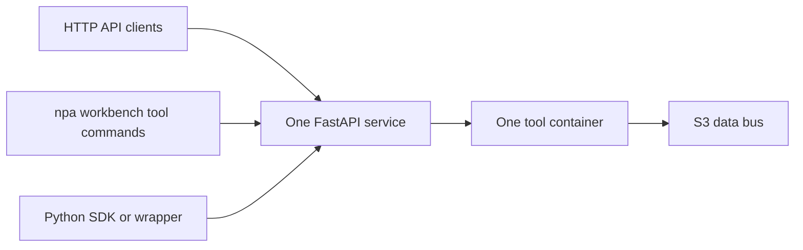

# Contributing to Nebius Physical AI

Start with the task you are changing. The detailed contracts below cover a new
Workbench tool; small fixes can go directly to the relevant section.

| Task | Start here |
| --- | --- |
| Improve a README or guide | [Documentation requirements](#documentation-requirements) and [documentation checks](npa/README.md#developing-and-testing-npa) |
| Fix a CLI, SDK, or service | [Required interfaces](#required-interfaces) and [testing](#testing-requirements) |
| Add a tool and container | [End-to-end contribution skill](skills/workflows/add-workbench-tool/SKILL.md) |
| Add or adapt a workflow | [Workflow authoring](skills/workflows/author-npa-workflow/SKILL.md) |
| Prepare a pull request | [Validation gates](skills/atomic/pre-pr-validation/SKILL.md) and [PR conventions](#commit-and-pr-conventions) |
| Merge a pull request from mobile | [Auto-merge and the merge queue](#auto-merge-and-the-merge-queue) |

## Contribution quality

Use the [contributions skill](skills/atomic/contributions/SKILL.md) when writing
or reviewing changes. It defines the required readability, exported-symbol
documentation, module headers, README updates, and anti-pattern rules for new
and changed code. Existing violations outside the task's scope do not require
unrelated rewrites.

Coding agents discover this skill through `AGENTS.md` and `skills/index.yaml`.
The workbench agent's existing repository corpus also includes the root
`skills/` tree; refresh that corpus after updating a deployed checkout to make
new guidance available through retrieval.

## Scope
This document covers adding a new Workbench tool to Nebius Physical AI.

It is about the tool layer:

- A deployable tool container.
- A tool HTTP service or documented service endpoint.
- A `npa workbench ...` CLI surface.
- A Python-callable wrapper or SDK surface.
- Tests, docs, workflow hooks, and agent skill files.

It does not define platform orchestration internals, the agentic layer, or new
cross-tool composition systems. Those are separate layers. The current repo
architecture is indexed in `docs/architecture/contributor-context.md` and
`skills/atomic/architecture/SKILL.md`.

The strongest full-tool reference is LeRobot:

- `npa/src/npa/cli/workbench/lerobot.py`
- `npa/src/npa/workbench/lerobot/__init__.py`
- `npa/docker/workbench/lerobot/Dockerfile`
- `skills/tools/lerobot/SKILL.md`
- `npa/tests/cli/test_lerobot_cli.py`

The cleanest service, CLI, and compatibility SDK reference is detection
training:

- `npa/src/npa/workbench/detection_training/service.py`
- `npa/src/npa/workbench/detection_training/schemas.py`
- `npa/src/npa/cli/workbench/detection_training.py`
- `npa/src/npa/sdk/workbench/detection_training.py`
- `npa/tests/workbench/test_detection_training.py`

Detection training is not one of the 8 validated tools listed in the
architecture context. It is a BDD100K pipeline workbench service. Use it for the
three-access implementation shape, not as evidence that the 8-tool list has
changed.
## Workbench Tool Architecture
The intended Workbench pattern is one tool capability exposed through three
access modes:

- HTTP API, the source of truth for service behavior.
- CLI, the operator-facing client under `npa workbench`.
- Python SDK or wrapper, the programmable client.

Do not duplicate core training, inference, import, status, or conversion logic
separately across layers. Put behavior in the service or a shared implementation
module, then make the CLI and SDK call that surface.

Current code is mixed. Detection training follows this most directly:

- FastAPI app in `npa/src/npa/workbench/detection_training/service.py`.
- Pydantic request and response models in `npa/src/npa/workbench/detection_training/schemas.py`.
- CLI commands in `npa/src/npa/cli/workbench/detection_training.py`.
- Compatibility SDK functions in `npa/src/npa/sdk/workbench/detection_training.py`.

LeRobot is the main full-tool exemplar, but much of its current training path is
implemented as CLI orchestration over VM, container, or serverless runtime
helpers in `npa/src/npa/cli/workbench/lerobot.py`. Treat that as current code,
not as a reason to add new duplication.


```mermaid
flowchart LR
    APIClient["HTTP API clients"] --> Service["One FastAPI service"]
    CLI["npa workbench tool commands"] --> Service
    SDK["Python SDK or wrapper"] --> Service
    Service --> Container["One tool container"]
    Container --> S3["S3 data bus"]
```

For new tools, keep the container as the deployment unit and the service
endpoint as the invocation unit. The Workbench tool pattern is documented in
`skills/tools/workbench-tool/SKILL.md`.
## Required Interfaces
Every new Workbench tool needs a coherent HTTP, CLI, and Python-callable
surface. The exact workload verbs are tool-specific, but the management verbs
must be predictable.
### HTTP API
For a new first-party wrapper service, start from:

- `npa/src/npa/workbench/detection_training/service.py`
- `npa/src/npa/workbench/detection_training/schemas.py`
- `npa/src/npa/workbench/lancedb/server.py`

Required minimum for new first-party services:

- `GET /health`, returns a machine-checkable status.
- `GET /status`, when the service owns jobs, runs, or lifecycle state.
- `GET /system-info`, when the service owns runtime hardware or dependency state.
- A list endpoint for service-managed objects. Prefer `GET /list` for new
  services, unless the domain has a clearer noun path.
- One or more capability endpoints, for example `POST /train`, `POST /eval`,
  `POST /serve`, `POST /infer`, `POST /import-bdd100k`, or `POST /backfill`.

Use Pydantic schemas for request and response bodies, following
`npa/src/npa/workbench/detection_training/schemas.py`. For domain-specific
datasets, keep schema governance explicit. The BDD100K label-map pattern in
`docs/workbench-yaml-guide.md` exists because generic flexibility would push
mapping code back onto customers.

Current services do not all match the minimum endpoint set. See
`Known Deviations` before copying an existing service wholesale.
### CLI
Register the CLI under `npa workbench` through
`npa/src/npa/cli/workbench/__init__.py`.

The current common management commands are:

- `deploy`
- `status`
- `list`

Most named tools also expose `system-info`; new tools should include it.

Workload verbs are chosen by domain:

- LeRobot: `train`, `eval`, `serve`, `infer`, `list-checkpoints`.
- FiftyOne: `launch`, `load-dataset`, `curate`, `eval`, `open`.
- Genesis: `train-teacher`, `generate-demos`, `eval-teacher`, `diagnose`, `tune`.
- Isaac Lab: `train`, `eval`, `export-lerobot`.
- Cosmos: `serve`, `train`, `finetune`, `optimize`, `infer`.
- GR00T: `download`, `finetune`, `eval`, `serve`, `infer`, `convert`.
- LanceDB: `import-bdd100k`, `backfill`, `create-mv`, `query-table`.
- SONIC: `train`, `serve`.

The actual command implementations are in:

- `npa/src/npa/cli/workbench/lerobot.py`
- `npa/src/npa/cli/fiftyone/__init__.py`
- `npa/src/npa/cli/genesis/__init__.py`
- `npa/src/npa/cli/isaac_lab/__init__.py`
- `npa/src/npa/cli/cosmos/__init__.py`
- `npa/src/npa/cli/groot/__init__.py`
- `npa/src/npa/cli/workbench/lancedb/cli.py`
- `npa/src/npa/cli/workbench/sonic/cli.py`

`--input-path` and `--output-path` are the public cross-tool handoff flags.
Validate them with the shared path contract in
`npa/src/npa/cli/path_contract.py`.

The rule is:

- `--input-path` reads an `s3://` URI.
- Some read-side commands may also accept a Hugging Face dataset or checkpoint
  identifier when the tool explicitly opts in.
- `--output-path` writes an `s3://` URI.
- Public CLI handoff paths must not require VM-local paths, local files,
  `file://` URIs, or plain HTTP URLs.

LeRobot shows the path contract in `train`, `eval`, `serve`, and `infer` in
`npa/src/npa/cli/workbench/lerobot.py`. Detection training shows compatibility
aliases for older flags in `npa/src/npa/cli/workbench/detection_training.py`.
### Python SDK Or Wrapper
There are two Python-callable layers in the current repo.

The compatibility namespace is:

- `npa/src/npa/sdk/workbench/__init__.py`
- `npa/src/npa/sdk/workbench/detection_training.py`
- `npa/src/npa/sdk/workbench/lancedb/__init__.py`

The broader current wrapper layer is:

- `npa/src/npa/_sdk.py`
- `npa/src/npa/workbench/lerobot/__init__.py`
- `npa/src/npa/workbench/fiftyone/__init__.py`
- `npa/src/npa/workbench/genesis/__init__.py`
- `npa/src/npa/workbench/isaac_lab/__init__.py`
- `npa/src/npa/workbench/cosmos/__init__.py`
- `npa/src/npa/workbench/groot/__init__.py`
- `npa/src/npa/workbench/lancedb/__init__.py`

For a new tool, add a Python-callable wrapper in the `npa.workbench` namespace.
If the tool is a first-party HTTP service with stable request and response
models, also add it to the compatibility namespace used by detection training
and LanceDB.

The SDK surface should not contain a second implementation of the workload. It
should call the service or shared implementation layer.
## Containerization
Every Workbench tool needs a container image under `npa/docker/workbench/`. Use the
existing Dockerfiles as the reference set, especially
`npa/docker/workbench/lerobot/Dockerfile`, `npa/docker/workbench/fiftyone/Dockerfile`,
`npa/docker/workbench/lancedb/Dockerfile`, and
`npa/docker/workbench/detection-training/Dockerfile`.

Before a Docker build with `npa/` as its context, stage the top-level workflow
catalog as described in [Build and tag](docs/workbench/container-packaging.md#build-and-tag).

Base image and tag conventions are backed by:

- `npa/docker/workbench/tags.yaml`
- `npa/docker/workbench/check_tag_consistency.py`
- `docs/security/image-reproducibility.md`
- `.github/workflows/image-security-scan.yml`

For the complete external-fork-to-release procedure, including the maintainer
trust boundary, licensing gate, trusted registry build, and incremental GHCR
publication, follow `skills/workflows/contribute-workbench-image/SKILL.md`.
The contributor-facing checklist is
`docs/workbench/contributing-a-containerized-solution.md`.

The current tag-family strategy is `cuda12` for production CUDA 12.x images and
`cuda13-b300` for B300 and future Blackwell images. The latter remains blocked
or vendor-paced for much of the stack.

LeRobot has both a CUDA 12 image and a B300-specific Dockerfile:

- `npa/docker/workbench/lerobot/Dockerfile`
- `npa/docker/workbench/lerobot/Dockerfile.b300`

Do not invent a third tag family in a new contribution. If a tool genuinely
needs a new family, update `npa/docker/workbench/tags.yaml`,
`npa/docker/workbench/check_tag_consistency.py`, and `docs/security/image-reproducibility.md`
in a separate design change.

NPA-owned releases resolve from the public GHCR namespace and do not inherit
ambient `NPA_REGISTRY` or legacy saved registry values. `NPA_REGISTRY` remains a
build/BYOF destination; runtime custom bytes require an explicit complete image
reference or workflow `--registry`. The official registry shape is:

```text
ghcr.io/nebius/nebius-physical-ai/npa-tool:${TAG}
```

Build scripts should follow the `--registry` and `--push` shape used by:

- `npa/docker/workbench/lerobot/build.sh`
- `npa/docker/workbench/groot/build.sh`
- `npa/docker/workbench/base/cuda13-b300/build.sh`

Keep image entrypoints explicit. LeRobot runs `python -m npa.server.app`;
FiftyOne intentionally uses `/bin/bash` because the CLI launches the app command
from `npa/src/npa/cli/fiftyone/__init__.py`.
## Runtime Modes
The repo supports several runtime modes. A new tool should support only the
modes that the existing code can actually exercise for that kind of workload.
### VM
VM runtime provisions or reuses a Nebius VM, then manages the tool over SSH.
This is the mature path for tools with hard host requirements or large stacks.
Examples:

- `npa/src/npa/cli/workbench/lerobot.py`
- `npa/src/npa/cli/fiftyone/__init__.py`
- `npa/src/npa/cli/genesis/__init__.py`
- `npa/src/npa/cli/isaac_lab/__init__.py`
- `npa/src/npa/cli/cosmos/__init__.py`
- `npa/src/npa/cli/groot/__init__.py`

Terraform, config, and SSH helpers live in `npa/src/npa/deploy/`,
`npa/src/npa/clients/config.py`, and `npa/src/npa/clients/ssh.py`.
### Container On VM Or BYOVM
Container runtime runs the Workbench image on a VM. It is useful for repeatable
application deploys while keeping SSH and Docker control.

Examples are LeRobot and FiftyOne container deploy paths in their CLI files, and
BYOVM registration commands in `npa/src/npa/cli/cosmos/__init__.py`,
`npa/src/npa/cli/fiftyone/__init__.py`, and `npa/src/npa/cli/groot/__init__.py`.
If a tool supports BYOVM, preserve the config shape in
`npa/src/npa/clients/config.py`.
### Kubernetes Workbench Service
Kubernetes service mode is used for persistent services on the NPA cluster.

Examples are detection training deploy in
`npa/src/npa/cli/workbench/detection_training.py`, LanceDB deploy in
`npa/src/npa/cli/workbench/lancedb/deploy.py`, and FiftyOne Kubernetes deploy in
`npa/src/npa/cli/fiftyone/__init__.py`. Use the `workbench` namespace for
deployed services, as documented in `skills/tools/nebius-infra/SKILL.md`.
### Serverless
Serverless Jobs and Endpoints are the target for batch and serving workloads
when the tool can run without hard host assumptions.

Shared helpers:

- `npa/src/npa/clients/serverless.py`
- `npa/src/npa/serverless_common/subnet.py`
- `npa/src/npa/serverless_common/output.py`
- `npa/src/npa/serverless_common/platform.py`

Use `resolve_subnet` from `npa/src/npa/serverless_common/subnet.py`; do not add
new per-tool subnet discovery logic. Use
`build_serverless_output_upload_cmd` from `npa/src/npa/serverless_common/output.py`
for S3 output upload snippets.

Serverless is not universal. FiftyOne deploy rejects it, while FiftyOne
`load-dataset`, `curate`, and `eval` can submit serverless jobs. Isaac Lab
serverless exists for training but still depends on RT-core routing.
### SkyPilot Workflows
Workflow orchestration uses SkyPilot managed jobs, not Argo.

Shared code:

- `npa/src/npa/orchestration/skypilot/workflow.py`
- `npa/src/npa/orchestration/skypilot/_bin.py`
- `npa/src/npa/orchestration/skypilot/controller.py`
- `npa/src/npa/orchestration/skypilot/cleanup.py`

SkyPilot must be invoked through `NPA_SKYPILOT_BIN`, as resolved in
`npa/src/npa/orchestration/skypilot/_bin.py`. Do not rely on `sky` from `PATH`.
## Composition Contract
Cross-tool data flow is S3-only. Tools should not call each other directly to
move datasets, checkpoints, videos, embeddings, or metrics.

Use these references:

- `npa/src/npa/cli/path_contract.py`
- `npa/src/npa/clients/storage.py`
- `npa/src/npa/serverless_common/output.py`
- `docs/workbench-yaml-guide.md`
- `workflows/testing/bdd100k-pipeline.yaml`

The public handoff flags are:

- `--input-path`, for source artifacts.
- `--output-path`, for result artifacts.

Typical S3 shapes:

```text
s3://${NPA_S3_BUCKET}/bdd100k-pipeline/${NPA_PIPELINE_RUN_ID}/lancedb/
s3://${NPA_S3_BUCKET}/bdd100k-pipeline/${NPA_PIPELINE_RUN_ID}/training/view-name/
s3://${NPA_S3_BUCKET}/isaac-lab-rl/${NPA_ISAAC_LAB_RUN_ID}/
```

Credentials are configured outside the repo. The user-facing template is
`docs/credentials.yaml.example`; the runtime loader is
`npa/src/npa/clients/credentials.py`.

The primary storage endpoint for the current cluster is:

```text
storage.eu-north1.nebius.cloud
```

The historical `storage.uk-south1.nebius.cloud` default is wrong for the
primary cluster. Deploy commands that support endpoint overrides should accept
`NPA_STORAGE_ENDPOINT` and pass the resolved URL through as `AWS_ENDPOINT_URL`
or `NEBIUS_S3_ENDPOINT`. See `docs/workbench/getting-started.md`,
`npa/src/npa/clients/credentials.py`, and
`npa/src/npa/cli/workbench/lancedb/deploy.py`.

Backing services are encapsulated. A pipeline stage should receive an S3 URI,
call a tool endpoint, and write the next S3 URI. The BDD100K pipeline in
`workflows/testing/bdd100k-pipeline.yaml` is the worked example.
## Workflow YAML Conventions
The supported, customer-facing workflow catalog is the declarative
`npa.workflow` spec set under `workflows/`. Keep `workflows/main/` limited to
`sim2real.yaml`, `paidf-cosmos3.yaml`, and `nurec-reconstruct.yaml`; author new catalog workflows in
`workflows/testing/`. Keep catalog documentation in `workflows/README.md`.
Do not add raw SkyPilot task templates to
the package as a workflow catalog; the old catalog path is guardrail-retired.
Raw SkyPilot YAML is still accepted by the submit wrapper for customer-owned
files, test fixtures, and guarded tool-specific examples such as burst or NuRec
single-pod execution. Do not add Argo workflows.

References:

- `docs/workbench-yaml-guide.md`
- `workflows/testing/bdd100k-pipeline.yaml`
- `npa/src/npa/workflows/byof/profiles/isaac-lab-rl-train.yaml`
- `workflows/testing/isaac-lab-rl-sweep.yaml`
- `npa/scripts/run_bdd100k_pipeline.py`
- `npa/scripts/run_isaac_lab_rl.py`

Current YAML rules:

- Use `apiVersion: npa.workflow/v0.0.1` and `kind: Workflow`.
- Put per-run paths, service URLs, and domain schema values in `config`.
- Add one named state per stage, preferably with a `toolRef`.
- Use `resources.<profile>` blocks and point states at profiles by name.
- Express dependencies with `initial`, `needs`, `next`, `parallel`, and
  `transitions`; the renderer emits the SkyPilot task documents.
- Keep customer-specific bucket, registry, project, and credential values out of
  committed YAML.
- Add `validate-spec`, `plan-spec`, render-only, mock-endpoint, or snapshot
  validation coverage before live submission.

Training workflows must run headless. Isaac Lab shows the required `--headless`
flag in `npa/src/npa/workflows/byof/profiles/isaac-lab-rl-train.yaml`.

Use `image_id` overrides for customer containers when the tool contract is
preserved. Isaac Lab documents this pattern in `docs/workbench-yaml-guide.md`
and the runner supports image rewriting through `npa/scripts/run_isaac_lab_rl.py`.
## GPU Routing
Use the shared GPU alias table in `npa/src/npa/serverless_common/platform.py`.

Current verified routing:

- H100 is the default choice for general training, CLIP embedding, and
  detection-training workflow stages. The BDD100K workflow requests H100 in
  `workflows/testing/bdd100k-pipeline.yaml`.
- H200 is used by several serving or training defaults, including LeRobot and
  Cosmos serverless paths in their CLI files.
- L40S or RTX Pro 6000 is required for Isaac Lab simulation paths that need RT
  cores. The code enforces this in `npa/src/npa/cli/isaac_lab/__init__.py`, and
  the SkyPilot workflows request L40S.
- FiftyOne is CPU-first for the app, but curate and eval serverless paths allow
  H100 or RTX6000 and intentionally exclude L40S in
  `npa/src/npa/cli/fiftyone/__init__.py`.
- LanceDB CLIP backfill routes to H100 in the BDD100K workflow and
  `skills/tools/lancedb/SKILL.md`.
- B300 support is not a general default. `npa/docker/workbench/tags.yaml`,
  `docs/security/image-reproducibility.md`, and `docs/b300-validation-matrix.md`
  show B300 as validated for the base image and LeRobot ACT smoke training, with
  broader support still blocked or vendor-paced.

SONIC has a current code-vs-skill routing conflict. The skills say route SONIC
to H100, while the CLI defaults to L40S and warns for non-RT-core platforms.
Treat this as a known deviation, not as a pattern for new tools.

Do not add GPU routing rules only in prose. Encode routing in CLI defaults,
serverless platform resolution, workflow YAML resources, and the tool skill
file.
## Configuration And Secrets
Do not commit credentials, tokens, live project IDs, tenant IDs, bucket names,
or concrete registry IDs.

References:

- `SECURITY.md`
- `docs/credentials.yaml.example`
- `docs/workbench/getting-started.md`
- `npa/src/npa/clients/credentials.py`
- `npa/src/npa/clients/config.py`

Use environment variables and placeholders:

- `NEBIUS_PROJECT_ID`
- `NEBIUS_TENANT_ID`
- `NPA_REGISTRY`
- `NPA_PUBLIC_REGISTRY`
- `NPA_S3_BUCKET`
- `NPA_STORAGE_ENDPOINT`
- `AWS_ENDPOINT_URL`
- `NEBIUS_S3_ENDPOINT`
- `NPA_SKYPILOT_BIN`

Committed examples should use placeholders such as:

```text
<your-project-id>
<your-tenant-id>
<your-registry>/<namespace>
<your-bucket>
```

Secrets belong in the user credentials file described by
`docs/credentials.yaml.example`, not in source, docs, tests, or workflow YAMLs.

One automatic PR workflow, `.github/workflows/security-regression.yml`, owns the
required candidate gate. It calls the following reusable workflows and runs the
security jobs in the same candidate-level concurrency group, so a new commit
cancels the complete superseded gate instead of six independent fragments:

| Workflow | What it runs | Reproduce locally |
| --- | --- | --- |
| `.github/workflows/test.yml` | Full PR coverage; exact-tree queue reuse; scheduled compatibility audit | `make test` |
| `.github/workflows/lint.yml` | `ruff check .`, and `scripts/build_docs.sh --check` for `docs/cli/` drift | `make lint`, `make docs-check` |
| `pr-precheck`; `.github/workflows/harness-guardrails.yml` on main | `pytest npa/tests/guardrails` | `make test-guardrails` |
| `.github/workflows/confidentiality-scan.yml` | `npa.guardrails.confidentiality` over the diff and tree | needs the denylist secrets; see `skills/atomic/protect-nebius-infra-details/SKILL.md` |
| `.github/workflows/gitleaks.yml` | the custom Nebius-pattern rules in `.gitleaks.toml` | `gitleaks detect` |
| `.github/workflows/image-security-scan.yml` | Always reports scope; runs Trivy and complete-byte checks for image-affecting candidates and every main/scheduled audit | `npa/tests/docker/` for the contract checks |

Start with `make precheck`: it checks the working tree's CI dependency fingerprint,
lint, formatting, and focused CI contract regressions. It does not change files or
run the full suite. `make format-check` is the formatting check alone.
`make check` runs this fast precheck before `docs-check` and `test`, including when
invoked with `make -j`, so a cheap failure stops expensive local validation.
It is not a full stand-in for `test.yml`, which additionally enforces
`--cov-fail-under=60` and runs `tests/integration/test_cli_install.sh` and
`scripts/check-source-drift.sh`. `make test` runs no coverage, so `make check` can
pass while `test.yml` fails the 60% floor. Add coverage locally when a change moves
a lot of untested code:

```bash
make test PYTEST_ADDOPTS="--cov=src/npa --cov-fail-under=60"
```

The two also report different counts, so do not compare them directly: `make test`
deselects the live/GPU markers described below, while `test.yml` runs the whole
tree and lets those tests self-skip. Both numbers rise as tests land; the shape of
the difference, several hundred more collected and skipped in CI, is the part that
stays true.

Pull requests start `pr-precheck`: dependency-input consistency, lint and
formatting, all guardrails, smoke tests, and full test collection. Its five-minute
execution budget provides an early signal; a pass is not permission to merge.
Fresh source/dependency, secret and confidentiality scans also start immediately.
The secret-scan planner verifies the generated CI requirements before releasing
the expensive test and image jobs. Those jobs then overlap the broader precheck,
while its result remains required by the final gate. This retains cheap rejection
for broken dependency updates without adding the former four-to-five-minute delay
to every successful PR.
The hosted precheck runs full collection alongside guardrails and smoke tests
on the same runner with `bash npa/scripts/ci_precheck.sh`. Both must pass;
collection errors remain blocking, and failed guardrails stop the collector.
This saves a sequential collection pass without starting another runner.

PR admission still requires seven duration-balanced Python 3.12 coverage shards,
Cypress, focused Python 3.10/3.14 compatibility tests, security, documentation
drift, and repository guardrails. Source and test changes receive the full suite,
including other subsystems; merged coverage must meet the unchanged 60% floor.

The queue reuses successful PR validation only for an **identical Git tree**,
including file modes, tests, workflows, and dependencies. A verifier copied from
the trusted base reads GitHub run/job/artifact metadata with read-only access.
It requires the current PR head, latest run attempt, every required job, either
full coverage/browser results or the established prose smoke, a unique receipt
for the tested PR merge commit, and evidence started within the last 24 hours.
It checks that commit's parent and tree through GitHub's Git API. It never
downloads or executes PR artifacts. Different commit messages or squash SHAs do
not invalidate identical bytes.

The queue reruns gitleaks, confidentiality, and the source/dependency scanners
against its actual base/candidate. It does not rebuild CUDA images or repeat
unit/browser tests whose identical tree already passed. When preceding merges
change the combined tree, it reruns all tests, lint, guardrails and hostile-input
checks. Complete Git-tree comparisons include additions, deletions and file
modes. The trusted base image-scope policy decides whether image inputs changed:
unchanged image inputs reuse the successful image checks; changed inputs rerun
the full image gate too. Missing, stale, failed, partial-rerun or unreadable
evidence also restores the full queue gate: every current combined-tree test
and security check must then pass. Older PRs can therefore adopt the policy
without being rejected just for lacking a receipt. The installing PR receives
the full gate because its base has no verifier yet. Refreshing an older branch
and completing PR validation enables the faster evidence-reuse path.

The operating targets are an early signal within five minutes, complete PR
validation within fifteen, and queue validation within ten. Hosted-runner waiting
is outside these execution budgets;
GitHub does not reserve capacity for this repository. Set the queue's check
response timeout to ten minutes only after this workflow is on main and a live
queue candidate has verified the new path. A timeout rejects, never merges, an
unvalidated candidate. Optional timing reports run on PR/main validation only;
their completion is not a prerequisite for reusing already-passed required jobs.

Full suites collect smoke tests in the shards and run the CLI install check in
the browser job, avoiding duplicate smoke and subsystem jobs. The install check
runs on Python 3.12 before that job switches interpreters for compatibility tests;
it no longer extends the last coverage shard. Cypress runs once in its own job,
never inside a pytest shard. Cached constrained installs, xdist workers, and
independent job scheduling retain fast feedback without deferring
coverage until queue admission. Scheduled and manual audits retain four shards
on each of Python 3.10, 3.12, and 3.14.

A narrow prose-only exception skips the full Python and browser suites on PRs
and merge candidates while retaining smoke, lint, documentation drift, guardrail,
and every existing security gate. It applies only to edits of existing regular
Markdown files in `docs/`, the root/package README and contribution guide, or
workflow READMEs. Generated CLI references, security documentation, skills, new
or renamed files, mode changes, and edits to fenced/indented code, inline code,
frontmatter, or templates keep full validation. Mixed merge groups use the full
combined diff, so a prose PR cannot hide a preceding code change.

The existing `gitleaks` runner executes `npa/scripts/ci_test_scope.py` from the
trusted base commit, requesting its merge-candidate policy for both PR and queue events. This
also prevents the installing PR from inheriting an older base's narrower PR
policy. Test selection overlaps the PR precheck and needs no additional runner
before the shards start. The parent passes the prose exception only when all
three scope outputs agree; missing outputs, standalone runs, and scheduled
audits retain full coverage. Queue evidence accepts either the prior scope job
or the successful trusted-selection step inside `gitleaks`. A candidate cannot
install its own shortcut. Missing base policy keeps the full suite; an invalid
comparison fails the job. To inspect a selection locally with the candidate
checked out, pass full commit SHAs:

```bash
npa/.venv/bin/python npa/scripts/ci_test_scope.py \
  --base "$(git rev-parse origin/main)" --head "$(git rev-parse HEAD)" \
  --event pull_request
```

The command prints the prose/full-suite/browser decisions as JSON. For the same
base and head, `--event merge_group` must produce the identical decision.

The internal sharder activates only when `NPA_CI_SHARD_INDEX` and
`NPA_CI_TOTAL_SHARDS` are both set. The index is one-based and must not exceed
the total; ordinary local test runs leave both variables unset. It greedily
balances measured module durations from `npa/tests/ci_test_durations.json`, then
uses a deterministic default for new tests. Every full Python 3.12 run uploads
per-shard module timings, including available measurements from failed shards.
Successful full runs publish `ci-test-durations-<sha>` with a merged profile.
Refresh the reviewed manifest from a successful `main` audit or a successful
validation of an exact tree that has since merged. Review the source run and
numeric data before committing them; PR profiles are never loaded automatically
as policy. The current profile comes from the
[successful #689 validation](https://github.com/nebius/nebius-physical-ai/actions/runs/35738254239)
whose tested tree was verified at merge, and covers 938 modules.

### CI dependency setup and timing reports

Python test jobs use uv 0.12.5 with a persistent package cache and
`npa/ci/requirements.txt` constraints. These pins cover the core, development,
adapter, and CPU SONIC/export dependencies across Python 3.10, 3.12, and 3.14.
The CPU Torch version remains in `npa/ci/constraints.in`. CI rejects stale inputs
and direct edits to the generated pin body before installing dependencies.
Dependabot updates the source manifests but does not edit
`npa/ci/requirements.txt`; refresh that generated file with the repository
command. With uv 0.12.5 installed, run:

```bash
npa/.venv/bin/python npa/scripts/ci_requirements.py --update
npa/.venv/bin/python npa/scripts/ci_requirements.py --check
```

Add `--upgrade` to the update command for an intentional dependency upgrade;
ordinary refreshes retain compatible existing pins. Review and commit the
generated requirements with their input change. Local contributor installs may
still use pip; these constraints make the CI test environment reproducible.

The `ci-timing-report` job runs after the required `security-regression` check
finishes, including failed checks. Its Actions summary and
`ci-timing-<run-id>-<attempt>` artifact show each job's runner wait, execution,
and setup time, with individual step durations in JSON. Runner wait measures
job creation to start; it excludes time waiting for dependencies before job
creation. Parallel job durations must not be added to estimate merge latency.
Reporting reads only run metadata with read-only permissions and is excluded
from its own measurements. It is outside the required merge checks; cancellation
of the parent workflow can interrupt reporting.

### Validation concurrency

Queue evidence verification, trusted test selection, and secret scanning share
the `gitleaks` job and checkout. A failed verification restores full validation;
a failed secret scan still blocks the required context. The other required
context names are unchanged.

Operators can configure repository Actions variables after approved Ubuntu
x64 runners are available to this repository. Repository-scoped disposable Nebius
CPU runners can provide temporary capacity without organization runner-group
administration; see the [CPU runner operations guide](.github/ci-runners/README.md)
for setup, verification, routing rollback, and drain-and-delete commands.

| Variable | Candidate jobs routed to that label | Default |
| --- | --- | --- |
| `NPA_CI_SECURITY_RUNNER` | Independent confidentiality and source/dependency scans | Priority label, then `ubuntu-latest` |
| `NPA_CI_PRIORITY_RUNNER` | Precheck, queue evidence/secrets, confidentiality, source/dependency scans, scope and final aggregation | `ubuntu-latest` |
| `NPA_CI_TEST_RUNNER` | Full Python/browser tests, docs, runtime and image validation | `ubuntu-latest` |

For a small CPU pool, configure only `NPA_CI_SECURITY_RUNNER`. Leave admission,
test shards, and final aggregation on hosted runners so VM replacement cannot
hold up the merge path. Branches adopt the new security routing after refreshing
their workflow files. Use separate capacity for configured labels. Main, scheduled and manual audits keep
using standard runners, as do background image builds unless their existing
`build_runner_label` input selects another pool. The priority pool must support
the precheck's Python dependencies and ordinary GitHub Ubuntu tools; use approved
ephemeral runners with the repository's public-PR access policy. Merely setting
a variable does not create runners or reserve capacity, and an unavailable label
leaves jobs queued. Verify access with a real candidate before relying on it.
Without configured pools there is no runner reservation or per-PR fairness
guarantee. Runner allocation, rather than longer timeouts or skipped checks,
remains necessary to meet latency targets under sustained load.

Independent validation jobs use GitHub's available runner capacity. Validation
workflows have no job-level concurrency locks or matrix `max-parallel` caps:
after the fast dependency latch all seven pytest shards and browser checks can
run together while leaving capacity for image validation, and unrelated PRs,
merge candidates, and audits do not serialize through repository-wide slots.
Scope selection, coverage aggregation, and the final required check wait only
for their declared dependencies and an available runner.

Lint, CLI documentation drift, and guardrails run before queue admission and
again when the queue must validate a changed combined tree. Their reusable
workflows do not also start on every push to `main`: those duplicate jobs
competed with the next queue candidate immediately after each merge. Both
workflows remain available through manual dispatch, and the daily full Python
audit includes guardrails. Post-merge secret, confidentiality, source/dependency,
hostile-input, and image-security audits remain automatic.

The parent workflow retains a concurrency group per PR so a newer commit
cancels that PR's superseded validation, including its reusable child workflows.
Merge candidates have distinct groups keyed by candidate SHA. Main pushes
supersede older main runs. Reusable workflows use distinct group prefixes so
they cannot hold or cancel their parent's group. Publication and live-workload
concurrency controls have separate purposes and remain independent of this policy.

The former shared pools limited every PR's tests to two active jobs across the
repository. A dependency-update batch filled their 100-job pending queues and
caused jobs to be rejected before tests ran. Removing those shared locks avoids
that concurrency-group queue limit; GitHub plan limits and organization-wide
runner availability can still cause waiting. Separate concurrency groups do
not reserve runners or guarantee merge priority. Use the CI timing report to
distinguish runner waiting from execution, and inspect organization runner
capacity if waiting persists. See [GitHub's concurrency documentation](https://docs.github.com/en/actions/how-tos/write-workflows/choose-when-workflows-run/control-workflow-concurrency).

Already queued runs keep the workflow configuration from their original commit.
After this policy lands on `main`, refresh older PR branches to create runs with
the new configuration; rerunning an old commit does not adopt it. Merge
candidates receive it through their combined commit. Required checks and coverage
remain enforced. Queue timeout changes follow the staged rollout described above.

### Merge readiness and queue rejections

Before pushing committed work, check its combined dependency inputs against the
current target without switching branches or modifying your index:

```bash
git fetch origin main
make merge-precheck
```

This checks committed `HEAD` merged with fetched `origin/main`, reports the exact
base/head/tree hashes, and rejects merge conflicts or an inconsistent merged CI
fingerprint. Staged and uncommitted changes are excluded; use `make precheck` for
the working tree. It runs no candidate code and does not replace Linux CI, scanner
checks, or validation of interactions with preceding queued PRs. An alternate
target can be inspected with
`npa/.venv/bin/python npa/scripts/ci_merge_precheck.py --base <ref> --head <ref>`.

PR admission includes every test category required by the queue. The queue
compares its combined tree with the completed PR validation and reruns fresh
security scans. A preceding merge can change that tree; the queue then reruns
combined-tree tests and any affected image checks. Missing, failed or stale PR
evidence restores full queue validation. Refreshing the branch and completing
PR validation can enable the faster reuse path. Open the
failed **Security regression** run whose event is **merge_group**, then inspect
the first failed component job. Cancelled sibling shards usually follow a failed
shard through matrix fail-fast; their cancellation is not the original failure.

**Merge queue feedback** checks open PRs every five minutes and automatically
comments on their latest queue rejection or a failed active merge candidate.
The comment names the removal reason, exact synthetic candidate,
validation attempt, unfinished or failed jobs, failed steps, runner waits, and
direct Actions links. Timeout comments preserve the state at removal even if
the jobs later pass. A failed active merge candidate can also report before a
dequeue event is available, without claiming the PR was removed. Later polling
updates the same bot comment for that candidate;
a rerun cannot overwrite the diagnosis with a different attempt. Successful
merges do not receive rejection comments. Missing run metadata is reported
explicitly rather than guessing from another candidate.

The reporter uses a scheduled workflow and trusted default-branch code, with
read access to Actions and PR write permission used only to manage comments.
It never checks out
candidate code, installs its dependencies, or reads its logs/artifacts. Its own
concurrency group does not lock validation jobs; it is outside the required checks. The five-minute
schedule is not a delivery deadline: GitHub scheduling and runner availability can
delay a refresh. Polling stops for closed PRs; read-only manual diagnosis can
still inspect their history. See
[GitHub's scheduled workflow behavior](https://docs.github.com/en/actions/reference/workflows-and-actions/events-that-trigger-workflows#schedule).
The automation takes effect once the reporting workflow lands on main.

To inspect a removal without posting a comment:

```bash
npa/.venv/bin/python -I npa/scripts/merge_queue_report.py \
  --repository nebius/nebius-physical-ai --pr <number>
```

The command requires authenticated `gh`; it defaults to read-only output. Pass
`--candidate <full-sha>` to inspect an older rejected candidate, and `--publish`
only to post/update the report. `--scan-open` reconciles open PRs instead of one
`--pr`. The **Merge queue feedback** manual workflow has
the same read-only default, with an explicit `publish` input.

If **Check CI dependency pins** fails, bring the current base into your isolated
branch and run the dependency refresh and check commands above. Commit the
reviewed pins with the dependency changes before retrying the queue. Requeueing
the same stale inputs will fail again.

Use the timing report to distinguish runner waiting from test execution. Coverage
aggregation now starts only after successful full-suite shards and stops when
the workflow is cancelled. Failed or superseded builds therefore do not request
a coverage runner just to reject missing data. The required aggregate check still
rejects failed, skipped, cancelled, or missing component results, and successful
full suites still enforce the 60% merged coverage floor.

## Testing Requirements

Create the contributor virtualenv at `npa/.venv` from the repository root using CPython 3.12.
The development and adapter extras supply test, lint, and conversion dependencies:

```bash
python3 -m venv npa/.venv
npa/.venv/bin/python -m pip install -e "npa[dev,adapter]"
```

Run the full suite on **Linux**: native filesystem and controller tests use
Linux-specific behavior, including `/proc`. macOS supports the CLI, documentation
checks, and many focused tests, but does not reproduce the complete Linux gate.
Use an interpreter with `os.memfd_create`; some Conda builds omit it.
Install `ffmpeg`/`ffprobe` and the same CPU checkpoint/export runtime as CI:

```bash
npa/.venv/bin/python -m pip install --index-url https://download.pytorch.org/whl/cpu torch==2.14.0
npa/.venv/bin/python -m pip install -e "npa[sonic]"
export PATH="$PWD/npa/.venv/bin:$PATH"
export NPA_REQUIRE_FFMPEG=1
umask 077  # Publication handoff tests require private files.
```

This exercises real tensor serialization and ONNX export without GPU allocation.
The [CI workflow](.github/workflows/test.yml) is the complete environment recipe.

`npa/.venv` is the repo convention, not a preference: `AGENTS.md`, the guardrail
CI jobs, and helper scripts such as `npa/scripts/start_golden_evals_tmux.sh` and
`scripts/build_docs.sh` all look there by default. Any other location works, but
you must then point the tooling at it — `make test PYTHON=...`,
`NPA_BIN=.../bin/npa`, `GOLDEN_EVAL_PYTHON=.../bin/python`.

If you keep multiple checkouts of this repo (for example `git worktree add`, or
several agent sandboxes on one machine) and share one `npa/.venv` across them —
by symlinking it, rather than running its own `pip install -e` in each — the
venv's editable install still resolves `npa` from whichever checkout last ran
that install. `pytest` then collects test files from the checkout you are
standing in but imports production code from a *different* checkout, silently,
with no error or non-zero exit. `make test`/`test-smoke`/`test-guardrails`/
`test-e2e` all run `make check-env` first specifically to catch this: it fails
fast with the exact `export PYTHONPATH=...` fix (or the option to give the
checkout its own venv) instead of letting you spend minutes on a run whose
result is meaningless. Run it standalone any time you are unsure which
checkout your interpreter is really resolving `npa` from: `make check-env`.

Then use the `make` targets from the repo root:

```bash
make check-env        # fails fast if $PYTHON would import npa from another checkout
make test-prereqs     # non-blocking: reports missing optional tools and temp-disk observations
make check            # local subset: lint, docs-check, unit tests
make test             # full unit suite, live/GPU markers deselected
make test-smoke       # quickest: onboarding CLI smoke tests only
make test-guardrails  # repo guardrails: catalogs, specs, skills, docs, hygiene
make lint             # ruff
make docs             # regenerate docs/cli/ after any CLI change
make docs-check       # the docs/cli/ drift gate
make test-e2e         # opt-in: real Nebius infrastructure, NPA_INTEGRATION_E2E=1
```

Run `make test-prereqs` once per environment before trusting `make test`'s
result: it distinguishes two different consequences of a missing optional
tool, verified against the specific test files that check for each, not
assumed. The `adapter` extra's `pyarrow` is not optional in the usual sense —
without it, files that import it unconditionally (for example
`npa/tests/test_lerobot_shared_video_offsets.py`) fail to collect at all, so
`make test` exits non-zero outright rather than passing with less coverage.
Missing ffmpeg/ffprobe, a CPU checkpoint runtime, tmux, or Node
instead let the specific tests that check for them self-skip, so `make test`
can still exit 0 while covering less than CI. The same command also reports
free space and any retained `pytest-of-<user>/pytest-N` directories under the
temp root pytest will use, purely for awareness — it recommends no deletion.
That root (`$TMPDIR/pytest-of-<user>` by default) is shared by every process
you run, not scoped to one checkout, so concurrent work across worktrees on
one machine competes for the same disk. Point a large or parallel run at a
directory you own instead — `pytest --basetemp=<owned-dir> ...` — and clean
up only that directory yourself. A directory not currently the
`pytest-current` target is not thereby proven idle: another process may hold
a different `--basetemp` entirely, or a live lock file under this same root.
Do not delete another process's temp directory based on age alone.

`docs/cli/` is generated from live `npa --help` and drift-gated in CI, so
`make docs` and a commit of its output are part of any change to a command, flag,
or help string.

The suite is xdist-safe; `make test PYTEST_ADDOPTS=-nauto` cuts the serial run to
a few minutes with an identical pass count. CI also uses xdist inside four
coverage shards, then merges their data before enforcing the floor. A local
parallel pass remains a strong signal, but it does not reproduce that merge.

`make test` deselects the live/GPU/e2e markers (`gpu`, `multi_gpu`, `e2e`,
`e2e_serverless`, `e2e_skypilot`, `e2e_pipeline`, `byovm_live`, `ngc_e2e`) by
marker rather than only ignoring `tests/e2e`. This matters: some `gpu`/`e2e`
tests live under `tests/workbench/` and will try to launch real infrastructure
if your shell has Nebius creds/SkyPilot configured, so the marker filter — not
just `--ignore=tests/e2e` — is what keeps the default suite hermetic.

The equivalent raw command is:

```bash
cd npa && .venv/bin/python -m pytest tests/ --ignore=tests/e2e \
  -m "not e2e and not e2e_serverless and not e2e_skypilot and not e2e_pipeline and not gpu and not multi_gpu and not byovm_live and not ngc_e2e" \
  --timeout=180 -q
```

Do not use bare `python` for repo validation; use your venv's interpreter.

Test layout:

- `npa/tests/cli/`
- `npa/tests/workbench/`
- `npa/tests/workflows/`
- `npa/tests/serverless_common/`
- `npa/tests/orchestration/skypilot/`
- `npa/tests/smoke/`
- `npa/tests/e2e/`

For a new tool, add focused tests for:

- CLI registration and help output.
- `deploy`, including dry-run or mocked infrastructure paths.
- Every management command: `status`, `system-info`, and `list`.
- Every capability command, for example `train`, `eval`, `serve`, `infer`,
  `load-dataset`, `backfill`, or `download`.
- Every HTTP endpoint success path.
- At least one failure path per endpoint.
- S3 path validation for `--input-path` and `--output-path`.
- Serverless command construction if the tool supports serverless.
- Container image naming or registry override behavior if the tool deploys an
  image.

Use `typer.testing.CliRunner` against `npa.cli.main:app`, as shown throughout
`npa/tests/cli/`.

Workflow YAMLs need programmatic checks. The current examples are:

- `npa/tests/workflows/test_bdd100k_pipeline.py`
- `npa/tests/workflows/test_isaac_lab_rl.py`

Required workflow checks include:

- Task order or execution grouping.
- Resource blocks.
- `image_id` placeholders.
- S3 output path construction.
- Mock endpoint or render-only validation.
- Snapshot hash when the workflow is intentionally stable.

E2E tests live under `npa/tests/e2e/` and are gated by
`NPA_INTEGRATION_E2E=1`. The gate is implemented in `npa/tests/e2e/conftest.py`.

Smoke tests live under `npa/tests/smoke/` or tool-specific CLI test files. Heavy
smoke tests must skip unless their environment variable is set. See
`docs/testing/smoke-tests.md`.

The gate for `make test` is **0 failures**. The pass count is a reference point,
not an assertion — the most recent measurement, on `1b89b3ba`, was:

```text
10836 passed, 37 skipped, 12 deselected, 1 xpassed, 0 failures
```

Read that as a floor that rises whenever tests land: it is stale by construction
between measurements, and a run reporting more than it is normal rather than
suspicious. Only a count that has *fallen* is worth chasing, and the reliable
comparison is against your own merge base rather than against this line. Two things
move it without anything being wrong:

- A few tests self-skip without `node`, `tmux`, or `docker`, moving them from
  passed to skipped.
- `make test` deselects the live/GPU markers, so it collects a different tree from
  `test.yml`, which runs everything and lets those tests self-skip.

The default suite is hermetic. It needs no `kubectl`, no cluster, and no venv at a
particular path, so a failure naming a missing executable or an unimportable `npa`
is a bug to fix rather than a prerequisite to install.

Promotion criteria must be evidence-based. Use numeric thresholds,
programmatic assertions, emitted JSON, artifact checks, and exact error messages.
Subjective inspection is not enough.
## Registration Steps
Register the CLI parent in `npa/src/npa/cli/workbench/__init__.py`, the
Python-callable namespace in `npa/src/npa/workbench/__init__.py`, and the
compatibility SDK namespace in `npa/src/npa/sdk/workbench/__init__.py` when the
tool has stable schemas. If the tool owns a published image, update
`npa/src/npa/deploy/images.py`.

Use `npa/src/npa/cli/workbench/lerobot.py` for a rich CLI reference,
`npa/src/npa/cli/workbench/lancedb/cli.py` for a modular CLI package,
`npa/src/npa/workbench/detection_training/service.py` for a first-party FastAPI
service, and `npa/src/npa/sdk/workbench/detection_training.py` for compatibility
SDK request handling.

Add an agent skill under `skills/tools/`; examples are
`skills/tools/lerobot/SKILL.md`, `skills/tools/fiftyone/SKILL.md`, and
`skills/tools/isaac-lab/SKILL.md`. Update `skills/atomic/architecture/SKILL.md`
only when the platform architecture changes.
## Documentation Requirements
A new tool needs human docs and agent docs.

For README and guide changes, run the offline documentation contracts:

```bash
npa/.venv/bin/python -m pytest npa/tests/guardrails/test_documentation_examples.py -q
```

They check local links and heading anchors, shell/Python syntax, literal CLI names and
options, declared workflow variables, and the executable package planning example.
Keep prerequisites, first commands, expected artifacts, and cleanup together.
Move optional operator details to linked references; retain the scope of historical
measurements. Quote shell placeholders and mark abbreviated grammar as `text`.

Human docs should cover the tool role, upstream project, runtime modes, GPU
routing, image build path, credentials, input and output formats, S3 handoff
paths, CLI examples, Python wrapper examples, workflow YAML usage, known
limitations, and evidence required before promotion.

Put operator runbooks under `docs/workbench/cookbooks/`. Existing examples include
`docs/workbench/cookbooks/bdd100k-pipeline.md`,
`docs/workbench/cookbooks/lancedb-deploy-runbook.md`,
`docs/workbench/cookbooks/lancedb-vector-search.md`,
`docs/workbench/cookbooks/serverless-tools-coverage.md`, and
`docs/workbench/cookbooks/sonic-whole-body-control.md`. Put architecture rationale under
`docs/architecture/` only when it applies beyond one tool.

Do not create a templates directory for a new tool. Point contributors at a
worked implementation instead.
## Agent Skill Files
Agent skill files are instructions for coding agents, not marketing docs.

Existing examples are `skills/tools/lerobot/SKILL.md`,
`skills/tools/fiftyone/SKILL.md`, `skills/tools/genesis/SKILL.md`,
`skills/tools/isaac-lab/SKILL.md`, `skills/tools/cosmos/SKILL.md`,
`skills/tools/lancedb/SKILL.md`, `skills/tools/groot/SKILL.md`, and
`skills/tools/sonic/SKILL.md`.

The skill should include when to use it, the tool role, CLI and API contract,
input and output data contract, GPU routing, runtime modes, known issues,
validation status, and integration patterns with other tools. Write direct
instructions, not broad prose an agent must reinterpret.

Register the skill in `skills/index.yaml` with a `smoke` block. That manifest is
the source of truth, and `npa/tests/guardrails/test_skills_index.py` checks both
that every skill is covered by it and that each declared smoke actually runs, so
an unregistered skill fails `harness-guardrails.yml`. Run `make test-guardrails`
after adding one.

Update `AGENTS.md` only if the skill list or root index changes.
## Commit And PR Conventions
Every proposed merge runs the [security regression gate](docs/security/merge-security-gate.md).
Run its real scanner regression checks and base comparison before changing the
security policy. Fix new findings and scanner errors before requesting review;
the guide describes coverage, local commands, and required-check enforcement.

Keep commits small and logical.

Commit messages use an imperative subject, subject length <=72 characters, and
one logical change per commit. Do not mix a tool addition with unrelated
infrastructure cleanup.

Examples:

```text
Add Isaac Lab workbench service
Fix CLIP GPU dispatch batch size
Update BDD100K label map for real data
```

Before review, a PR should pass the reproducible PR gates:

```bash
make check
```

Run focused tests for the touched surface as well. Documentation-only changes
can use `pytest -x --collect-only` as a smoke check. Parallel agent or operator
runs use scope-specific commit lock directories under `/tmp/npa-commit-lock/`;
remove the lock after commit and push.

Run Claude Code reviews only when explicitly requested by the operator.

## Auto-merge and the merge queue

Keep **Settings → General → Pull Requests → Allow auto-merge** enabled for this
repository. This repository setting is separate from the merge-queue rule on
`main`; committing workflow YAML does not enable it. Maintainers can inspect and
restore it with GitHub CLI:

```bash
gh api repos/nebius/nebius-physical-ai --jq '.allow_auto_merge'
gh api --method PATCH repos/nebius/nebius-physical-ai -F allow_auto_merge=true \
  --jq '.allow_auto_merge'
```

The readback should be `true`. Enabling the repository setting lets contributors
request auto-merge for individual PRs; it preserves required checks, signatures,
and the merge queue. See [GitHub's repository auto-merge settings](https://docs.github.com/en/repositories/configuring-branches-and-merges-in-your-repository/configuring-pull-request-merges/managing-auto-merge-for-pull-requests-in-your-repository).

On a phone, use the PR's auto-merge control when available. If the app does not
offer it or fails to save the request, open the PR on GitHub.com in the phone's
browser, select **Merge when ready**, and confirm. GitHub adds the PR to the
queue after its requirements pass, then validates the combined candidate before
merging. The queue controls the merge method. See [GitHub's merge-queue guide](https://docs.github.com/en/pull-requests/how-tos/merge-and-close-pull-requests/merging-a-pull-request-with-a-merge-queue).

To diagnose a request from a terminal, set `pr_number` to the affected PR:

```bash
: "${pr_number:?Set pr_number to the affected pull request number}"
gh pr view "$pr_number" --repo nebius/nebius-physical-ai \
  --json autoMergeRequest,mergeStateStatus,statusCheckRollup
gh pr checks "$pr_number" --repo nebius/nebius-physical-ai --required
```

A non-null `autoMergeRequest` means GitHub saved the request. Pending checks can
still leave the PR `BLOCKED` and outside the queue; inspect the linked Actions
run for waiting runners or failures. A green component job does not mean the
aggregate required `security-regression` check has finished. Resolve failed
checks or merge conflicts before requesting queue entry again. If no request
was saved, the [CLI fallback](https://cli.github.com/manual/gh_pr_merge) is:

```bash
gh pr merge "$pr_number" --repo nebius/nebius-physical-ai --auto
```

Use this only for a PR you intend to merge. It waits for requirements or queues
an already eligible PR. Do not use `--admin` to work around a waiting check.

## Design Principles
The core promise is to remove glue code. Contributions should avoid bespoke
adapters, path mapping scripts, and one-off orchestration logic that customers
must maintain. Prefer domain-specific schemas over generic catch-all fields when
the domain is known, as shown by the BDD100K label-map pattern in
`docs/workbench-yaml-guide.md`.

Use S3 as the data bus. Let customers bring their own containers when that is
the practical path, using the `image_id` override pattern in
`docs/workbench-yaml-guide.md` and `npa/scripts/run_isaac_lab_rl.py`. Prove
behavior with code, tests, or run artifacts.
## Where To Start
For setup, start with `docs/workbench/getting-started.md`,
`docs/credentials.yaml.example`, and `docs/orchestration/skypilot-setup.md`.
For known operational failure modes, read
`docs/workbench/troubleshooting/known-footguns.md`.
For the main full-tool reference, read `npa/src/npa/cli/workbench/lerobot.py`,
`npa/src/npa/workbench/lerobot/__init__.py`, `npa/docker/workbench/lerobot/Dockerfile`,
and `skills/tools/lerobot/SKILL.md`.

For the clean HTTP service, CLI, and SDK pattern, read
`npa/src/npa/workbench/detection_training/service.py`,
`npa/src/npa/workbench/detection_training/schemas.py`,
`npa/src/npa/cli/workbench/detection_training.py`, and
`npa/src/npa/sdk/workbench/detection_training.py`.

For workflow composition, read `docs/workbench-yaml-guide.md`,
`workflows/testing/bdd100k-pipeline.yaml`,
`npa/src/npa/workflows/byof/profiles/isaac-lab-rl-train.yaml`,
`npa/tests/workflows/test_bdd100k_pipeline.py`, and
`npa/tests/workflows/test_isaac_lab_rl.py`. For deeper rationale, read
`docs/architecture/contributor-context.md` and
`skills/atomic/architecture/SKILL.md`.
## Known Deviations
The repo is in active development. These are real current divergences, not new
patterns to copy.
### Top-level CLI registrations mix namespaces and platform utilities
FIXME(solutions): `npa/src/npa/cli/main.py` currently registers both the
`workbench` solution namespace and legacy platform-level utility commands
(`adapter`, `cluster`, `convert`, `demo`, `network`, `rerun`, `skypilot`, and
`viz`). These utilities predate the solutions model and remain top-level for
compatibility until a future migration moves them to appropriate namespaces.

New commands should be registered under a solution namespace, not as additional
top-level entries.
### First-party HTTP APIs are incomplete across the 8 tools
Appendix A says every validated tool exposes `/health`, `/status`,
`/system-info`, and `/list` as HTTP endpoints. Current code does not.

Detection training has `/health`, `/system-info`, `/runs`, `/train`, `/eval`,
and `/status` in `npa/src/npa/workbench/detection_training/service.py`.
LanceDB has `/health`, `/tables`, and domain endpoints in
`npa/src/npa/workbench/lancedb/server.py`. Cosmos and GR00T embed FastAPI
server source in their CLI files. FiftyOne uses the stock app surface.

New tools should implement the first-party service pattern, but do not claim all
existing tools already do.
### SDK namespace coverage is mixed
`npa/src/npa/sdk/workbench/__init__.py` exports only detection training and
LanceDB. Most named tools expose Python-callable wrappers through
`npa/src/npa/workbench/` and `npa/src/npa/_sdk.py`.

New tools should add a wrapper in `npa/src/npa/workbench/` and use the
compatibility SDK namespace when they have stable request and response schemas.
### SONIC is not registered in the workbench Python namespace
SONIC is registered in the CLI parent through
`npa/src/npa/cli/workbench/__init__.py`, and it has Docker and skill files.
However, `npa/src/npa/workbench/__init__.py` does not export `sonic`, and there
is no Sonic sibling directory under `npa/src/npa/workbench/`.

New tools should register both CLI and Python-callable surfaces.
### LanceDB and SONIC do not expose CLI system-info
Most named tools expose `system-info`. LanceDB's modular CLI registration in
`npa/src/npa/cli/workbench/lancedb/cli.py` does not include it, and SONIC's
registration in `npa/src/npa/cli/workbench/sonic/cli.py` does not include it.

New tools should include `system-info`.
### Public development and release tags share one namespace
`NPA_PUBLIC_REGISTRY` selects the official public GHCR publication namespace,
and `NPA_REGISTRY` is an operator build/BYOF destination. Development tags are
immutable `dev-<full-git-sha>` values on the normal image packages. Restricted
images use only an operator-controlled registry and never enter official GHCR;
an explicit image or workflow `--registry` selects custom runtime bytes.
### Detection training is a service, not one of the 8 named tools
`npa/src/npa/workbench/detection_training/` exists and is a strong service
reference. It is not in the 8-tool architecture list in
`skills/atomic/architecture/SKILL.md` or `docs/architecture/contributor-context.md`.

Use it to understand implementation mechanics. Use LeRobot or FiftyOne for
validated Workbench tool shape.
