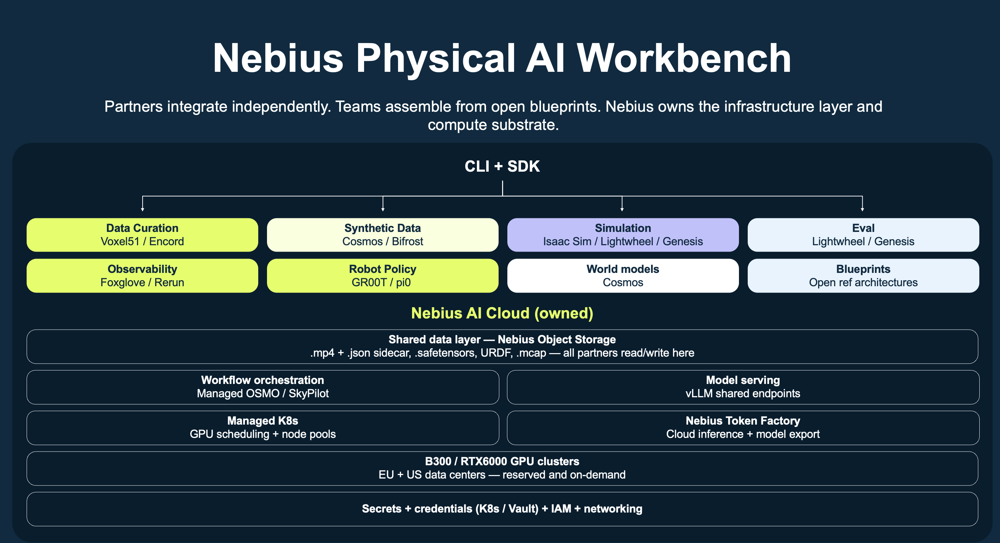

# Nebius Physical AI

Partners integrate independently. Teams assemble from open blueprints. Nebius
owns the infrastructure layer and compute substrate.



`npa` is the CLI and SDK for physical-AI workloads on Nebius. Workbench is the
primary solution: it gives developers one command surface for data curation,
simulation, synthetic data, policy training, evaluation, export, observability,
and SkyPilot workflows running on the Nebius substrate of object storage,
orchestration, vLLM serving, managed Kubernetes, and GPU clusters.

## Quick Start

Supported platforms: **macOS**, **Linux**, and **Windows (WSL2 Ubuntu)**.
Native Windows shells are not supported — use WSL2. Full copy-paste blocks:
[docs/quickstart.md § Fast install by platform](docs/quickstart.md#fast-install-by-platform).

Install the `npa` package into a fresh virtual environment. The venv can live
anywhere; activating it puts `npa` on your `PATH` (Python 3.10+ required):

```bash
git clone https://github.com/nebius/nebius-physical-ai.git
cd nebius-physical-ai

python3 -m venv .venv
source .venv/bin/activate
pip install --upgrade pip
pip install -e npa

npa --version
```

Install the Nebius CLI if it is not on `PATH` yet (all platforms):

```bash
curl -fsSL https://storage.eu-north1.nebius.cloud/cli/install.sh | bash
export PATH="${HOME}/.nebius/bin:${PATH}"   # add to ~/.zshrc or ~/.bashrc
```

Run your first real result with **no cloud, GPU, or credentials** — score a
shipped sample rollout set with the offline stub backend:

```bash
npa workbench vlm-eval benchmark \
  --dataset npa/src/npa/workbench/vlm_eval/fixtures/sample_benchmark/benchmark.json \
  --output /tmp/vlm-eval-benchmark.json \
  --backend stub \
  --thresholds 0.5,0.8,0.9 \
  --rubrics default,strict \
  --models Qwen/Qwen2-VL-7B-Instruct \
  --format json
```

You should see a ranked report with `accuracy: 1.0` over four labeled rollouts.
That is the full local loop; the same command swaps `--backend stub` for a real
`self-hosted` or `api` VLM backend once you add credentials.

### Nebius AI Cloud account

Before `npa configure --interactive`, sign in to Nebius AI Cloud and create the
tenant and project that NPA will use:

1. **Sign up and log in** — create an account at
   [Nebius signup](https://docs.nebius.com/signup-billing/sign-up). Use a
   standard email login (not SSO-only) so you can create tenants and projects.
2. **Tenant** — Nebius creates a tenant on signup. To add another, follow
   [Creating a tenant](https://docs.nebius.com/iam/create-tenants). Copy your
   tenant id (`tenant-…`) from the tenant selector in the
   [web console](https://console.nebius.com) or list tenants with the Nebius
   CLI ([get tenants](https://docs.nebius.com/iam/get-tenants)).
3. **Project** — create a project in that tenant for your workloads (for example
   in `eu-north1`). Use the console
   ([Manage projects](https://docs.nebius.com/iam/manage-projects)) or the CLI:

   ```bash
   nebius iam v2 project create --parent-id <tenant-id> --name npa-workbench --region eu-north1
   ```

   Copy the project id (`project-…`) from the console project selector or
   `nebius iam v2 project list --parent-id <tenant-id>`.
4. **Object Storage bucket (optional)** — `npa configure --interactive` can create
   a default `npa-bucket` for your project when you press Enter at the bucket
   prompt.
   For new buckets it asks for **storage class** (`standard`, default, or
   `enhanced`) and a **size limit in GB** (default 50). To reuse your own
   bucket instead, create one in the console (**Storage → Object Storage →
   Create bucket**) or via the CLI
   ([Manage buckets](https://docs.nebius.com/object-storage/buckets/manage)):

   ```bash
   nebius storage bucket create --parent-id <project-id> --name <your-bucket-name> \
     --default-storage-class standard --max-size-bytes 53687091200
   ```

   See the [Object Storage quickstart](https://docs.nebius.com/object-storage/quickstart)
   for naming rules.

You will enter your project id and tenant id when `npa configure --interactive`
prompts for them. No example ids or bucket names are shown — use the values from
your account, or press Enter to let NPA create a default `npa-bucket`.

Next, run interactive NPA setup (install the Nebius CLI binary first). This is
the supported onboarding path: `npa configure --interactive` reuses or creates
the Nebius CLI profile, prompts for tenant id, project id, region, bucket
(reuse or create `npa-bucket` with storage class and size), and optional
Hugging Face, Token Factory, and NGC keys, then writes `~/.npa/credentials.yaml`
and `~/.npa/config.yaml`. In a normal terminal, plain `npa configure` is
equivalent; use `--interactive` explicitly when documenting copy-paste steps or
when stdin is not a TTY. See
[docs/quickstart.md](docs/quickstart.md) for the full walkthrough:

```bash
npa configure --interactive
```

The flagship GPU workload is **NVIDIA Cosmos** (world-foundation model for
synthetic data and world generation). It runs across multiple NVIDIA GPU
platforms via a single `--gpu-type` flag (`gpu-h100-sxm`, `gpu-h200-sxm`,
`gpu-b300-sxm`, `gpu-l40s`) with no RT-core lock-in:

```bash
npa workbench cosmos -p <your-project-alias> -n cosmos deploy \
  --runtime serverless --gpu-type <gpu-platform> --wait
npa workbench cosmos -p <your-project-alias> -n cosmos infer \
  --prompt "A robot arm stacks colored cubes" \
  --output-path s3://<your-bucket>/cosmos/out/
```

Cosmos needs Nebius credentials, an `HF_TOKEN`, and GPU capacity; see the
flagship walkthrough in [docs/quickstart.md](docs/quickstart.md#7-flagship-gpu-workload-nvidia-cosmos).

## Zero-GPU hosted inference: Nebius Token Factory

[Nebius Token Factory](https://tokenfactory.nebius.com/) is an OpenAI-compatible
hosted-inference API for open text and vision models. NPA uses it natively so
several workbench tools run with **no GPU and no server to manage** — you only
need a `NEBIUS_API_KEY`. This includes physical-AI scene reasoning with
`nvidia/Cosmos3-Super-Reasoner` (image/video → scene understanding + plan).

```bash
# 1. Get a key at https://tokenfactory.nebius.com/ -> API keys, then:
npa configure --interactive         # paste the key at the Token Factory prompt
npa workbench token-factory verify  # confirms auth + lists served models

# 2. Use it (zero GPU):
npa workbench token-factory reason   --input-path ./scene  --output-path /tmp/plan      # Cosmos reasoner
npa workbench token-factory caption  --input-path ./frames --output-path /tmp/captions  # vision
npa workbench token-factory generate --input-path ./prompts.jsonl --output-path /tmp/gen # text
npa workbench vlm-eval run --backend api --api-key-env NEBIUS_API_KEY \
  --input-path ./rollout --output-path /tmp/eval                                        # score rollouts
```

Full register-and-use walkthrough, SkyPilot workflows, and combo pipelines that
pair Token Factory with Nebius GPU compute:
[docs/workbench/token-factory.md](docs/workbench/token-factory.md).

To work on `npa` itself (tests, lint), install the dev extra and run the fast
suite — see [CONTRIBUTING.md](CONTRIBUTING.md):

```bash
pip install -e "npa[dev]"
make test
```

For full cloud setup, continue with [docs/quickstart.md](docs/quickstart.md)
and [docs/workbench/getting-started.md](docs/workbench/getting-started.md).

## Easy Guides

Short, fun, copy-paste walkthroughs that pair a **robot**, a **simulation
environment**, and a **cool public dataset**. Start with the no-GPU one, then
pick a robot — see [docs/workbench/guides/README.md](docs/workbench/guides/README.md).

| Guide | Robot | Sim / engine | Public dataset |
| --- | --- | --- | --- |
| [Score a robot in 60 seconds (no GPU)](docs/workbench/guides/score-a-robot-no-gpu.md) | any | offline | shipped sample rollouts |
| [Pick-and-place with a Franka arm](docs/workbench/guides/franka-pick-and-place-genesis.md) | Franka Emika Panda | Genesis | DROID (Franka) |
| [Teach a robot to push a T](docs/workbench/guides/pusht-sim-to-real.md) | sim pusher | sim-to-real loop | `lerobot/pusht` |
| [Train a Reachy 2 humanoid policy](docs/workbench/guides/reachy2-lerobot-policy.md) | Reachy 2 | LeRobot | Pollen Robotics / LeRobot Hub |
| [Make a Unitree G1 walk](docs/workbench/guides/g1-humanoid-walk-sonic.md) | Unitree G1 | MuJoCo | NVIDIA GEAR-SONIC |
| [Train a quadruped to run](docs/workbench/guides/quadruped-isaac-lab.md) | ANYmal / quadruped | Isaac Lab | Isaac Lab built-in tasks |

## Workbench

Workbench is the main product surface in this repository. Current Workbench
tools are mounted directly under `npa workbench`; there is no `solutions` CLI
namespace.

| Category | Workbench commands |
| --- | --- |
| Data curation | `npa workbench fiftyone curate`, `eval`, `load-dataset`, `datasets list`; `npa workbench lancedb deploy`, `create-table`, `import-lerobot`, `import-bdd100k`, `backfill`, `create-mv`, `refresh-mv`, `query-table`, `query`; `npa workbench detection-training train`, `eval`, `status`, `list` |
| Synthetic data | `npa workbench cosmos infer`, `train`, `serve`, `status`; `npa workbench genesis generate-demos`; SkyPilot templates such as `npa/workflows/workbench/skypilot/bdd100k-pipeline.yaml` and `npa/workflows/workbench/templates/curate-augment-train.yaml` |
| Simulation | `npa workbench isaac-lab train`, `eval`, `export-lerobot`; `npa workbench genesis train-teacher`, `generate-demos`, `eval-teacher`, `eval-student`, `diagnose`, `tune`; `npa workbench sonic retargeting run` |
| Eval | `npa workbench vlm-eval run`, `benchmark`, `workflow`, `status`, `list`; `npa workbench mjlab eval`; `npa workbench sonic eval`; `npa workbench fiftyone eval`; `npa workbench isaac-lab eval`; `npa workbench genesis eval-student` |
| Observability | Tool-level `status`, `list`, and `system-info` commands; `npa workbench workflow status`, `logs`; `npa rerun host`, `share`, `list-shares`, `revoke`; `npa cluster status`, `list` |
| Robot policy | `npa workbench lerobot train`, `eval`, `serve`, `infer`, `list-checkpoints`, `benchmark`, `profile-train`, `train-student`; `npa workbench groot download`, `finetune`, `eval`, `serve`, `infer`, `convert`; `npa workbench sonic train`, `serve`, `export`, `eval`, `status`, `list` |
| World models | `npa workbench cosmos deploy`, `serve`, `infer`, `train`, `status`, `system-info` |
| Blueprints | `npa workbench workflow submit`, `workflow trigger watch`, `status`, `logs`, `teardown`, `distill`; checked-in YAML under `npa/workflows/workbench/skypilot/` and `npa/workflows/workbench/sim2real/` for Isaac Lab, VLM eval, SONIC export, SONIC eval, SONIC locomotion fine-tuning, retargeting, MJLab eval, sim-to-real, and BDD100K pipelines |

### Eval: VLM Backend

`vlm-eval` is a first-class Eval capability. It scores rollout artifacts with
self-hosted, API, or stub backends and has a checked-in SkyPilot template at
`npa/workflows/workbench/skypilot/vlm-eval.yaml`. The benchmark command sweeps a
labeled rollout set across thresholds, rubrics, and models, then writes a ranked
accuracy report with the best config.

```bash
npa workbench vlm-eval list
npa workbench vlm-eval status
npa workbench vlm-eval workflow
npa workbench vlm-eval run \
  --input-path ./rollout.json \
  --output-path ./eval.json \
  --backend stub \
  --score 0.9 \
  --dry-run
npa workbench vlm-eval benchmark \
  --dataset npa/src/npa/workbench/vlm_eval/fixtures/sample_benchmark/benchmark.json \
  --output /tmp/vlm-eval-benchmark.json \
  --backend stub \
  --thresholds 0.5,0.8,0.9 \
  --rubrics default,strict \
  --models Qwen/Qwen2-VL-7B-Instruct
```

The self-hosted workflow starts an OpenAI-compatible vLLM server and then calls
`npa workbench vlm-eval run`; the benchmark workflow does the same for
`npa workbench vlm-eval benchmark`.

### Robot Policy: GR00T, LeRobot, and SONIC

Robot policy work is split across policy training/serving, humanoid foundation
model operations, whole-body control, and export:

```bash
npa workbench lerobot train --help
npa workbench lerobot serve --help
npa workbench groot finetune --help
npa workbench groot serve --help
npa workbench sonic train --help
npa workbench sonic export --help
npa workbench sonic eval --help
```

`sonic export` is a first-class Robot Policy model-export capability. It
converts a trained SONIC locomotion checkpoint to a deterministic-action ONNX
graph:

```bash
npa workbench sonic export \
  --checkpoint sonic_release/last.pt \
  --output exported/sonic_policy.onnx
```

The matching workflow template is
`npa/workflows/workbench/skypilot/sonic-export.yaml`.
`npa workbench sonic eval` consumes the exported ONNX and sidecar metadata and
can run the built-in reference backend or a configured eval container. The
checked-in SkyPilot template is
`npa/workflows/workbench/skypilot/sonic-eval.yaml`.

### Workflows And Routing

Workbench workflow orchestration lives under the Workbench solution. For
**declarative state-machine specs** (`apiVersion: npa.workflow/v0.0.1`) — tool
chains, loops, and S3 artifact handoff — see
[docs/workbench/npa-workflow-guide.md](docs/workbench/npa-workflow-guide.md)
(golden YAMLs under `npa/workflows/workbench/npa-workflows/`).

SkyPilot pipeline submission (checked-in YAML under `npa/workflows/workbench/skypilot/`):

```bash
npa workbench workflow submit npa/workflows/workbench/skypilot/vlm-eval.yaml --run-id vlm-eval
npa workbench workflow submit npa/workflows/workbench/skypilot/sonic-export.yaml --run-id sonic-export
npa workbench workflow submit npa/workflows/workbench/skypilot/sonic-eval.yaml --run-id sonic-eval
npa workbench workflow run distill --local
npa workbench workflow status run-1
npa workbench workflow logs run-1 train_student
```

`submit` sends SkyPilot YAML through the NPA controller convention and supports
`--controller-backend kubernetes`, `--controller-backend nebius`, `--run-id`,
and repeated `--var KEY=VALUE` substitutions.

SONIC image routing is manifest-driven:

- `npa workbench sonic train` resolves the first-party image from
  `npa/src/npa/deploy/sonic_image_manifest.json` using `--gpu-type`, with
  `--image` and `--image-variant` available as explicit overrides.
- L40S VM targets use the baked `npa-sonic:0.1.2` image. RTX PRO 6000
  Blackwell Kubernetes targets use the host-mounted `npa-sonic:0.1.2-k8s-runtime`
  image. See `docs/workbench/sonic-image-catalog.md`.

### Solution Patterns

Workbench tools share the same platform patterns:

- Object-storage handoff through S3-style `--input-path` and `--output-path`
  values, with `~/.npa/credentials.yaml` as the user-authored credential file.
- SkyPilot workflows checked into `npa/workflows/workbench/` and submitted with
  `npa workbench workflow submit`.
- vLLM-compatible self-hosted serving for VLM eval and model-serving paths where
  the runtime exposes an OpenAI-compatible endpoint.
- Lifecycle commands that keep deploy, status, list, run, train, eval, serve,
  infer, export, and system-info behavior predictable across tools.

## Solutions Framework

The repository supports multiple top-level solution namespaces. Workbench is the
current primary solution and is implemented as the top-level SDK namespace
`npa.workbench` and the CLI namespace `npa workbench`.

Future solutions are additive: a datalake or simfarm solution would sit beside
Workbench as another top-level `npa` namespace. Future solutions should not
rename Workbench, move Workbench under a `solutions` namespace, or require users
to change existing `npa workbench` commands.

## Nebius Cloud Substrate

Workbench runs on Nebius infrastructure rather than hiding it:

- Object storage is the data layer for datasets, checkpoints, rollouts, eval
  JSON, exported models, and Rerun recordings.
- SkyPilot provides orchestration patterns for multi-stage jobs and managed
  Kubernetes backed workflows.
- vLLM-compatible endpoints support shared model-serving and Eval backends.
- Managed Kubernetes, VM, BYOVM, container, and serverless runtimes cover GPU
  targets including H100, H200, L40S, B300, and RTX6000 profiles as each tool is
  validated.
- Nebius CLI authentication, IAM, local `~/.npa/credentials.yaml`, and
  machine-managed `~/.npa/config.yaml` keep user secrets separate from project,
  workbench, endpoint, SSH, storage, and Terraform state metadata.

## Docs And Contributing

- [docs/quickstart.md](docs/quickstart.md): install, Nebius auth, and
  credential setup.
- [docs/workbench/npa-workflow-guide.md](docs/workbench/npa-workflow-guide.md):
  authoring **NPA workflow YAML** (`npa.workflow/v0.0.1` state machines).
- [docs/workbench/getting-started.md](docs/workbench/getting-started.md):
  Workbench setup and first workload path.
- [docs/workbench/guides/README.md](docs/workbench/guides/README.md): easy,
  beginner-friendly guides built around Franka, Reachy 2, Unitree G1, and
  quadrupeds in simulation with public datasets.
- [docs/workbench/](docs/workbench/): Workbench guides, cookbooks, and
  troubleshooting.
- [docs/workbench/cookbooks/README.md](docs/workbench/cookbooks/README.md):
  end-to-end cookbooks, including the
  [BDD100K + LanceDB pipeline](docs/workbench/cookbooks/bdd100k-pipeline.md).
- [docs/cli/README.md](docs/cli/README.md): generated CLI reference.
- [docs/architecture/solutions-model.md](docs/architecture/solutions-model.md):
  solution namespace model.
- [docs/architecture/cli-namespaces.md](docs/architecture/cli-namespaces.md):
  CLI namespace conventions.
- [CONTRIBUTING.md](CONTRIBUTING.md): contribution guidelines.
- [LICENSE](LICENSE): Apache License 2.0.
