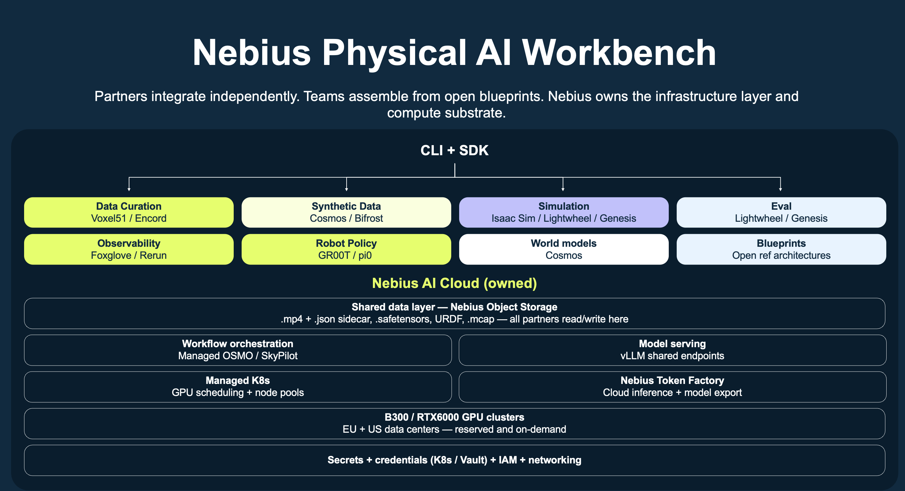

<div align="center">

# Nebius Physical AI

**Run physical-AI workloads on Nebius with one CLI, SDK, and workflow layer.**



[](LICENSE)
[](https://www.python.org/downloads/)
[](docs/install.md)
[](https://github.com/nebius/nebius-physical-ai/actions/workflows/test.yml)
[](CONTRIBUTING.md)

**[Quickstart](docs/quickstart.md)** ·
**[Robot guides](docs/workbench/guides/README.md)** ·
**[Workbench docs](docs/workbench/)** ·
**[CLI reference](docs/cli/README.md)** ·
**[Contributing](CONTRIBUTING.md)**

</div>

---

`npa` helps robotics teams curate data, run simulation, generate synthetic
data, train and evaluate policies, serve models, and compose multi-stage jobs.
Workloads run on Nebius object storage, managed Kubernetes, and GPU clusters.

| Goal | Start here |
| --- | --- |
| Train or evaluate a robot policy | [Robot guides](docs/workbench/guides/README.md) |
| Run Cosmos, Isaac Lab, LeRobot, GR00T, or SONIC | [Workbench getting started](docs/workbench/getting-started.md) |
| Build a multi-stage pipeline | [Workflow authoring guide](docs/workbench/npa-workflow-guide.md) |
| Run the Physical AI Data Factory | [Deployment guide](docs/workbench/guides/physical-ai-data-factory-deploy.md) |
| Deploy the browser-based NPA agent | [Agent operator guide](skills/tools/npa-agent/SKILL.md) |
| Bring your own framework | [BYOF guide](docs/workbench/cookbooks/byof-isaac-lab/) |

## Quick start

Requirements: Python 3.10+, a Nebius tenant and project, and macOS, Linux, or
WSL2. See [installation details](docs/install.md) for platform-specific setup.

```bash
git clone https://github.com/nebius/nebius-physical-ai.git
cd nebius-physical-ai
python3 -m venv .venv
source .venv/bin/activate
pip install -e npa

# Install the Nebius CLI, then configure npa.
curl -fsSL https://storage.eu-north1.nebius.cloud/cli/install.sh \
  | NEBIUS_CLI_VERSION=0.12.254 bash
export PATH="${HOME}/.nebius/bin:${PATH}"
npa configure
```

Verify the installation:

```bash
npa --version
npa workbench health preflight
```

## Pick a robot

| Tutorial | Stack |
| --- | --- |
| [Franka pick-and-place](docs/workbench/guides/franka-pick-and-place-genesis.md) | Genesis + DROID |
| [Push-T sim-to-real](docs/workbench/guides/pusht-sim-to-real.md) | Sim-to-real + LeRobot |
| [Reachy 2 policy training](docs/workbench/guides/reachy2-lerobot-policy.md) | LeRobot |
| [Unitree G1 walking](docs/workbench/guides/g1-humanoid-walk-sonic.md) | SONIC + MuJoCo |
| [Quadruped locomotion](docs/workbench/guides/quadruped-isaac-lab.md) | Isaac Lab |

Prefer a data pipeline? Run the
[Physical AI Data Factory](docs/workbench/guides/physical-ai-data-factory-deploy.md).
More examples are in the [cookbooks](docs/workbench/cookbooks/README.md).

## Workbench

All tools are available under `npa workbench`.

| Area | Tools and capabilities |
| --- | --- |
| Data | Dataset-of-record, FiftyOne, LanceDB |
| Simulation and synthetic data | Genesis, Isaac Lab, Cosmos |
| Robot policies | LeRobot, GR00T, SONIC |
| Evaluation | VLM eval, MJLab, golden evals |
| Serving and inference | Token Factory and vLLM-compatible endpoints |
| Operations | Workflows, health checks, status, logs, Rerun, Foxglove |

Browse the [CLI reference](docs/cli/README.md) for every command or the
[image/GPU compatibility matrix](docs/workbench/image-gpu-compatibility-matrix.md)
before selecting hardware. Public images and exact tags are in the
[container image catalog](docs/workbench/container-image-catalog.md).

## Workflows

Compose Workbench tools as declarative `npa.workflow/v0.0.1` state graphs with
S3 artifact handoffs, gates, and loops.

```bash
WORKFLOW=npa/workflows/workbench/npa-workflows/vlm-eval-single.yaml
export NPA_REGISTRY=ghcr.io/nebius/nebius-physical-ai

# Local checks; does not launch compute.
npa workbench workflow validate-spec "$WORKFLOW"
npa workbench workflow plan-spec "$WORKFLOW" --run-id demo
npa workbench workflow preflight-images "$WORKFLOW" --registry "$NPA_REGISTRY"

# Submit after `npa configure`.
npa workbench workflow submit "$WORKFLOW" \
  --run-id demo \
  --registry "$NPA_REGISTRY"
```

References: [authoring guide](docs/workbench/npa-workflow-guide.md) ·
[tool catalog](docs/workbench/npa-workflow-tool-catalog.md) ·
[example workflows](npa/workflows/workbench/npa-workflows/).

## NPA agent

The self-hosted agent provides a browser UI, grounded chat, artifact viewers,
and workflow draft/validate/plan/submit actions.

```bash
npa agent preflight
npa agent setup
npa agent status --project <project-alias> --name agent
```

Requirements and operations: [agent guide](skills/tools/npa-agent/SKILL.md) ·
[fresh setup and teardown](skills/workflows/agent-fresh-operate/SKILL.md).

## Common issues

| Symptom or question | What to do |
| --- | --- |
| Nebius CLI version is rejected | Install tested version `0.12.254`; `0.12.227` is also accepted with a warning. |
| Unsure whether credentials are ready | Run `npa workbench health preflight`. Add `--offline` to check presence only or `--json` for structured output. |
| Choosing a GPU | Check the [image/GPU compatibility matrix](docs/workbench/image-gpu-compatibility-matrix.md). Isaac Lab requires an RT-core GPU such as L40S or RTX Pro 6000. |
| `401` while pulling a private image | Refresh the `npa-nebius-registry` pull secret; registry tokens expire. Use the [public image catalog](docs/workbench/container-image-catalog.md) when a GHCR image is available. |
| Token Factory authentication fails | Use `NEBIUS_TOKEN_FACTORY_KEY`; Token Factory keys start with `v1.` and are not Nebius IAM tokens. |
| `status` reaches a stale endpoint | Pass `-p PROJECT -n NAME` to the tool's `status` command. |
| Submitting a multi-stage job | Use `npa workbench workflow submit`; avoid hand-editing scheduler YAML. |

See [known footguns](docs/workbench/troubleshooting/known-footguns.md) and the
[active issue list](FIXME.md) for deeper troubleshooting.

## Documentation

| Topic | Reference |
| --- | --- |
| Install and authentication | [Quickstart](docs/quickstart.md) |
| Workbench setup | [Getting started](docs/workbench/getting-started.md) |
| Tutorials | [Robot guides](docs/workbench/guides/README.md) · [cookbooks](docs/workbench/cookbooks/README.md) |
| Physical AI Data Factory | [Deployment guide](docs/workbench/guides/physical-ai-data-factory-deploy.md) · [concepts](docs/workbench/guides/physical-ai-data-factory.md) |
| Workflow authoring | [Authoring guide](docs/workbench/npa-workflow-guide.md) · [tool catalog](docs/workbench/npa-workflow-tool-catalog.md) |
| Containers and GPUs | [Image catalog](docs/workbench/container-image-catalog.md) · [packaging](docs/workbench/container-packaging.md) · [compatibility matrix](docs/workbench/image-gpu-compatibility-matrix.md) |
| Cleanup | [CLI cleanup guide](docs/cli/cleanup.md) · [safe uninstall](docs/cli/uninstall.md) |
| Architecture | [Contributor context](docs/architecture/contributor-context.md) · [solutions model](docs/architecture/solutions-model.md) |
| Troubleshooting | [Known footguns](docs/workbench/troubleshooting/known-footguns.md) |

## Contributing

```bash
pip install -e "npa[dev]"
make test
```

See [CONTRIBUTING.md](CONTRIBUTING.md) for development setup and review
requirements. Security disclosures: [SECURITY.md](SECURITY.md).

## License

Licensed under the [Apache License 2.0](LICENSE). Built by
[Nebius](https://nebius.com) and the physical-AI community.
