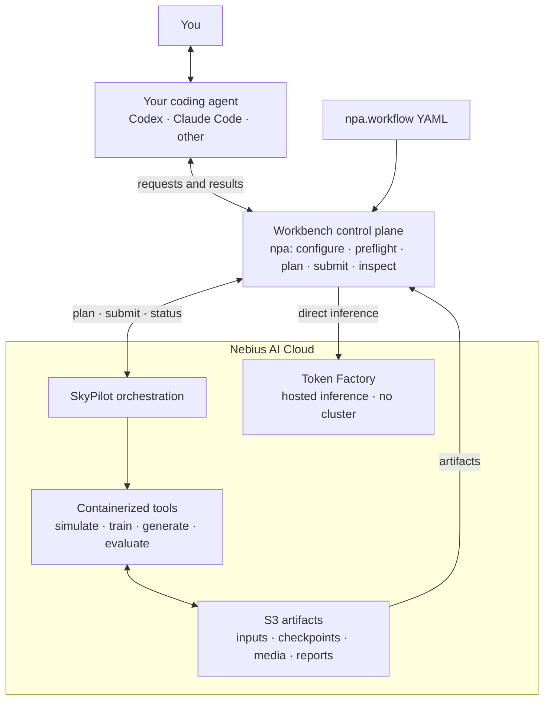

<div align="center">

# Nebius Physical AI

**The control plane your coding agent uses to run physical-AI workloads on Nebius.**


[](LICENSE)
[](https://www.python.org/downloads/)
[](docs/install.md)
[](https://github.com/nebius/nebius-physical-ai/actions/workflows/test.yml)
[](CONTRIBUTING.md)

**[Quickstart](docs/quickstart.md)** ·
**[Guides](docs/workbench/guides/README.md)** ·
**[Workbench docs](docs/workbench/README.md)** ·
**[CLI reference](docs/cli/README.md)** ·
**[Python & API](docs/workbench/cli-sdk-yaml-walkthrough.md)** ·
**[Cookbooks](docs/workbench/cookbooks/README.md)** ·
**[Contributing](CONTRIBUTING.md)**

</div>


## What is Workbench?

Workbench is the agent-facing control plane for physical AI on Nebius. You
describe the outcome; Codex, Claude Code, or another coding agent with terminal
access to this checkout uses `npa` to configure the project, check access, plan
resources, run containerized tools and workflows, and inspect the result with
you. You can drive the same operations directly through the CLI, and supported
tools also expose Python interfaces.

### How Workbench runs a task


```mermaid
flowchart TB
    you["You"] <--> agent["Your coding agent<br/>Codex · Claude Code · other"]
    agent <-->|"requests and results"| npa["Workbench control plane<br/>npa: configure · preflight · plan · submit · inspect"]
    spec["npa.workflow YAML"] --> npa

    subgraph nebius["Nebius AI Cloud"]
        direction LR
        sky["SkyPilot orchestration"] --> tools["Containerized tools<br/>simulate · train · generate · evaluate"]
        tools <--> s3["S3 artifacts<br/>inputs · checkpoints · media · reports"]
        tf["Token Factory<br/>hosted inference · no cluster"]
    end

    npa <-->|"plan · submit · status"| sky
    npa -->|"direct inference"| tf
    s3 -->|"artifacts"| npa
```

`npa` gives the agent one bounded interface for readiness checks, infrastructure,
workflow lifecycle, and artifacts. SkyPilot schedules the selected tools on
Nebius; Token Factory handles supported hosted inference without a cluster; S3
carries durable inputs and outputs between stages. You remain in the loop for
choices and human-bound approvals such as accepting model terms.

Start with a [workload guide](#pick-your-first-win). The guide tells you which
data, model access, GPU, and output to expect.

## Quickstart

Using a coding agent? Open this checkout in your agent and paste one of the
maintained prompts:

- [Set up Workbench for a task](docs/workbench/agent-first-run.md#set-up-workbench).
- [Run the Cosmos 3 generation workflow](docs/workbench/agent-first-run.md#run-cosmos-3-generation).

The prompts keep credentials private, stop at human approval gates, validate
the plan before provisioning, and stay with the run through artifact inspection.
The manual path below exposes the same control-plane steps.

### 1. Install

Use Python **3.10+** on macOS, Linux, or WSL2 Ubuntu. Clone the repository,
then run the remaining commands from its root:

```bash
git clone https://github.com/nebius/nebius-physical-ai.git
cd nebius-physical-ai
python3 -m venv .venv
source .venv/bin/activate
pip install -e npa
npa --version
```

You should see the installed `npa` version. Remote GPU workloads use their
container dependencies; you do not need CUDA or a local GPU to use the CLI.
[Installation](docs/install.md) covers platform setup and optional dependencies.

### 2. Connect your project

Install the tested Nebius CLI and configure your project:

```bash
curl -fsSL https://storage.eu-north1.nebius.cloud/cli/install.sh \
  | NEBIUS_CLI_VERSION=0.12.254 bash
export PATH="${HOME}/.nebius/bin:${PATH}"
npa configure
npa workbench health preflight --checks nebius --json
```

The preflight should report working Nebius authentication. It does not reserve
GPUs or verify model access. Interactive configuration provisions object storage
by default and needs project admin permission for that setup. Use
`npa configure --no-provision` to save settings without creating storage.
See [configuration](docs/configuration.md) for SSO, existing projects, and tokens.

Check a project's saved storage with its configured alias in place of `<alias>`:

```bash
npa workbench health preflight --project '<alias>' --checks s3,nebius --json
```

Missing or invalid project storage fails without borrowing shell or host-file
credentials or changing configuration. S3 readiness uses a bounded listing call;
it does not enumerate the dataset or verify write access. Without `--project`,
the S3 check keeps the existing host credential selection.

### 3. Run and inspect

Choose one guide below and follow it through input preparation, GPU setup,
submission, and output inspection. [Workbench setup](docs/workbench/getting-started.md)
provides the shared cluster and SkyPilot steps; complete them once per project.
Keep the returned run ID: you use it to inspect logs, find artifacts, and resume.

For video augmentation, the [PAIDF + Cosmos 3 runbook](workflows/guides/paidf-cosmos3.md)
includes a public source-video example and full submission commands.

<a id="pick-your-first-win"></a>

## Choose your first workload

| Result | Guide | Main requirement |
| --- | --- | --- |
| Generated images or video | [Cosmos 3 generation](docs/quickstart.md#standalone-cosmos-3-generation) | Compatible GPU and model access |
| Augmented video with evaluation and curation reports | [PAIDF + Cosmos 3](workflows/guides/paidf-cosmos3.md) | Source video, GPU, S3, hosted inference |
| A labeled video dataset | [Physical AI Data Factory](docs/workbench/guides/physical-ai-data-factory-deploy.md) | Source video, RT-core GPU, S3 |
| A reconstructed 3D scene and novel views | [Neural reconstruction](docs/workbench/guides/neural-reconstruction.md) | Sensor capture and RT-core GPU |
| A robot-policy training checkpoint | [Reachy 2 + LeRobot](docs/workbench/guides/reachy2-lerobot-policy.md) | Matching recorded dataset and GPU |
| A Franka training and evaluation exercise | [Franka + Genesis](docs/workbench/guides/franka-pick-and-place-genesis.md) | GPU; recorded run did not solve the task |
| Quadruped reinforcement learning | [Isaac Lab](docs/workbench/guides/quadruped-isaac-lab.md) | RT-core GPU |
| A G1 locomotion evaluation or training path | [G1 + SONIC](docs/workbench/guides/g1-humanoid-walk-sonic.md) | Runtime-specific GPU and checkpoints |
| A browser workbench and artifact viewer | [Deploy the agent](docs/agent.md) | Terraform and S3 |

The [guide index](docs/workbench/guides/README.md) records validation scope.
[Cookbooks](docs/workbench/cookbooks/README.md) cover longer training and data
pipelines. GPU names alone do not establish image compatibility; check the
[image/GPU matrix](docs/workbench/image-gpu-compatibility-matrix.md) before provisioning.

## Compose it into a workflow

A workflow is a YAML state graph: each `toolRef` selects a Workbench operation;
outputs become inputs to later stages. SkyPilot schedules the work on Nebius.

These commands validate and plan a checked-in example **locally**:

```bash
npa workbench workflow validate-spec workflows/testing/cosmos3-generate.yaml
npa workbench workflow plan-spec workflows/testing/cosmos3-generate.yaml --run-id demo
```

Expect a valid specification and a plan containing the `generate` stage.
The example's storage values are placeholders. Planning creates no workload and
does not prove its inputs, credentials, image, or GPU are ready for execution.

For a real run, follow the selected guide's `prepare-run`, image preflight,
`submit --runtime`, and monitoring instructions with your own project and input.
See the [workflow catalog](workflows/README.md),
[authoring guide](docs/workbench/npa-workflow-guide.md), and
[run lifecycle](docs/run-lifecycle.md). The canonical
[14-stage Sim2Real pipeline](docs/workbench/guides/sim2real-workflow.md) uses this
same runtime and requires its own prepared images, task data, and resource profiles.

<a id="whats-in-the-box"></a>

## Find a tool or integration

| Task | Reference |
| --- | --- |
| Discover tools by task | [Workbench docs](docs/workbench/README.md) |
| Find a command or option | [CLI index](docs/cli/README.md), then `npa workbench <tool> --help` |
| Call a tool from Python or HTTP | [CLI / SDK walkthrough](docs/workbench/cli-sdk-yaml-walkthrough.md) — supported interfaces vary by tool |
| Develop a native Ray application | [Ray guide](docs/workbench/ray.md) |
| Inspect or share run outputs | [Rerun](docs/workbench/rerun-sharing.md) · [Foxglove/MCAP](docs/workbench/foxglove-export.md) |
| Diagnose a failed run | [Troubleshooting](docs/workbench/troubleshooting/known-footguns.md) |

## When you're done, tear it down

Cancel active jobs before deleting their infrastructure. Preview project cleanup:

```bash
npa destroy --project "<alias>" --all
```

This is read-only until you pass `--yes`. Review the listed resources and save
needed artifacts before deleting storage. [Teardown](docs/teardown.md) covers
service, controller, cluster, and storage cleanup. Local `npa cleanup` alone
does not stop cloud resources.

## Container images

Use the [public image catalog](docs/workbench/container-image-catalog.md) to pull
available GHCR images. Repository-owned runtime defaults already select GHCR;
`npa configure` needs no registry setup. Some images fetch separately licensed
runtimes or model weights at startup, so check their access requirements too.

For modified or private images, follow the
[build and packaging guide](docs/workbench/container-packaging.md) and select
the image explicitly. `NPA_REGISTRY` alone does not change runtime defaults.

## Validated on Nebius

The [image/GPU matrix](docs/workbench/image-gpu-compatibility-matrix.md) records
hardware tests and distinguishes them from expected compatibility. Each guide
states what its run established: a working container, a generated artifact, a
training checkpoint, or measured task performance. A smoke test is not evidence
of policy convergence. See also the
[LeRobot benchmarks](docs/workbench/cookbooks/lerobot-gpu-benchmarks.md) and
[planned partner capabilities](docs/architecture/partner-skills-roadmap.md).

## Repository layout

| Directory | Contents |
| --- | --- |
| [`npa/`](npa/README.md) | Python package, CLI, SDK, and tests |
| [`workflows/`](workflows/README.md) | Declarative workflow catalog and runbooks |
| [`docs/`](docs/README.md) | Setup, tool guides, cookbooks, and references |
| [`deploy/cluster/`](deploy/cluster/README.md) | Managed Kubernetes Terraform wrapper |
| [`skills/`](skills/index.yaml) | Operating and contribution instructions for agents |
| [`workbench/mlflow/`](workbench/mlflow/README.md) | Local MLflow and Postgres stack |
| [`research/`](research/lerobot-deploy/README.md) | Historical standalone deployment research |

## Documentation

Use the [documentation index](docs/README.md) to find setup, operations, and
contributor references. Report a broken example with its command, `npa` version,
and redacted error in [GitHub Issues](https://github.com/nebius/nebius-physical-ai/issues).
Keep credentials and private infrastructure identifiers out of issue text.

## Contributing

See [CONTRIBUTING.md](CONTRIBUTING.md) for the development environment, required
checks, and PR process. [The package README](npa/README.md#developing-and-testing-npa)
has the shortest test commands. Update the relevant documentation and
[root skill](skills/index.yaml) when changing behavior.
Security disclosures: [SECURITY.md](SECURITY.md).

## License

[Apache License 2.0](LICENSE). Third-party software, models, and datasets retain
their own licenses and access terms.
