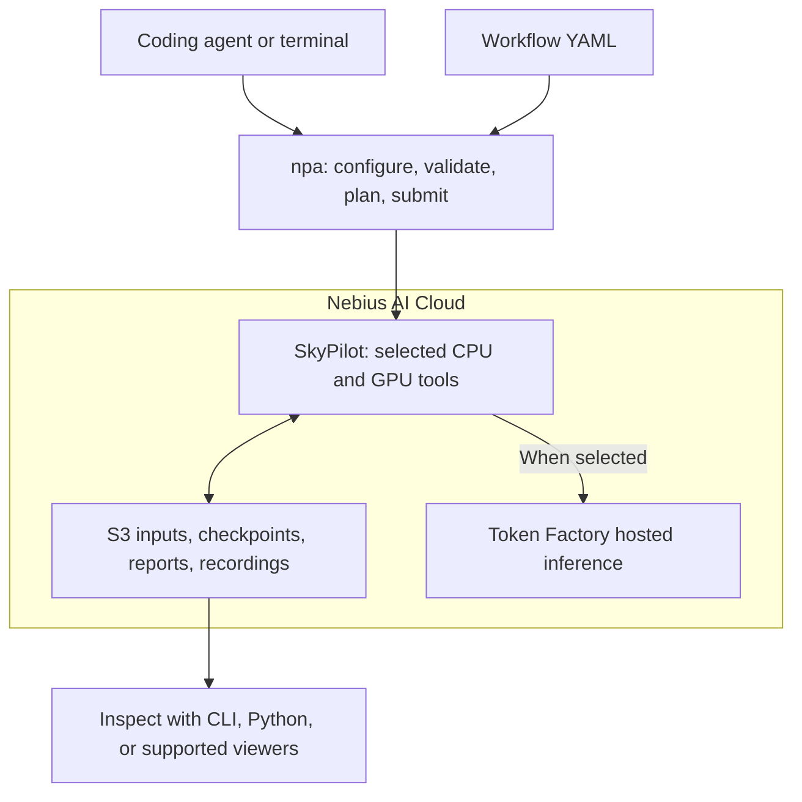

<div align="center">

# Nebius Physical AI

**One CLI, one SDK, one workflow layer for physical-AI workloads on Nebius —
data curation, simulation, synthetic data, policy training, evaluation,
observability, and cluster orchestration.**


[](LICENSE)
[](https://www.python.org/downloads/)
[](docs/install.md)
[](https://github.com/nebius/nebius-physical-ai/actions/workflows/test.yml)
[](CONTRIBUTING.md)

**[Quickstart](docs/quickstart.md)** ·
**[Guides](docs/workbench/guides/README.md)** ·
**[Workbench docs](docs/workbench/README.md)** ·
**[CLI reference](docs/cli/README.md)** ·
**[Python & API](docs/workbench/cli-sdk-yaml-walkthrough.md)** ·
**[Cookbooks](docs/workbench/cookbooks/README.md)** ·
**[Contributing](CONTRIBUTING.md)**

</div>

---

## What is `npa`?

`npa` is the CLI and SDK for **Nebius Physical AI**. Workbench is its primary
solution: one command surface that composes data curation, simulation, synthetic
data, policy training, evaluation, export, observability, and declarative
workflows on Nebius object storage, managed Kubernetes, vLLM-compatible serving,
and GPU clusters (H100 · H200 · L40S · B300 · RTX PRO 6000).

You bring a robot, a dataset, or a pipeline idea. `npa` brings the containers,
the orchestration, and the preflight checks that catch a missing token before it
stalls your run.

Workbench is meant to be operated by **your own coding agent**. Connect the
agent to this checkout with terminal access, attach your cloud and model
credentials through its private environment or secret manager, and ask it to
configure, validate, provision, submit, and inspect workflows with you. The
prompts in the [coding-agent guide](docs/workbench/agent-first-run.md) are a
starting point; you do not need to learn every `npa` command before running
something real.

|                       |                                                                                                              |
| --------------------- | ------------------------------------------------------------------------------------------------------------ |
| **What you can do**   | Curate datasets · train and evaluate policies · render synthetic data · run sim-to-real loops · serve models  |
| **Who it's for**      | Robotics teams, physical-AI researchers, and partners shipping on Nebius                                      |
| **Where it runs**     | Nebius S3, managed Kubernetes, and GPU clusters                                                               |
| **How you extend it** | Declarative `npa.workflow/v0.0.1` YAML specs and reusable Workbench tool refs                                 |

For an existing Fleet, run `npa fleet verify-storage --spec <fleet.yaml>` to
verify the shared filesystem on every CPU and GPU worker, including host mount
capacity, cross-node PVC reads and writes, and cleanup. The command and Python
SDK share one implementation; see [Fleet storage verification](docs/fleet-storage-verification.md)
for selectors, private evidence, and automation-safe JSON.

For an existing 8-GPU RTX rendering Fleet, run
`npa fleet verify-graphics --spec <fleet.yaml>`. It fresh-verifies each
registered target, observes cluster stability, and then proves CUDA vectorAdd,
GLX, EGL, and Vulkan on every RTX worker. Exact receipts stay owner-private;
text and JSON output contain only counts, failure categories, and evidence
hashes. See the [GPU driver strategy](docs/workbench/mk8s-gpu-driver-strategy.md#qualifying-an-existing-rtx-fleet).

> Partners integrate independently. Teams assemble from open blueprints.
> Nebius owns the infrastructure layer and compute substrate.

### How workflows run


```mermaid
flowchart TB
    operator["Coding agent or terminal"] --> npa["npa: configure, validate, plan, submit"]
    yaml["Workflow YAML"] --> npa
    npa --> run["SkyPilot: selected CPU and GPU tools"]
    subgraph nebius["Nebius AI Cloud"]
        run <--> s3["S3 inputs, checkpoints, reports, recordings"]
        tf["Token Factory hosted inference"]
    end
    run -->|"When selected"| tf
    s3 --> inspect["Inspect with CLI, Python, or supported viewers"]
```

Workbench submits workflow tasks through SkyPilot. Selected tools exchange
inputs and outputs through S3; workflows can call Token Factory for hosted
inference. Inspect artifacts through the CLI, Python, or a compatible Rerun or
Foxglove viewer. This diagram describes workflow execution; the
[Workbench Ray guide](docs/workbench/ray.md) routes direct native Jobs/Core,
Train, Serve, and KubeRay use to the supported paths.

The [daily dev VM test guide](docs/testing/dev-vm-daily.md) covers the daily and
manual GitHub workflow, a dedicated VM with public SSH, pinned host keys, and
isolated test execution. The workflow connects directly from GitHub without a
VPN or an identity-federation service. The guide also covers selecting an
external public address pool and updating trusted SSH settings after an address
change.

Python and HTTP coverage varies by tool. The
[CLI / SDK walkthrough](docs/workbench/cli-sdk-yaml-walkthrough.md) explains
typed clients, callback wrappers, and their return values.

---

## Quickstart

[Use Workbench with a coding agent](docs/workbench/agent-first-run.md).

Three steps from a clone to a real result on Nebius.

### 1. Install `npa`

Python **3.10+**. `npa` is not on PyPI — install it editable from the clone:

```bash
git clone https://github.com/nebius/nebius-physical-ai.git
cd nebius-physical-ai
python3 -m venv .venv
source .venv/bin/activate
pip install -e npa
npa --version
```

> **Windows:** use WSL2 Ubuntu. Per-platform steps are in
> [docs/install.md](docs/install.md).
>
> **Managed deployments** (such as `npa agent fresh-setup`) also need
> **Terraform 1.x** on `PATH` — `pip install -e npa` does not install it. Check
> with `terraform version`; agent bootstrap installs the tested 1.13.3 baseline
> only when Terraform is missing entirely.

### 2. Connect to Nebius

[Sign up](https://docs.nebius.com/signup-billing/sign-up), create a
[tenant and project](https://docs.nebius.com/iam/manage-projects), install the
Nebius CLI, then let `npa configure` write `~/.npa/credentials.yaml` and
`~/.npa/config.yaml` for you:

```bash
curl -fsSL https://storage.eu-north1.nebius.cloud/cli/install.sh \
  | NEBIUS_CLI_VERSION=0.12.254 bash
export PATH="${HOME}/.nebius/bin:${PATH}"   # add to ~/.zshrc or ~/.bashrc
npa configure
```

`npa` is tested with Nebius CLI `0.12.254` (recommended) and `0.12.227`
(compatible, with a warning). Anything else is blocked *before* provider calls,
and the error prints the exact install command to run.

`npa configure` also prompts for optional model and inference tokens, linking
each setup guide inline: [Hugging Face](docs/workbench/huggingface-token.md) ·
[NVIDIA NGC](docs/workbench/ngc-api-key.md) ·
[Nebius Token Factory](docs/workbench/token-factory-key.md).
Its Hugging Face and NGC access summary is informative: missing, rejected,
gated, or temporarily unreachable providers do not prevent otherwise-valid
configuration from being saved. Use `npa workbench health access` when access
must be an enforcing gate.

Interactive configuration provisions object storage by default. First-time
storage setup needs admin permission on the target project to create the
service account, access key, and bucket-scoped IAM permissions.

For project creation, SSO, non-interactive provisioning, credential names, and
recovery, see [configuration](docs/configuration.md). Use the
[coding-agent setup prompt](docs/workbench/agent-first-run.md#configure-the-project-and-model-access)
to prepare the credentials and resources required by your selected task.

### 3. Run your first workload

Choose a GPU workload from the [guides](docs/workbench/guides/README.md), such
as a robot policy or [NVIDIA Cosmos](docs/quickstart.md#standalone-cosmos-3-generation).
You can also select individual tools from the [tool reference](docs/cli/workbench.md)
and compose them into a workflow. Use the [coding-agent guide](docs/workbench/agent-first-run.md)
to check the inputs, credentials, and resources your task needs.

For a worked video-augmentation example, use
[PAIDF + Cosmos 3](docs/workbench/guides/paidf-cosmos3.md): supply a
local H.264 MP4 or private S3 MP4 URI, generate source-conditioned variants,
evaluate them, and curate accepted outputs. The
[PAIDF workflow prompt](docs/workbench/agent-first-run.md#run-paidf-with-cosmos-3)
guides your agent through project storage, model access, GPU planning, image
checks, submission, recovery, and output inspection. The PAIDF guide's command
examples validate and plan the workflow without running it.

Check the raw generated media as well as the published PAIDF composite, which
blends source and generated frames (80% source by default). A quality rejection
after bounded refinement skips labeling and curation; inspect the report before
retrying. The original [Physical AI Data Factory](docs/workbench/guides/physical-ai-data-factory-deploy.md)
continues to use Cosmos Transfer 2.5.

---

## Pick your first win

Short, copy-paste walkthroughs. Pick whichever sounds fun — they are independent.

| I want to…                                     | Go here                                                                                | Needs                    |
| ------------------------------------------------ | ---------------------------------------------------------------------------------------- | -------------------------- |
| Pick and place with a Franka arm                 | [Franka + Genesis](docs/workbench/guides/franka-pick-and-place-genesis.md)                | GPU cluster                |
| Teach a robot to push a T                        | [PushT sim-to-real](docs/workbench/guides/pusht-sim-to-real.md)                           | GPU cluster                |
| Train a Reachy 2 humanoid policy                 | [Reachy 2 + LeRobot](docs/workbench/guides/reachy2-lerobot-policy.md)                     | GPU cluster                |
| Make a Unitree G1 walk                           | [G1 + SONIC](docs/workbench/guides/g1-humanoid-walk-sonic.md)                             | GPU cluster                |
| Train a quadruped to run                         | [Quadruped + Isaac Lab](docs/workbench/guides/quadruped-isaac-lab.md)                     | RT-core GPU                |
| Run the flagship GPU workload                    | [NVIDIA Cosmos](docs/quickstart.md#standalone-cosmos-3-generation)                 | GPU cluster                |
| Augment robot video with PAIDF + Cosmos 3        | [PAIDF with Cosmos 3](docs/workbench/guides/paidf-cosmos3.md)                             | GPU cluster + S3           |
| Run a real data pipeline, not a robot            | [Physical AI Data Factory](docs/workbench/guides/physical-ai-data-factory-deploy.md)      | GPU cluster + S3           |
| Rebuild a real scene in 3D                       | [Neural reconstruction](docs/workbench/guides/neural-reconstruction.md)                   | RT-core GPU                |
| Get a browser workbench with a Rerun viewer      | [Deploy the `npa` agent](docs/agent.md)                                                  | Terraform + S3 (~20 min)   |

Full index: [docs/workbench/guides/README.md](docs/workbench/guides/README.md).
Longer end-to-end recipes (BDD100K + LanceDB, Isaac-Lab BYOF, LeRobot GPU
benchmarks): [cookbooks](docs/workbench/cookbooks/README.md).

---

## What's in the box

Every tool lives under `npa workbench` (there is no `solutions` namespace).
A few highlights:

- **`token-factory`** — hosted inference, captioning, and reasoning against your
  own frames.
- **`vlm-eval`** — scores rollouts with API or self-hosted vLLM backends; see
  [`vlm-eval-single.yaml`](workflows/testing/vlm-eval-single.yaml).
- **`health preflight`** — validates HF / NGC / S3 / Token Factory before a
  deploy or a GPU job.
- **`foxglove`** — packs run frames, metrics, and logs into MCAP for the
  embedded viewer ([CLI](docs/cli/foxglove.md) ·
  [export contract](docs/workbench/foxglove-export.md)).
- **`golden-eval`** — defines and runs per-container checks; CI validates their
  manifest, while execution results depend on the selected test and runtime.
- **`trigger`** — watches S3-compatible prefixes and retriggers workflows.
- **`sonic export`** — converts locomotion checkpoints to ONNX.

<details>
<summary><strong>Browse the full command inventory by category</strong></summary>

| Category         | Workbench commands                                                                                                                                                                                                                                                                                     |
| ---------------- | ------------------------------------------------------------------------------------------------------------------------------------------------------------------------------------------------------------------------------------------------------------------------------------------------------ |
| Data curation    | `npa workbench fiftyone curate`, `eval`, `load-dataset`, `datasets list`; `npa workbench lancedb deploy`, `create-table`, `import-lerobot`, `import-bdd100k`, `backfill`, `create-mv`, `refresh-mv`, `query-table`, `query`; `npa workbench detection-training train`, `eval`, `status`, `list`         |
| Synthetic data   | `npa workbench cosmos infer`, `train`, `serve`, `status`; `npa workbench cosmos2 transfer`; `npa workbench cosmos3 reason`; `npa workbench genesis generate-demos`; specs such as [`bdd100k-pipeline.yaml`](workflows/testing/bdd100k-pipeline.yaml) |
| Simulation      | `npa workbench isaac-lab train`, `eval`, `export-lerobot`, `export-onnx`; `npa workbench leisaac launch`, `status`, `destroy` (browser teleoperation); `npa workbench genesis train-teacher`, `generate-demos`, `eval-teacher`, `eval-student`, `diagnose`, `tune`; `npa workbench sonic retargeting run`, `workflow`                                                                    |
| Eval            | `npa workbench vlm-eval run`, `benchmark`, `workflow`, `status`, `list`; `npa workbench mjlab eval`, `workflow`; `npa workbench sonic eval`; `npa workbench fiftyone eval`; `npa workbench isaac-lab eval`; `npa workbench genesis eval-student`; `npa workbench golden-eval run`, `run-all`, `validate` |
| Robot policy    | `npa workbench lerobot train`, `eval`, `serve`, `infer`, `list-checkpoints`, `benchmark`, `profile-train`, `train-student`; `npa workbench groot download`, `finetune`, `eval`, `serve`, `infer`, `convert`; `npa workbench sonic train`, `serve`, `export`, `eval`, `status`, `list`                    |
| World models    | `npa workbench cosmos deploy`, `serve`, `infer`, `train`, `finetune`, `optimize`, `autoscale`, `status`, `system-info`                                                                                                                                                                                   |
| Hosted LLM      | `npa workbench token-factory caption`, `generate`, `reason`, `verify`, `models`, `workflow`, `status`                                                                                                                                                                                                    |
| Workflows       | `npa workbench workflow validate-spec`, `plan-spec`, `run-spec`, `submit`; workbench workflows under [`workflows/`](workflows/)                                                                                                                                           |
| Observability   | Tool-level `status`, `list`, and `system-info` commands; `npa workbench workflow status`, `logs`; `npa workbench health preflight`; `npa workbench foxglove convert-run`, `inspect`, `install-sdk`, `config`; `npa rerun host`, `share`, `list-shares`, `revoke`; `npa cluster status`, `list`                                                                                       |
| Platform utils  | `npa configure` / `init`, `npa provision-if-absent`; `npa agent`, `npa skypilot bootstrap/status/verify`, `npa soperator`, `npa burst`, `npa cluster`, `npa network`, `npa adapter convert`, `npa convert lerobot-to-rrd/-mp4`, `npa viz`, `npa demo`                                                    |

</details>

Full CLI reference: [docs/cli/README.md](docs/cli/README.md).

---

## Compose it into a workflow

Author pipelines as declarative `npa.workflow/v0.0.1` specs — a state graph of
Workbench `toolRef` steps with S3 handoffs, gates, and loops. The same YAML is
what you validate, plan, and submit.

These commands inspect an example locally. Its bucket and rollout paths are
placeholders; the commands do not stage input or launch a workload.

```bash
npa workbench workflow validate-spec workflows/testing/vlm-eval-single.yaml
npa workbench workflow plan-spec workflows/testing/vlm-eval-single.yaml --run-id demo
```

|                         |                                                                                    |
| ----------------------- | ------------------------------------------------------------------------------------ |
| **Format**              | `apiVersion: npa.workflow/v0.0.1`                                                    |
| **CLI**                 | `validate-spec` · `plan-spec` · `run-spec` · `submit`                                |
| **Workbench workflows** | [`workflows/`](workflows/)   |
| **Tool catalog**        | [npa-workflow-tool-catalog.md](docs/workbench/npa-workflow-tool-catalog.md)          |
| **Authoring guide**     | [npa-workflow-guide.md](docs/workbench/npa-workflow-guide.md)                        |
| **What submit does**    | [Run lifecycle](docs/run-lifecycle.md) — gates, run identity, restart safety, status |

For execution, follow a complete workload guide with your actual bucket,
prepared input, credentials, and resources. Use `submit --runtime` for parallel
groups and decisions evaluated during the run. The canonical
[14-stage Sim2Real workflow](docs/workbench/guides/sim2real-workflow.md) uses
this standard runtime at [`workflows/main/sim2real.yaml`](workflows/main/sim2real.yaml).
Its [data contracts](docs/workbench/guides/sim2real-data-contracts.md) preserve
simulator episode resets across sparse samples and exclude reset intervals from
training credit.
The older `sim2real/runbook.yaml` is a legacy path. See the
[workflow guide](docs/workbench/npa-workflow-guide.md) for supported graph
structures and limitations.

Image preflight can create and delete a temporary probe pod when an image
lacks bootstrap evidence; see the [run lifecycle](docs/run-lifecycle.md).

---

## When you're done, tear it down

Teardown is an **ordered** sequence — cancel jobs, destroy the agent, remove the
shared controller, destroy the cluster, delete the bucket, remove storage IAM,
then clear local state. Skipping a step leaves something billing.

```bash
npa cleanup                                  # report + the exact runbook for your machine
npa destroy --project <alias> --all          # read-only until you add --yes
```

Every command, every guard, and how to finish a teardown you can no longer
address by alias: **[docs/teardown.md](docs/teardown.md)**.

---

## Container images

Every Workbench tool ships as a container image. The publicly redistributable
subset is mirrored to GHCR, so the easiest path is to **pull instead of build**:

```bash
docker pull ghcr.io/nebius/nebius-physical-ai/npa-retargeting:0.1.1
```

The GHCR mirror is the runtime default; no registry setup is required in
`npa configure`. Ambient `NPA_REGISTRY` and legacy saved registry values do not
repoint repository-owned runtime defaults. Use your own registry only when you
build private or locally modified images, then select those bytes with an
explicit `--image` or workflow `--registry`:

```bash
docker login registry.example
export NPA_REGISTRY=registry.example/customer
npa/docker/workbench/lerobot/build.sh --registry "$NPA_REGISTRY" --push
# Runtime example: npa workbench workflow submit <spec> --registry "$NPA_REGISTRY"
```

| Reference | What it tells you |
| --- | --- |
| [Public image catalog](docs/workbench/container-image-catalog.md) | Exact GHCR names, tags, pull commands, and intentional exclusions |
| [Image ↔ GPU compatibility matrix](docs/workbench/image-gpu-compatibility-matrix.md) | Every image against every Nebius GPU platform, and which cells are hardware-verified |
| [Packaging contract](docs/workbench/container-packaging.md) | Tiers, non-root users, ports, and redistribution classes |
| [Golden evals](docs/security/container-golden-evals.md) | The real capability test each image must pass — not an import probe |
| [Blackwell compatibility](docs/workbench/blackwell-datacenter-image-compatibility.md) | B200 / B300 build, tag, and validation runbook |
| [SONIC image catalog](docs/workbench/sonic-image-catalog.md) | Manifest-driven SONIC variant routing per GPU |
| [Image reproducibility](docs/security/image-reproducibility.md) | The two-tag strategy (`cuda12`, `cuda13-b300`) and how tags are pinned |
| [Merge security gate](docs/security/merge-security-gate.md) | Reproduce source, workflow and dependency regression checks before contributing |

Each image declares a `redistribution` class in the packaging contract. Public
images may be mirrored to GHCR; restricted images remain private. Some public
images download vendor runtimes or model weights when the workload starts;
their access requirements and terms still apply.

`cosmos3-serving` uses a public Python base and fetches its runtime at startup.
Content Agents also fetches OVRTX at runtime. The `cosmos3-super-benchmark`
image remains restricted. The [packaging contract](docs/workbench/container-packaging.md)
describes the redistribution classes and image contents.

---

## Validated on Nebius

Validation is recorded by workload, image, and GPU. The
[compatibility matrix](docs/workbench/image-gpu-compatibility-matrix.md)
distinguishes recorded hardware tests from expected compatibility. A manifest
check establishes test coverage definitions; a successful capability test
establishes only what that test exercised. Neither establishes full training
or workflow success for every configuration.

| Reference | What it tells you |
| --- | --- |
| [Historical B300 validation](docs/b300-validation-matrix.md) | May results, with links to later image evidence |
| [LeRobot GPU benchmarks](docs/workbench/cookbooks/lerobot-gpu-benchmarks.md) | Steps/s across H200 · B300 · L40S · RTX PRO 6000 by policy type |
| [NVIDIA architecture coverage](docs/nvidia-platform-architecture-coverage.md) | CUDA 12.8 x86_64 vs CUDA 13 aarch64 tool coverage |
| [Partner roadmap](docs/architecture/partner-skills-roadmap.md) | NVIDIA Omniverse / CAD-to-SimReady capabilities on the way — not yet shipped |

---

## Repository layout

```text
npa/                       # Python package (CLI + SDK); install with `pip install -e npa`
  src/npa/cli/             # Typer entry point and every top-level command
  src/npa/workbench/       # Per-tool implementations (cosmos, lerobot, sonic, ...)
  workflows/workbench/
    sim2real/              # Operator notes and legacy compatibility
workflows/                 # Supported npa.workflow/v0.0.1 catalog; see README.md
  main/                    # sim2real.yaml, paidf-cosmos3.yaml, nurec-reconstruct.yaml
  testing/                 # All other catalog workflow specs
docs/                      # Quickstart, architecture, workbench guides, cookbooks
skills/                    # SKILL.md files for agents and contributors (source of truth)
deploy/                    # Terraform + cluster provisioning (uses Nebius solutions library)
research/                  # LeRobot deploy research (older reference)
workbench/mlflow/          # MLflow tracking-server compose stack
```

User secrets live in a versioned, exact-project map in `~/.npa/credentials.yaml`;
machine-managed config lives in `~/.npa/config.yaml`. The repo supports multiple
top-level solution namespaces, and Workbench is the current primary one — future
solutions are additive and never rename or nest it. See
[solutions model](docs/architecture/solutions-model.md) ·
[CLI namespaces](docs/architecture/cli-namespaces.md) ·
[contributor context](docs/architecture/contributor-context.md).

---

## Documentation

| Topic | Where to look |
| --- | --- |
| Install & auth | [quickstart.md](docs/quickstart.md) · [install.md](docs/install.md) · [configuration.md](docs/configuration.md) |
| Coding-agent first run | [Setup and workload prompts](docs/workbench/agent-first-run.md) |
| Workbench setup | [getting-started.md](docs/workbench/getting-started.md) |
| Beginner robot guides | [guides/README.md](docs/workbench/guides/README.md) |
| Physical AI Data Factory | [deploy runbook](docs/workbench/guides/physical-ai-data-factory-deploy.md) · [concepts](docs/workbench/guides/physical-ai-data-factory.md) |
| Cookbooks | [cookbooks/README.md](docs/workbench/cookbooks/README.md) — incl. [BDD100K + LanceDB](docs/workbench/cookbooks/bdd100k-pipeline.md) and [Isaac-Lab BYOF](docs/workbench/cookbooks/byof-isaac-lab/) |
| Workflow authoring | [npa-workflow-guide.md](docs/workbench/npa-workflow-guide.md) · [tool catalog](docs/workbench/npa-workflow-tool-catalog.md) |
| Python & HTTP access | [CLI / SDK walkthrough](docs/workbench/cli-sdk-yaml-walkthrough.md) · [SDK errors](docs/sdk/errors.md) — check each tool's supported surfaces |
| What `submit` does | [run-lifecycle.md](docs/run-lifecycle.md) |
| Self-hosted agent | [agent.md](docs/agent.md) · [operator skill](skills/tools/npa-agent/SKILL.md) · [fresh-operate](skills/workflows/agent-fresh-operate/SKILL.md) |
| Teardown & cost | [teardown.md](docs/teardown.md) |
| Container images | [catalog](docs/workbench/container-image-catalog.md) · [packaging contract](docs/workbench/container-packaging.md) |
| Preemptible GPU VMs | [preemptible-vms.md](docs/workbench/preemptible-vms.md) |
| Troubleshooting | [known-footguns.md](docs/workbench/troubleshooting/known-footguns.md) · [FIXME.md](FIXME.md) · [FTUE audit](FTUE-AUDIT.md) |
| CLI reference | [cli/README.md](docs/cli/README.md) |
| Extend Workbench | [Contributing](CONTRIBUTING.md) · [OSS onboarding ladder](docs/architecture/oss-onboarding-ladder.md) |
| Documentation index | [docs/README.md](docs/README.md) |

---

## Contributing

We welcome PRs, issues, and workflow contributions.

```bash
pip install -e "npa[dev]"
make test
```

Read [CONTRIBUTING.md](CONTRIBUTING.md) for the review checklist,
skill-maintenance requirements, and repo hygiene rules. New behavior should have
a matching root `skills/` entry — see [`skills/index.yaml`](skills/index.yaml).
Security disclosures: [SECURITY.md](SECURITY.md). Support and community happen
through GitHub [Issues](https://github.com/nebius/nebius-physical-ai/issues) and
[Pull Requests](https://github.com/nebius/nebius-physical-ai/pulls).

---

## License

Licensed under the [Apache License 2.0](LICENSE). Built by
[Nebius](https://nebius.com) and the physical-AI community.
