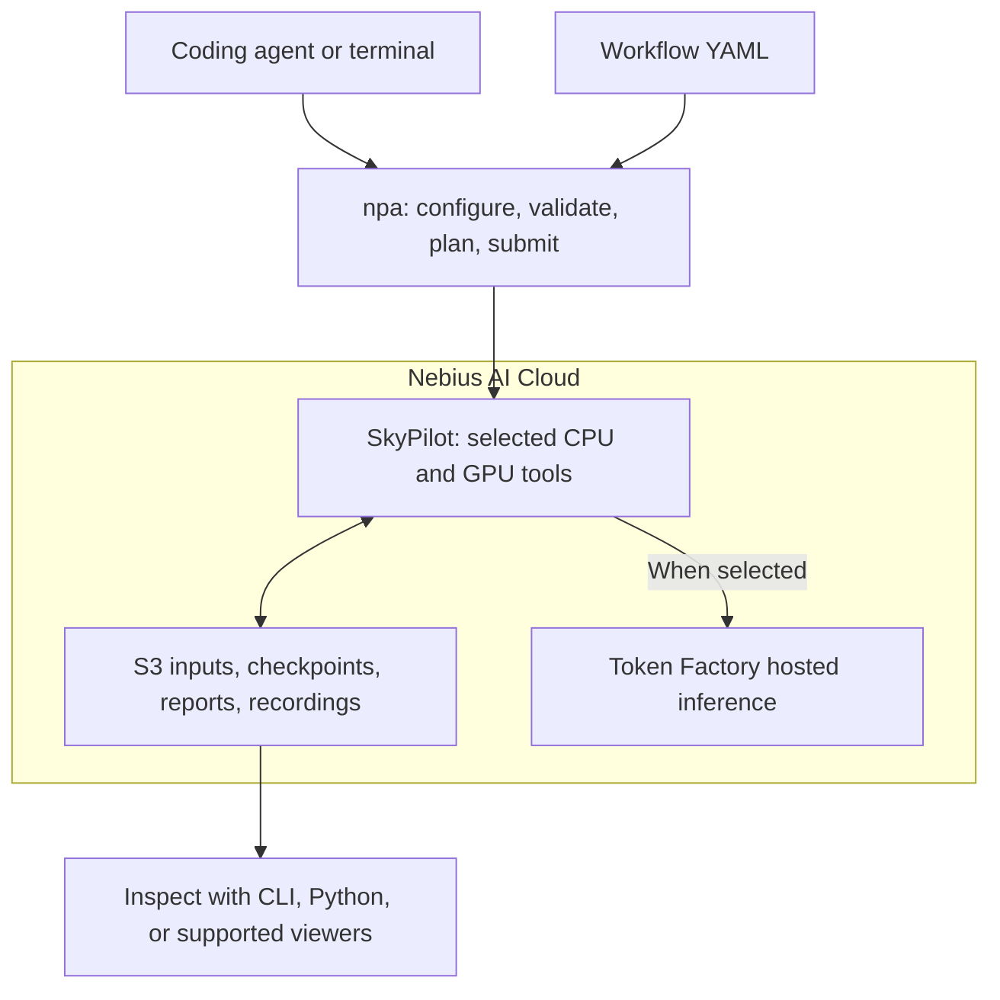

# Nebius Physical AI Workbench

Run data curation, simulation, model training, and evaluation workloads on
Nebius AI Cloud. Workbench provides the `npa` CLI, Python interfaces, container
images, and YAML workflows that exchange artifacts through object storage.

Use individual tools from your coding agent or terminal, or compose them into
workflows. Choose the tools that fit your task, prepare their inputs, run them,
and inspect the outputs. Requirements depend on the selected tools and runtime.

**[Get started](docs/quickstart.md)** ·
**[Use your coding agent](docs/workbench/agent-first-run.md)** ·
**[Choose a workflow](docs/workbench/guides/README.md)** ·
**[Check GPU compatibility](docs/workbench/image-gpu-compatibility-matrix.md)**

[](LICENSE)
[](docs/install.md)
[](https://github.com/nebius/nebius-physical-ai/actions/workflows/test.yml)

<a id="what-is-npa"></a>

## How Workbench workflows run


```mermaid
flowchart TB
    operator["Coding agent or terminal"] --> npa["npa: configure, validate, plan, submit"]
    yaml["Workflow YAML"] --> npa
    npa --> run["SkyPilot: selected CPU and GPU tools"]
    subgraph nebius["Nebius AI Cloud"]
        run <--> s3["S3 inputs, checkpoints, reports, recordings"]
        tf["Token Factory hosted inference"]
    end
    run -->|"When selected"| tf
    s3 --> inspect["Inspect with CLI, Python, or supported viewers"]
```

Workbench submits workflow tasks through SkyPilot. Selected tools exchange
inputs and outputs through S3; workflows can call Token Factory for hosted
inference. Inspect artifacts through the CLI, Python, or a compatible Rerun or
Foxglove viewer.
This diagram describes workflow execution. See the
[Ray development guide](docs/testing/fast-source-iteration.md) for direct
development with native Ray Jobs.

Python and HTTP coverage varies by tool. The
[CLI / SDK walkthrough](docs/workbench/cli-sdk-yaml-walkthrough.md) explains
typed clients, callback wrappers, and their return values.

## Quickstart

### 1. Install `npa`

Use Python **3.10+**. Install `npa` from the clone; it is not on PyPI:

```bash
git clone https://github.com/nebius/nebius-physical-ai.git
cd nebius-physical-ai
python3 -m venv .venv
source .venv/bin/activate
pip install -e npa
npa --version
```

> **Windows:** use WSL2 Ubuntu. Per-platform steps are in
> [docs/install.md](docs/install.md).
>
> **Managed deployments** (such as `npa agent fresh-setup`) also need
> **Terraform 1.x** on `PATH`. Install it separately and check
> with `terraform version`; agent bootstrap installs the tested 1.13.3 baseline
> only when Terraform is missing entirely.

### 2. Configure your project

[Sign up](https://docs.nebius.com/signup-billing/sign-up), create a
[tenant and project](https://docs.nebius.com/iam/manage-projects), install the
Nebius CLI, then let `npa configure` write `~/.npa/credentials.yaml` and
`~/.npa/config.yaml` for you.

Interactive configuration provisions object storage by default. First-time
storage setup needs admin permission on the target project to create the
service account, access key, and bucket-scoped IAM permissions.

```bash
curl -fsSL https://storage.eu-north1.nebius.cloud/cli/install.sh \
  | NEBIUS_CLI_VERSION=0.12.254 bash
export PATH="${HOME}/.nebius/bin:${PATH}"   # add to ~/.zshrc or ~/.bashrc
npa configure
```

`npa` is tested with Nebius CLI `0.12.254` (recommended) and `0.12.227`
(compatible, with a warning). Anything else is blocked *before* provider calls,
and the error prints the exact install command to run.

`npa configure` also prompts for optional model and inference tokens, linking
each setup guide inline: [Hugging Face](docs/workbench/huggingface-token.md) ·
[NVIDIA NGC](docs/workbench/ngc-api-key.md) ·
[Nebius Token Factory](docs/workbench/token-factory-key.md).
Its Hugging Face and NGC access summary is informative: missing, rejected,
gated, or temporarily unreachable providers do not prevent otherwise-valid
configuration from being saved. Use `npa workbench health access` when access
must be an enforcing gate.

For project creation, SSO, non-interactive provisioning, credential names, and
recovery, see [configuration](docs/configuration.md).

### 3. Run your first workload

Choose a task from the [workload guides](docs/workbench/guides/README.md), or
explore the [tool reference](docs/cli/workbench.md) to compose your own workflow.
Use the [coding-agent guide](docs/workbench/agent-first-run.md) to select tools
and check the inputs, credentials, and resources your task needs.

For a worked video-augmentation example, use
[PAIDF + Cosmos 3](docs/workbench/guides/paidf-cosmos3.md): supply a
local H.264 MP4 or private S3 MP4 URI, generate source-conditioned variants,
evaluate them, and curate accepted outputs. Use the
[PAIDF workflow prompt](docs/workbench/agent-first-run.md#run-paidf-with-cosmos-3) with your coding
agent for project storage, model access, GPU planning, image checks, submission,
recovery, and output inspection. The PAIDF guide explains configuration and
outputs; its command examples validate and plan the workflow without running it.

Check the raw generated media as well as the published PAIDF composite, which
blends source and generated frames (80% source by default). A quality rejection after bounded
refinement skips labeling and curation; inspect the report before retrying.

<a id="pick-your-first-win"></a>

## Choose a workload

| I want to…                                     | Go here                                                                                | Needs                    |
| ------------------------------------------------ | ---------------------------------------------------------------------------------------- | -------------------------- |
| Pick and place with a Franka arm                 | [Franka + Genesis](docs/workbench/guides/franka-pick-and-place-genesis.md)                | GPU cluster                |
| Teach a robot to push a T                        | [PushT sim-to-real](docs/workbench/guides/pusht-sim-to-real.md)                           | GPU cluster                |
| Train a Reachy 2 humanoid policy                 | [Reachy 2 + LeRobot](docs/workbench/guides/reachy2-lerobot-policy.md)                     | GPU cluster                |
| Make a Unitree G1 walk                           | [G1 + SONIC](docs/workbench/guides/g1-humanoid-walk-sonic.md)                             | GPU cluster                |
| Train a quadruped to run                         | [Quadruped + Isaac Lab](docs/workbench/guides/quadruped-isaac-lab.md)                     | RT-core GPU                |
| Generate an image or video                    | [NVIDIA Cosmos](docs/quickstart.md#standalone-cosmos-3-generation)                 | GPU cluster                |
| Augment robot video with PAIDF + Cosmos 3        | [PAIDF with Cosmos 3](docs/workbench/guides/paidf-cosmos3.md)                             | GPU cluster + S3           |
| Curate and augment video data            | [Physical AI Data Factory](docs/workbench/guides/physical-ai-data-factory-deploy.md)      | GPU cluster + S3           |
| Rebuild a real scene in 3D                       | [Neural reconstruction](docs/workbench/guides/neural-reconstruction.md)                   | RT-core GPU                |
| Get a browser workbench with a Rerun viewer      | [Deploy the `npa` agent](docs/agent.md)                                                  | Terraform + S3 (~20 min)   |

Full index: [docs/workbench/guides/README.md](docs/workbench/guides/README.md).
Longer end-to-end recipes (BDD100K + LanceDB, Isaac-Lab BYOF, LeRobot GPU
benchmarks): [cookbooks](docs/workbench/cookbooks/README.md).

<a id="compose-it-into-a-workflow"></a>

## Compose and submit workflows

A `npa.workflow/v0.0.1` specification connects named catalog operations
(`toolRef` steps) through S3 artifacts, decisions, and loops. Validate the YAML
and inspect its plan before preparing inputs or submitting work.

These commands inspect an example locally. Its `example-bucket` and rollout
paths are placeholders; the commands do not stage input or launch a workload.

```bash
npa workbench workflow validate-spec npa/workflows/workbench/npa-workflows/vlm-eval-single.yaml
npa workbench workflow plan-spec npa/workflows/workbench/npa-workflows/vlm-eval-single.yaml --run-id demo
```

For execution, follow a complete workload guide with your actual bucket,
prepared input, credentials, and resources. Use `submit --runtime` for parallel
groups and decisions evaluated during the run. The canonical
[14-stage Sim2Real workflow](docs/workbench/guides/sim2real-workflow.md) uses
this standard runtime. The older `sim2real/runbook.yaml` is a legacy path.
See the [workflow guide](docs/workbench/npa-workflow-guide.md) for supported
graph structures and limitations.

The [run lifecycle](docs/run-lifecycle.md) explains submission checks and
restart behavior. Image preflight can create and delete a temporary probe pod
when an image lacks bootstrap evidence.

<a id="container-images"></a>
<a id="validated-on-nebius"></a>

## Container images and validation

Supported public images are available from GHCR. Some download vendor runtimes
or model weights when the workload starts; their access requirements and terms
still apply. The [image catalog](docs/workbench/container-image-catalog.md)
lists exact tags, pull commands, and exclusions. GHCR is the runtime default;
select a private or modified image explicitly with `--image` or workflow
`--registry` where supported.

`cosmos3-serving` uses a public Python base and fetches its runtime at startup.
Content Agents also fetches OVRTX at runtime. The `cosmos3-super-benchmark`
image remains private. See the [packaging contract](docs/workbench/container-packaging.md)
for redistribution classes and image contents.

Validation is recorded by workload, image, and GPU. The
[compatibility matrix](docs/workbench/image-gpu-compatibility-matrix.md)
distinguishes recorded hardware tests from expected compatibility. A manifest
check establishes test coverage definitions; a successful capability test
establishes only what that test exercised. Neither establishes full training
or workflow success for every configuration.

- [Golden evaluations](docs/security/container-golden-evals.md): test definitions and execution modes.
- [LeRobot GPU benchmarks](docs/workbench/cookbooks/lerobot-gpu-benchmarks.md): dated performance measurements by policy and GPU.
- [Historical B300 validation](docs/b300-validation-matrix.md): May results, with links to later image evidence.

<a id="when-youre-done-tear-it-down"></a>

## Clean up resources

Follow [teardown](docs/teardown.md) to cancel jobs, remove deployments and
clusters, and delete storage and IAM resources you own. Local cleanup alone
does not stop cloud charges.

```bash
npa cleanup                          # inspect caches and the cleanup runbook
npa destroy --project <alias> --all  # preview; deletion requires --yes
```

<a id="whats-in-the-box"></a>
<a id="repository-layout"></a>

## Documentation

| Task | Reference |
| --- | --- |
| Install and configure | [Quickstart](docs/quickstart.md), [platform installation](docs/install.md), [configuration](docs/configuration.md) |
| Run with a coding agent | [First-run prompts](docs/workbench/agent-first-run.md), [automation contract](docs/workbench/agent-workflow-operations.md) |
| Find commands and APIs | [CLI reference](docs/cli/README.md), [Python interfaces](npa/README.md) |
| Author a workflow | [Workflow guide](docs/workbench/npa-workflow-guide.md), [tool catalog](docs/workbench/npa-workflow-tool-catalog.md), [spec catalog](npa/workflows/workbench/npa-workflows/README.md) |
| Deploy browser tools | [Optional self-hosted agent](docs/agent.md) |
| Inspect or recover a run | [Run lifecycle](docs/run-lifecycle.md), [troubleshooting](docs/workbench/troubleshooting/known-footguns.md) |
| Browse all documentation | [Documentation index](docs/README.md), [Workbench index](docs/workbench/README.md) |

## Contributing

Read [CONTRIBUTING.md](CONTRIBUTING.md) for development setup, tests, and review
requirements. Agent instructions and tool skills are indexed in
[skills/index.yaml](skills/index.yaml). Report bugs through
[GitHub Issues](https://github.com/nebius/nebius-physical-ai/issues);
follow [SECURITY.md](SECURITY.md) for security disclosures.

## License

Licensed under the [Apache License 2.0](LICENSE). Built by
[Nebius](https://nebius.com) and the physical AI community.
