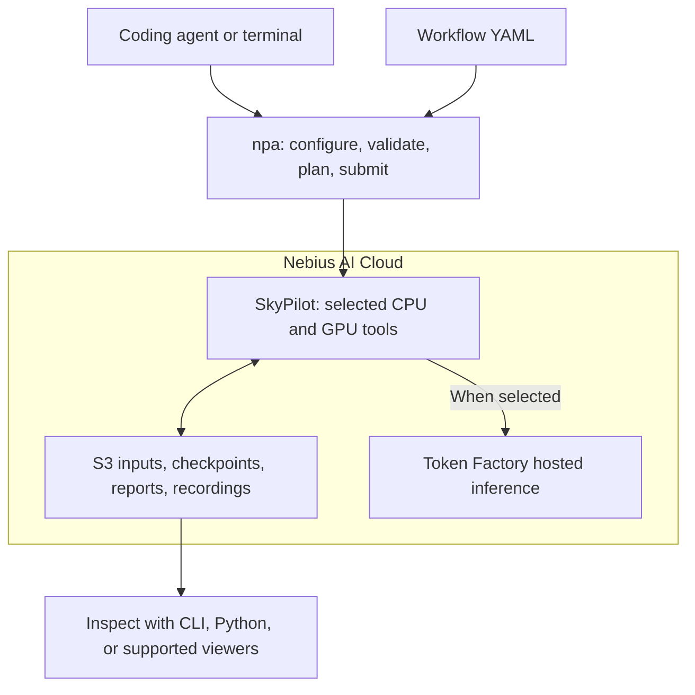

<div align="center">

# Nebius Physical AI

**One CLI, one SDK, one workflow layer for physical-AI workloads on Nebius —
data curation, simulation, synthetic data, policy training, evaluation,
observability, and cluster orchestration.**


[](LICENSE)
[](https://www.python.org/downloads/)
[](docs/install.md)
[](https://github.com/nebius/nebius-physical-ai/actions/workflows/test.yml)
[](CONTRIBUTING.md)

**[Quickstart](docs/quickstart.md)** ·
**[Guides](docs/workbench/guides/README.md)** ·
**[Workbench docs](docs/workbench/README.md)** ·
**[CLI reference](docs/cli/README.md)** ·
**[Python & API](docs/workbench/cli-sdk-yaml-walkthrough.md)** ·
**[Cookbooks](docs/workbench/cookbooks/README.md)** ·
**[Contributing](CONTRIBUTING.md)**

</div>

---

## What is `npa`?

`npa` runs robotics and physical-AI workloads on Nebius: data curation,
simulation, synthetic data, policy training, and evaluation. Workbench tools
run in containers and exchange inputs, checkpoints, and results through S3.
Use the CLI, a tool's Python interface, or a declarative workflow.

Bring your dataset, robot, or pipeline idea. Start with the
[quickstart](docs/quickstart.md), or give your coding agent the
[first-run prompts](docs/workbench/agent-first-run.md) and terminal access to
this checkout. Keep credentials in its private environment or the NPA
credential store.

### How workflows run


```mermaid
flowchart TB
    operator["Coding agent or terminal"] --> npa["npa: configure, validate, plan, submit"]
    yaml["Workflow YAML"] --> npa
    npa --> run["SkyPilot: selected CPU and GPU tools"]
    subgraph nebius["Nebius AI Cloud"]
        run <--> s3["S3 inputs, checkpoints, reports, recordings"]
        tf["Token Factory hosted inference"]
    end
    run -->|"When selected"| tf
    s3 --> inspect["Inspect with CLI, Python, or supported viewers"]
```

Workbench submits workflow tasks through SkyPilot. Selected tools exchange
inputs and outputs through S3; workflows can call Token Factory for hosted
inference. Inspect artifacts through the CLI, Python, or a compatible Rerun or
Foxglove viewer. This diagram describes workflow execution; the
[Workbench Ray guide](docs/workbench/ray.md) routes direct native Jobs/Core,
Train, Serve, and KubeRay use to the supported paths.

Python and HTTP coverage varies by tool. The
[CLI / SDK walkthrough](docs/workbench/cli-sdk-yaml-walkthrough.md) explains
typed clients, callback wrappers, and their return values.

---

## Quickstart

[Use Workbench with a coding agent](docs/workbench/agent-first-run.md).

### 1. Install `npa`

Python **3.10+** on macOS, Linux, or WSL2 Ubuntu. Install from this repository:

```bash
git clone https://github.com/nebius/nebius-physical-ai.git
cd nebius-physical-ai
python3 -m venv .venv
source .venv/bin/activate
pip install -e npa
npa --version
```

See [installation](docs/install.md) for platform details and tools such as
Terraform and `kubectl`, which are installed separately.

### 2. Connect to Nebius

Install the tested Nebius CLI, then select your project:

```bash
curl -fsSL https://storage.eu-north1.nebius.cloud/cli/install.sh \
  | NEBIUS_CLI_VERSION=0.12.254 bash
export PATH="${HOME}/.nebius/bin:${PATH}"
npa configure
npa workbench health preflight --checks nebius --json
```

Interactive configuration provisions object storage by default; first-time
storage setup needs admin permission on the target project. Use
`npa configure --no-provision` to save project and token settings without
storage provisioning. [Configuration](docs/configuration.md) covers account
setup, SSO, model tokens, and non-interactive use.

### 3. Run your first workload

Choose a guide below, prepare its input and model access, then complete
[Workbench setup](docs/workbench/getting-started.md). Follow the guide through
submission and inspect its generated media, checkpoint, or report.

For video augmentation, [PAIDF + Cosmos 3](docs/workbench/guides/paidf-cosmos3.md)
accepts your source clip and records generation, evaluation, and curation
results. The [coding-agent prompt](docs/workbench/agent-first-run.md#run-paidf-with-cosmos-3)
covers execution; the guide's examples validate and plan only.

---

## Pick your first win

Choose by the result you need; each guide states its inputs and validation scope.

| I want to… | Go here | Needs |
| ------------------------------------------------ | ---------------------------------------------------------------------------------------- | -------------------------- |
| Pick and place with a Franka arm | [Franka + Genesis](docs/workbench/guides/franka-pick-and-place-genesis.md) | GPU cluster |
| Inspect the PushT SDK | [PushT SDK smoke](docs/workbench/guides/pusht-sim-to-real.md) | Local dataset inspection |
| Train a Reachy 2 humanoid policy | [Reachy 2 + LeRobot](docs/workbench/guides/reachy2-lerobot-policy.md) | GPU cluster |
| Choose a G1 locomotion path | [G1 + SONIC](docs/workbench/guides/g1-humanoid-walk-sonic.md) | GPU cluster |
| Train a quadruped to run | [Quadruped + Isaac Lab](docs/workbench/guides/quadruped-isaac-lab.md) | RT-core GPU |
| Generate images or video | [NVIDIA Cosmos](docs/quickstart.md#standalone-cosmos-3-generation) | GPU cluster |
| Augment robot video with PAIDF + Cosmos 3 | [PAIDF with Cosmos 3](docs/workbench/guides/paidf-cosmos3.md) | GPU cluster + S3 |
| Build a labeled dataset | [Physical AI Data Factory](docs/workbench/guides/physical-ai-data-factory-deploy.md) | GPU cluster + S3 |
| Rebuild a real scene in 3D | [Neural reconstruction](docs/workbench/guides/neural-reconstruction.md) | RT-core GPU |
| Get a browser workbench with a Rerun viewer | [Deploy the `npa` agent](docs/agent.md) | Terraform + S3 (~20 min) |

Full index: [docs/workbench/guides/README.md](docs/workbench/guides/README.md).
Longer end-to-end recipes (BDD100K + LanceDB, Isaac-Lab BYOF, LeRobot GPU
benchmarks): [cookbooks](docs/workbench/cookbooks/README.md).

---

## What's in the box

Use `npa workbench <tool> --help` for a tool's commands and options.

| Task | Tools and guides |
| --- | --- |
| Simulate and train policies | [Robot guides](docs/workbench/guides/README.md): Genesis, Isaac Lab, LeRobot, GR00T, SONIC, and MJLab |
| Generate or reconstruct scenes | [Generation and scene tools](docs/workbench/README.md#generation-and-scenes): Cosmos, NuRec, Content Agents, LTX-2, and Wan |
| Curate and evaluate | [Data and evaluation](docs/workbench/README.md#data-and-evaluation): FiftyOne, LanceDB, detection training, VLM evaluation, and hosted Token Factory inference |
| Inspect outputs | [Rerun sharing](docs/workbench/rerun-sharing.md), [Foxglove/MCAP](docs/workbench/foxglove-export.md), and the [browser workbench](docs/agent.md) |
| Manage compute | [Kubernetes](docs/workbench/kubernetes.md), [SkyPilot](docs/orchestration/skypilot-setup.md), and [cluster backends](docs/cluster-backends.md) |

Browse the [Workbench docs](docs/workbench/README.md) for usage guides or the
[generated CLI reference](docs/cli/README.md) for the command inventory.

---

## Compose it into a workflow

Author pipelines as declarative `npa.workflow/v0.0.1` specs — a state graph of
Workbench `toolRef` steps with S3 handoffs, gates, and loops. The same YAML is
what you validate, plan, and submit.

These commands inspect an example locally. Its bucket and rollout paths are
placeholders; the commands do not stage input or launch a workload.

```bash
npa workbench workflow validate-spec workflows/testing/vlm-eval-single.yaml
npa workbench workflow plan-spec workflows/testing/vlm-eval-single.yaml --run-id demo
```

|  |  |
| ----------------------- | ------------------------------------------------------------------------------------ |
| **Format** | `apiVersion: npa.workflow/v0.0.1` |
| **CLI** | `validate-spec` · `plan-spec` · `run-spec` · `submit` |
| **Workbench workflows** | [`workflows/`](workflows/) |
| **Tool catalog** | [npa-workflow-tool-catalog.md](docs/workbench/npa-workflow-tool-catalog.md) |
| **Authoring guide** | [npa-workflow-guide.md](docs/workbench/npa-workflow-guide.md) |
| **What submit does** | [Run lifecycle](docs/run-lifecycle.md) — gates, run identity, restart safety, status |

For execution, follow a complete workload guide with your actual bucket,
prepared input, credentials, and resources. Use `submit --runtime` for parallel
groups and decisions evaluated during the run. The canonical
[14-stage Sim2Real workflow](docs/workbench/guides/sim2real-workflow.md) uses
this standard runtime at [`workflows/main/sim2real.yaml`](workflows/main/sim2real.yaml).
The older `sim2real/runbook.yaml` is a legacy path. See the
[workflow guide](docs/workbench/npa-workflow-guide.md) for supported graph
structures and limitations.

Image preflight can create and delete a temporary probe pod when an image
lacks bootstrap evidence; see the [run lifecycle](docs/run-lifecycle.md).

---

## When you're done, tear it down

Preview cleanup for your project:

```bash
npa destroy --project <alias> --all
```

This is read-only until you pass `--yes`. Review the plan and retain artifacts
you need before deleting their storage. [Teardown](docs/teardown.md) covers
canceling jobs before removing owned services and infrastructure. Local
`npa cleanup` alone does not stop cloud resources.

---

## Container images

Every Workbench tool ships as a container image. The publicly redistributable
subset is mirrored to GHCR, so the easiest path is to **pull instead of build**:

```bash
docker pull ghcr.io/nebius/nebius-physical-ai/npa-retargeting:0.1.1
```

The GHCR mirror is the runtime default; no registry setup is required in
`npa configure`. Ambient `NPA_REGISTRY` and legacy saved registry values do not
repoint repository-owned runtime defaults. Use your own registry only when you
build private or locally modified images, then select those bytes with an
explicit `--image` or workflow `--registry`:

```bash
docker login registry.example
export NPA_REGISTRY=registry.example/customer
npa/docker/workbench/lerobot/build.sh --registry "$NPA_REGISTRY" --push
# Runtime example: npa workbench workflow submit <spec> --registry "$NPA_REGISTRY"
```

| Reference | What it tells you |
| --- | --- |
| [Public image catalog](docs/workbench/container-image-catalog.md) | Exact GHCR names, tags, pull commands, and intentional exclusions |
| [Image ↔ GPU compatibility matrix](docs/workbench/image-gpu-compatibility-matrix.md) | Every image against every Nebius GPU platform, and which cells are hardware-verified |
| [Packaging contract](docs/workbench/container-packaging.md) | Tiers, non-root users, ports, and redistribution classes |
| [Golden evals](docs/security/container-golden-evals.md) | The real capability test each image must pass — not an import probe |
| [Blackwell compatibility](docs/workbench/blackwell-datacenter-image-compatibility.md) | B200 / B300 build, tag, and validation runbook |
| [SONIC image catalog](docs/workbench/sonic-image-catalog.md) | Manifest-driven SONIC variant routing per GPU |
| [Image reproducibility](docs/security/image-reproducibility.md) | The two-tag strategy (`cuda12`, `cuda13-b300`) and how tags are pinned |
| [Merge security gate](docs/security/merge-security-gate.md) | Reproduce source, workflow and dependency regression checks before contributing |

Each image declares a `redistribution` class in the packaging contract. Public
images may be mirrored to GHCR; restricted images remain private. Some public
images download vendor runtimes or model weights when the workload starts;
their access requirements and terms still apply.

`cosmos3-serving` uses a public Python base and fetches its runtime at startup.
Content Agents also fetches OVRTX at runtime. The `cosmos3-super-benchmark`
image remains restricted. The [packaging contract](docs/workbench/container-packaging.md)
describes the redistribution classes and image contents.

---

## Validated on Nebius

Validation is recorded by workload, image, and GPU. The
[compatibility matrix](docs/workbench/image-gpu-compatibility-matrix.md)
distinguishes recorded hardware tests from expected compatibility. A manifest
check establishes test coverage definitions; a successful capability test
establishes only what that test exercised. Neither establishes full training
or workflow success for every configuration.

| Reference | What it tells you |
| --- | --- |
| [Historical B300 validation](docs/b300-validation-matrix.md) | May results, with links to later image evidence |
| [LeRobot GPU benchmarks](docs/workbench/cookbooks/lerobot-gpu-benchmarks.md) | Steps/s across H200 · B300 · L40S · RTX PRO 6000 by policy type |
| [NVIDIA architecture coverage](docs/nvidia-platform-architecture-coverage.md) | CUDA 12.8 x86_64 vs CUDA 13 aarch64 tool coverage |
| [Partner roadmap](docs/architecture/partner-skills-roadmap.md) | NVIDIA Omniverse / CAD-to-SimReady capabilities on the way — not yet shipped |

---

## Repository layout

```text
npa/                       # Python package (CLI + SDK); install with `pip install -e npa`
  src/npa/cli/             # Typer entry point and every top-level command
  src/npa/workbench/       # Per-tool implementations (cosmos, lerobot, sonic, ...)
  workflows/workbench/
    sim2real/              # Operator notes and legacy compatibility
workflows/                 # Supported npa.workflow/v0.0.1 catalog; see README.md
  main/                    # sim2real.yaml, paidf-cosmos3.yaml, nurec-reconstruct.yaml
  testing/                 # All other catalog workflow specs
docs/                      # Quickstart, architecture, workbench guides, cookbooks
skills/                    # SKILL.md files for agents and contributors (source of truth)
deploy/                    # Terraform + cluster provisioning (uses Nebius solutions library)
research/                  # LeRobot deploy research (older reference)
workbench/mlflow/          # MLflow tracking-server compose stack
```

User secrets live in a versioned, exact-project map in `~/.npa/credentials.yaml`;
machine-managed config lives in `~/.npa/config.yaml`. The repo supports multiple
top-level solution namespaces, and Workbench is the current primary one — future
solutions are additive and never rename or nest it. See
[solutions model](docs/architecture/solutions-model.md) ·
[CLI namespaces](docs/architecture/cli-namespaces.md) ·
[contributor context](docs/architecture/contributor-context.md).

---

## Documentation

| Topic | Where to look |
| --- | --- |
| Install & auth | [quickstart.md](docs/quickstart.md) · [install.md](docs/install.md) · [configuration.md](docs/configuration.md) |
| Coding-agent first run | [Setup and workload prompts](docs/workbench/agent-first-run.md) |
| Workbench setup | [getting-started.md](docs/workbench/getting-started.md) |
| Beginner robot guides | [guides/README.md](docs/workbench/guides/README.md) |
| Physical AI Data Factory | [deploy runbook](docs/workbench/guides/physical-ai-data-factory-deploy.md) · [concepts](docs/workbench/guides/physical-ai-data-factory.md) |
| Cookbooks | [cookbooks/README.md](docs/workbench/cookbooks/README.md) — incl. [BDD100K + LanceDB](docs/workbench/cookbooks/bdd100k-pipeline.md) and [Isaac-Lab BYOF](docs/workbench/cookbooks/byof-isaac-lab/) |
| Workflow authoring | [npa-workflow-guide.md](docs/workbench/npa-workflow-guide.md) · [tool catalog](docs/workbench/npa-workflow-tool-catalog.md) |
| Python & HTTP access | [CLI / SDK walkthrough](docs/workbench/cli-sdk-yaml-walkthrough.md) · [SDK errors](docs/sdk/errors.md) — check each tool's supported surfaces |
| What `submit` does | [run-lifecycle.md](docs/run-lifecycle.md) |
| Self-hosted agent | [agent.md](docs/agent.md) · [operator skill](skills/tools/npa-agent/SKILL.md) · [fresh-operate](skills/workflows/agent-fresh-operate/SKILL.md) |
| Teardown & cost | [teardown.md](docs/teardown.md) |
| Container images | [catalog](docs/workbench/container-image-catalog.md) · [packaging contract](docs/workbench/container-packaging.md) |
| Preemptible GPU VMs | [preemptible-vms.md](docs/workbench/preemptible-vms.md) |
| Troubleshooting | [known-footguns.md](docs/workbench/troubleshooting/known-footguns.md) · [FIXME.md](FIXME.md) · [FTUE audit](FTUE-AUDIT.md) |
| CLI reference | [cli/README.md](docs/cli/README.md) |
| Extend Workbench | [Contributing](CONTRIBUTING.md) · [OSS onboarding ladder](docs/architecture/oss-onboarding-ladder.md) |
| Documentation index | [docs/README.md](docs/README.md) |

---

## Contributing

We welcome PRs, issues, and workflow contributions.

```bash
pip install -e "npa[dev,adapter]"
make test PYTHON="$(pwd)/.venv/bin/python"
```

Read [CONTRIBUTING.md](CONTRIBUTING.md) for the review checklist,
skill-maintenance requirements, and repo hygiene rules. New behavior should have
a matching root `skills/` entry — see [`skills/index.yaml`](skills/index.yaml).
Security disclosures: [SECURITY.md](SECURITY.md). Support and community happen
through GitHub [Issues](https://github.com/nebius/nebius-physical-ai/issues) and
[Pull Requests](https://github.com/nebius/nebius-physical-ai/pulls).

---

## License

Licensed under the [Apache License 2.0](LICENSE). Built by
[Nebius](https://nebius.com) and the physical-AI community.
