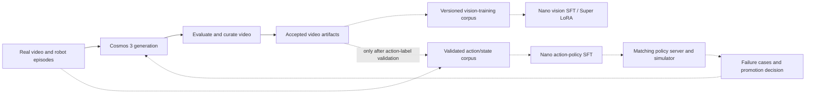

# A Cosmos 3 model factory on Nebius

[Workbench docs](../workbench/README.md)

**Baseline assessment: 2026-09-14. Follow-on: experimental policy workflow.**
Repository baseline: `d743f1853` on `origin/main`.

**2026-09-15 implementation follow-on:** the experimental
[LIBERO policy model-factory workflow](../workbench/cosmos3-policy-model-factory.md)
adds native training, matching simulator evaluation, and failure-targeted
generation. Its [live report](../workbench/cosmos3-policy-model-factory-live-20260916.md)
records completed eight-GPU training, simulator evaluation and failure-targeted
generation, including the unsuccessful policy and candidate-quality outcomes.
Its readiness record tracks GPU qualification separately. The
baseline assessment below explains the wider factory work still required.

## Recommendation

Build on the existing Nebius Managed Kubernetes, SkyPilot, Cosmos 3 generation,
and Physical AI Data Factory (PAIDF) paths. The workbench has useful pieces of
a model factory, but it does not yet demonstrate a complete Cosmos 3
generate → post-train → evaluate → improve cycle.

The target is generation, distributed post-training, and policy evaluation on
a persistent cluster with shared storage. Measure useful progress per reserved
GPU-hour, including checkpoint and recovery overhead. Qualify that complete
path on Nebius before advertising a model factory.

Start by qualifying **native Cosmos3-Nano vision SFT** (supervised fine-tuning)
on an eight-GPU H200 or B200 training node, with the exact image/GPU combination
validated before use. That connects most directly to our existing video
generation work. Then qualify a **native LIBERO action-policy recipe and its
matching simulator** to prove a complete policy loop. Add DROID for another
robot embodiment and Super LoRA for teacher adaptation.
These are proposed qualification configurations, not NPA capacity guarantees.

The critical work is the training runtime, trustworthy training datasets,
checkpoint-to-simulator handoff, and recovery measurement. A new orchestrator
or a workflow made from unimplemented stages would not close those gaps.

## Baseline assessment

"Implemented" below describes inspected repository code. Historical execution
evidence is identified separately; it does not qualify a new image or workload.

| Capability | Evidence in the current workbench | Work needed for the factory |
| --- | --- | --- |
| Versioned source data | [Dataset service](../../npa/src/npa/workbench/dataset/service.py), [schemas](../../npa/src/npa/workbench/dataset/schemas.py), and [tests](../../npa/tests/workbench/test_dataset.py) support ingest, validation, derived versions, and lineage. | Materialize the exact native Cosmos training layout; retain source episode identity and disjoint train/evaluation splits. A generic dataset manifest is not a Cosmos dataloader input. |
| Cosmos video generation | [PAIDF + Cosmos 3](../workbench/guides/paidf-cosmos3.md) implements source conditioning, full-video alignment checks, evaluation, curation, and Rerun artifacts; it records live-run evidence. [Super serving](../workbench/cosmos3-super-serving.md) and [Nano Ray Serve](../workbench/cosmos3-ray-serve.md) cover resident generation. | Select and qualify the generation mode for each training dataset. The existing PAIDF composition does not automatically use the resident Super server. |
| Quality and curation | PAIDF uses Cosmos Evaluator, Cosmos Curator, and FiftyOne; rejected runs retain evidence and do not promote. | Establish task-specific acceptance criteria. A passing video-quality gate does not establish action-label correctness or improved policy success. |
| Cosmos3-Nano SFT and Super LoRA | The [post-training skill](../../skills/workflows/cosmos3-post-training/SKILL.md) explicitly identifies these as planning work. The [Cosmos3 image](../../npa/docker/workbench/cosmos3/Dockerfile) installs an inference environment and sets `COSMOS_TRAINING=0`. | Qualify a training environment, native recipes, distributed execution, real DCP save/resume, and export. Existing `cosmos train` commands do not prove Cosmos3 SFT support. |
| Cosmos policy evaluation | [Cosmos checkpoint evaluation](../workbench/cosmos3-b200-checkpoint-evaluation-20260814.md) records 72 generated still images. Other workbench tools have policy evaluators. | Implement and validate a Cosmos action-policy server/client pair against the exact trained checkpoint and embodiment. Still-image evaluation and a generic LeRobot evaluator do not prove this integration. |
| Persistent compute and storage | [GPU cluster setup](../../skills/tools/gpu-cluster-provisioning/SKILL.md), [model cache](../workbench/model-weight-cache.md), and [task pod configuration](../../npa/src/npa/orchestration/npa_workflow/skypilot_render.py) provide reusable infrastructure and volume hooks. | Qualify a separate shared training workspace, cross-node NCCL, data loading, and checkpoint I/O for Cosmos. A weight cache does not define a training corpus or checkpoint protocol. |
| Recovery | The [workflow runtime](../../npa/src/npa/orchestration/npa_workflow/runtime.py) persists stage attempts and supports resume. The [Ray Train reference](../../npa/workflows/workbench/ray-train-synthetic/README.md) exercises synthetic DDP optimization and optimizer recovery. | Demonstrate Cosmos DCP recovery, then node replacement and gang recovery. Existing recovery evidence does not establish recovery for Cosmos training. |
| Metrics and lineage | [Insights](../../skills/tools/insights/SKILL.md) records metrics, artifact relations, and comparisons; [schemas](../../npa/src/npa/workbench/insights/schemas.py) distinguish metric and cost records. | Collect factory allocation intervals, useful progress, rejected outputs, and recovery losses. Existing per-run metrics do not measure reserved-pool goodput. |
| Failure-driven improvement | PAIDF can refine rejected generation attempts; workflow composition supports gates and loops. | Turn policy evaluation failures into versioned generation targets, retrain, and evaluate on an unchanged held-out task set. A generation retry is not a policy-learning round. |

## Native implementation sources

Pin the native framework and qualify its training dependencies independently
of the existing generation image:

| Source | Inspected revision | Consequence |
| --- | --- | --- |
| NPA generation image's Cosmos framework | `5e67049cd94acb667786f1e6dd0dab821cb90c97` | The image selects `cu130-torch213` for inference. The presence of training source files does not make its installed dependency set a training runtime. |
| NVIDIA framework main | `2a8339d46a6e10e96f26c98509e6080d04ead490` | Current [training guidance](https://github.com/NVIDIA/cosmos-framework/blob/2a8339d46a6e10e96f26c98509e6080d04ead490/docs/training.md), [DROID post-training](https://github.com/NVIDIA/cosmos-framework/blob/2a8339d46a6e10e96f26c98509e6080d04ead490/docs/action_policy_droid_posttrain.md), and [LIBERO post-training/evaluation](https://github.com/NVIDIA/cosmos-framework/blob/2a8339d46a6e10e96f26c98509e6080d04ead490/docs/action_policy_libero_posttrain.md) provide native starting points. |

Prefer the native recipe and matching dataset at the selected revision. Two
datasets using LeRobot v3 need not have compatible actions or observations.
The current NVIDIA DROID guide documents a particular dataset
layout, proprioceptive state, and absolute joint-position actions. Its LIBERO
guide uses different action coordinates and normalization.

A ready HTTP server does not establish compatibility with an arbitrary checkpoint.
Use the matching native server, action statistics, camera transform, and
simulation client. Current NVIDIA guidance includes both a
[DROID/RoboLab path](https://github.com/NVIDIA/cosmos-framework/blob/2a8339d46a6e10e96f26c98509e6080d04ead490/docs/action_policy_droid_server.md)
and the LIBERO path above. Neither was integrated at the assessed baseline;
the follow-on workflow adds the LIBERO integration.

## Target architecture

Solid arrows show the existing video-production path. Dashed arrows show
proposed training and feedback integrations. All artifacts retain source
lineage in Nebius Object Storage.

### Compute and scheduling

Use one persistent Managed Kubernetes control plane, with CPU workers and
workload-specific GPU node groups. H200/B200 training and generation can share
compatible capacity. If evaluation uses Isaac rendering, place the simulator
on an RT-capable GPU such as RTX PRO 6000; the policy server can be a separate
GPU workload. LIBERO requires its own simulator environment and EGL validation.
A shared cluster need not have identical GPUs in every node group.

Keep SkyPilot as the workflow execution engine. Implement training as one
gang of workers running native `torchrun`, with NPA's standard artifact and
attempt tracking. Existing resource profiles carry node count and pod
configuration, but the Cosmos rendezvous and full-gang recovery still need
qualification. [Burst](../../skills/tools/burst/SKILL.md) can isolate a single
distributed qualification job; it has no durable workflow resume and should
not become the factory controller. Ray Train's synthetic reference is useful
recovery evidence for that application, not a replacement Cosmos trainer.

Nebius documents [InfiniBand for Kubernetes GPU clusters](https://docs.nebius.com/kubernetes/gpu/clusters).
Verify NCCL transport and collective bandwidth inside the selected training
image on the actual nodes, using the Nebius-supported networking stack.
Resolve the framework, Python, Torch, CUDA,
NCCL, attention kernels, Transformer Engine, and video-decoder versions together.
Measure both single-node execution and cross-node execution before scaling.

Generation and training have different parallelism settings. Qualify each
against its native engine; multiplying generation server replicas does not
establish distributed training throughput. Prevent long-lived generation
servers from occupying capacity needed by a training gang. Add queue quotas,
priorities, and preemption only with a separately tested cluster policy; NPA
needs explicit scheduling policy beyond launching Kubernetes jobs.

### Storage and checkpoint ownership

Keep Object Storage as the durable data bus. Add a separately provisioned
shared training workspace through a ReadWriteMany PVC using the documented
[Nebius filesystem CSI path](https://docs.nebius.com/kubernetes/storage/filesystem-over-csi).
Use immutable dataset-version directories and independent run/attempt output
directories. Mount source datasets read-only in workers. Keep credentials and
gated model caches within the authorized operator's access boundary.

Treat the shared filesystem as a working tier, with explicit checksummed
publication to Object Storage. Verify publication explicitly. Compare cold
metadata access, cold bulk reads, warm epoch reads, and checkpoint writes on
representative datasets. Measure throughput rather than inferring it from the
existence of a shared mount. Local scratch can hold reconstructible
caches, but it cannot be the only copy of a resumable checkpoint.

Publish a completed DCP (PyTorch Distributed Checkpoint) only after all required
shards and metadata are durable and readable. Record the resolved training
configuration, source revision, dataset digest, optimizer step, and checkpoint
file hashes. A partial directory or weights-only export is not a full training
resume point. Resume must restore the model, optimizer, scheduler, and the
recipe's RNG/data-progress state; validate which of those the selected native
recipe actually preserves. Inference exports need their own compatibility and
readback checks.

Workflow replay, training-state recovery, and unhealthy-node replacement are
three separate mechanisms. Prove each separately and then together. Synchronous
and asynchronous checkpoint modes must be recorded explicitly; count actual
GPU stall for asynchronous saves rather than assuming all I/O time is a stall.

### Dataset and promotion contracts

The existing PAIDF LeRobot selector extracts one episode/camera into video. It
does not reconstruct a training dataset with action and state records. Even
frame-aligned generated video may move a gripper or change contact geometry.
Do not reuse original actions solely because timestamps still match.

For vision SFT, produce the selected upstream JSONL/caption layout and verify
decoding, duration, caption structure, and native dataloader acceptance. For
policy training, require an explicit embodiment, action units and coordinate
frame, state features, camera transforms, control frequency, normalization
statistics, and episode boundaries. Reject incompatible data. Keep all variants
of one source episode in the same split to prevent evaluation leakage.

Each learning round should bind these proposed artifacts:

| Artifact | Required evidence |
| --- | --- |
| Training corpus | Source versions/hashes, split membership, accepted/rejected items, real/synthetic mixture, and data/action schema |
| Checkpoint | Base model revision, image digest, framework revision, resolved recipe, completed optimizer step, and complete DCP/export checksums |
| Evaluation report | Exact checkpoint and corpus digests, task suite/version, seeds, episode denominator, simulator outcomes, action latency, and failure traces |
| Promotion decision | Evaluation report digest, operator-selected thresholds, baseline comparison, unresolved failures, and an explicit accept/reject result |
| Next-round targets | Failed task/episode, source observations, failure category, generation conditions, and lineage to the evaluated checkpoint |

Evaluate the base or previous policy and the new policy on the same held-out
tasks and seeds. Keep separate development failures for generating new training
data; do not feed final held-out evaluation episodes back into the corpus.
Report success counts and uncertainty as well as aggregate rates. Video quality,
training loss, and HTTP readiness cannot replace simulator task success.

## Implementation sequence and acceptance criteria

These are the original proposed contribution slices. The follow-on workflow
implements the LIBERO training, evaluation, and failure-targeting slice; the
remaining factory capabilities below still need implementation or qualification.
Durations, training schedules, dataset sizes, and
campaign counts remain operator choices.

| Order | Deliverable and code seam | Evidence required before advertising support |
| --- | --- | --- |
| 1. Native training qualification | A dedicated Cosmos training image/packaging contract and shared implementation under `npa/src/npa/workbench/cosmos/`, starting with native Nano vision SFT. Follow [tool contribution](../../skills/workflows/add-workbench-tool/SKILL.md) and [runtime-fetch packaging](../../skills/workflows/runtime-fetch-onboard/SKILL.md). | Pinned source and dependency closure; native `train.py --dryrun`; real dataset decode; real optimizer updates; complete DCP save and reload; inference from the trained checkpoint. Record peak GPU/host memory. Qualify each GPU/image combination separately. |
| 2. Training corpus and NPA surface | Convert accepted PAIDF video/captions into the selected native training layout, with explicit split and provenance validation. Expose one shared implementation through CLI/SDK and the appropriate service contract; add a real training toolRef. | Native dataloader reads the materialized corpus; source variants cannot cross splits; malformed captions/media fail; a submitted workflow trains on the exact recorded corpus. Tests cover real flag names and image routing. |
| 3. Action-policy loop | Package native LIBERO training plus its matching policy server and simulation client; subsequently add the native DROID path or a separately qualified public-data adapter. | Train a real policy checkpoint, reload it in the matching server, execute simulator episodes, and record factual success/failure traces. Reject incompatible action dimensions, units, statistics, or checkpoint type before evaluation. |
| 4. Teacher and distributed scale | Add Super LoRA, reusable generation-to-corpus handoff, shared-storage qualification, and multi-node training through the standard runtime. | Real Super adapter update and inference; NCCL transport proof; identical recipe/data accounting across scales; complete sharded checkpoints and readback after worker teardown. |
| 5. Recovery and observability | Extend native Cosmos metrics into Insights and the cluster telemetry path. Integrate checkpoint recovery with exact workflow attempt identity and node health handling. | Interrupt a worker after progress beyond a saved checkpoint; restore the full gang; verify recovered state, replayed work, eventual completion, and no conflicting writers. Separately demonstrate node replacement and controller restart. |
| 6. Failure-driven workflow | Compose the qualified stages as `npa.workflow/v0.0.1`, with immutable round artifacts and an explicit promotion gate. | Run a complete round, create new training targets from development failures, and evaluate the resulting checkpoint against the fixed held-out baseline. Measure the quality/capacity tradeoff; report regressions as well as gains. |

Every runtime slice needs its CLI/SDK/toolRef contracts, focused tests, image
qualification, and committed live coverage under the repository's
[testing conventions](../../skills/atomic/testing-conventions/SKILL.md).
Register executable workflow specs in the live submit matrix when the real
stages exist. A configuration-only dry run proves configuration resolution,
not training, checkpoint recovery, or policy quality.

Before builds, downloads, or GPU work, apply
[credential preflight](../../skills/atomic/health-preflight/SKILL.md), exact
[model/dataset access checks](../../skills/atomic/access-approval/SKILL.md), and
the [packaging review](../../skills/atomic/solution-licensing/SKILL.md). Reuse the
operator's bounded use declaration. Upstream model availability does not itself
establish redistribution permission for a training image or dataset.

## Measure factory efficiency

Measure the whole factory on Nebius. Extend Insights with explicit allocation
and progress records; do not
derive billed cost or reserved-pool efficiency from stage wall time alone.

- **Reserved GPU-hours:** integrate the number of GPUs allocated to the factory
  pool over the observation window. Include idle capacity, resident services,
  initialization, failed attempts, checkpoint stalls, and recovery. Sum each
  physical allocation once even when stage windows overlap. Report GPU types
  separately before presenting a combined total.
- **Useful-progress fraction:** useful GPU-seconds divided by allocated
  GPU-seconds for the same window. Define useful work per stage: accepted
  generation, training progress retained after recovery, and completed valid
  evaluation. Exclude replayed optimizer work from the numerator. Keep the
  raw interval ledger so the classification can be audited.
- **Generation:** accepted video-seconds per allocated GPU-hour, rejection
  rate, and cold/warm latency at a fixed model, resolution, duration, and quality
  criterion. Raw generated throughput and accepted throughput are different
  measurements.
- **Training:** processed samples/tokens, global batch, sequence lengths,
  optimizer steps, step-time distribution, memory, and held-out quality. For
  strong-scaling comparisons hold total work fixed; label growing-workload
  scaling separately. MFU (model FLOPs utilization) needs an explicit FLOP
  estimate and the correct accelerator/precision peak; it is not GPU occupancy.
- **Evaluation:** task successes/episodes, uncertainty, policy latency,
  simulator throughput, and checkpoint provenance. Report the result even when
  adding synthetic data does not improve it.
- **Recovery:** detection, replacement/reschedule, reload, and replay time;
  lost optimizer steps; checkpoint stall; and the last independently verified
  durable step. Separate worker recovery from node replacement.

The first comparable release should publish reproducible image and recipe
identities, a complete learning-round trace, matching checkpoint reload and
simulation evidence, and measured failure recovery. Full operational parity
additionally needs shared-pool scheduling/governance and node-lifecycle proof.
Report measurements from the exact Nebius run and retain their workload scope.

## What can run today

Use the existing [PAIDF + Cosmos 3 setup/run guide](../../workflows/guides/paidf-cosmos3.md)
for generated video, evaluator decisions, curation, and Rerun evidence. Use the
[Super serving guide](../workbench/cosmos3-super-serving.md) for the separately
qualified resident-generation path. Both require their documented images,
access, and GPU prerequisites; retain the precise run's artifacts and follow
their cleanup instructions.

The [2026-09-15 live exercise](../workbench/cosmos3-model-factory-live-20260915.md)
ran the canonical video workflow on reserved RTX PRO 6000 capacity. Both
generation passes produced temporally aligned videos, but both batches failed
the shipped quality criteria. The retry improved appearance checks while one
required hallucination score worsened. This is evidence for the generation and
rejection path; it does not qualify a training corpus or the policy-learning loop.

The follow-on [native policy workflow](../workbench/cosmos3-policy-model-factory.md)
now implements LIBERO-10 action-policy SFT, matching closed-loop evaluation,
failure feedback, and guarded video candidates. It is experimental and requires
its own GPU qualification; the earlier video exercise does not validate it.
It completes one learning round through candidate generation, with action-label
validation and automatic subsequent rounds still outstanding.
Preserve durable outputs, cancel exact owned jobs, and verify
their terminal state before removing compute as described in
[teardown](../teardown.md).

## Design provenance

The continuous generation/training/evaluation loop and emphasis on useful
progress per reserved GPU-hour were informed by
[Build a Physical AI model factory with NVIDIA Cosmos 3 on SageMaker HyperPod](https://aws.amazon.com/blogs/machine-learning/build-a-physical-ai-model-factory-with-nvidia-cosmos-3-on-sagemaker-hyperpod/).
This credits the design source. Implementation references are the native NVIDIA
recipes and existing NPA components above; no sample code was copied.
