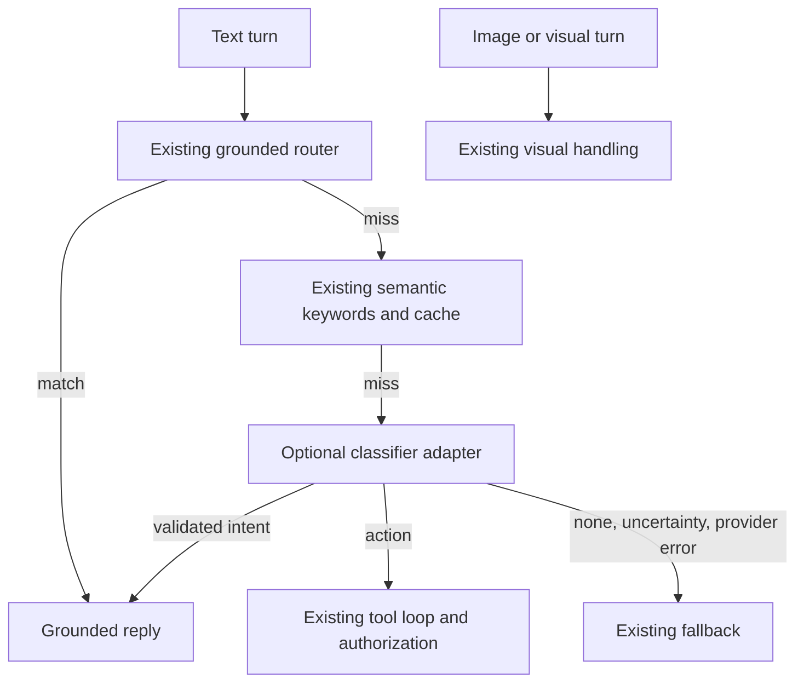

# Jev integration assessment for workbench development

Status: evaluation and proposed experiment, 2026-09-19. Source review used
workbench commit `d22893238d75efbb05a69eb75bca1b82eb5fe280`. This document does
not enable a provider, change the agent, or claim a live Jev benchmark.

## Recommendation

Start with an optional developer experiment for **skill selection and failure
triage**. If that produces useful measurements, evaluate replacing the agent's
**paid semantic classification fallback**. Keep deterministic routing first.
Prefer a small injected HTTP adapter for a future production integration; use
the LangChain wrapper when the consuming application already uses LangChain.

The [LangChain article](https://www.langchain.com/blog/building-a-harness-with-jev)
describes Jev, a TypeSafe model for classification rather than generation.
It fits decisions with a known answer set. Its advertised speed and cost
multipliers are vendor comparisons, not measurements of this workbench.
Code generation, diagnosis explanations, and workflow authoring still need
the coding agent or a generative model.

The current [blueprint architecture](blueprint-incorporation-plan.md) keeps
the custom action loop and uses Nebius-hosted inference plus self-hostable
tracing. A hosted TypeSafe dependency would extend that architecture. Keep it
an explicit optional experiment until its quality and data handling justify
that decision; migrating the agent to LangGraph is unnecessary.

## Verified upstream contract

| Surface | Finding | Consequence for NPA |
| --- | --- | --- |
| Decisions | `Choice` selects a label; `Noul` returns a yes probability; `Score` evaluates an ordered rubric. | Request intent, relevance, and triage judgments together when they share state. |
| Transport | `POST https://api.typesafe.ai/v1/systemone`, bearer authentication, `state`, `model`, and `questions`. | This is a separate provider protocol, not a Token Factory chat-completions model ID. |
| Model | The documented version is `jev-1.13.0`; `jev-latest` is a moving alias. | Pin model and question revisions for comparisons. |
| Modality | Text and structured text only. | Preserve image/Describe-this routing and VLM evaluation. Classify captions or textual metrics only after their existing producers run. |
| LangChain | `langchain-typesafe==0.0.1a2`, Python >=3.10; depends on `langchain-core` and `httpx2`. | Compatible with NPA's Python floor, but adds a framework and its transitive dependencies. |
| Direct SDK | `typesafe-sdk==0.7.0`, Python >=3.10; uses `httpx2` and Pydantic >=2.12. | Smaller than a LangChain integration, but still changes NPA's dependency floor if adopted. |

Sources: [HTTP contract](https://docs.typesafe.ai/api),
[model and modality reference](https://docs.typesafe.ai/models),
[LangChain release metadata](https://pypi.org/project/langchain-typesafe/0.0.1a2/),
and [TypeSafe SDK release metadata](https://pypi.org/project/typesafe-sdk/0.7.0/).
Package versions and signatures were also inspected in an isolated Python 3.12
environment. Installing those packages for this assessment does not add them
to NPA's dependency declarations.

The article's first Python snippet does not match the inspected wrapper:
`TypeSafeClassifier` requires `questions` at construction, and `invoke` takes
the state as its input. The current
[integration guide](https://docs.langchain.com/oss/python/integrations/providers/typesafe)
uses that shape. Its `ModelRouterMiddleware` and `AutoModeMiddleware` require
the experimental extra. They attach to LangChain agent hooks, while NPA has
its own loop. Auto Mode refuses selected tool calls; it does not implement
NPA's action-bound confirmation protocol.

`Choice.confidence` summarizes the distribution; it is not an independently
measured probability of correctness. `Noul` has no separate confidence field.
Do not reuse NPA's current semantic router threshold of `0.4` for Jev without
calibration. See [confidence semantics](https://docs.typesafe.ai/confidence).

## Where it fits in the current code

| Priority | Use | Existing integration point | Proposed behavior and comparison |
| --- | --- | --- | --- |
| First developer experiment | Suggest relevant skills | [`skills/index.yaml`](../../skills/index.yaml), `_resolve_skill_context` in [`agent.py`](../../npa/src/npa/cli/agent.py) | Rank candidate skill descriptions with an explicit `none` option; verify the best candidates against their actual instructions. Compare with current keyword/intent selection. Explicitly requested and mandatory skills remain authoritative. |
| First developer experiment | Triage failed development runs | `find_improvements` in [`improvements.py`](../../npa/src/npa/agent_backend/improvements.py) | Add advisory categories such as environment, implementation, insufficient evidence, and recovered. Preserve deterministic findings, real validation receipts, and independent review. |
| First runtime candidate | Classify paraphrases the free router misses | `classify_intent_semantic` in [`semantic_router.py`](../../npa/src/npa/agent_backend/semantic_router.py), `_semantic_route` in [`agent.py`](../../npa/src/npa/cli/agent.py) | Replace only the paid classification branch with `Choice` over known intents, `action`, and `none`. Measure against the current cheap Token Factory classifier. |
| Later | Choose a generation tier | `classify_tier` and `build_model_ladder` in [`agent_routing.py`](../../npa/src/npa/cli/agent_routing.py) | Compare optional Jev tier suggestions with free heuristics. Preserve explicit model selection, operator model configuration, and vision requirements. |
| Later | Rank retrieved documentation | `retrieve` in [`retrieval.py`](../../npa/src/npa/agent_backend/retrieval.py) | Rerank retrieved candidates and flag unsupported citations. Retain source IDs and original evidence; compare answer quality and added latency. |
| Later | Classify textual workflow failures | [`token_factory_triage.py`](../../npa/src/npa/workflows/token_factory_triage.py) | Label a sanitized artifact summary before generative diagnosis. Compare against existing report quality and end-to-end cost; a category cannot replace the written report. |

Skill selection has a directly relevant
[upstream experiment](https://docs.typesafe.ai/cookbooks/skill_suggestion): rank
the catalog, then inspect shortlisted skills before suggesting one. Its Hermes
results motivate an NPA experiment, but do not establish NPA accuracy. NPA's
catalog includes overlapping workflow and tool skills, so evaluation labels
must allow multiple valid skills and explicitly test requests needing none.

For a coding assistant working on this repository, the practical loop is:

1. Use repository paths and the skill index to form candidates locally.
2. Ask Jev to rank only a synthetic or approved sanitized task summary and
   those public descriptions. Load and follow the actual selected skills.
3. After running real checks, classify a sanitized failure summary to suggest
   the next area to inspect. Keep the original evidence available locally.
4. Let the coding assistant investigate, edit, and rerun the required checks.
   Record whether the suggestion helped, including wrong or unnecessary ones.

This can operate as a script invoked by a coding assistant. Installing a
LangChain package alone does not alter Codex's internal model routing, tool
permissions, or approval policy.

## Proposed runtime boundary



The diagram isolates the semantic decision; it does not replace the other
chat handlers or retrieval path. Put a proposed adapter in a normal shipped
backend module, inject its client, and wire it through the existing bootstrap.
Do not write classifier logic directly into the rendered backend string.

An adapter should return an NPA-owned decision with intent/mode, provider,
model, question revision, probabilities, confidence, token usage, and outcome
(`accepted`, `abstained`, or `unavailable`). Validate the requested question
IDs and answer types, allowed labels, finite numeric values, and probability
distributions before using them. Validate `action` as strictly as other labels.
The existing OpenAI-shaped `model_call` interface is not a suitable place to
silently substitute a Jev response.

Disabled means no import-time client creation or network call. During shadow
evaluation, record a suggestion while the baseline owns every decision.
For a later enabled experiment, abstention or provider failure must resume
the existing path without changing permissions. Avoid classifying the same
turn twice after returning to that path. Keep cache keys scoped to provider,
model, question and intent-catalog revisions, plus the decision input; do not
mix Jev results into the existing text-only cache across configuration changes.

Prefer direct HTTP with NPA's existing `httpx` dependency for production if
the measured benefit is confined to classification. That requires explicit
response validation, error mapping, and client lifecycle handling. The direct
SDK is an alternative if its typed API and retry support justify the extra
dependencies. LangChain is useful for an external LangChain application that
calls NPA tools, or a developer notebook already using its runnable interface.
None of these choices requires a new container or GPU workbench tool.

## Trust and operating constraints

TypeSafe documents adversarial-state sensitivity, unreliable arithmetic, and
degradation with irrelevant context in its
[Jev limitations](https://docs.typesafe.ai/model-jaggedness/jev-1.13). Keep GPU
placement, numeric gates, workflow validation, and resource identity checks in
code. A high classifier score cannot authorize a tool call or prove a run
succeeded. Continue to use [`actions.py`](../../npa/src/npa/agent_backend/actions.py)
for tool allowlisting and digest-bound confirmations. Security classification
may provide an advisory signal; it is not the sole enforcement boundary.

The experiment sends data to TypeSafe. Start with synthetic inputs and public
skill descriptions. Real trajectories require an explicit data-sharing
decision and an allowlisted, reviewed export; existing redaction is useful
but does not establish that all private context has been removed. Keep raw
logs, credentials, signed links, infrastructure details, and private tool
arguments out of requests and traces. Use existing NPA tracing with sanitized
decision metadata. LangChain callbacks can also trace state, so disable
LangSmith tracing for the isolated experiment.

Provider retention, region, private deployment, and service guarantees remain
deployment due diligence. A configurable API base URL does not demonstrate
that Jev weights or a self-hostable server are available. Verify applicable
terms through the [provider's published policies](https://docs.typesafe.ai/legal)
before an operational adoption; this assessment makes no legal conclusion.

## Reproducible synthetic API probe

Use an isolated checkout with its own `npa/.venv` as described in
[Contributing](../../CONTRIBUTING.md#testing-requirements). Install only the
wrapper version evaluated here:

```bash
uv pip install --python npa/.venv/bin/python 'langchain-typesafe==0.0.1a2'
```

Provide `TYPESAFE_API_KEY` through your private environment. Its value is
required and has no default in this example. This is the upstream credential,
not a new NPA configuration setting. The command below makes a hosted request
with synthetic text, writes decision metadata to stdout, and executes no NPA
action. Its output is an observation, not a pass/fail benchmark. Tracing is
disabled and the endpoint is explicit so ambient gateway settings cannot
redirect the example.

```bash
LANGSMITH_TRACING=false LANGCHAIN_TRACING_V2=false npa/.venv/bin/python - <<'PY'
import asyncio
import json
import os
from time import perf_counter

from langchain_typesafe import Choice, Noul, TypeSafeClassifier

classifier = TypeSafeClassifier(
    api_key=os.environ["TYPESAFE_API_KEY"],
    base_url="https://api.typesafe.ai",
    model="jev-1.13.0",
    questions={
        "triage": Choice(
            instructions="Which explanation best fits the observed test failure?",
            criteria={
                "environment": "A required local executable or dependency is absent.",
                "implementation": "Executed code produced an incorrect result.",
                "unknown": "The observations do not establish either explanation.",
            },
        ),
        "needs_evidence": Noul(
            instructions="Is more evidence needed to identify the failure's cause?"
        ),
    },
)
try:
    started = perf_counter()
    response = classifier.invoke({
        "task": "Run an offline documentation check.",
        "observation": "The shell reports: command not found: npa.",
    })
    print(json.dumps({
        "model": response.model,
        "elapsed_seconds": perf_counter() - started,
        "answers": {
            key: answer.model_dump() for key, answer in response.answers.items()
        },
        "usage": response.usage.model_dump(),
    }, indent=2))
finally:
    classifier.client.close()
    asyncio.run(classifier.async_client.aclose())
PY
```

No remote resource needs cleanup. Both HTTP clients are closed. Remove the
isolated checkout and its virtualenv when the experiment is finished.

## Evaluation before adoption

Use the existing [agent scenario harness](../../npa/tests/agent_eval/harness.py)
and [scenarios](../../npa/tests/agent_eval/scenarios.py) as a starting inventory,
then add held-out paraphrases and representative developer tasks. The current
harness uses mocked model responses: its pass rate does not measure Jev.

Compare three systems on the same labeled inputs: deterministic rules alone,
the current rules plus Token Factory semantic classifier, and rules plus Jev.
Separate threshold tuning from the final holdout; group paraphrases of a task
together to avoid leakage. Have a human review disputed labels independently
of both models. Preserve an explicit abstention label.

| Dimension | Required evidence |
| --- | --- |
| Routing quality | Per-intent precision/recall, confusion matrix, action false positives, abstention coverage, and whole-task success relative to baseline. |
| Skill usefulness | Recall of required skills, irrelevant suggestions, no-skill accuracy, and downstream task success. Mandatory skill omissions must be zero in the regression set. |
| Triage usefulness | Agreement with confirmed causes; false defect reports for successful recovery or valid empty results; developer acceptance of suggestions. |
| Calibration | Reliability plots, Brier score where applicable, and error versus coverage at candidate thresholds. Preserve probability distributions. |
| Cost and speed | End-to-end p50/p95 latency, classified/missed/cache-hit counts, input usage, provider errors, retries, and downstream generation cost. Report warm and cold cases separately. |
| Existing contracts | Zero new provider calls for deterministic hits; all authorization and explicit-model/vision regressions pass; malformed or unavailable classifications preserve the baseline path. |

The model reference lists $0.042 per million input tokens, with output tokens
free, as of the assessment date. At that rate a hypothetical 2,000-input-token
call costs $0.000084. This arithmetic is an estimate, not an observed request.
Use actual provider usage and the price in effect when benchmarking. For paid
fallbacks, compare `classifier cost + downstream cost + retry/fallback cost`
with the baseline total. On a deterministic hit the baseline classification
cost is already zero, so inserting Jev there cannot save classification spend.
[Pricing source](https://docs.typesafe.ai/models).

Promotion should require held-out task success at least as good as baseline,
a measured improvement in total cost or latency, and all existing contract
regressions passing. Report sample counts and uncertainty; equality on a small
sample is insufficient evidence. Tune thresholds separately for each decision,
including the `action` label. Start runtime use in opt-in shadow mode, then an
opt-in semantic fallback. Keep a disable path that restores the current router.

The follow-up implementation should cover invalid/missing questions, unknown
labels, non-finite probabilities, low confidence, provider authentication and
rate-limit errors, unavailable models, changed cache revisions, adversarial
state, explicit model choices, and image turns. Use injected transport tests
in CI and separately gated live provider evaluation. Any agent/bootstrap
change also needs the repository's rendered-backend and live deployment checks.

## Evidence and remaining work

The assessment inspected the upstream documentation, installed pinned client
packages, and checked the current repository integration points. The exact
documented example was executed with injected `httpx2.MockTransport` clients:
one synthetic request verified serialization, typed response parsing, stdout
metadata, and closure of both clients. The missing-constructor-questions error
in the blog example was reproduced. These checks establish API compatibility,
not model quality, calibration, service availability, or latency.

Local validation on Python 3.12/macOS:

- Repository Ruff lint passed.
- Documentation contracts: 663 passed, including local links and examples.
- Existing semantic-router, model-routing, and task-scorecard checks:
  50 passed, 1 skipped. The skip is the opt-in live scorecard.
- The new page's links and shell/Python syntax were also checked directly.

Reproduce the focused repository checks from the checkout root:

```bash
npa/.venv/bin/python -m ruff check npa
npa/.venv/bin/python -m pytest npa/tests/guardrails/test_documentation_examples.py -q
npa/.venv/bin/python -m pytest npa/tests/cli/test_agent_semantic_router.py \
  npa/tests/cli/test_agent_routing.py \
  npa/tests/agent_eval/test_agent_eval_scorecard.py -q
```

No `TYPESAFE_API_KEY` was configured in the evaluation environment, so no live
Jev inference was run. Runtime adoption remains contingent on the comparison
above. The useful deliverable now is a concrete experiment and integration
boundary, with production behavior unchanged.
