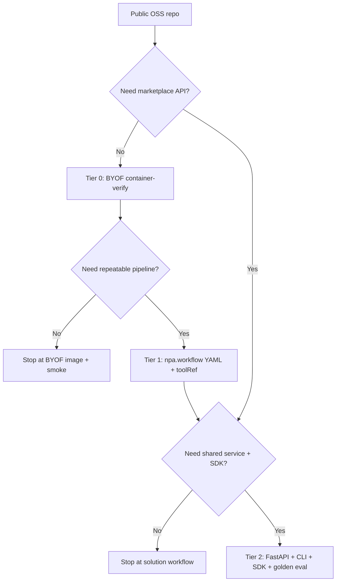

# OSS Onboarding Ladder

Single decision tree for taking an open-source solution from a public repo to
first-class Nebius Physical AI exposure (CLI, SDK, YAML). This is the platform
ladder; it does **not** replace per-solution registry catalogs.

## Tiers

| Tier | When to stop here | What you get | Surfaces |
| --- | --- | --- | --- |
| **0 — BYOF container** | Validate an OSS repo runs on Nebius GPUs without a marketplace product | Image in project registry + container-verify smoke | `npa workbench byof run`, `workbench.byof.repo` toolRef, `byof.yaml` |
| **1 — Solution workflow** | Repeatable pipeline for one OSS capability (train/eval/datagen) | Declarative `npa.workflow` YAML + SkyPilot smoke | Catalog `toolRef` + workflow under `npa/workflows/workbench/npa-workflows/` |
| **2 — First-class workbench tool** | Shared marketplace tool with API/CLI/SDK parity | FastAPI service, golden eval, skill, image in `CONTAINER_IMAGE_NAMES` | `npa workbench <tool>`, `npa.sdk.workbench.<tool>`, catalog entries |



## Tier 0 — BYOF container

Follow `skills/workflows/byof-onboard/SKILL.md`.

```bash
npa workbench byof run \
  --repo-url <repo-url> \
  --repo-ref <repo-ref> \
  --base-profile ubuntu \
  --workload container-verify \
  --cleanup
```

Equivalent script (still supported): `npa/scripts/run_byof_repo.py`.

YAML:

```bash
npa workbench workflow validate-spec \
  npa/workflows/workbench/npa-workflows/byof.yaml --json
```

## Tier 1 — Solution workflow

1. Keep the BYOF (or curated) image build path.
2. Author an `npa.workflow/v0.0.1` spec using
   `skills/workflows/author-npa-workflow/SKILL.md` (or generate/diagram skills).
3. Register any new `toolRef` in
   `npa/src/npa/orchestration/npa_workflow/catalog.py`.
4. Sync the human catalog in `docs/workbench/npa-workflow-tool-catalog.md`
   (enforced by `test_catalog_doc_sync.py`).
5. Add a SkyPilot smoke under `npa/workflows/workbench/skypilot/` when GPU
   evidence is required.

Do **not** invent a parallel registry skill here; solution-specific catalogs are
a separate concern.

## Tier 2 — First-class workbench tool

Follow the seven-step checklist in
`docs/architecture/contributor-context.md` § “Adding a new workbench tool” and
`skills/tools/workbench-tool/SKILL.md`:

1. FastAPI service (source of truth)
2. CLI `npa workbench <tool>`
3. SDK `npa.sdk.workbench.<tool>`
4. Dockerfile under `npa/docker/workbench/<tool>/`
5. Image + version registration (`images.py`, `pyproject.toml`)
6. Golden eval entry (`golden_evals.yaml`)
7. Agent skill + `skills/index.yaml`

Container packaging must satisfy
`docs/workbench/container-packaging.md` and
`npa/docker/workbench/packaging-contract.yaml`.

Partner / NVIDIA Omniverse capabilities additionally follow the gating in
`docs/architecture/partner-skills-roadmap.md` (real entrypoints + tests before
a skill lands).

## Dual YAML models

| Model | Path | Use |
| --- | --- | --- |
| Declarative `npa.workflow` | `npa/workflows/workbench/npa-workflows/` | Agent/plan/validate; `toolRef` catalog |
| SkyPilot task YAML | `npa/workflows/workbench/skypilot/` | Live GPU/container smokes and production jobs |

BYOF uses both: `byof.yaml` for the declarative contract, SkyPilot YAMLs for
live verify. Prefer declarative specs for composition; keep SkyPilot for
resource-bound execution.

## Definition of done (by tier)

| Gate | Tier 0 | Tier 1 | Tier 2 |
| --- | --- | --- | --- |
| Image builds + pushes | required | required | required |
| Live container or GPU smoke | required | required | required |
| `validate-spec` / `plan-spec` | optional (`byof.yaml`) | required | required for workflow stages |
| CLI | `npa workbench byof` | via toolRef argv | `npa workbench <tool>` |
| SDK | `npa.sdk.workbench.byof` | optional | `npa.sdk.workbench.<tool>` |
| Golden eval manifest | n/a (ad-hoc tag) | n/a | required |
| Agent skill | `byof-onboard` | author/generate skills | `skills/tools/<tool>` |
