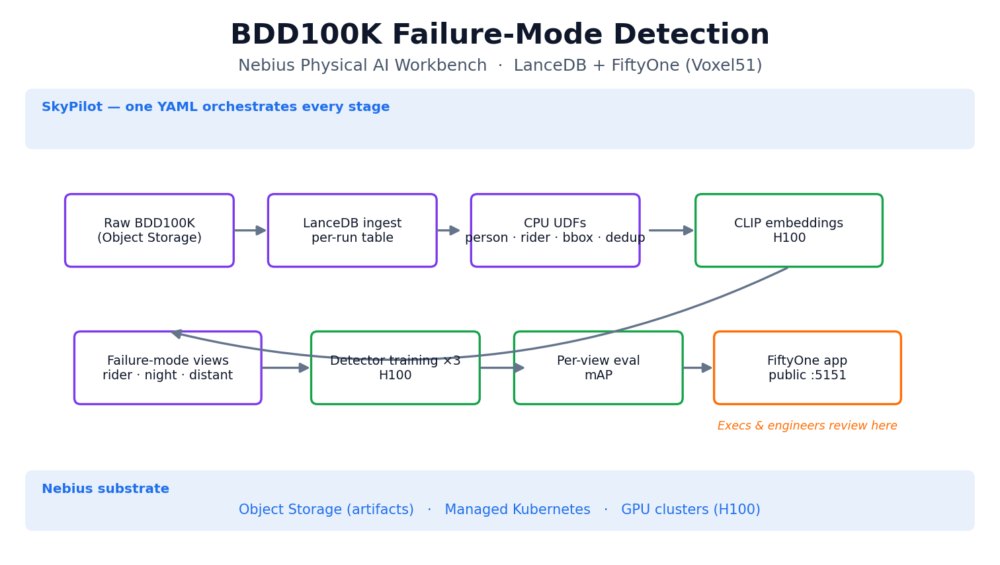
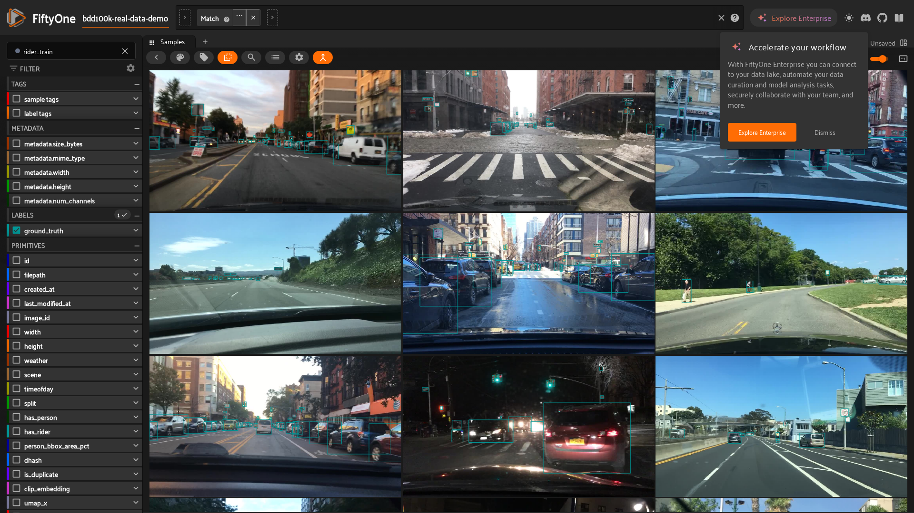
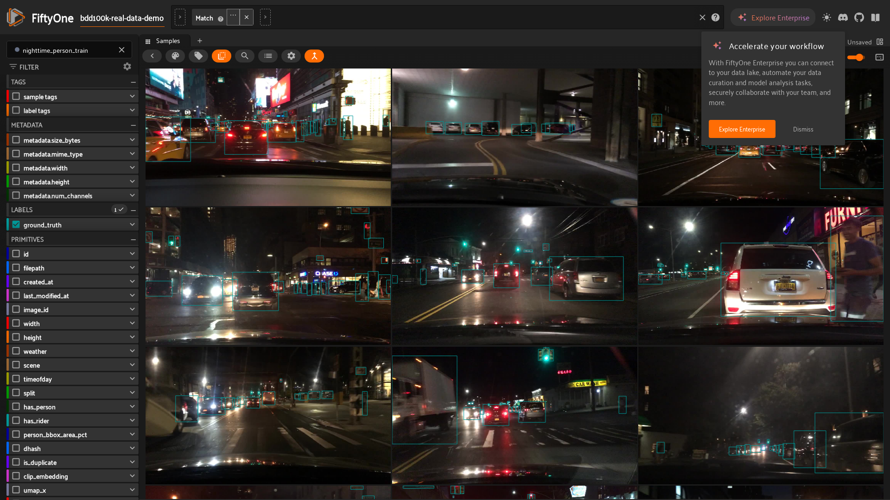
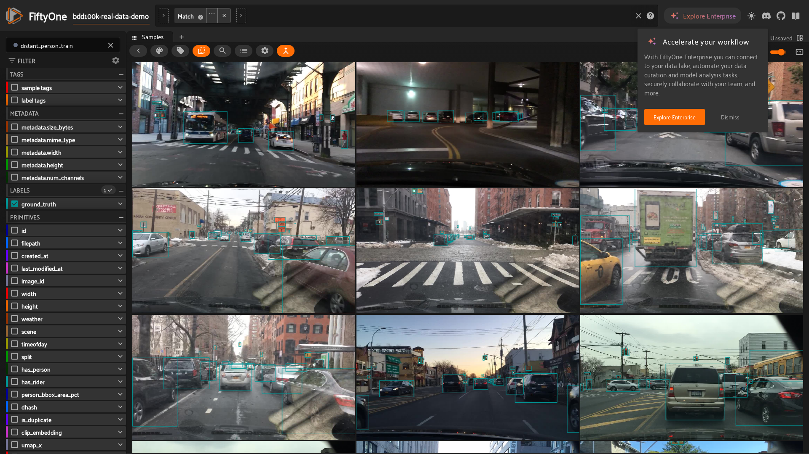

# BDD100K Demo — Step-by-Step Walkthrough (Exec + Technical)

A presenter-ready script for showing the BDD100K failure-mode detection demo to a
mixed audience. It pairs a plain-English narrative for execs and C-suite with the
exact FiftyOne (Voxel51) UI steps and commands for technical viewers.

- **Companion writeup (the full story):** [bdd100k-lancedb-demo.md](bdd100k-lancedb-demo.md)
- **Pipeline + how to run/reproduce:** [../workbench/cookbooks/bdd100k-pipeline.md](../workbench/cookbooks/bdd100k-pipeline.md)
- **Narrated slideshow video (built from live captures):** [assets/bdd100k/bdd100k-demo.mp4](assets/bdd100k/bdd100k-demo.mp4)
- **Unedited live session recording (real FiftyOne UI):** [assets/bdd100k/bdd100k-live-session.mp4](assets/bdd100k/bdd100k-live-session.mp4)
- **Architecture diagram:** [assets/bdd100k/architecture.png](assets/bdd100k/architecture.png)
- **Reproduced from (LanceDB):** [Unifying the AV ML Stack blog](https://www.lancedb.com/blog/unifying-the-av-ml-stack-lancedb) · [lancedb/training object-detection](https://github.com/lancedb/training/tree/main/object-detection)

> The `live-*.png` screenshots and `bdd100k-live-session.mp4` were captured from
> the deployed FiftyOne app (`bdd100k-real-data-demo`) running on the
> `npa-workbench-eu-north1` cluster.

## What this demo is

A self-driving (AV) perception model can score well *on average* yet fail on the
rare scenes that matter most for safety: **riders, pedestrians at night, and
distant pedestrians**. This demo ingests dashcam data, uses AI to surface and
slice those failure modes, trains a targeted detector for each, scores them, and
lets anyone review the results **visually in FiftyOne (Voxel51) running on
Nebius** — open in a browser, no install.

## Architecture (one slide for the room)



One SkyPilot YAML runs the whole chain on Nebius Managed Kubernetes: raw frames
in object storage → LanceDB ingest → CPU enrichment → CLIP embeddings on H100 →
failure-mode views → a detector per view on H100 → per-view evaluation → the
FiftyOne review app on a public URL.

## Run of show (about 8 minutes)

### 0. Before the meeting — bring the FiftyOne app up

```bash
# Expose the review app to external viewers (LoadBalancer public IP)
npa workbench fiftyone deploy --public-ip
npa workbench fiftyone status        # prints: Public URL: http://<external-ip>:5151
```

Open that URL in a browser tab and have it ready on the shared screen. (Operators
who prefer a local tunnel can use `npa workbench fiftyone open` instead.)

If you have no live cluster, play the prebuilt video
([assets/bdd100k/bdd100k-demo.mp4](assets/bdd100k/bdd100k-demo.mp4)) and use the
screenshots below — the talking points are identical.

### 1. Frame the problem (30s, no screen)

> "Our model's overall accuracy looks fine. But the accidents come from the rare
> cases — a cyclist, someone crossing at night, a person far down the road. Those
> are underrepresented in training data and invisible in an averaged score. Here's
> how we find and fix them."

### 2. Show the whole dataset (1 min)

**Say:** "This is 3,000 real dashcam frames, in the browser. Every frame carries
its boxes and AI-computed metadata — no spreadsheets."
**Do:** In FiftyOne, show the grid; hover a frame to show bounding boxes; point at
the left sidebar fields (`has_person`, `has_rider`, `person_bbox_area_pct`).


### 3. Failure mode 1 — riders (1 min)

**Say:** "One click isolates riders — motorcyclists and cyclists — a small,
high-risk slice."
**Do:** Select the saved view `rider_train` from the views dropdown.



### 4. Failure mode 2 — pedestrians at night (1 min)

**Say:** "Same idea, defined by a single rule on the data: people, at night."
**Do:** Select the saved view `nighttime_person_train`.



### 5. Failure mode 3 — distant pedestrians (1 min)

**Say:** "The hardest case: small, far-away people the model is most likely to
miss."
**Do:** Select the saved view `distant_person_train`.



### 6. The AI similarity map (1 min)

**Say:** "Beyond rules, the model learned what scenes *look* alike. This map lets
us lasso a cluster and pull in more rare cases automatically."
**Do:** Open the Embeddings panel (`clip_umap`), color by `has_rider`, lasso a
cluster to filter the grid.


### 7. Results (1 min, no screen)

A separate detector is trained and scored per failure mode:

| Failure-mode view | mAP | mAP@50 |
| --- | ---: | ---: |
| rider | 0.354 | 0.637 |
| nighttime pedestrian | 0.274 | 0.545 |
| distant pedestrian | 0.397 | 0.668 |

> Honest caveat for the room: these are from a small 3,000-frame run. They prove
> the **end-to-end path and label handling**, not final shippable model quality.

### 8. Close (30s)

> "The entire thing is one file on Nebius infrastructure — reproducible by anyone,
> and reviewable by anyone with a browser. No bespoke glue."

## Recording the video

There are three options, in increasing order of "live":

1. **Narrated slideshow (committed):**
   [assets/bdd100k/bdd100k-demo.mp4](assets/bdd100k/bdd100k-demo.mp4) — 50s, 1080p,
   title → architecture → the four FiftyOne views → similarity map → results.
   Its view slides are built from live captures of the deployed app. Regenerate:

   ```bash
   npa/.venv/bin/python docs/demos/build_bdd100k_demo_video.py
   ```

2. **Unedited live session (committed):**
   [assets/bdd100k/bdd100k-live-session.mp4](assets/bdd100k/bdd100k-live-session.mp4)
   — a headless-browser recording of the real FiftyOne app cycling the three
   saved views. Reproduce against a reachable FiftyOne endpoint with Playwright:

   ```bash
   npa/.venv/bin/pip install playwright
   npa/.venv/bin/python -m playwright install --with-deps chromium
   # then drive http://<fiftyone-public-ip>:5151 and record the context;
   # FiftyOne saved views are URL-addressable: ?view=rider-train,
   # ?view=nighttime-person-train, ?view=distant-person-train
   ```

3. **Manual screen recording (best for a live narrated demo):** record your
   screen while walking the steps above against the live FiftyOne URL with any
   recorder (macOS `Cmd+Shift+5`, OBS, Loom). Follow the run-of-show order so the
   recording matches this script.

## Viewing the assets

```bash
# Video (any player / browser / Slack)
xdg-open docs/demos/assets/bdd100k/bdd100k-demo.mp4    # or open on macOS

# Architecture diagram
xdg-open docs/demos/assets/bdd100k/architecture.png
```
