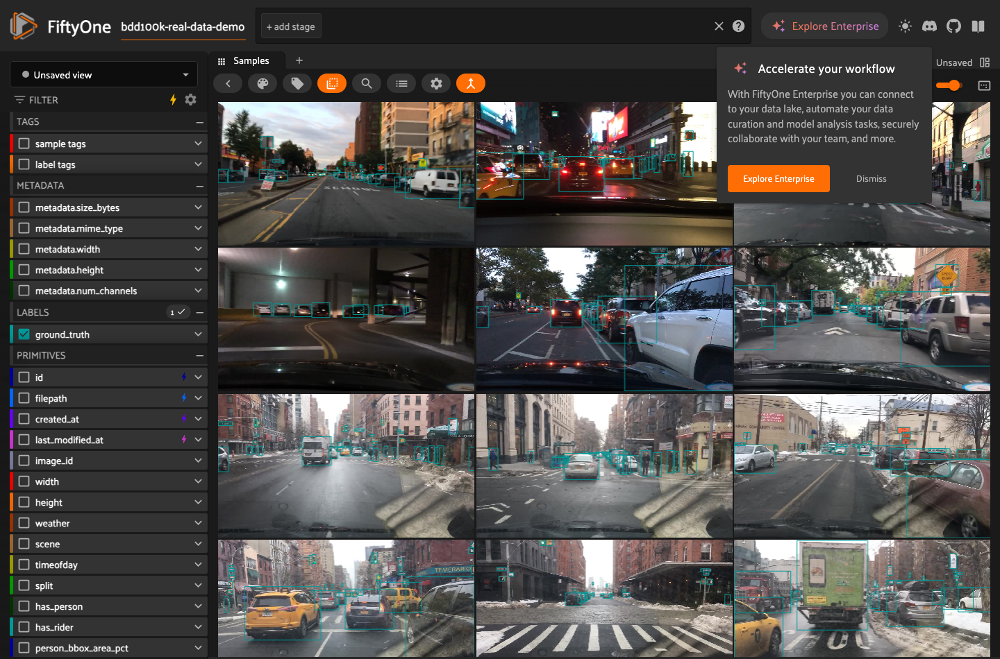
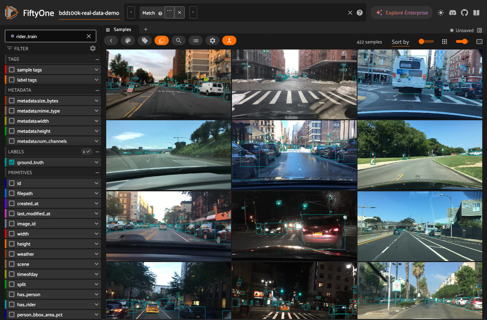
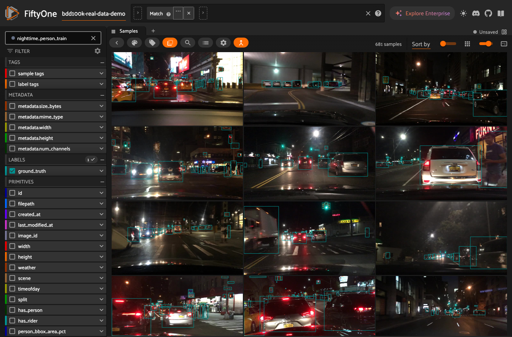
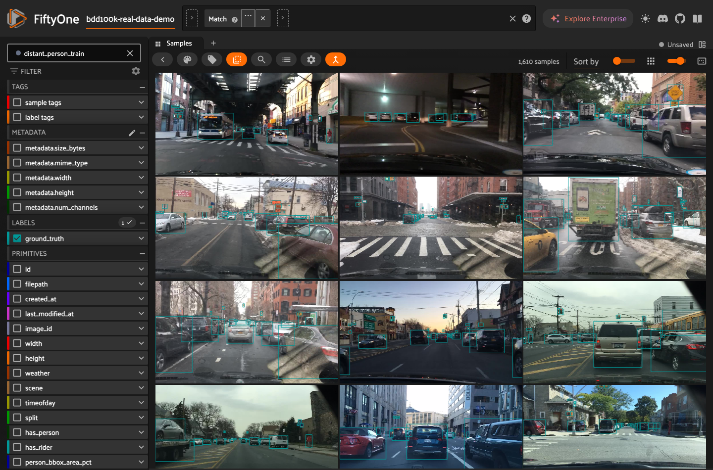
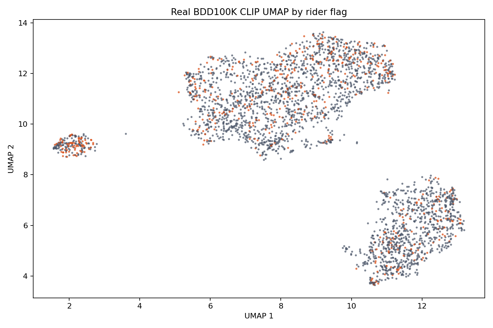

# BDD100K Failure-Mode Detection Demo
## Nebius Physical AI Workbench - LanceDB Reproduction

### The Problem

AV perception models fail silently on rare scenarios: riders, nighttime pedestrians, and objects far from the camera. These failure modes are underrepresented in training data and easy to miss in aggregate metrics.

### The Approach

1. Ingest a BDD100K-shaped dataset into LanceDB on Nebius object storage
2. Enrich it with UDFs: presence flags, bounding-box area, perceptual hash, and deduplication
3. Compute CLIP embeddings for visual similarity search
4. Define failure-mode materialized views with SQL filters
5. Train a targeted Faster R-CNN detector on each failure-mode slice
6. Evaluate per-view mAP

### The Pipeline

One YAML file describes the full pipeline. SkyPilot orchestrates the dependencies on Nebius GPU infrastructure.

```yaml
# BDD100K reproduction pipeline.
# SkyPilot 0.12.2 supports serial pipelines and all-parallel job groups, but
# not mixed dependency graphs in one YAML. Training and evaluation therefore
# run serially here; split them into separate parallel job groups only when the
# orchestration layer supports cross-job dependencies.
name: bdd100k-pipeline
execution: serial
---
# Stage 1: import the BDD100K subset into a per-run LanceDB table.
name: bdd100k-ingest
resources:
  cloud: kubernetes
  cpus: 4
  memory: 16
  # Pinned first-party LanceDB image; override image_id only for BYO registries.
  image_id: "docker:cr.eu-north1.nebius.cloud/e00cm0vc6t09m0z5gw/npa-lancedb:0.30.2"
envs:
  NPA_PIPELINE_RUN_ID: "<your-run-id>"
  S3_BUCKET: "${NPA_S3_BUCKET}"
  S3_PREFIX: "bdd100k-pipeline/${NPA_PIPELINE_RUN_ID}"
  PIPELINE_ROOT_URI: "s3://${NPA_S3_BUCKET}/bdd100k-pipeline/${NPA_PIPELINE_RUN_ID}"
  BDD100K_SOURCE_URI: s3://${NPA_S3_BUCKET}/raw-bdd100k/subset-demo/
  BDD100K_LIMIT: "10000"
  BDD100K_SYNTHETIC_ROWS: "0"
  LANCE_URI: "s3://${NPA_S3_BUCKET}/bdd100k-pipeline/${NPA_PIPELINE_RUN_ID}/lancedb/"
  LANCE_TABLE: bdd100k
  LANCEDB_ENDPOINT: http://npa-lancedb.workbench.svc.cluster.local:8686
  LANCEDB_TOKEN: ""
setup: |
```

### Dataset Overview

The validated production demo run uses 3000 real BDD100K dashcam frames staged
at `s3://YOUR_S3_BUCKET/raw-bdd100k/subset-demo/`. The pipeline writes its
LanceDB table, checkpoints, and eval artifacts under
`s3://YOUR_S3_BUCKET/bdd100k-pipeline/bdd100k-real-data-demo/`.

| Column | Type | Description |
|---|---|---|
| `image_bytes` | bytes | Raw frame |
| `ann_bboxes` | list[list[float]] | Bounding box coordinates |
| `ann_categories` | list[str] | Category labels |
| `has_person` | bool | Person present in frame |
| `has_rider` | bool | Rider present in frame |
| `person_bbox_area_pct` | float | Fraction of frame area covered by person boxes |
| `dhash` | int64 | Perceptual hash for deduplication |
| `is_duplicate` | bool | Near-duplicate flag |
| `clip_embedding` | float32[512] | CLIP ViT-B/32 visual embedding |



### Failure-Mode Views

The view filters below are from the LanceDB `_mv_registry` table for this run.

| View | SQL filter | Rows | Share of dataset |
|---|---|---:|---:|
| `rider_train` | `has_rider = true AND split = 'train'` | 422 | 14.1% |
| `nighttime_person_train` | `timeofday = 'night' AND has_person = true AND split = 'train'` | 681 | 22.7% |
| `distant_person_train` | `has_person = true AND person_bbox_area_pct < 0.01 AND split = 'train'` | 1610 | 53.7% |





### Embedding Space

FiftyOne Brain computed a 2D UMAP projection from the 512-dimensional `clip_embedding` field under brain key `clip_umap`. The plot below colors samples by `has_rider`.



The CLIP embedding space exposes visual neighborhoods that can be used for targeted retrieval and augmentation beyond SQL filters.

### Training Results

Each failure-mode view trains a separate Faster R-CNN ResNet50 FPN v2 detector.

| View | mAP | mAP_50 | mAP_75 | Checkpoint |
|---|---:|---:|---:|---|
| `rider_train` | 0.354251 | 0.637311 | 0.346032 | `training/bdd100k_rider_train/train-20260519T234231Z-493c64d1a888/checkpoints/epoch_10.pt` |
| `nighttime_person_train` | 0.273981 | 0.544926 | 0.233182 | `training/bdd100k_nighttime_person_train/train-20260519T234630Z-6458d8011409/checkpoints/epoch_10.pt` |
| `distant_person_train` | 0.396922 | 0.668106 | 0.390239 | `training/bdd100k_distant_person_train/train-20260519T235137Z-ea5c897db39c/checkpoints/epoch_10.pt` |

> Note: these metrics are from a 3000-frame targeted real-data subset with short
> training runs. They validate the production artifact path and label handling,
> but publishable model quality still requires a held-out evaluation split.

### Reproducing This Demo

Prerequisites: Nebius account, `npa` CLI installed, and access to the
`npa-workbench-eu-north1` cluster profile. Start with the no-infrastructure
validation first:

```bash
python npa/scripts/run_bdd100k_pipeline.py \
  --yaml npa/workflows/workbench/skypilot/bdd100k-pipeline.yaml \
  --synthetic 5000 \
  --mock-endpoints
```

For a live cluster run, configure SkyPilot and storage first:

```bash
export NPA_SKYPILOT_BIN=/opt/npa/skypilot/bin/sky
export NPA_STORAGE_ENDPOINT=storage.eu-north1.nebius.cloud
"$NPA_SKYPILOT_BIN" check nebius kubernetes
```

The pipeline expects in-cluster services at:

```text
http://npa-lancedb.workbench.svc.cluster.local:8686
http://npa-detection-training.workbench.svc.cluster.local:8790
```

Deploy or register equivalent services before submitting. The detection-training
service requires an output path:

```bash
npa workbench detection-training deploy \
  --namespace workbench \
  --output-path s3://<YOUR_BUCKET>/bdd100k-pipeline/
```

The OSS LanceDB VM path is still operator-owned in this build. For local smoke,
use the container runbook in `docs/workbench/cookbooks/lancedb-deploy-runbook.md`; for the
live BDD100K pipeline, the operator must provide the in-cluster LanceDB service
or a compatible endpoint override.

Submit the synthetic pipeline after those services are reachable:

```bash
python npa/scripts/run_bdd100k_pipeline.py \
  --yaml npa/workflows/workbench/skypilot/bdd100k-pipeline.yaml \
  --synthetic 5000

# View results in FiftyOne
npa workbench fiftyone deploy --public-ip
npa workbench fiftyone status
```

### Accessing the FiftyOne Session

```bash
# Public URL, no local tooling required for viewers
npa workbench fiftyone status
# Public URL: http://<external-ip>:5151

# Local access for operators who prefer a port-forward
npa workbench fiftyone open
```

### Reproducing with Real Data

Stage a BDD100K subset at `s3://<your-bucket>/raw-bdd100k/subset-demo/` with
3-5k frames in standard BDD100K format, then re-run without the synthetic flag.
Before a production run, switch the three training task label-map comment blocks
in `npa/workflows/workbench/skypilot/bdd100k-pipeline.yaml` from the synthetic map to the
real BDD100K map:

```json
{"pedestrian":0,"rider":1,"car":2,"truck":3,"bus":4,"train":5,"motorcycle":6,"bicycle":7,"traffic light":8,"traffic sign":9}
```

The committed YAML keeps the synthetic default for CI and first-run safety; the
real-data label map is an operator switch for live production demos.

Example live real-data invocation:

```bash
export AWS_PROFILE=nebius-eu-north1
export KUBECONFIG=/Users/timothyle/.npa/clusters/npa-workbench-eu-north1/kubeconfig
export NPA_S3_BUCKET=YOUR_S3_BUCKET
export NPA_RUN_ID=bdd100k-real-data-demo
export BDD100K_PIPELINE_MODE=FULL_SUBMISSION

python npa/scripts/run_bdd100k_pipeline.py \
  --yaml npa/workflows/workbench/skypilot/bdd100k-pipeline.yaml \
  --run-id bdd100k-real-data-demo
```

The pipeline ingests real frames, computes real CLIP embeddings, and produces
the per-view mAP artifacts shown above.

### Architecture

This demo follows the three-layer workbench architecture described under [`docs/architecture/`](../architecture/): object storage as the artifact layer, LanceDB/FiftyOne/detection services as the workbench layer, and SkyPilot as the orchestration layer.

### S3 Artifacts

- Lance table: `s3://${NPA_S3_BUCKET}/bdd100k-pipeline/bdd100k-real-data-demo/lancedb/`
- Checkpoints: `s3://${NPA_S3_BUCKET}/bdd100k-pipeline/bdd100k-real-data-demo/training/`
- Eval metrics: `s3://${NPA_S3_BUCKET}/bdd100k-pipeline/bdd100k-real-data-demo/eval/`

### Demo Session

The runbook session loaded `bdd100k-real-data-demo` into FiftyOne with 3000 real
BDD100K samples, CLIP embeddings, bounding boxes, scalar UDF fields, and the
three saved views above. Run `npa workbench fiftyone status` for the public URL,
or `npa workbench fiftyone open` for local access.
