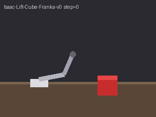
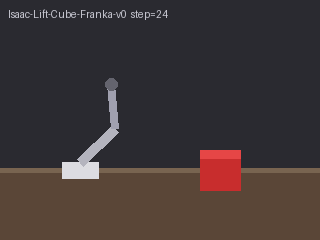
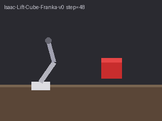

# Hackathon Guide — Isaac Lab Franka + Token Factory (sim visuals → serverless reasoner)

This guide shows **one complete pipeline** that pairs an **existing workbench tool**
(Isaac Lab on Nebius GPU) with **Nebius Token Factory** (zero-GPU hosted inference).
You simulate a **Franka arm** in Isaac Lab, capture RGB frames from the rollout,
then call **`nvidia/Cosmos3-Super-Reasoner`** to describe the scene and produce a
manipulation plan.

| Piece | What it does | GPU? |
|-------|----------------|------|
| **Isaac Lab** (`Isaac-Lift-Cube-Franka-v0`) | Headless Franka lift-cube sim; writes PNG frames | Yes (L40S / RTX Pro) |
| **Token Factory** (`token-factory reason`) | Reads frames (local or S3); returns scene + plan JSON | No (hosted API) |

Prerequisites for the **serverless** stage match
[hackathon-cosmos3-reasoner.md](hackathon-cosmos3-reasoner.md) (Token Factory key,
`npa configure`, `verify`). The **sim** stage additionally needs Nebius Kubernetes
+ the `npa-isaac-lab` image (RT-core GPU).

---

## What the visuals look like

Sample frames (stylized stand-ins for Isaac Sim RGB) shipped in-repo for offline
SDK runs. On a real L40S job, `capture_isaac_lab_scene_frames.py` writes
photoreal frames like these from `Isaac-Lift-Cube-Franka-v0`:

| Frame | Sim step (approx.) |
|-------|-------------------|
|  | approach |
|  | pre-grasp |
|  | lift |

Full sequence: `docs/assets/hackathon/isaac-franka-lift-cube/frame_00.png` …
`frame_05.png`.

---

## Architecture (one workflow)

```text
[ Isaac Lab GPU stage ]  --PNG frames-->  [ S3 SCENE_URI ]
                                              |
                                              v
[ Token Factory CPU stage ]  reads SCENE_URI, writes scene_reasoning.json → PLAN_URI
```

SkyPilot YAML:
[`npa/workflows/workbench/skypilot/isaac-franka-capture-reason.yaml`](../../npa/workflows/workbench/skypilot/isaac-franka-capture-reason.yaml)

---

## Path A — SDK example (local, uses bundled sample frames)

No GPU required for this path — uses the sample Franka frames above.

```bash
cd nebius-physical-ai
python3 -m venv .venv && source .venv/bin/activate
pip install -e npa

export NEBIUS_TOKEN_FACTORY_KEY='v1.…'   # or: npa configure --token-factory-key …
npa workbench token-factory verify

npa/.venv/bin/python npa/examples/isaac_franka_token_factory_reason.py \
  --input-path docs/assets/hackathon/isaac-franka-lift-cube \
  --output-path /tmp/isaac-franka-reason-out
```

✅ Checkpoint — JSON on stdout with `status: completed` and a non-empty
`analysis`. Artifact: `/tmp/isaac-franka-reason-out/scene_reasoning.json`.

### SDK internals (same calls the CLI uses)

```python
from npa.workbench.token_factory import reason_scene

result = reason_scene(
    input_path="docs/assets/hackathon/isaac-franka-lift-cube",
    output_path="/tmp/out",
    task="Describe the Franka scene and give a lift plan.",
    model="nvidia/Cosmos3-Super-Reasoner",
    max_images=8,
    max_tokens=1024,
)
print(result.analysis)
```

`TokenFactoryClient` in `npa.clients.token_factory` is the lower-level
OpenAI-compatible wrapper if you need custom message shapes.

---

## Path B — CLI (local frames folder)

After capturing frames on a GPU host (Path C) or using the sample folder:

```bash
npa workbench token-factory reason \
  --input-path ./docs/assets/hackathon/isaac-franka-lift-cube \
  --output-path ./out \
  --task "These frames are from Isaac Lab Franka lift-cube. What is happening and what should the robot do next?" \
  --model nvidia/Cosmos3-Super-Reasoner \
  --max-images 8 \
  --max-tokens 1024 \
  --output json
```

---

## Path C — Capture real Isaac Sim frames (GPU host)

Run inside the **Isaac Lab container** on an L40S-class GPU (RT cores required):

```bash
# On a k8s pod or Isaac VM with /opt/nebius-physical-ai mounted
/isaac-sim/python.sh npa/scripts/capture_isaac_lab_scene_frames.py \
  --task Isaac-Lift-Cube-Franka-v0 \
  --output-path ./isaac-franka-frames \
  --max-steps 80 \
  --max-frames 6

# Or upload directly to S3:
/isaac-sim/python.sh npa/scripts/capture_isaac_lab_scene_frames.py \
  --task Isaac-Lift-Cube-Franka-v0 \
  --output-path s3://YOUR_BUCKET/hackathon/RUN_ID/isaac-franka/scene/
```

Dry-run (no GPU):

```bash
python npa/scripts/capture_isaac_lab_scene_frames.py \
  --render-only \
  --output-path s3://YOUR_BUCKET/hackathon/run/scene/
```

Then run Path A or B on the output folder / S3 prefix.

---

## Path D — Full SkyPilot workflow (GPU capture + Token Factory)

1. Replace `<your-registry-id>`, bucket, and run id in the YAML `envs:` block
   (SkyPilot 0.12.2 does not interpolate `${VAR}` in `envs:` — edit literals before launch).
2. Bootstrap SkyPilot if needed: `npa skypilot bootstrap`.
3. Launch:

```bash
sky jobs launch \
  --secret NEBIUS_TOKEN_FACTORY_KEY \
  --secret AWS_ACCESS_KEY_ID \
  --secret AWS_SECRET_ACCESS_KEY \
  npa/workflows/workbench/skypilot/isaac-franka-capture-reason.yaml
```

**Stage 1** (`isaac-franka-capture`): L40S + `npa-isaac-lab` image → PNGs in
`SCENE_URI`.

**Stage 2** (`token-factory-reason`): CPU + `npa-cosmos` image →
`scene_reasoning.json` in `PLAN_URI`.

Or use the workflow submit wrapper:

```bash
npa workbench workflow submit \
  npa/workflows/workbench/skypilot/isaac-franka-capture-reason.yaml \
  --run-id hackathon-franka-001 \
  --var SCENE_URI=s3://YOUR_BUCKET/hackathon/hackathon-franka-001/isaac-franka/scene/ \
  --var PLAN_URI=s3://YOUR_BUCKET/hackathon/hackathon-franka-001/isaac-franka/reasoning/
```

---

## Troubleshooting

| Symptom | Fix |
|---------|-----|
| `CUDA GPU is required` on capture | Run capture on L40S / RTX Pro; Isaac Lab needs RT cores |
| `No frames captured` | Confirm `Isaac-Lift-Cube-Franka-v0` and `enable_cameras`; check Isaac image version |
| `NEBIUS_TOKEN_FACTORY_KEY is not set` | `export NEBIUS_TOKEN_FACTORY_KEY` or `npa configure --token-factory-key` |
| Reasoner returns empty `analysis` | Increase `--max-tokens`; confirm Cosmos3 model in `npa workbench token-factory models` |
| SkyPilot stage 1 can't find NPA repo | Set `NPA_REPO_ROOT=/opt/nebius-physical-ai` or bake repo into image |

---

## Related docs

- [hackathon-cosmos3-reasoner.md](hackathon-cosmos3-reasoner.md) — Token Factory only (no sim)
- [composing-cloud-and-token-factory.md](../workbench/composing-cloud-and-token-factory.md) — general compute + TF composition
- [tokenfactory-compute-combos.md](../workbench/cookbooks/tokenfactory-compute-combos.md) — LeRobot combo workflows
- Isaac Lab tool skill: `skills/tools/isaac-lab/SKILL.md`
