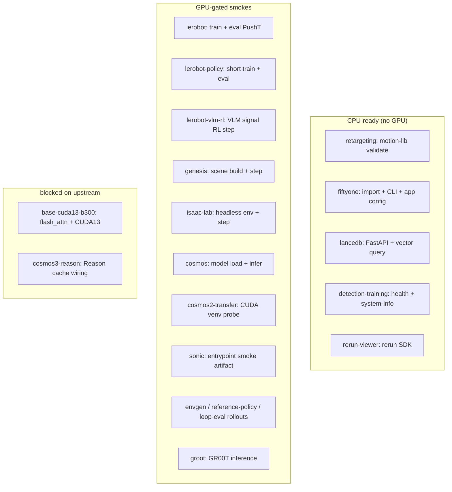

# Container safety review & golden evals

This document is the safety + Physical AI usefulness review for every Workbench
container image, and the contract for each container's **golden eval** — the
minimal "does this container actually work" / "hello world" tested rerun.

The machine-readable source of truth is
[`npa/src/npa/smoke/golden_evals.yaml`](../../npa/src/npa/smoke/golden_evals.yaml).
This doc is the human-readable companion; if the two disagree, the manifest
(which is test-enforced) wins.

Packaging tiers, security baseline, and ENTRYPOINT expectations are documented
in [`docs/workbench/container-packaging.md`](../workbench/container-packaging.md)
and enforced by `npa/docker/workbench/packaging-contract.yaml`.

## How it is enforced

- **Completeness/consistency gate** —
  `npa/tests/smoke/test_golden_eval_manifest.py` runs in the standard unit suite
  and fails CI if any container in `npa.deploy.images.CONTAINER_IMAGE_NAMES` is
  missing an entry, references a missing Dockerfile, an unimportable smoke
  module, or omits a safety / Physical AI field.
- **Nightly run** — the workflow at `docs/ci/golden-evals-nightly.yml` runs at
  04:00 UTC once installed to `.github/workflows/` (it ships under `docs/ci/`
  because the author credential lacked the GitHub `workflow` scope). The
  `validate-manifest` and `cpu-evals` jobs run on GitHub-hosted runners; the GPU
  golden evals run on a self-hosted GPU runner via `workflow_dispatch`
  (`run_gpu_evals: true`).
- **Image CVE / config scanning** — handled separately by the weekly
  `image-security-scan.yml` (Trivy config scan + base-image CVE matrix).

## CLI

```bash
npa workbench golden-eval list              # table of every container + eval
npa workbench golden-eval show lerobot      # full safety + eval record (JSON)
npa workbench golden-eval validate          # offline completeness/consistency
npa workbench golden-eval run cosmos        # print the eval command (dry run)
npa workbench golden-eval run cosmos --execute       # run locally (needs runtime)
npa workbench golden-eval run lerobot --serverless   # run on a Nebius GPU
npa workbench golden-eval run genesis --serverless --gpu h100
```

## Running on Nebius Serverless

`--serverless` submits the golden eval as a **Nebius Serverless AI Job** that
pulls the tool's real container image (resolved via
`npa.deploy.images.container_image_for_tool`) and runs the eval command on a
GPU, then waits for the PASS/FAIL result. This is the path the nightly GPU job
uses — no self-hosted GPU runner required, only Nebius + storage credentials.

Each eval's GPU is taken from `golden_eval.serverless_gpu` in the manifest
(falling back to `l40s`, since Nebius Jobs always require a GPU preset) and can
be overridden with `--gpu`. Implementation: `npa.smoke.serverless_runner`.

The same logic is available as a script for CI:
`python npa/scripts/run_golden_evals.py {validate,list,run}`.

## Golden-eval capability chart

Each container's golden eval proves specific **capabilities** (not just `--help` or
import). Registry tags come from ``pyproject.toml`` → ``[tool.npa.supported-tools]``.

```bash
npa/.venv/bin/python npa/scripts/run_golden_evals.py list --capabilities
npa/.venv/bin/python npa/scripts/audit_workbench_image_tags.py   # stale tag gate
```



| container | registry tag | eval kind | capabilities tested | gpu | status |
| --- | --- | --- | --- | --- | --- |
| `base-cuda13-b300` | *(foundation)* | build-import | torch+CUDA; flash_attn import | required | blocked-on-upstream |
| `groot` | `0.1.0` | container-smoke | GR00T repo; uv; standalone inference | required | gpu-gated |
| `lerobot` | `0.5.1` (default) | container-smoke | version; 50-step PushT train; checkpoint; eval; output | required | gpu-gated |
| `lerobot` | `0.6.0` (additional) | container-smoke | same suite with `NPA_LEROBOT_VERSION=0.6.0` / `npa-lerobot:0.6.0` | optional | gpu-gated |
| `lerobot-policy` | `0.1.1` | container-smoke | short train; short eval on checkpoint | optional | gpu-gated |
| `lerobot-vlm-rl` | `0.1.1` | container-smoke | CUDA; VLM signal parse + RL step | required | gpu-gated |
| `genesis` | `0.4.6` | container-smoke | import; Franka scene; step; body state | required | gpu-gated |
| `isaac-lab` | `2.3.2.post1` | container-smoke | version; runtime; manipulation env; step | required | gpu-gated |
| `cosmos` | `1.0.9` | container-smoke | version; model load; single inference (safety on) | required | gpu-gated |
| `cosmos2-transfer` | `2.5.1-golden-eval-smoke-*` | container-smoke | venv torch; CUDA; GPU matmul probe | required | gpu-gated |
| `cosmos3-reason` | `3.0.1-genuine-sm120` | container-smoke | CUDA; Reason cache wiring | optional | blocked-on-upstream |
| `sonic` | `0.1.2` | entrypoint-smoke | `/entrypoint.sh smoke`; GPU proofs; JSON artifact | required | gpu-gated |
| `retargeting` | `0.1.1` | container-smoke | validate_motion_lib on synthetic motion | none | ready |
| `fiftyone` | `1.15.0` | container-smoke | import+version; CLI; app config (env smoke) | none | ready |
| `lancedb` | `0.30.3` | server-smoke | server start; create table; vector query; list | optional | ready |
| `detection-training` | `bdd100k-golden-eval-smoke-*` | server-smoke | server start; `/health`; `/system-info` | optional | ready |
| `envgen` | `0.1.2` | container-smoke | raw envgen JSONL; Genesis CUDA step | optional | gpu-gated |
| `reference-policy` | `0.1.2` | container-smoke | policy contract (envgen functional delegate) | optional | gpu-gated |
| `loop-eval` | `0.1.1-genuine-sm120` | container-smoke | CUDA; FrankaPickPlace rollout step | optional | gpu-gated |
| `rerun-viewer` | `0.31.4` | build-import | rerun SDK import + version | none | ready |

Machine-readable probes: ``npa/src/npa/smoke/capabilities.py`` (enforced by
``npa/tests/smoke/test_golden_eval_capabilities.py``).

## Golden-eval kinds

| kind | meaning |
| --- | --- |
| `container-smoke` | env + functional smoke module run inside the built image |
| `server-smoke` | start the FastAPI service, poll `/health`, do one real op |
| `entrypoint-smoke` | container ENTRYPOINT mode that self-reports a result artifact |
| `workflow-smoke` | workflow/CLI entrypoint contract (help/parse) proof |
| `build-import` | import/compile proof that the heavy deps resolve |

`status` is one of `ready` (runs on a normal runner), `gpu-gated` (needs a GPU
host/serverless with the image), `blocked-on-upstream` (B300/CUDA13 family), or
`needs-image-update` (the published image cannot run its eval yet — see the
validation results below).

## Validation results

The golden evals were first submitted to **Nebius Serverless AI Jobs** in their
real published images. That run passed `lerobot` (H200, 5/5) and `groot`
(H100, 3/3) and surfaced four packaging bugs, which are now **fixed** and
re-verified by building the images from source and running the eval:

| container | result | how verified | notes |
| --- | --- | --- | --- |
| `lerobot` | **PASS 5/5** | live serverless H200 | version, 50-step PushT train, checkpoint, eval, output |
| `groot` | **PASS 3/3** | live serverless H100 | inference script, uv, standalone GR00T inference |
| `lancedb` | **PASS 4/4** | local rebuild + run | start server, create table, vector query, list tables |
| `detection-training` | **PASS 2/2** | local rebuild + run | health + system-info |
| `fiftyone` | **PASS 3/3** | local rebuild + run | import + version + CLI + app config (env smoke) |
| `genesis` | fix verified | `_versions` unit test | py3.10 import fix; full GPU run still pending |
| `isaac-lab` | command fixed | static + manifest | standalone-script command; GPU run pending |

### Bugs the golden evals surfaced (now fixed)

1. **genesis** — `npa.smoke._versions` did `import tomllib`/`tomli`; the genesis
   py3.10 venv has neither. `_versions` is now stdlib-only (regression test:
   `test_versions_helper_works_without_toml_library`).
2. **lancedb** — the image flattens server modules into `/app` and does not
   install `npa`; the smoke now ships as a standalone `/app/smoke_functional.py`
   (`LANCEDB_SMOKE_APP=npa_lancedb_server:app`).
3. **detection-training** — (a) the image did not bundle the smoke, and (b) its
   service imports `npa.workbench.training_config`, which the image never copied,
   so the service could not even start. Both files are now copied in.
4. **fiftyone** — the published `:1.15.0` predated the current Dockerfile (no
   smoke script at all); and the functional smoke needs a MongoDB the slim base
   cannot provision, so the golden eval is the DB-free env smoke.
5. **isaac-lab** — used a `python -m npa.smoke.*` command, but the image only
   ships a standalone script (no `npa` package); command corrected to the script.

### Regression guard

`test_dockerfile_provides_golden_eval_entrypoint` statically checks, for every
`container-smoke`/`server-smoke`, that the Dockerfile actually builds in the
eval's module or script. This would have caught all of the above at update time.

### Serverless fleet peak (feat/golden-eval)

Batch `run-all --serverless` (excluding `blocked-on-upstream` by default) targets
**16/16 PASS** on real Nebius Serverless GPUs. The prior 15/16 gap was
`cosmos2-transfer`: the published `2.5.0` image installs PyTorch in
`/opt/cosmos/venv`, not on default `python`, so bare `python -c import torch`
probes failed. The fix is a thin wrapper image (`2.5.1-golden-eval-smoke-*`)
that copies `smoke_functional.sh` and runs the probe via the venv python.
`base-cuda13-b300` and `cosmos3-reason` remain `blocked-on-upstream`
(B300/CUDA13 family) and are excluded from the default fleet count.

Infrastructure landed in this branch: batch continue-on-error (submit/runtime
failures no longer abort the fleet), H100 routing for CPU-optional tools (L40S
scheduling failures), and smoke fixes for VLM-RL, lerobot-policy train/eval,
and cosmos inline probes.

The converge tmux loop (`start_golden_evals_converge_tmux.sh`) is **paused** when
fleet logs show `SubnetResolutionError` / VPC `PermissionDenied`; it writes
`PAUSED-IAM` under `GOLDEN_EVAL_STATE_DIR` and exits until IAM is fixed.

### Other findings

- The end-to-end serverless path (image pull → GPU run → PASS/FAIL) works with
  no bespoke infrastructure.
- The L40S serverless preset (`1gpu-40vcpu-160gb`) failed to schedule with
  `NotEnoughResources`; H100/H200 scheduled reliably. The manifest's
  `serverless_gpu` values reflect this (override with `--gpu`).
- Registry tags were bumped in `[tool.npa.supported-tools]` for packaging fixes
  (`lancedb:0.30.3`, `retargeting:0.1.1`, `lerobot-policy:0.1.1`, sim2real
  stack, `detection-training:bdd100k-golden-eval-smoke-20260614T210000Z`).
  Local rebuilds verified the fixes; full registry push is pending converge
  unblocking (PAUSED-IAM).

## Summary: safety + Physical AI usefulness

All shipped containers are assessed as **useful for Physical AI**; each is a
distinct stage of the robotics / simulation / perception / synthetic-data
pipeline. Key safety notes are condensed below.

| container | Physical AI role | golden eval | gpu | status |
| --- | --- | --- | --- | --- |
| `base-cuda13-b300` | CUDA13/PyTorch foundation for B300 derivatives | `build-import` | required | blocked-on-upstream |
| `groot` | Isaac-GR00T foundation-model deploy/inference | `container-smoke` | required | gpu-gated |
| `lerobot` | LeRobot policy train/eval/serve | `container-smoke` | required | gpu-gated |
| `lerobot-policy` | sim-to-real policy stage (serve/train/eval) | `build-import` | optional | gpu-gated |
| `lerobot-vlm-rl` | VLM-reward RL step for sim-to-real | `workflow-smoke` | optional | gpu-gated |
| `genesis` | Genesis physics sim + RL teacher + demos | `container-smoke` | required | gpu-gated |
| `isaac-lab` | Isaac Lab RL sim (headless train/eval) | `container-smoke` | required | gpu-gated |
| `cosmos` | Cosmos world-model serving (text2world) | `container-smoke` | required | gpu-gated |
| `cosmos2-transfer` | Cosmos-Transfer2 video-to-video for synthetic data | `container-smoke` | required | gpu-gated |
| `cosmos3-reason` | Cosmos-Reason1 VLM reasoning stage | `workflow-smoke` | optional | blocked-on-upstream |
| `sonic` | SONIC whole-body humanoid locomotion | `entrypoint-smoke` | required | gpu-gated |
| `retargeting` | CPU motion retargeting for SONIC locomotion | `build-import` | none | ready |
| `fiftyone` | dataset curation/visualization (CPU) | `container-smoke` | none | ready |
| `lancedb` | vector store for AV/perception data | `server-smoke` | optional | ready |
| `detection-training` | object-detection train/eval service | `server-smoke` | optional | ready |
| `envgen` | randomized Genesis env generation | `workflow-smoke` | optional | gpu-gated |
| `reference-policy` | reference policy contract | `workflow-smoke` | optional | gpu-gated |
| `loop-eval` | sim-to-real full-loop evaluation | `workflow-smoke` | optional | gpu-gated |

## Safety review highlights

- **Runtime user** — npa-built images (`groot`, `lerobot*`, `genesis`, `cosmos`,
  `cosmos3-reason`, `fiftyone`, `envgen`, `reference-policy`, `loop-eval`) run as the unprivileged `ubuntu`
  user. `isaac-lab` and `sonic` inherit `root` from the `nvcr.io/nvidia/isaac-lab`
  base; `lancedb` and `detection-training` run as `root` from the PyTorch base.
  These are candidates for a non-root hardening pass.
- **Network exposure** — services that open ports (`lerobot` :8080, `cosmos`
  :8080, `lancedb` :8686, `detection-training` :8790, `fiftyone` :5151) must be
  deployed in the `workbench` namespace behind controlled access, never bound to
  public ingress without auth. `lancedb` and `detection-training` ship a token
  auth mode and warn loudly when started with `auth_mode=none` (the golden eval
  uses `none` against a throwaway store/port only).
- **Content safety** — `cosmos` ships a content-safety guardrail.
  `COSMOS_DISABLE_SAFETY` must remain `"0"` in production; the functional smoke
  keeps safety enabled by default.
- **External fetches** — `isaac-lab` and `sonic` pull from `nvcr.io` (NGC auth
  required); `groot`/`sonic` clone pinned Git refs; several images fetch from
  Hugging Face. Base images are digest-pinned and tracked by the weekly Trivy
  CVE scan.
- **B300 / CUDA13 family** — `base-cuda13-b300` and its derivatives
  (`cosmos3-reason`) are `blocked-on-upstream` (Taichi sm_103, flash-attn
  Blackwell wheels, CUDA 13 host driver >= 580); their golden evals are defined
  but expected to remain gated until upstream lands.

## Per-container golden eval commands

Run these inside the corresponding built image (or via
`npa workbench golden-eval run <name> --execute` on a host with the runtime):

- `groot` — `python -m npa.smoke.test_groot_functional` (env: `test_groot_env`)
- `lerobot` — `python -m npa.smoke.test_lerobot_functional` (env: `test_lerobot_env`)
- `lerobot-policy` — `python -m npa.workbench.lerobot.policy_container check-import`
- `lerobot-vlm-rl` — `python -m npa.workbench.lerobot.policy_container vlm-signal-step --help`
- `genesis` — `python -m npa.smoke.test_genesis_functional` (env: `test_genesis_env`)
- `isaac-lab` — `python -m npa.smoke.test_isaac_lab_functional` (env: `test_isaac_lab_env`)
- `cosmos` — `python -m npa.smoke.test_cosmos_functional` (env: `test_cosmos_env`)
- `cosmos2-transfer` — `bash /opt/cosmos2-transfer/smoke_functional.sh` (venv CUDA probe)
- `cosmos3-reason` — `python -m npa.workflows.sim2real_loop inner-loop --help`
- `sonic` — `/entrypoint.sh smoke` (artifact: `sonic_smoke_result.json`)
- `retargeting` — `python -c "import npa.workbench.retargeting"`
- `fiftyone` — `python -m npa.smoke.test_fiftyone_functional` (env: `test_fiftyone_env`)
- `lancedb` — `python -m npa.smoke.test_lancedb_functional`
- `detection-training` — `python -m npa.smoke.test_detection_training_functional`
- `envgen` — `python -m npa.workflows.sim2real_envgen --help`
- `reference-policy` — `python -m npa.workflows.sim2real_envgen policy-contract --help`
- `loop-eval` — `python -m npa.workflows.sim2real_loop full-loop --help`
- `base-cuda13-b300` — `python -c "import torch; assert torch.cuda.is_available(); import flash_attn"`

## Adding a new container

1. Add the Dockerfile under `npa/docker/workbench/<tool>/`.
2. Register the image in `npa.deploy.images.CONTAINER_IMAGE_NAMES` and pin the
   version in `pyproject.toml [tool.npa.supported-tools]`.
3. Add a `golden_evals.yaml` entry with `physical_ai`, `safety`, and
   `golden_eval` blocks. The unit gate will fail until it is present and valid.
4. Provide the smoke entrypoint the golden eval references (a
   `npa.smoke.test_<tool>_functional` module, a server smoke, or an entrypoint
   mode).
