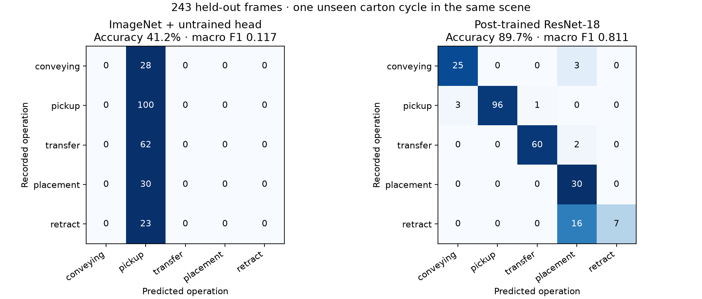

# Antioch post-training validation

Validation on 2026-09-17 uses the authentic native warehouse recording described
in [the warehouse evidence](antioch-warehouse.md), with the branch updated to
Workbench main `fa9b7590688af2f047a1309c47c235fedfacb1db`.
The [run guide](../workbench/antioch-posttrain.md) defines the source and output
contracts for the [three-stage workflow](../../workflows/testing/antioch-posttrain.yaml).

## Data and runtime prerequisites

- Native video: 4,313 decoded 1280×720 frames at 30 fps, with actual simulation
  phase, time, and placement count for every frame.
- Physics and image acceptance: 21/21 checks, recomputed from native evidence.
- Dataset: 1,438 sampled RGB frames; 953 training, 242 validation, and 243 test.
  Complete carton cycles 0–3 train, cycle 4 selects the checkpoint, and cycle 5
  is held out. The five operation classes occur in every split.
- Source publication: selected-project bucket ownership and output-prefix
  PUT/GET verified; every source object read back and checked by SHA-256.
- Weights: official ImageNet ResNet-18 V1 checkpoint fetched from PyTorch and
  independently verified as SHA-256
  `f37072fd47e89c5e827621c5baffa7500819f7896bbacec160b1a16c560e07ec`.
- Runtime: existing optional LeRobot 0.6.0 image pinned by its accepted digest;
  anonymous manifest/config inspection confirms its Kubernetes prerequisites.
  All 33 default accepted public release digests also matched anonymously.

## Cloud execution

The standard Workbench submission completed with live-verified `SUCCEEDED` for
all three stages: CPU preparation, GPU training, and held-out evaluation.
Training ran on an NVIDIA RTX PRO 6000 Blackwell Server Edition with PyTorch
2.11.0+cu130 and TorchVision 0.26.0+cu130. All dataset, checkpoint, and report
objects were independently downloaded from Nebius S3 and verified by SHA-256.
Dataset provenance matches the exact native video and source manifest.

| Held-out result | Initial ImageNet backbone + untrained head | Post-trained model |
| --- | --- | --- |
| Frames | 243 | 243 |
| Correct predictions | 100 | 218 |
| Accuracy | 41.1523% | 89.7119% |
| Macro F1 | 0.116618 | 0.811093 |

The majority-class predictor also scores 41.1523% accuracy. Both quality checks
pass. Validation selected epoch 6 of 20, with 92.1488% validation accuracy and
0.874016 macro F1. The 44,784,587-byte checkpoint is SHA-256
`5327547f7852f9cd3e73b302838bf79f8dfc174041f20f79791085bc23de749f`.
Backbone parameter hashes differ before and after training. Reloading the saved
weights on an independent CPU host with PyTorch 2.12.1 reproduces **every** cloud
prediction and metric for both checkpoints.

Retract remains the weakest operation: 7/23 test frames are correct, with 16
confused for placement. The [machine-readable evidence](assets/antioch-posttrain-evidence.json)
retains the complete confusion matrices, per-class F1, every held-out prediction,
all 20 training epochs, source lineage, artifact hashes, and implementation hashes.

The experiment updates the full pretrained ResNet-18 backbone for 20 epochs,
selects by validation macro F1, and compares against the initial ImageNet backbone
with the same seeded, untrained five-class head. It also requires held-out
accuracy to exceed the majority-class predictor. Test data never selects a
checkpoint. This is within-scene visual state recognition; it does not establish
robot control or generalization to another scene, camera, or real warehouse.

## Recovery evidence

The first cloud attempt failed in worker bootstrap before preparing data. Its
default LeRobot image was replaced by the already published 0.6.0 digest with
Kubernetes prerequisites. The retry then stopped before launching because source
staging changed the saved source URI in the configuration bound to the old API.
The original configuration was restored byte-for-byte against the recorded hash.
Cancellation, controller removal, and API shutdown were verified before using
fresh API state. A task-private teardown journal avoids a shared journal's
conflicting context alias; provider and controller ownership checks remain active.

No scheduler ownership or credential guard was changed. Exact identities,
locations, commands, source manifests, raw logs, and cleanup receipts remain in
private operator evidence.

After the successful run, cancellation verified the terminal state without
issuing a cloud cancellation. Standard controller cleanup verified remote
absence, and independent Kubernetes readback found no task-owned worker or
controller pods/services. The owned API was then stopped. S3 data, checkpoints,
and evaluation artifacts are retained.

## Repository checks

| Check | Result |
| --- | --- |
| Data integrity, split isolation, native model, quality failure, runtime pin | 22 passed |
| Tool argv, catalog reachability, live matrix, catalog documentation | 198 passed |
| Harness guardrails | 3,667 passed |
| Linux security regressions with official CPU PyTorch 2.13.0 | 783 passed |
| Onboarding smoke | 114 passed |
| Ruff and whitespace checks | Passed |

The full suites were attempted and did **not** pass as a whole. The Linux run
reported 21,886 passed, 229 failed, 515 errors, 172 skipped, and one xpassed.
Restoring Git metadata and removing group-write permissions from the isolated
source fixed 732 of the 744 failed/error cases. All 12 remaining failures also
reproduced on clean main. Moving temporary fixtures outside Git and installing
the optional ONNX exporter dependencies then produced 77 passes and one failure
in the affected fleet/SONIC modules. The remaining SONIC S3 export failure also
reproduces on clean main with the same dependencies. The scanner scheduling
timing test passed on an isolated rerun.

The macOS full-suite attempt reported 22,217 passed, 198 failed, 161 errors,
226 skipped, and one xpassed; Linux-specific process checks were subsequently
exercised by the passing Linux security gate. These are retained failed suite
attempts and focused reruns, not a claim that the full suite or CI is green.
