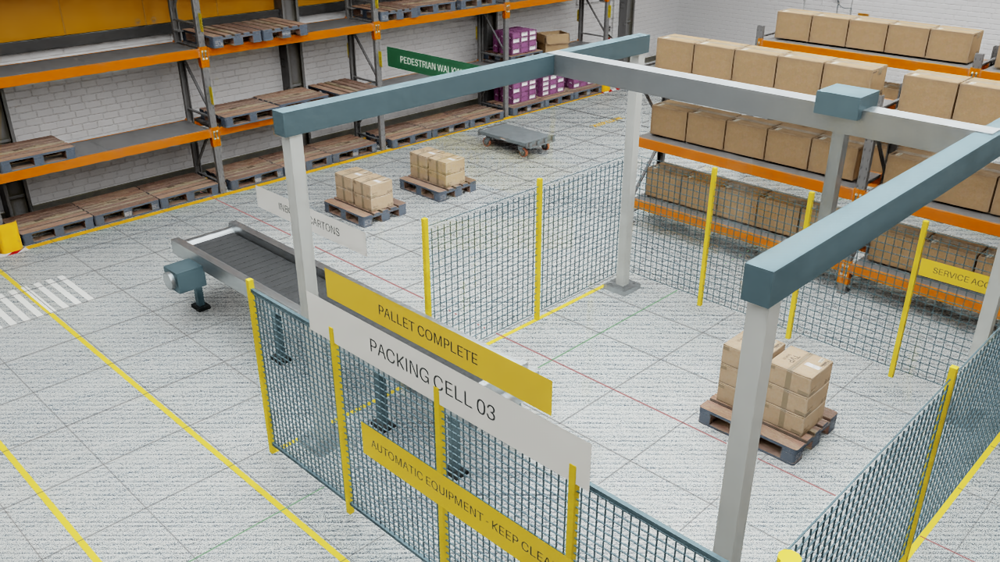

# Antioch warehouse validation

This ports the current local Antioch fulfillment warehouse into
[`workflows/testing/antioch-warehouse.yaml`](../../workflows/testing/antioch-warehouse.yaml).
The isolated checkout started at Workbench `070e2a5fa`. Validation took place on
2026-09-17 UTC. The [run guide](../workbench/antioch-warehouse.md) explains the
GPU, source overlay, runtime assets, and S3 handoff.

## Native execution: passed

The exact committed package source ran through its `simulate` entrypoint in the
existing Antioch development service, using native Isaac Sim 6.0.1 and an RTX PRO
6000 Blackwell Server Edition. It completed one batch, saved all three PNGs and
measurements, and passed all 21 checks. After downloading the artifacts, the CPU
`verify` entrypoint independently reproduced the complete verification report.
The source SHA-256 inventory matches this checkout byte for byte.

| Measurement | Observed | Required |
| --- | --- | --- |
| Physics | PhysX, 120 Hz | PhysX, 120 Hz |
| Scene | 4,745 prims; eight rigid bodies | More than 4,000 prims; eight rigid bodies |
| Completed placements | Six distinct cartons, one batch | Six distinct cartons, one batch |
| Maximum placement error | 0.001031 m | Less than 0.02 m |
| Maximum settled speed | 0.008624 m/s | Less than 0.04 m/s |
| Maximum attachment error | 0.007501 m | Less than 0.04 m |
| Measured conveyor displacement | 4.853047 m | More than 3.5 m |
| Simulation duration | 143.733341 s | Complete batch; no duration gate |
| Images | Three decoded 1280×720 PNGs | Nonblank, bounded exposure |
| Verification | 21/21; independent report identical | Every check passes |

The [machine-readable evidence](assets/antioch-warehouse-evidence.json) retains
measurements, source hashes, all six raw artifact hashes, decoded pixel statistics,
and individual check outcomes. The image below is an unchanged render from that
run; its SHA-256 is in the evidence report.



This demonstrates scripted gantry control and ideal fixed-joint attachment with
measured dynamic carton behavior. It does not demonstrate learned control,
physical suction, robot IK, or certified safety. See the recorded fidelity fields.

## Workbench submission: incomplete

The standard submit path passed project/cluster ownership, object-storage
read/write, source staging, image pullability/bootstrap checks, and RTX GPU
discovery. It submitted the two-stage managed job. That initial job was cancelled
through the normal workflow command after the parallel native test identified a
capture race in its source revision.

The corrected source was restaged, but resubmission stopped before launch at the
existing isolated SkyPilot API credential-consistency check. Stopping the owned
local API did not resolve the recorded-identity mismatch. No completed Workbench
GPU-to-S3-to-CPU run is claimed. The readiness record keeps `target_runtime`
unverified even though native simulation and CPU verification passed.

Cancellation converged for the submitted job. Standard controller cleanup refused
an existing context-alias identity conflict, so the task-created controller pod
and its two services were removed only after matching their creation record and
live UIDs. Exact-label absence was confirmed. Other controllers and the original
Antioch development session were retained.

The Mac submit path also stopped before launch because existing SkyPilot API
process inspection requires Linux `/proc`. Submission was therefore tested from
an isolated Linux checkout. These orchestration files are outside this PR's scope.

## Bugs found by live execution

- Viewport capture completion precedes completion of the asynchronous PNG writer.
  The port now drains the renderer's capture queue before reading or publishing
  each image. A repeated native batch produced all three complete images.
- Kit's automatic fast shutdown can replace an unhandled exception with exit 0.
  The module entrypoint now prints and flushes the exception, then terminates
  with exit 1. A subprocess regression registers a simulated successful native
  shutdown and proves that a workload exception still exits nonzero.
- Final telemetry now records all six placements without introducing duplicate
  timestamps. Runtime exceptions preserve available artifacts before propagating.

## Repository checks

| Check | Result |
| --- | --- |
| Warehouse evidence, failure boundaries, routing, and process exit | 22 passed |
| Tool argv, catalog reachability, catalog documentation | 148 passed |
| Live-submit matrix contract | 42 passed |
| Harness guardrails | 3,540 passed before the additional skill smoke registration |
| Documentation checks | 597 passed; final docs and skill checks: 729 passed |
| Onboarding smoke | 114 passed |
| Isaac EULA/bootstrap and three-tier contracts | 147 passed |
| Linux security regressions with pinned CPU PyTorch | 738 passed |
| Repository Ruff lint | Passed |

The evidence unit tests use explicitly synthetic measurements to exercise the
acceptance oracle. The native run above supplies the physical execution evidence.
The live-submit matrix registers real GPU execution, without a plan-only exemption.

The full suites were attempted and did **not** pass as a whole. On macOS,
21,177 passed, 195 failed, 63 errored, 235 skipped, and one xpassed. A clean-base
comparison reproduced 257 of the 258 failure/error test IDs; the remaining relay
timing test passed on immediate isolated rerun. On Linux, 21,201 passed, 181 failed,
49 errored, 177 skipped, and one xpassed. Failures included restrictive scanner
fixtures rejecting group-writable checkout files, fixture paths under a Git
ancestor, and missing PyTorch. These results are retained as failed suite runs;
targeted passes do not imply a green full-suite or CI coverage result.

After normalizing the isolated Linux checkout permissions, using a private test
umask and a temporary directory outside Git, and installing the CI-pinned CPU
PyTorch 2.13.0 wheel, all 538 tests in the previously failing modules passed.
The complete security regression command then passed all 738 tests without skips.
These were focused reruns after repairing the test environment, not another full
suite invocation.

Reproduce the focused package and workflow checks with:

```bash
npa/.venv/bin/python -m pytest npa/tests/workflows/test_antioch_warehouse.py -q
npa/.venv/bin/python -m pytest npa/tests/guardrails/test_skills_index.py -q
npa workbench workflow validate-spec workflows/testing/antioch-warehouse.yaml
npa workbench workflow plan-spec workflows/testing/antioch-warehouse.yaml --run-id preview
```

Exact operational logs and raw run artifacts remain in private evidence. Public
reports contain only measurements, hashes, validation outcomes, and generic
reproduction commands; they omit cloud identities, credentials, and private URIs.
