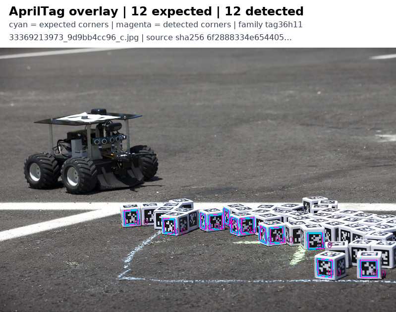

# AprilTag: fresh image and observed cloud execution

**PASS for the documented CPU fiducial-detection capability.** Exact source `d0057c80bd19563c2484bd793d9f8ef0a443ce4f` and image `7bb4606386f4487eeeb6953ee5843a1e4698a485eac4cde3cbdd7f3a69d6612e` completed a fresh supported SkyPilot job. The observer captured the actual workload Pod, image identity, CPU requests and post-bootstrap runtime inventory. All 24 output objects were downloaded and independently rehashed.

[Second photograph](annotations/34085369442_304b6bafd9_c_detections.png) · [Third photograph](annotations/34139872896_defdb2f8d9_c_detections.png) · [Measurements](measurements.json) · [Consumer observations](fiducial_observations.json) · [Image qualification](image-qualification.json)

| Check | Observed result |
| --- | --- |
| Actual detector | 47/47 upstream detections across three photographs; zero false positives or misses |
| Independent numeric review | All 376 corner-coordinate differences recomputed from the exported observations and exact upstream records; RMSE 0.0000273889 pixels |
| Negative controls | Blank and fixed-seed noise: zero detections; input pixels independently verified |
| Native validation | All three upstream CTest cases passed |
| Full source suite | 25,549 passed, 155 skipped, one non-strict xpass; eleven local gates and native security passed |
| Hosted CI | All 22 checks completed: 20 success, two expected skips; required Actions checks verified on this exact head |
| Complete image bytes | 75,051 records accounted for; zero private literal matches and zero unresolved findings after exact-byte review |
| Actual cleanup | Task Pod, controller Pod, two Services and owned pull Secret absent in five exact reads; complete metadata lists checked, four foreign controller UIDs preserved |

The tiny numeric residual measures parity with four-decimal upstream regression records. It is not a detector localization-accuracy estimate. This three-image population does not establish generalization, calibrated camera pose or robot safety. GPU testing does not apply to the CPU detector.

The complete fresh overlay pixels match the prior qualified Kimi-K3 review inputs. [Visual applicability](visual-applicability.json) binds each image hash and exact pixel comparison; [actual prior inputs and responses](https://github.com/nebius/nebius-physical-ai/blob/e5f4210090dac2d1a1880bdffdc33a9e042c102b/docs/testing/evidence/apriltag-kimi-k3-production-census/README.md) retain scores of 0.95 for all three. No new VLM call is claimed. Prior calibration overlap and input-resolution limits remain disclosed; visual review concerns presentation.

The rebuild removes unused Windows signing material while preserving CTest, and inherits fresh-instance SSH host-key generation. Original failed images and scanner/harness attempts remain retained. Native scan findings are disclosed in the image report, including the original raw false verdict; exact-file review resolved them without hiding raw findings. This proof does not publish the private image. Seven storage-client dependencies were added by the observed bootstrap; the detector, NumPy/Pillow versions and native command bytes stayed unchanged.

The read-only inventory capture was an explicitly recorded diagnostic hook before the unchanged shipped functional command. Infrastructure selectors, credentials and raw cloud logs remain private. JSON execution fields here omit the private registry reference; original artifact hashes are retained separately. See [attribution and media terms](ATTRIBUTION.md) and [SHA-256 inventory](SHA256SUMS).
