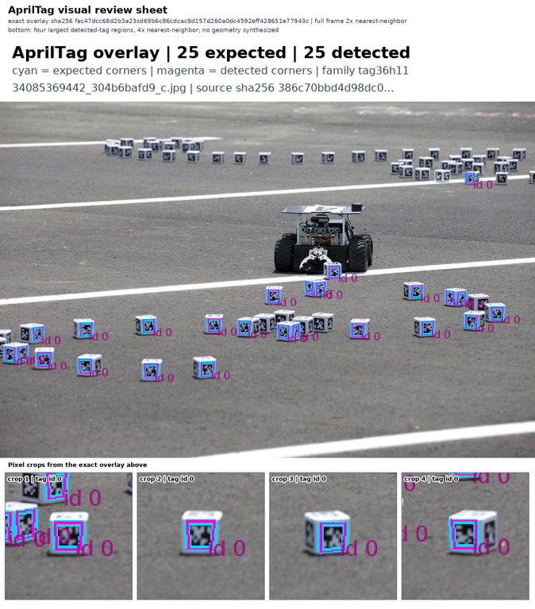
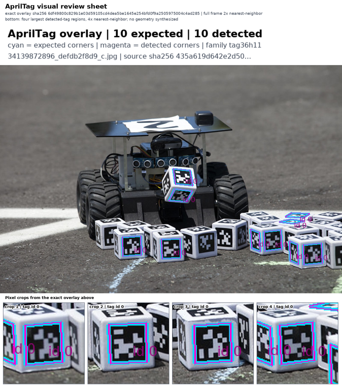

# AprilTag production review with Kimi-K3

All three predeclared production review sheets passed at score **0.95**. This pack contains the original review sheets, the exact smaller PNGs sent to the model, the visible model answers, task/rubric text, attribution, and cryptographic hashes.

## Outcome

The exact Kimi-K3 evaluator source commit `a26a868e3bed68d48eb6fd91638e1e1d3d048474` passed four disclosed controls and a separately committed four-case holdout before this exhaustive production-output census ran. All three production sheets passed at score `0.95`. Two census image byte sets overlap disclosed calibration inputs: `33369213973_9d9bb4cc96_c` repeats the exact disclosed request, while `34139872896_defdb2f8d9_c` reuses only the input-image bytes under a different task. The census is not an independent held-out set or an error-rate estimate.

| Case | Expected/detected | Score | Result |
| --- | ---: | ---: | --- |
| `33369213973_9d9bb4cc96_c` | 12 / 12 | 0.95 | PASS |
| `34085369442_304b6bafd9_c` | 25 / 25 | 0.95 | PASS |
| `34139872896_defdb2f8d9_c` | 10 / 10 | 0.95 | PASS |

## Hardware and evidence applicability

| Gate | Applicability | Result |
| --- | --- | --- |
| Detector workload | CPU required | PASS: real CPU Kubernetes/SkyPilot workload; complete three-image/47-label upstream regression population |
| Local GPU | Not applicable | No local model or detector GPU path was used |
| Hosted visual model | Required for presentation review | PASS: exact `moonshotai/Kimi-K3`, HTTP 200, `finish_reason=stop`, strict JSON, exact model identity |
| Disclosed controls | Required | PASS: positive 0.95; shifted 0.20; blank 0.05; mismatched source 0.25 |
| Independent holdout | Required before census | PASS: four committed cases met all frozen labels and score bounds |
| Production census | Required | PASS: all three sheets at 0.95, exact 3/3/3 calls/responses, no within-phase replay |
| Independent retained-byte review | Required | PASS: raw/parsed/hash chains and pixel-review agreement accepted |

## Evidence boundaries

The detector's objective result remains the CPU workload's exact parity with 47 upstream-recorded IDs/corners and 0 FP/FN on three pinned images. The roughly `2.74e-5 px` residual is four-decimal reference quantization, not localization accuracy. The vision model judges only visible overlay presentation and reviewability. It does not establish corner accuracy, camera pose, navigation success, physical correctness, robot safety, or generalization beyond these small frozen populations.

The [four disclosed controls are published separately](https://github.com/nebius/nebius-physical-ai/blob/4c017e2db23b270e2ef114b698f43dc9cd98b716/docs/testing/evidence/kimi-k3-disclosed-controls-a26a868e/README.md). The independently committed holdout remains access-controlled; this pack includes only its aggregate transition result, not holdout pixels, labels, prompts, or raw answers.

See `ATTRIBUTION.md` for NASA/Kim Shiflett source credits, CC BY-SA 2.0 links, modifications, and share-alike terms.

## Exact model inputs and answers

The product converts each original 1598×1822 sheet to RGB and applies a 768×768 bounding thumbnail, yielding the actual **674×768** submitted PNG. The files below were extracted directly from the retained request data URLs without re-encoding. Original sheet hashes and submitted-image hashes are distinct and both recorded in [manifest.json](manifest.json). The [exact visible task and rubric text](model-inputs.json) accompany each case.

### 33369213973_9d9bb4cc96_c

[Original larger sheet](33369213973_9d9bb4cc96_c_review.png) · [Visible answer](33369213973_9d9bb4cc96_c_visible-answer.json)

### 34085369442_304b6bafd9_c

[Original larger sheet](34085369442_304b6bafd9_c_review.png) · [Visible answer](34085369442_304b6bafd9_c_visible-answer.json)

### 34139872896_defdb2f8d9_c

[Original larger sheet](34139872896_defdb2f8d9_c_review.png) · [Visible answer](34139872896_defdb2f8d9_c_visible-answer.json)

Root independently verified 24 retained file hashes, the three frozen request bodies, exact returned model, HTTP status, finish reason, visible scores/rationales and cumulative send counts. These checks made no provider call and added no semantic rescore. See [independent-audit.json](independent-audit.json) and [SHA256SUMS](SHA256SUMS).
