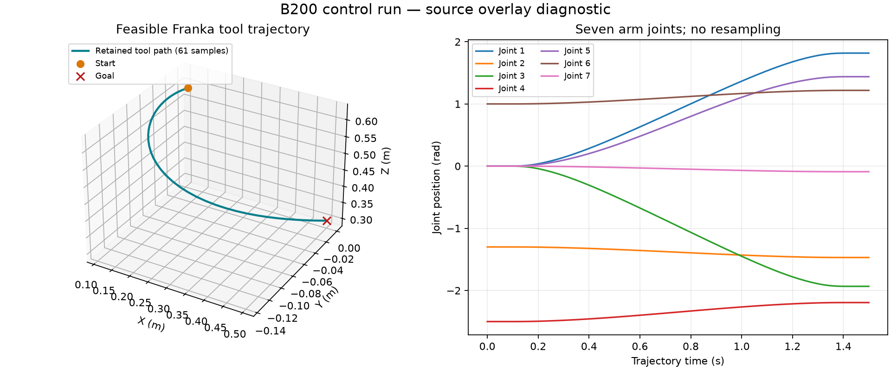

# cuRobo B200 control evidence

The feasible Franka goal produced a trajectory. The deliberately blocked goal failed without a trajectory, and the malformed robot input was rejected without output. The stock check and explicit controls passed on a real NVIDIA B200 (compute capability 10.0). All 25 retained object sizes and hashes were independently checked.

**Scope:** this used the immutable predecessor container plus reviewed source overlay `d738db0dc0053b4abff48c5b7d6bfd00b8c76f97`. It is diagnostic evidence, not acceptance of the final rebuilt container. The complete 5,200-row benchmark, RTX coverage, dynamics coverage and visual assessment remain separate gates. No collision certification or physical robot execution is claimed.

The plot comes directly from the [exact retained trajectory data](problems.jsonl), with 61 samples over 1.5 seconds and no smoothing or interpolation. [Inputs](controls.json), [malformed input](malformed.json), [result](result.json), [validation](validation.json), [control acceptance](control-acceptance.json), [decoded Rerun inspection](rrd-inspection.json), and [provenance](provenance.json) are downloadable alongside [SHA-256 hashes](SHA256SUMS).

| Control or measurement | Observed result |
| --- | --- |
| Feasible goal | Success; one trajectory |
| Blocked goal | Failed as expected; no trajectory |
| Malformed robot | Rejected; no output |
| Independent FK position replay error | 0 m |
| Independent quaternion replay error | 0 rad, unchanged 0.00001 rad gate |
| Terminal goal position error | 0.000000142774 m |
| Terminal goal orientation error | 0.000000162269 rad |
| Recomputed joint path length | 3.049696223690777 rad |
| Rerun semantic decode | 61 trajectory samples; two goal/status entities; zero chunk mismatches |

The original Rerun recording contains an operational identifier and is retained privately. Its unchanged SHA-256 is recorded in the decoded inspection. The JSON summaries omit only that identifier; the trajectory and input files retain their exact bytes. This plot is a data visualization, not a screenshot of the native viewer or a VLM assessment.

Earlier failed attempts remain in the private audit: two numeric defects were fixed without loosening thresholds; the first two attempts with this overlay then exposed a stale result parser and inherited CLI configuration in the qualification harness. Neither failed attempt is counted as a pass. A subsequent full benchmark reached the B200 but failed at the separate Pinocchio import because the container lacks `libgomp.so.1`; an exact-image CPU reproduction confirmed that dependency defect. No full-benchmark pass is claimed.
