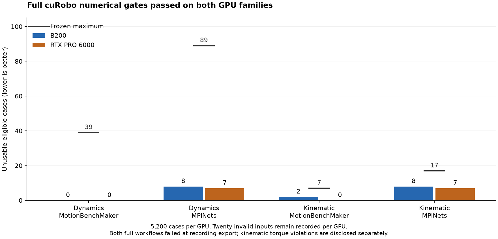

# cuRobo: full benchmark results on B200 and RTX PRO 6000

Both 5,200-case numerical matrices passed their frozen acceptance gates. **Both full workflows failed at Rerun recording export. PR [#625](https://github.com/nebius/nebius-physical-ai/pull/625) remains draft.**

[Download the full aggregate report](report.json) · [Verify file hashes](SHA256SUMS)

| Result | B200 | RTX PRO 6000 |
|---|---:|---:|
| Cases recorded | 5,200 | 5,200 |
| Planner successes | 5,162 | 5,166 |
| Planner failures | 18 | 14 |
| Invalid inputs, retained | 20 | 20 |
| Successful trajectories independently replayed | 5,162 | 5,166 |
| Dynamics successes exceeding torque limits | 0 | 0 |
| Kinematic successes exceeding torque limits | 52 | 52 |
| Maximum terminal position error | 4.927 mm | 4.927 mm |
| Maximum terminal orientation error | 0.02393 rad | 0.02906 rad |
| Durable objects / bytes, all hashes verified | 29 / 540,277,610 | 28 / 540,495,287 |
| Numerical validation | Pass | Pass |
| Complete workflow | Failed: recording export | Failed: recording export |

The full matrix covers 800 MotionBenchMaker and 1,800 MPINets inputs in each of kinematic and dynamics modes. Every failure and invalid input remains in the retained journal. Ten invalid inputs per mode are excluded from the eligible-case denominator; they are not counted as successes. The report includes each dataset/mode cell and all retained aggregate trajectory metrics.

The dynamics check inspected all 2,582 B200 and 2,583 RTX successful dynamics rows: 3 kg attached mass, seven named active arm joints, and seven-wide trajectories and torques. It found no malformed rows or dynamics torque-limit violations. Kinematic mode does not constrain torque: its 52 violations on each GPU comprise 42 MotionBenchMaker and 10 MPINets successes. Its passing acceptance gate does not erase those violations.

Independent forward-kinematics and inverse-dynamics replay reproduced the recorded values with zero maximum discrepancy. That measures agreement with the stored calculation, **not zero distance to the requested goal**. The largest actual endpoint error was 4.927 mm. The benchmarks use upstream relaxed joint limits (+/-0.2 rad), OBB scene conversion and optimizer settings. Energy is an inverse-dynamics proxy. These results do not independently certify collision freedom or authorize robot execution.

Both runs used immutable image index `c85e8718c9645cc70fddc0e20ea66edd317448a8c50c0444bbcc85384db07550`, produced from NPA source `49fed65d0d1a315ce08addab533c56c48180d419`. PR head `662f04c3a98e395f4f0f37a19475806a553ffe06` changes only formatting; independent AST/build/workflow comparisons bind it to that implementation. The full local suite at the producer source passed 24,237 tests, with zero failures/errors, 154 skips and one non-strict xpass. Current-commit hosted CI and final image acceptance remain separate gates.

Prepare, benchmark and validation completed on both GPUs. Rerun rejected the generated recording. A CPU reproduction on the retained B200 journal identified `TooManyTables` in the Arrow IPC footer; the original failed workflows remain failed. Cursor is repairing the export and must verify the retained data without dropping cases or samples. No VLM quality pass or accepted full-matrix RRD is claimed here. The complete image-byte policy is also still pending.

An independent consumer downloaded and hashed every durable object, parsed every journal row and checked the validation contracts. Root crosschecked the eight retained receipts/results, their hashes and all count totals. This public pack exposes selected aggregate fields and original artifact hashes; the raw journals and operational metadata remain private. The chart is a plot of those measurements, not a rendered robot demonstration.

Earlier [failed matrices](../curobo-full-matrix-failures-b3876436/README.md) remain failures. Separate [B200 controls](../curobo-b200-controls-49fed65d/README.md) and [RTX controls](../curobo-rtx-controls-49fed65d/README.md) document positive and negative cases on the repaired image.
