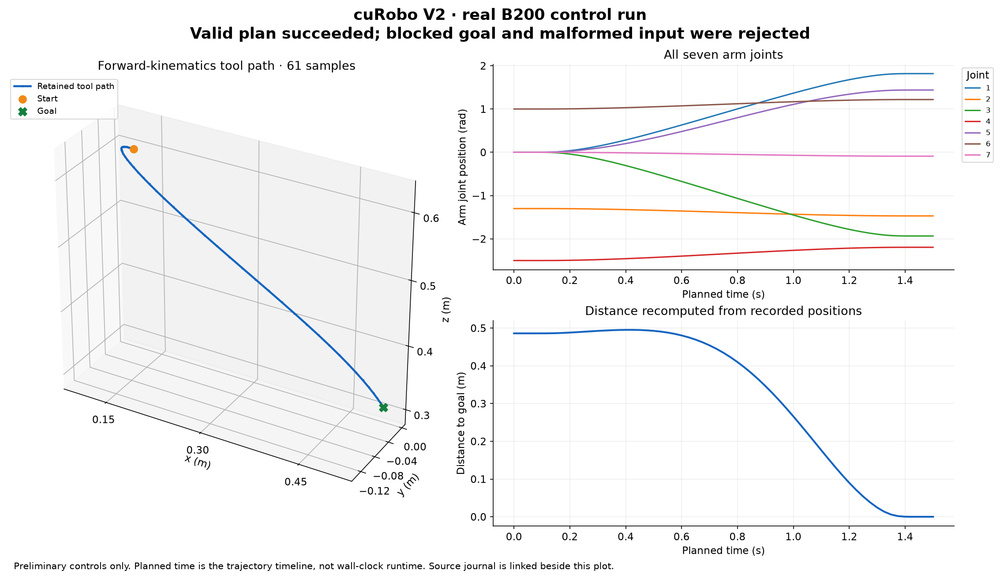

# cuRobo V2: rebuilt-image RTX PRO 6000 controls

**The exact rebuilt image passed these preliminary controls without manual package repair. Full benchmark and final image acceptance remain separate gates.**

[Unchanged RTX journal](problems.jsonl) · [Numeric report](report.json) · [SHA-256 manifest](SHA256SUMS)

The plot above is from the **B200** run. Root independently compared both retained journals: problem identities, outcomes and all trajectory arrays are exactly equal. The full journals differ in runtime measurements; the RTX journal is linked separately.

| Control or measurement | RTX result |
| --- | --- |
| Hardware | RTX PRO 6000 Blackwell Server Edition; compute capability 12.0 |
| Feasible plan | Succeeded; 61 samples and nine joint columns |
| Blocked goal | Failed as expected |
| Malformed input | Rejected without outputs |
| Independent FK replay difference | 0 m |
| Recomputed endpoint distance | 1.4277366110e-7 m |
| Recomputed tool path length | 0.6550320881 m |
| RRD semantic verification | Passed; all 61 samples |
| Durable readback | 25 objects, 970,301 bytes; every hash matched |
| Manual apt/dpkg/pip intervention | None |

The first attempt requested seven CPUs and failed scheduling prechecks before allocation. The successful attempt used a new identity and a five-CPU reservation, with the same image and workload. The failed precheck is retained separately.

Image source `49fed65d0d1a315ce08addab533c56c48180d419` includes the missing SkyPilot bootstrap packages and named active-joint dynamics repair. PR [#625](https://github.com/nebius/nebius-physical-ai/pull/625) head `662f04c3a98e395f4f0f37a19475806a553ffe06` is an independently verified AST-equivalent formatting successor. This run used immutable image `sha256:c85e8718c9645cc70fddc0e20ea66edd317448a8c50c0444bbcc85384db07550` with no source overlay.

Actual runtime observations confirm a seven-coordinate Pinocchio model, seven named active arm joints and torque limits, and nine-column retained trajectories including fingers. These establish the repair's dimensional premise; these kinematic controls do not establish a completed inverse-dynamics benchmark.

Root independently verified all 25 downloaded artifacts against the retained readback manifest and recomputed the plotted quantities from the unchanged journal. It issued no additional object-store query. The original RRD and operational metadata remain private. The earlier image's manual-bootstrap diagnostic and failed full matrices remain separate historical evidence.

The complete 5,200-row benchmark on each GPU family, final image-byte and lifecycle acceptance, and current hosted CI remain required. These controls do not estimate benchmark success, certify collision freedom or robot safety, or establish a VLM quality result. No public image promotion is claimed.
