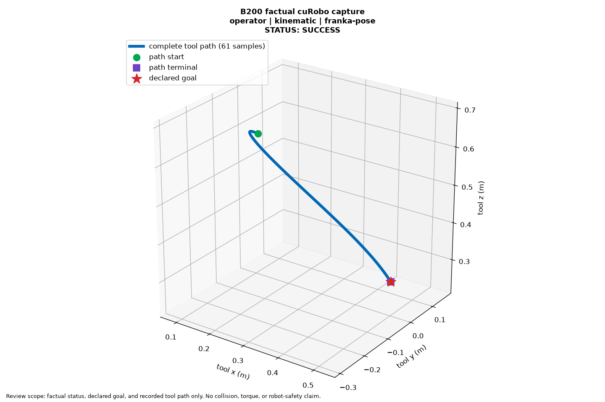
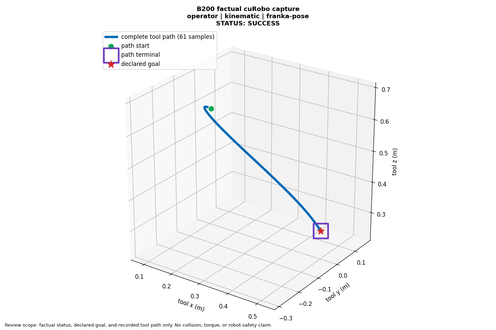

# cuRobo proof: visible trajectory endpoints

All **12 selected run captures** passed the frozen visible-evidence review after correcting an obscured end marker. The judge also correctly classified **8 calibration cases** and **4 retained holdout cases**, including seven negative controls. This checks readable identities, run status, complete path labels and visible start/end/goal markers. It does not establish collision freedom, policy skill, torque validity or robot safety.

The goal star partly covered the former small terminal square. The new hollow square surrounds the exact recorded endpoint while keeping the independently positioned goal star visible. Every recorded path coordinate, goal, case order, camera direction and axis rule is unchanged.

| Before | Corrected |
| --- | --- |
|  |  |

## Actual review

The judge was `moonshotai/Kimi-K3`, temperature 0, strict JSON schema and unchanged threshold 0.9. All 24 accepted calls returned HTTP 200, the requested model, `finish_reason=stop`, valid structured responses and consistent scores. Their actual usage was **86,885 tokens**. [Read every visible answer and call measurement](reviews.json), [the exact prompt](PROMPT-TEMPLATE.txt), [schema](response-schema.json), [validator](validator.py), and [measured provenance](measurements.json).

| Phase | Correct | Actual tokens |
| --- | ---: | ---: |
| Calibration | 8/8 | 26,267 |
| Retained holdout | 4/4 | 15,722 |
| Selected captures | 12/12 | 44,896 |

Holdout case identities were reused from earlier trials; their two positive plots were redrawn and their two negative image files were unchanged. Three final captures overlap calibration. These are disclosed presentation checks, not an estimate of unseen-scene generalization. The dynamics cell with no observed failure retains its explicitly labeled last-success fallback.

## Open the run captures

| Capture | Recorded planner status | Presentation score |
| --- | --- | ---: |
| [b200-golden-feasible](b200-golden-feasible-v4.png) | success | 1.0 |
| [b200-golden-blocked](b200-golden-blocked-v4.png) | failed | 1.0 |
| [rtx_pro_6000-golden-feasible](rtx_pro_6000-golden-feasible-v4.png) | success | 1.0 |
| [rtx_pro_6000-golden-blocked](rtx_pro_6000-golden-blocked-v4.png) | failed | 1.0 |
| [b200-motion-benchmaker-kinematic-success](b200-motion-benchmaker-kinematic-success-v4.png) | success | 1.0 |
| [b200-motion-benchmaker-kinematic-failed](b200-motion-benchmaker-kinematic-failed-v4.png) | failed | 1.0 |
| [b200-motion-benchmaker-dynamics-success](b200-motion-benchmaker-dynamics-success-v4.png) | success | 1.0 |
| [b200-motion-benchmaker-dynamics-last-success-no-failure-observed](b200-motion-benchmaker-dynamics-last-success-no-failure-observed-v4.png) | success | 1.0 |
| [b200-mpinets-kinematic-success](b200-mpinets-kinematic-success-v4.png) | success | 1.0 |
| [b200-mpinets-kinematic-failed](b200-mpinets-kinematic-failed-v4.png) | failed | 1.0 |
| [b200-mpinets-dynamics-success](b200-mpinets-dynamics-success-v4.png) | success | 1.0 |
| [b200-mpinets-dynamics-failed](b200-mpinets-dynamics-failed-v4.png) | failed | 1.0 |

A truthful failed planning result can pass the presentation review: it must show the declared goal, correct failed status and explicit absence of a trajectory.

## Failed trials remain failed

The original 60 calls used 56,535 tokens without qualifying a judge. A first Kimi trial passed 8 calibration and 4 retained holdout cases, then its first final response used the provider default 8,192 completion tokens without returning content (13 calls, 57,624 tokens total). A new frozen trial raised the output allowance to 131,072 and exposed the obscured endpoint in calibration (8 calls, 33,717 tokens); it stopped before holdout/final review. The corrected-marker trial above passed. Across all trials: **105 calls, 234,761 actual tokens**. Earlier failures were not relabeled or discarded. Authoritative provider cost was unavailable and is recorded as null.

## GPU results and source scope

[Full B200 and RTX PRO 6000 benchmark results](../curobo-full-matrices-49fed65d/README.md) contain 5,200 cases per GPU, retained failures, numerical replay and torque-limit details. [Interactive recordings and browser proof](../curobo-recorded-paths-0b0accdd/README.md) retain the original recording bytes. [Complete image-byte review](../curobo-complete-byte-0b0accdd/README.md) records the separate content adjudication.

The numerical producer is `49fed65d0d1a315ce08addab533c56c48180d419`; recording-image producer is `0b0accdd35406189a82bc3e2595ea3cfdef04195`. PR head `1558422bed6aad3eba495e907456fa39e483d64a` only fixes test-fixture refresh cleanup; production/image input files are unchanged. This visual pack adds no GPU rerun claim. The private full model responses and infrastructure receipts remain access-controlled; published files contain reviewed plots, visible answers, source hashes and measurements.

The [recorded coordinates](render-data.json) and [plotting script](render_captures.py) reproduce the figures with Matplotlib and NumPy. From a repository environment, run `npa/.venv/bin/python /path/to/render_captures.py`; it writes a new `reproduced` directory. PNG encoding can vary by library version; coordinate and source-row hashes are retained. [SHA256SUMS](SHA256SUMS) verifies this published pack.
