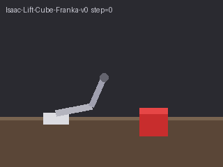
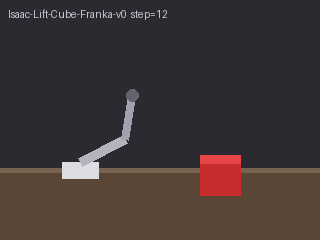
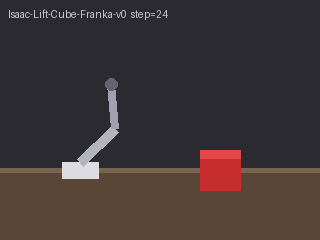
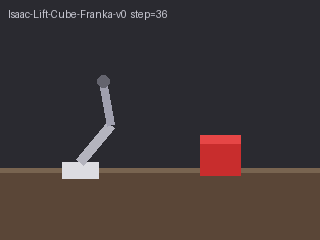
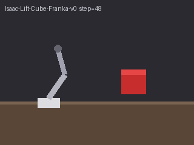

# #829 paired agency observation

This is source-readiness evidence for a narrow illustrative benchmark, not a model-quality, causal-grounding, physical-correctness, robot-policy or safety acceptance.

## Frozen original execution

Execution source: `bc775cbf1ac789384e8be912d6f6598175d6d89c`, tree `764e2a62cb26fc0d8d89dde203dad473f65f87e2`. Three actual hosted model tests passed, zero skips, six original inference responses. Passing tests verify traceability and complete measurement, not favorable model answers. No labels, thresholds, rubrics, prompts or frame selection were tuned after observing responses.

All models received the same six 320×240 stylized diagrams, the fixed default rubric, sequence selection, threshold 0.5, and two fixed claims: cube elevation (positive) versus robot grasp/lift attribution (negative). The selected object rises60 px; its minimum horizontal gap from the arm is50 px and grows. Color-mask proximity can refute this unsupported attribution in these diagrams; proximity alone cannot establish a grasp.

| Original model | Elevation score | Agency score | TP/TN/FP/FN | Balanced accuracy |
|---|---:|---:|---|---:|
| MiniMaxAI/MiniMax-M3 | 1.0 | 0.0 | 1/1/0/0 | 1.0 |
| google/gemma-3-27b-it | 1.0 | 0.0 | 1/1/0/0 | 1.0 |
| moonshotai/Kimi-K3 | 0.9 | 0.7 | 1/0/1/0 | 0.5 |

Kimi accepts the agency claim despite acknowledging no visible grasp/contact. MiniMax's negative rationale wrongly describes the visibly retracting arm as stationary. Gemma invents grasping in the positive explanation and a white-cube interaction in the negative explanation. Numeric agreement does not validate rationale truth. These failures remain retained; no favorable retry is substituted.

[Sanitized decoded scores, counts and source/request/response/frame hashes](original-observations-v2.json) are derived from retained original observations. Exact private operational records are not published. The collector's SHA associations are not provider attestations. The [frame manifest](frame-manifest.json) binds these existing public source PNGs to the normalized submitted PNG and decoded RGB hashes. PNG encodings differ; decoded source pixels were independently verified against the submitted pixels. The existing filename says Isaac; these are stylized stand-ins, not a rendered Isaac workload.

| Frame0 | Frame1 | Frame2 |
|---|---|---|
|  |  |  |
|  |  |  |

## Source and evidence review

An independent Codex lane inspected the scoped source, every original transport/report, all six images in order, decoded source pixels, request/rubric/response hashes, and numeric confusion counts. Its original source review found an exported metrics-constructor regression; the repair preserves the legacy positional and keyword argument sets and leaves newly unmeasured fields null. Generated benchmark metrics remain measured. Native Claude was unavailable after executable/tool and actual gateway-model checks; no proxy alias was represented as Claude, and no AI lane is human approval.

Original hosted evidence keeps its exact execution SHA. Later base integrations and source repairs have separate source-hash/affected-path review and test receipts. No old call is labeled as new-head execution. Current-head CI and current integration state are separate readiness gates.

## Affected sampling interface execution

External #612 landed sampling/source metadata and evidence schema v2. Signed integration source `c5e092d819061d4734d034362449c748e1c1d660`, tree `c62422c89868108d3c8c81da722aba5e49016052`, uses actual selection and frame-limit controls on both ordinary and preselected-frame paths. Current affected tests:277 passed/1 inherited opt-in GPU skip. All six original responses replay offline with the same request objects and decoded scores/labels/rationales/metrics; that replay is zero new inference, not a network packet capture or rewritten original evidence.

For the actually changed sampling path, one new fixed pair used the unchanged public default MiniMax model, identical six frames/tasks/rubric/threshold, and a protocol saved before inference. One metadata test passed with two actual HTTP200/stop responses and correct source indices0–5/count6/sequence/frame-limit6. MiniMax now scored elevation0.0 and agency0.0:TP0/TN1/FP0/FN1, balanced accuracy0.5. Both rationales incorrectly call the visibly rising cube stationary/on the ground; the negative also wrongly calls the retracting arm stationary. The false rejection is retained. This execution verifies the affected interface and illustrates instability, not a replacement favorable quality panel. No model repeats were made for proof serialization, prose, or the dependency-only base advance.

[Sanitized affected-interface observations](sampling-observations.json) retain separate execution source hashes and the actual v2 sampling metadata. Full local gates, final source-head publication, current-head CI and clean integration state remain separate requirements; this evidence publication alone does not mark #829 merge-ready.
