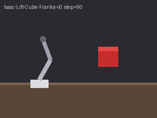

# Frozen agency observations after the grounded-prompt change

Actual execution is `67ee0e9c6a2a33daa83797ffeea82bb9aa2a437b`, not the later documentation/publication head. [Evidence and complete decoded rationales](evidence.json) bind six actual HTTP200/stop responses to the sealed requests, image/source hashes and current canonical writer/whole grade consumer. [Source and local-gate bridge](source-gate-bridge.json) distinguishes every original execution. Raw operational packets remain access-controlled.

The same six synthetic 320×240 drawings were used for both fixed claims: cube elevation is positive; a robot grasp causing the lift is negative. Sampling includes all six frames in sequence, threshold 0.5. Models, labels, prompt, images and threshold were frozen before calls; six actual attempts, no observed retry or favorable-answer replacement.

| Model | Elevation score | Agency score | TP/TN/FP/FN | Balanced accuracy |
| --- | ---: | ---: | --- | ---: |
| MiniMax-M3 | 1.0 | 0.0 | 1/1/0/0 | 1.0 |
| Gemma 3-27B | 0.0 | 0.0 | 0/1/0/1 | 0.5 |
| Kimi-K3 | 0.8 | 0.4 | 1/1/0/0 | 1.0 |

These are two-case observations, not calibrated quality estimates. Gemma's positive false negative is retained. MiniMax wrongly describes a disappearing cube and a stationary arm/cube; Gemma wrongly describes the cube as grounded throughout. Kimi's negative 0.4 agrees with the fixed binary label but conflicts with the actual rubric's zero-on-missing-or-ambiguous-terminal instruction. Typed score/grade validity does not establish semantic rubric compliance. Discrete snapshots do not establish continuous stability or causal grasp, and the stand-ins are not rendered Isaac, a physical robot, whole-episode coverage or safety proof.

All six reviewable [source frames](../../../../npa/src/npa/workbench/vlm_eval/fixtures/isaac_agency_calibration_v1/rollouts/isaac-franka-lift-cube) remain original committed synthetic media. Source PNG, exact transmitted normalized PNG and decoded RGB hashes are separate in evidence.json; 36 transmitted instances refer to six unique images.

Independent Codex AI review accepted exact execution/traceability and inspected all six pixels: 15 CPU replay/grade/hash-negative controls passed, zero new calls. Real first-party Claude Code Opus 5 primary and one focused repair follow-up are bound to their original commits; they are AI reviews, not human approval or Claude pixel inspection. Constructor/file-boundary and incoming-main changes have separate immutable review scopes.

The original [three-model and sampling proof](https://github.com/nebius/nebius-physical-ai/blob/6efa5e3b08b0653082173f4a547d98f1de56e624/docs/testing/evidence/cursor-agency-calibration-20261003/readme.md) remains unchanged, including Kimi's earlier 0.7 false agency acceptance and the later default 0.0 positive false rejection. Multiple prompt factors changed together; these panels do not isolate a causal prompt effect or substitute a favorable run for an earlier failure.

Local full proof remains original `31b`: 39,905 passed, 193 skipped, one XPASS; 77.56% coverage against the unchanged 60% floor. It is not a final-head execution. Exact affected supplements include current 851 passed, 1,174 documentation tests, 270 precheck tests and six original-response CPU replays; no new full or model calls merely for ancestry/prose. Required actual published-head CI, current integration, signatures, anonymous proof and sole-coordinator protected queue remain separate final gates. All failed executions keep their original identities.
