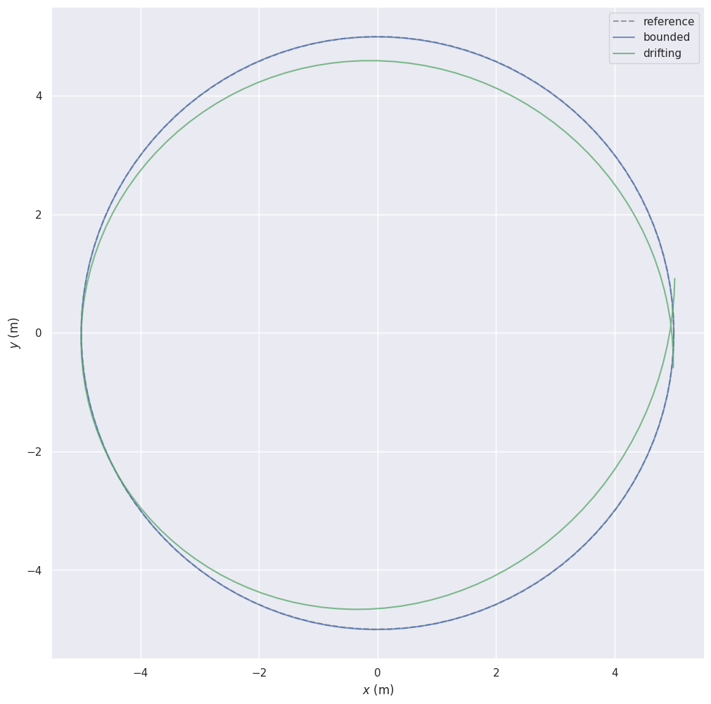
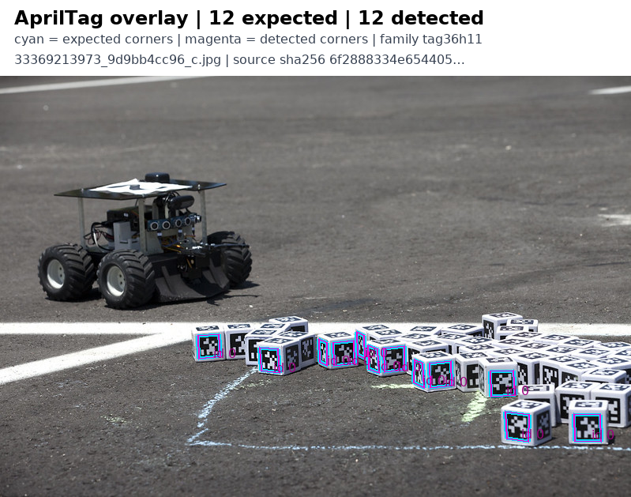
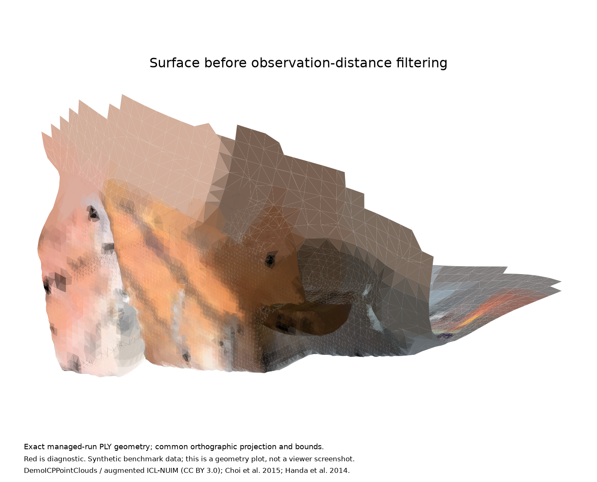
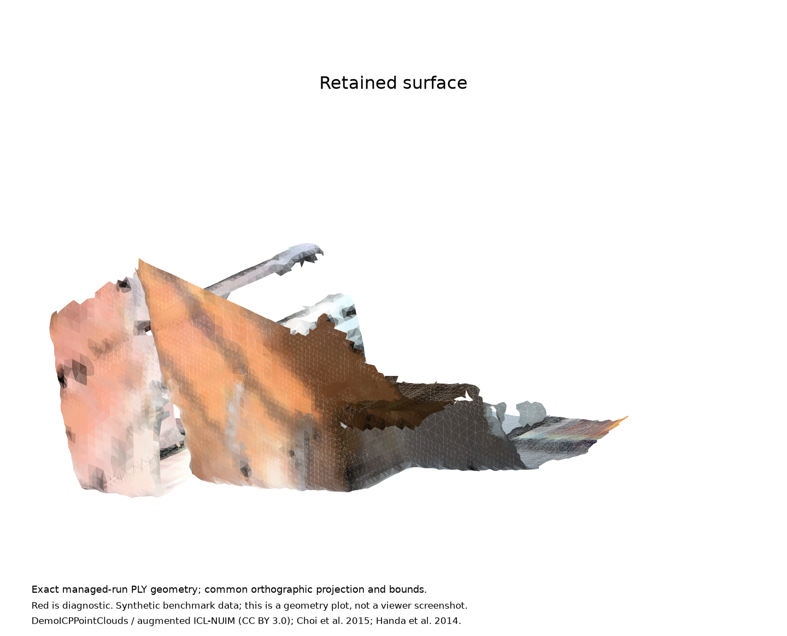
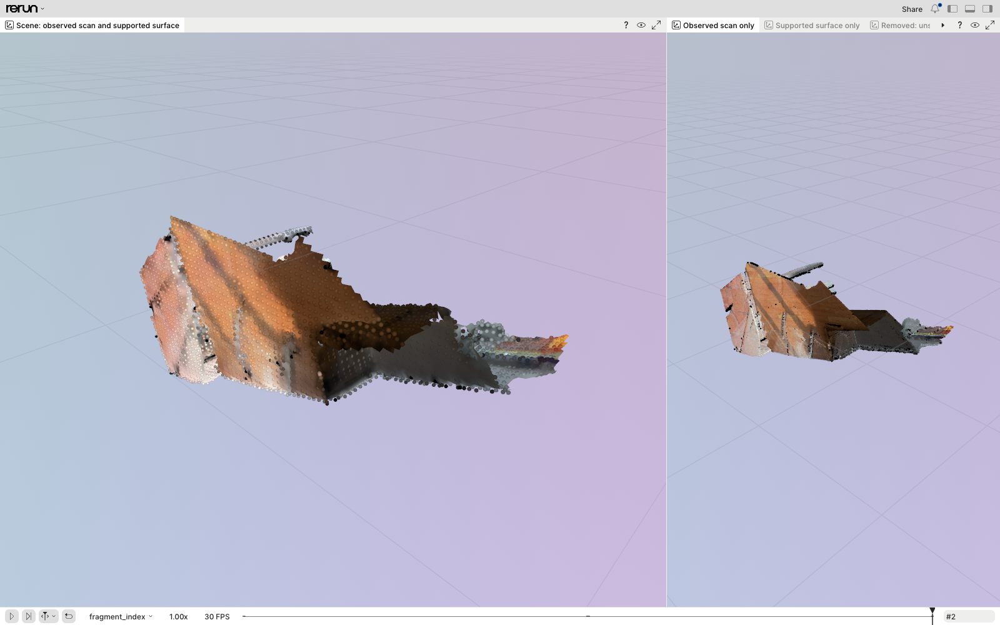
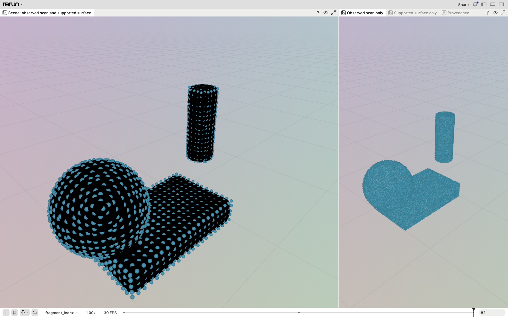

# Cursor batch eight: merge and runtime evidence

Prepared without Cursor. This package records source validation, real runtime checks and their limits. Raw operator receipts remain private; source/image hashes, reproducible checks, numeric results and safe media are retained here. AI review is not a human GitHub approval.

Final GitHub readiness is recorded in [github-checks.json](github-checks.json). The merge queue must validate the combined tree before merging.

| Order | PR | Change | Relevant proof |
| --- | --- | --- | --- |
| 1 | [#561](https://github.com/nebius/nebius-physical-ai/pull/561) | SDK exports and real LeRobot reads | [Reader](lerobot-reader.json), integrated tests |
| 2 | [#636](https://github.com/nebius/nebius-physical-ai/pull/636) | Actionable CLI compatibility errors | Integrated and preflight tests |
| 3 | [#642](https://github.com/nebius/nebius-physical-ai/pull/642) | Pending GPU contention by eligible placement | Placement tests, conservative missing-evidence controls |
| 4 | [#645](https://github.com/nebius/nebius-physical-ai/pull/645) | Lowercase accelerator label invariants | [Installed SkyPilot formatter](skypilot-labels.json) |
| 5 | [#607](https://github.com/nebius/nebius-physical-ai/pull/607) | Validated OCI provenance descriptors | Real CLI archive controls, image qualification |
| 6 | [#688](https://github.com/nebius/nebius-physical-ai/pull/688) | Streamed private-key detection | [Key controls](native-key-controls.json), [library controls](native-library-controls.json), [native gate](native-byte-gate.json) |
| 7 | [#584](https://github.com/nebius/nebius-physical-ai/pull/584) | evo trajectory evaluation | [Fresh CPU runs](cpu-runtime.json), native numeric comparisons |
| 8 | [#610](https://github.com/nebius/nebius-physical-ai/pull/610) | AprilTag fiducial evaluation | [Fresh CPU runs](cpu-runtime.json), real-image detection and overlays |
| 9 | [#718](https://github.com/nebius/nebius-physical-ai/pull/718) | Isaac render driver preflight | [Managed-driver refusal](managed-driver-refusal.json), [real RTX graphics checks](rtx-graphics.json) |
| 10 | [#602](https://github.com/nebius/nebius-physical-ai/pull/602) | Open3D registration and support-distance filtering | [Managed run](open3d-managed-validation.json), [actual viewer](open3d-cloud-viewer.json) |

Merge #584 before #610, and #561 before #602. Other ordering keeps infrastructure and security prerequisites ahead of workbench additions.

## Source tests and scanner gates

[Linux validation](linux-validation.json) records the exact integration commit, full suite, hostile-input suite and documentation checks. [Security gates](security-gates.json) and [native byte-gate results](native-byte-gate.json) include actual base/candidate scanner comparison, native helper build, parity, duplex transport and cancellation controls. The latter uses synthetic data and is not a production-image clearance.

The key regression controls invoke the actual scanner CLIs on synthetic archives with real executable/library carriers and disposable native-generated keys. Their security scope is explicit: supported key/token/path detection plus the separate complete-byte gate, not universal arbitrary-plaintext-secret detection.

The SDK change also changes a historical Habitat image input. Its original proof is preserved and current-source reuse is marked as requiring requalification; this batch does not claim a fresh Habitat image.

## Fresh CPU workloads

Two standard SkyPilot runs yielded **92 objects / 5,624,327 bytes**. Every object was rehashed; the full list is in [cpu-artifact-hashes.json](cpu-artifact-hashes.json). Actual pod/image identity and CPU-only resource requests were verified independently. Both runs reuse already-qualified immutable images with matching recipe/runtime inputs; no rebuilt-image claim applies to them.

**evo:** 68 artifacts, ten native archives, 690 independently checked error values, maximum delta 2.22e-15, and 2 true-positive / 2 true-negative / 0 false-positive / 0 false-negative controls. Nineteen output plots match the prior qualified pixels exactly.

[Open the evo image directly](evo-controls.png).

**AprilTag:** 24 artifacts, 47 detections, 376 corner-coordinate comparisons, corner RMSE 2.7388904934718522e-05 pixels against the rounded reference, no false positives/negatives, and three passing upstream CTests. Blank/noise controls return no detections. Three complete overlay regions, scaled 2x with nearest-neighbor interpolation, match the retained visual-review sheets exactly. The submitted model PNGs are separately hash-bound; no whole-input pixel equality, new VLM call or generalization claim is made.

[Open the AprilTag image directly](apriltag-detections.png). [Media attribution and license](attribution.md).

The AprilTag run had two unscheduled CPU-capacity retries before execution. Both watch streams raised shutdown transport errors; the original errors remain in private receipts. Independent pod/job evidence and final absence checks establish execution and cleanup. Four task pod UIDs, six controller resource UIDs and two owned pull secrets were removed; eleven unrelated controllers were preserved. The shared cluster was not destroyed.

## Real GPU and graphics prerequisites

The #718 check refused the actual managed-driver RTX placement and accepted a separately verified GPU Operator placement. The latter passed CUDA vectorAdd, GLX/EGL loading, Vulkan device discovery and the supported stability check on an RTX PRO 6000. Owned health pods were removed. This proves the host prerequisites and admission decision; it does not claim an Isaac 6 camera render.

## Open3D

The exact rebuilt image completed all **six standard SkyPilot stages** on existing CPU capacity. Six worker attestations verify the installed source bytes, package versions and non-root runtime. Twenty artifacts / 45,048,844 bytes were downloaded and rehashed. [Execution, geometry, negative control and cleanup](open3d-managed-validation.json).

The official DemoICP synthetic benchmark starts with 528,065 points in three fragments and produces a three-node pose graph, 6,339 fused samples and a retained 28,216-triangle surface. Independent checks measured unsupported area at the configured distance threshold falling from **52.738% to 0%**, while **99.274%** of fused samples remain within one voxel of the retained surface. Sample-to-surface RMSE is **0.010820 scene units**, with voxel size 0.05. This measures support relative to the observed samples, not physical ground truth. The mesh remains non-manifold and non-watertight.

| Before support-distance filtering | Retained surface |
| --- | --- |
|  |  |

[Observed samples](observed-fused-samples.png) and [removed surface](distance-removed-surface.png) use the same projection and bounds. These are plots of actual PLY geometry, not viewer screenshots or generated illustrations. [Attribution](attribution.md).

[Open the viewer screenshot directly](open3d-cloud-viewer.png). [Browser and recording binding](open3d-cloud-viewer.json). The original recording remains private because it includes the factual operational run identity; the public receipt preserves its SHA-256 and decoded-array verification.

A real S3 negative control replaced the mesh only in an isolated owned prefix. The visualizer rejected the valid but mismatched PLY before publishing any output. Fresh readback confirms the original surface bytes are unchanged. All captured worker/preflight pod UIDs, the owned controller and pull secret were removed. The final public submit command exited successfully and the managed run reached SUCCEEDED. A separate verification harness's read-only Kubernetes observer failed with a transport error, causing that harness to exit 1; independent polling captured all six workers and source attestations. The first submission's preflight failure, second submission's capacity cancellation, supplemental observer error, and optional offscreen-renderer failure remain in the report.

The [fresh Kimi qualitative review](open3d-visual-critique.json) returned **insufficient** for a blank control and **limited** reviewability for the actual geometry. It described the removal of large overhanging sheets, while retaining concerns about holes, ragged edges, small fragments and restricted viewpoints. This is neither a numeric pass nor a calibrated quality gate. The blank response also speculated about nonexistent speckles; that judge limitation remains in the report. The [image-byte review](open3d-image-byte-review.json) is separate from these visual and numeric checks. Complete-byte traversal covered 48,070 regular files and 3,162,727,696 content bytes. All 266 raw findings were independently accounted for, with no operational credential identified. The raw scanner verdict remains `valid=false`; the automated adjudicator does not support this NCore schema, so no automated adjudication pass or public-image release clearance is claimed.

The exact rebuilt image also runs a known synthetic geometry fixture. Its unmodified Rerun recording was opened in the actual hosted viewer using a fresh Chrome/WebGPU session. The screenshot below is an unedited viewer capture, not a generated illustration. [Recording, image and source binding](open3d-native-viewer.json).

This fixture validates known geometry and separated components. It is distinct from the standard cloud workflow using Open3D's DemoICP benchmark scene; that dataset is synthetic benchmark data, not a real sensor capture. Neither proves collision safety or physical ground truth.

The rebuilt image passes the repository's configured fixable-CRITICAL vulnerability policy and separate all-severity secret check. The [full HIGH/CRITICAL inventory](open3d-vulnerabilities.json) still records four fixable HIGH findings in pip's vendored dependencies, plus four CRITICAL and 75 HIGH findings without a fixed version in that inventory. These findings are retained, not suppressed. The [installed-package review](open3d-package-review.json) verifies the actual OpenSSL components. This is an operator-private validation image; no official public image was released.

## Review scope

Independent AI review inspected code, scanner controls, runtime artifact hashes, numeric comparisons, pixel equality and cleanup evidence. The real-image byte gate and exact-head GitHub snapshot have their own receipts. Human approval is not fabricated, and no PR was merged or queued during preparation.

Use [manifest.sha256](manifest.sha256) to verify downloaded files. Publication checks anonymously fetch every listed file and compare its bytes, avoiding expiring private-storage links.
