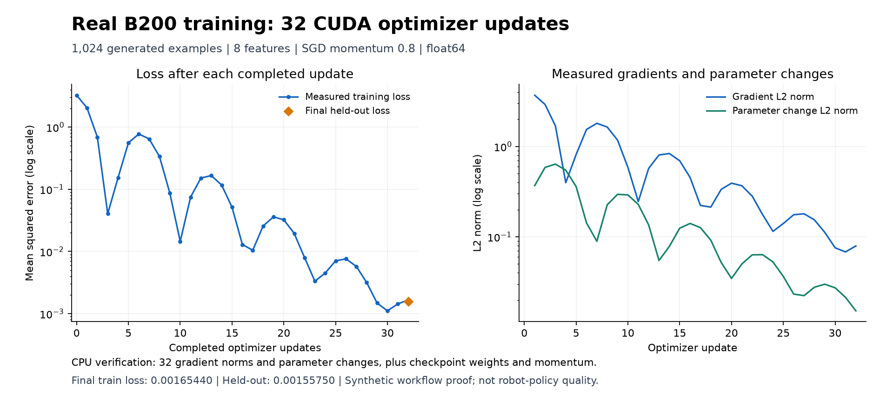

# Seven Cursor PRs: reviewed source, tests and real GPU evidence

Merge in this order: **#635 → #637 → #638 → #639 → #641 → #643 → #644**.
All seven preserve their original Cursor commits. Codex refreshed and reviewed
them without Cursor. This handoff does not merge or enqueue any PR.

| PR | Change | Tested head | Full CPU tests passed |
| --- | --- | --- | ---: |
| [#635](https://github.com/nebius/nebius-physical-ai/pull/635) | reconcile blocked waves before resume | `fc4ba852e873` | 29,203 |
| [#637](https://github.com/nebius/nebius-physical-ai/pull/637) | recover durable output reuse across driver crashes | `abaad6a30fe7` | 29,284 |
| [#638](https://github.com/nebius/nebius-physical-ai/pull/638) | preserve listener ownership during process exit | `fdc18016160e` | 29,208 |
| [#639](https://github.com/nebius/nebius-physical-ai/pull/639) | fence completed replay before output recovery | `bb1820e6491f` | 29,313 |
| [#641](https://github.com/nebius/nebius-physical-ai/pull/641) | bind replay identity to complete image selection | `3e478c98bec3` | 29,324 |
| [#643](https://github.com/nebius/nebius-physical-ai/pull/643) | cover image selection identity and replay | `7b9bf5c0f66f` | 29,353 |
| [#644](https://github.com/nebius/nebius-physical-ai/pull/644) | reject image selector errors before preparation | `80ffd450f150` | 29,368 |

At the recorded GitHub observation, every PR is open, non-draft and mergeable,
with clean merge status, verified commit signatures, no unresolved review
threads, and successful required `gitleaks`, `scan`, and `security-regression`
checks from GitHub Actions. [report.json](report.json) records the exact check
URLs, source trees, original Cursor ancestors, incremental diffs, local stage
results and log hashes. Readiness is a snapshot; the merge queue checks the
eventual merge result again.
Every test, scan, coverage and reporting job has completed. No pending or failed
check is accepted and no branch rule was changed.

## What was tested

Each final PR head passed its own Linux CPU suite, focused workflow tests,
hostile-input tests, smoke tests, guardrails, documentation drift,
confidentiality and history scanning. Full suites had zero failures,
116 skips and one non-strict expected-failure test that passed. `make test`
excludes live/GPU markers; the separate real CUDA tests below cover the changed
workflow execution and recovery paths. Hosted CI has its own coverage gate.

Native Bandit 1.9.4, Zizmor 1.30.1 and Trivy 0.74.0 ran against each frozen
base and candidate: 603 existing findings on each side, zero introduced
regressions and zero blocking findings. Adversarial scanner controls also passed.

The initial combined source passed 29,373 full tests. Seven actual sequential
squash merges onto newer main passed 29,413
full tests and native scanning. A later seven-squash integration on
`5d54f30aff4a688730c80e02a7a11593dd0c226b` was conflict-free and passed the affected tests recorded in
the report. These snapshots are available as public source commits:

- [GPU-tested combined source](https://github.com/nebius/nebius-physical-ai/commit/4602cc392b7725513cf963c96b05b63d817d8cb7)
- [Newer-main full-suite source](https://github.com/nebius/nebius-physical-ai/commit/9a97d113d6d3c8247af67e2eda91261ab53dce3b)
- [Latest-main compatibility source](https://github.com/nebius/nebius-physical-ai/commit/d02b5f7618bb437740a90a45bf80d5f62bd27284)

Read-only Claude Code review found two runtime blockers: transient history
failures could wedge recovery, and a saved reuse decision without its
cancellation event could fail to reconcile. Both were reproduced, fixed and
re-reviewed as resolved. The image review's real alternate-branch coverage
recommendation was implemented. Review is separate from test execution.

## Real B200 execution

The **combined source** `4602cc392b7725513cf963c96b05b63d817d8cb7` ran an ordinary two-stage NPA
workflow: actual B200 CUDA training, then a separate CPU verification job that
downloaded the checkpoint and checked every optimizer update. This is combined
batch GPU evidence; it is not seven separate GPU runs of individual PR heads.

The pinned public PyTorch image, actual pod image/device allocation, provider
queue, staged source bytes and checkpoint/metrics readbacks were checked.
All 2,866 staged source objects matched their expected bytes. Private execution
bindings and credentials remain outside this public packet; public hashes and
sanitized measured values are retained here.

| Measurement | Observed |
| --- | ---: |
| Device | NVIDIA B200, CUDA 13.0 |
| Torch | 2.13.0+cu130 |
| Training / held-out examples | 1,024 / 1,024 |
| Real float64 SGD updates | 32 |
| Initial training loss | 3.253974364402 |
| Final training loss | 0.001654399316 |
| Held-out loss | 0.001557499958 |
| Final / initial training loss | 0.000508424201 |
| Measured optimizer-step time, summed | 0.260954 s |

The scalar CPU oracle independently replayed SGD and compared every recorded
loss, gradient norm and parameter-change norm, then final weights and optimizer
momentum within a tolerance of 1e-8. The
measured time covers synchronized optimizer steps only; it excludes scheduling,
image pull, setup, storage and verification and is not an end-to-end benchmark.
Runtime boto3 was pinned; measured botocore is recorded, without claiming fully
locked transitive dependencies.



The chart preserves the measured non-monotonic loss sequence. Training loss is
shown before each update and after the final update; the held-out point is
evaluated after update 32. [baseline-numeric.json](baseline-numeric.json) carries
all 32 journal rows, numeric checkpoint tensors and raw artifact hashes.

## Replay and real cancellation recovery

Every acceptance item in [gpu-proof.json](gpu-proof.json) passed:

| Case | Required observed result |
| --- | --- |
| Baseline | CUDA training and independent CPU verification both succeeded. |
| Identical replay | Same attempts and output bytes; zero additional jobs or GPU pods. |
| Lost local receipt | Durable completed state recovered; same attempts and bytes, zero additional jobs or GPU pods. |
| Blocked live attempt | Resume adopted the exact still-running GPU attempt without a replacement. |
| Crash after immutable cancellation event | Exact provider cancellation verified; host driver exited before the mutable reuse marker; ordinary resume recovered the same training attempt and ran only the CPU verifier. |
| Crash after mutable reuse marker | Exact provider cancellation and both records persisted; host driver exited; ordinary resume recovered the same training attempt and ran only the CPU verifier. |
| Cleanup | Owned jobs/pods and task-local controller/API resources were audited and cleaned without changing shared infrastructure or unrelated configuration. |

Pod counts compare retained observations. Complete managed-job queue snapshots
also check for replacement submissions; each crash recovery added only its CPU
verification job.

The crash experiments used real GPU outputs and post-output CUDA evaluation.
The harness explicitly invoked supervision on an actual RUNNING observation,
injected a supported transient recovery reason, and exited the host driver at
the selected persistence boundary. Provider state and cancellation were real.
This is **injected recovery evidence**, not a claim that the provider reported
an infrastructure outage. No optimizer update occurred after output publication;
this does not demonstrate resuming training from a mid-optimizer checkpoint.

[Event recovery measurements](event-recovery-numeric.json) and
[runtime-marker recovery measurements](marker-recovery-numeric.json) preserve
their own numeric readbacks and artifact hashes. The generic
[fault driver](gpu-fault-driver.py), its
[110 synthetic controls](gpu-fault-tests/test_fault_driver.py) and
[usage/scope notes](FAULT-DRIVER.md) are included. Synthetic controls are labeled
separately from actual GPU execution.

Nine additional [derived controls](derived-controls/PUBLIC_README.md) used copies
of real baseline records: unchanged replay, changed/missing identities and
absent/corrupt copied outputs. Every provider/network/subprocess trap stayed at
zero. The strict copied-output checker deliberately raises on corruption;
this does not claim the normal boolean missing-output policy forbids replacement.
A separate two-tool image-selector fixture is CPU-only and makes no inference
or GPU claim.

## Recheck and limitations

From a repository checkout, use its interpreter and the downloaded packet:

```bash
npa/.venv/bin/python -B /path/to/packet/verify-numeric.py
npa/.venv/bin/python -B /path/to/packet/verify-numeric.py /path/to/packet/event-recovery-numeric.json
npa/.venv/bin/python -B /path/to/packet/verify-numeric.py /path/to/packet/marker-recovery-numeric.json
```

This CPU recheck needs neither storage credentials nor Torch. It verifies the
published values and rejects altered weights, zero parameter motion and a
missing optimizer step. It cannot independently attest physical GPU allocation.
The [workload source and reproduction instructions](gpu-workload/README.md)
provide the exact payload modules and deterministic archive manifest.
[SHA256SUMS](SHA256SUMS) covers every packet file except itself.

Earlier failed experiments are retained and disclosed in the reports. These
include validation-environment setup/procfs/temp-path failures and the initial
GPU fault harness that encountered production's correct healthy-job adoption
instead of the intended cancellation boundary. Correcting the harness did not
change production code or weaken the checks. The unsuccessful GPU experiment
was cancelled, preserved and excluded from successful recovery claims.
A cleanup audit initially expected a stopped API marker to discard its retained
interpreter setting; the corrected audit verified both owned APIs stopped, the
controller absent, no owned pods, and unchanged original configuration.
The last local integration checkout also exhausted disk while copying unrelated
documentation media. A sparse working copy preserved the complete Git tree.
The earlier temporary Linux environment was no longer present for the final
upstream-only dataset delta, so its two affected modules were checked locally
against the exact isolated source using the repository interpreter. Earlier full
Linux and GPU results remain separately attributed. Setup failures, final source
identity and platform details are retained in the compatibility report.
The subsequent demo-CLI-only upstream delta was also checked with its affected
module using the same local interpreter and an isolated exact-source checkout.

These orchestration changes are supported by real CUDA computation and recovery
evidence. They do not claim improved robot policy quality, VLM visual quality,
Ray/distributed training or native training-checkpoint resume. Legacy image
identities intentionally fail closed: restore the recorded version/options or
use a new run identity. Raw operational logs, checkpoints containing live run
bindings, private object URLs and infrastructure identifiers are not published.
