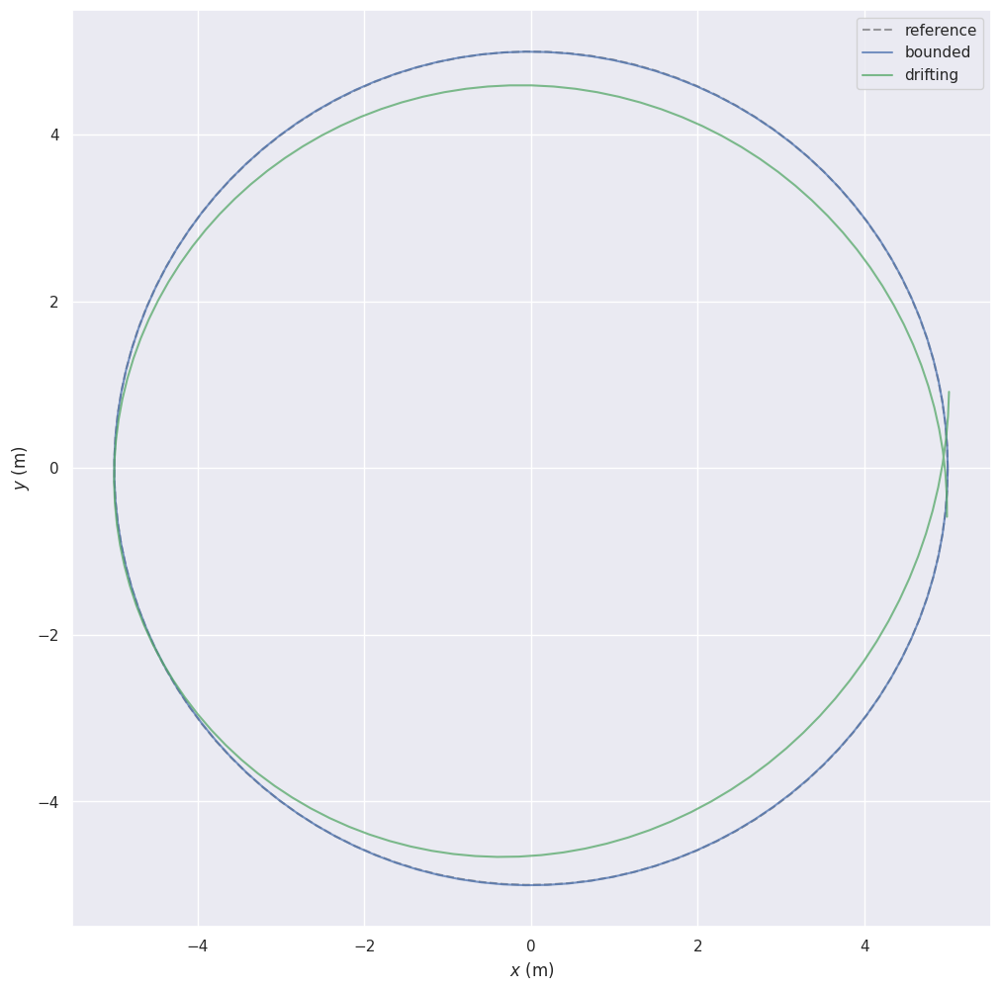

# Evo: real CPU qualification after the private host-key repair

PR [#584](https://github.com/nebius/nebius-physical-ai/pull/584) was exercised using source `841ceb59e051d7e7216992df56318c5cbbf7e7f5` and private image index `sha256:b41b61305fd78a0a6a89e690b3130049d77877afa47c5d5ba0acf1b5570ac5ed`. The native `evo_ape`, `evo_rpe`, and `evo_traj` commands completed through the supported direct SkyPilot BYOF path on Kubernetes. This workload uses CPU; GPU testing is not applicable.

All 67 retained artifacts passed an independent size and hash check. All ten result archives were decoded and their RMSE values recomputed. For the three synthetic trajectories, all **690 individual APE/RPE error values** were independently recalculated from the original input poses and matched the emitted arrays. Download the [sample-level errors](synthetic-errors.csv) and [machine-readable report](report.json).

| Input | APE RMSE (m) | RPE RMSE (m) | Outcome |
| --- | ---: | ---: | --- |
| Exact synthetic replay | 7.175037e-16 | 7.454746e-16 | Accepted |
| Bounded synthetic perturbation | 0.003545434 | 0.005949814 | Accepted |
| Nonlinear synthetic drift | 0.443811606 | 0.142876707 | Rejected |
| Malformed trajectory | — | — | Rejected; exit 1 |
| Pinned KITTI 00 ORB example | 1.303449715 | 1.250926005 | Compatibility observation |
| Pinned KITTI 00 S-PTAM example | 3.738487908 | 2.720131609 | Compatibility observation |

The frozen synthetic thresholds were APE RMSE ≤ 0.05 m, RPE RMSE ≤ 0.02 m, and at least 100 matched errors. The four controls produced TP=2, TN=2, FP=0, FN=0. APE uses SE(3) Umeyama alignment; synthetic RPE uses a 10-frame delta and KITTI RPE a 100-metre delta, using all eligible pairs. These settings differ and their RPE values should not be compared as one benchmark.

The image's targeted security checks reported zero fixable CRITICAL vulnerabilities, zero all-severity secrets, no private SSH host-key files across inspected ancestor layers, and distinct newly generated runtime key sets. SBOM, payload, provenance and bootstrap checks passed. **Complete archive-byte accounting is not claimed by this package** and remains a separate final image gate. The image remains private.

The original harness **failed in postprocessing** with `KeyError('path')` after the workload, objective checks and run cleanup succeeded. The capture manifest had multiple supported metadata shapes. A separately reviewed, read-only reconciliation resolved the retained artifacts by digest; it made no new workload submissions or VLM calls. The original failure and two rejected reconciliation attempts remain retained. Six current capture files were byte-identical to accepted prior captures, permitting reuse of presentation-only visual review. Cleanup of run resources, the managed controller and the temporary pull secret was independently verified.

The displayed PNG is an unchanged workload artifact showing wholly generated controls. KITTI-derived graphics, raw operational logs, private resource identifiers and customer credentials are excluded. Dataset attribution and the earlier visual-review limitations are retained in the [prior evidence](../evo-proof/README.md): Andreas Geiger, Philip Lenz, and Raquel Urtasun, *Are we ready for Autonomous Driving? The KITTI Vision Benchmark Suite*, CVPR 2012. Upstream evo is v1.35.1, commit `8dd6cfe0ec1747f9e1b5b569edd82c54d1a3f422`.

This demonstrates trajectory metric gating on the stated controls and compatibility with the pinned examples. It does not establish real-world SLAM quality, navigation success, sensor accuracy, robot safety, improved upstream trajectories, or execution through the outer `npa.workflow` launcher. PR readiness also requires current-source validation and hosted CI.
