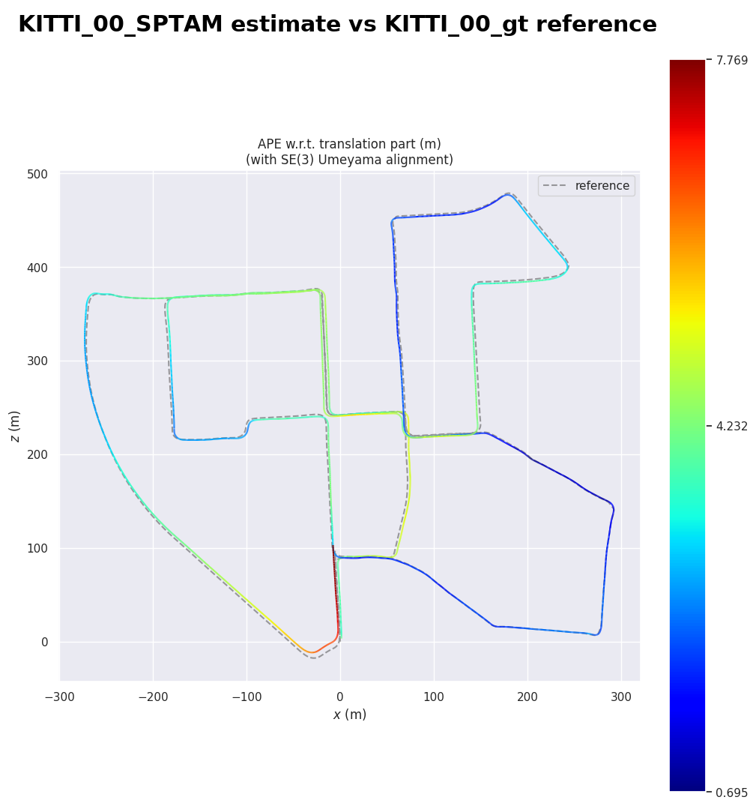

# Evo: observed managed CPU execution and complete owned cleanup

**PASS for the fixed native CPU evaluation and supported managed-task lifecycle.** The actual task succeeded, retained 68 artifacts, and produced 10 native result ZIPs and 19 decodable PNGs. Independent arithmetic reproduced 690 synthetic pose-error values. All four frozen controls classified correctly: TP=2/TN=2/FP=0/FN=0; malformed input exited 1 without a result archive.

Independent review accepted the exact source, qualified image, numeric controls and observed lifecycle within this scope. The uninterrupted exact-source Linux suite passed 25,514 tests with 155 skips and one non-strict xpass; no failures or errors. Its source, log and acceptance hashes are retained in [lifecycle.json](lifecycle.json). Hosted CI and merge readiness are checked separately.

The executing client is `3b12ef19a4724cd16c1af521fd0cbe9dd95c55cb`. The qualified image index is `2d1e1c074e2b6f066bb49aaee1ac6bf5252ca48689312ee9c368941ca42f15a9`, built from recipe `841ceb59e051d7e7216992df56318c5cbbf7e7f5`. The reviewed recipe/BYOF/workflow/cleanup paths remain byte-identical after client integration; the Evo submission entry is AST-equivalent. A separate accepted source revision supplied the pull preflight and is explicitly identified in [lifecycle.json](lifecycle.json).

Actual task-Pod observations bind the image graph, service-account and pull-secret selection, CPU placement and immutable task identity. These observations are separate from the preflight Pod. All 16 privately delivered OCI blobs matched the qualified archive. This packet makes no public image-release claim.

The shipped functional smoke is unchanged. Output accounting is **62 functional + 5 transport + 1 explicitly added read-only dependency inventory =68**. The inventory used the workload's actual interpreter and CLI shebangs. Five storage-related distributions were added during setup; existing distribution versions and the three Evo CLI files remained unchanged. Per-installer attribution is not claimed.

| Control | APE translation RMSE (m) | RPE translation RMSE (m) | Gate result |
| --- | ---: | ---: | --- |
| Exact | approximately 0 | approximately 0 | accepted |
| Bounded noise | 0.00354543 | 0.00594981 | accepted |
| Nonlinear drift | 0.44381161 | 0.14287671 | rejected |
| Malformed input | no result archive | not evaluated | rejected |

The frozen limits remain APE ≤ 0.05 m, RPE ≤ 0.02 m and at least 100 matched poses. The upstream ORB and S-PTAM fixture results are compatibility measurements; they are not represented as passing these synthetic-control limits. Full values and counts are in [measurements.json](measurements.json).

These exact output PNGs were copied without alteration and visually inspected. The first shows the bounded trajectory close to reference and the drifting trajectory deviating. The second shows the pinned example estimate against its reference and translation error coloring; it is not a new robot navigation benchmark. Evo is Michael Grupp and contributors' GPL-3.0-or-later project, pinned at [8dd6cfe0](https://github.com/MichaelGrupp/evo/tree/8dd6cfe0ec1747f9e1b5b569edd82c54d1a3f422). The second plot uses the upstream KITTI-labelled example trajectories; synthetic controls were generated for this test. No upstream endorsement is implied.

Supported cleanup removed the exclusively owned managed-jobs controller and its two native Services after terminal workload verification. A **separately timed** read-only audit retained five exact-object 404 responses for the controller Pod, two Services, task Pod and run-owned pull Secret, plus two metadata inventories. Both owned runs' native Pod/Service names were absent and four unrelated controller identities remained present. The underlying cluster was preserved. Response hashes and scope appear in [lifecycle.json](lifecycle.json); private resource identifiers and raw API bodies are omitted.

Earlier history remains retained: the previous recipe-revision run succeeded with 67 objects but missed its full live task-Pod capture; a later fresh pull preflight failed on expired registry authentication before workload submission and was cleaned up. The initial workflow cleanup did not remove owned controllers; its incomplete result was retained, followed by supported controller cleanup and the separate raw-read audit. None of those earlier records is relabeled as complete proof.

[All 68 retained artifact hashes](artifact-hashes.json) · [Measurements](measurements.json) · [Source, runtime and cleanup binding](lifecycle.json) · [Published-file hashes](SHA256SUMS)

Scope: synthetic metric behavior, pinned upstream compatibility, observed managed CPU execution and owned cleanup. No GPU, new hosted VLM result, SLAM accuracy or robot-safety claim. The outer declarative BYOF workflow remains plan-only because nested Sky submission is unsupported. The qualified image's complete-byte scanner raw failure with 54 findings remains retained; all findings were content-reviewed with no unresolved material. Current hosted CI and required merge-queue integration remain separate readiness gates.
