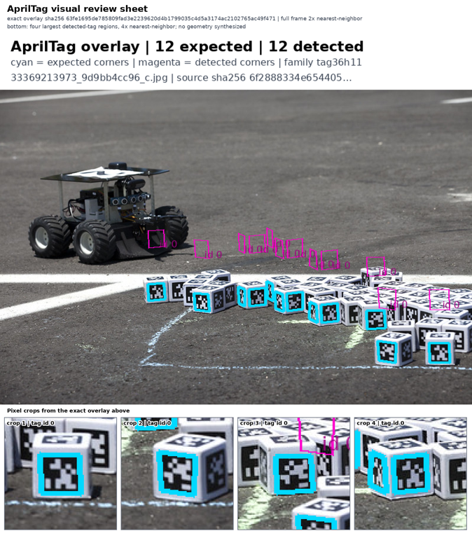

# Kimi-K3 disclosed visual controls

[PR #678](https://github.com/nebius/nebius-physical-ai/pull/678), source `a26a868e3bed68d48eb6fd91638e1e1d3d048474`, completed four real hosted visual calls using `moonshotai/Kimi-K3`. All returned HTTP 200, the exact requested model and `finish_reason=stop`; all four predeclared control expectations passed. The repaired request uses `reasoning_effort=low` and sends neither temperature nor a completion-token cap.

**This is disclosed calibration, not a heldout benchmark or final judge qualification.** A separate holdout harness is being repaired before any holdout calls. Earlier failed calibration evidence remains retained.

| Exact input supplied | Control | Score | Visible decision |
| --- | --- | ---: | --- |
| [Correct overlay](correct-overlay.png) | Aligned polygons and matching provenance | 0.95 | Pass |
| [Shifted detections](shifted-detections.png) | Polygons displaced from printed tags | 0.20 | Fail |
| [Blank image](blank.png) | No visual evidence | 0.05 | Fail |
| [Different source](mismatched-source.png) | Good geometry, wrong source/hash/count for this task | 0.25 | Fail |

The identical [prompt and rubric](prompt.txt) requires the first photograph and its 12/12 banner. The different-source image correctly shows 10/10 for another photograph; it is rejected for task-provenance mismatch, not for bad detection geometry. [Visible provider answers and provenance hashes](review.json) include the actual explanations.

Independent receipt review verified 32 retained per-case file hashes, all four request bodies against the frozen manifest, and equality of raw provider scores and product results. Images here are the exact decoded data-URL bytes from those requests. No new provider query or model-scoring replay was made by that audit. Four calls is the total; the per-case send counters are cumulative.

Raw operational envelopes, credentials, provider request identifiers and hidden reasoning remain private. The visible answer JSON is copied into this allowlisted report. Required CI, stack dependencies and any final workload/holdout gate remain separate from these results. [Image attribution and derivative license](ATTRIBUTION.md).
