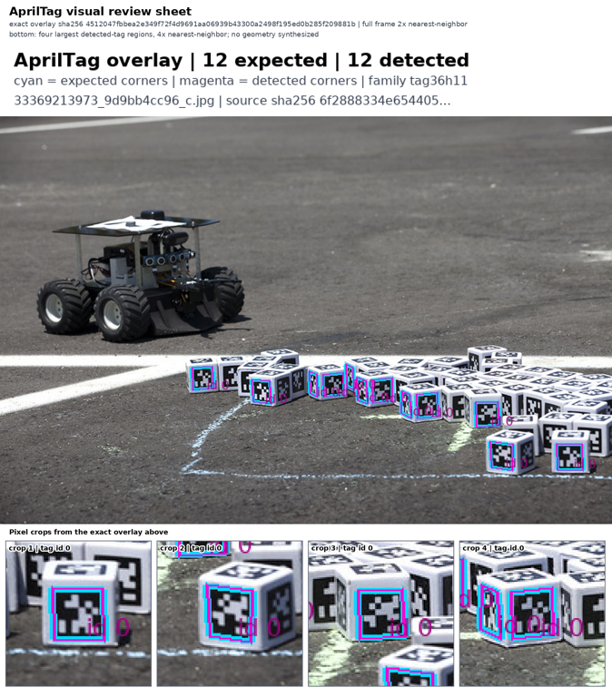

# Kimi-K3: live checks after request-provenance integration

Four real hosted calls passed the predeclared integration controls through the actual production HTTP transport. The evaluator now retains the provider response and binds it to the exact image, prompt, rubric, request and returned model. Each case sent one request and received one HTTP 200 response from `moonshotai/Kimi-K3`, with `finish_reason=stop`.

| Exact input sent | Expected decision | Actual score | Decision |
| --- | --- | ---: | --- |
| [Correct overlay](correct-overlay.png) | Pass | 0.96 | Pass |
| [Shifted detections](shifted-detections.png) | Fail | 0.25 | Fail |
| [Blank image](blank.png) | Fail | 0.05 | Fail |
| [Different source](mismatched-source.png) | Fail | 0.30 | Fail |

The threshold was 0.80: one true positive, three true negatives, no false positives or false negatives. These four disclosed controls test the integrated request and evidence path. They are not a new independent holdout, an error-rate estimate, or evidence of robot task success.

[Exact prompt and rubric](prompt.txt) · [Visible model explanations, token counts, latency and provenance hashes](review.json) · [Image attribution](ATTRIBUTION.md) · [File hashes](SHA256SUMS)

## Reproducibility and scope

The actual live producer was `b760e5134df4d89e0bb025eccfab9564f9583c8d`. The subsequent integration of current main is `723b5bc54446c50932edba9a8747adb3ad55a95a`. Every application file under `npa/src` is byte-identical between these commits. The live calls are attributed to the producer; this source comparison does not claim that their full installed environments are identical.

Independent review rehashed all 31 retained files, compared each raw request with its frozen hash and earlier disclosed JSON values, and verified that the actual raw response yields the published score, decision and explanation. The images above are the exact request image bytes without re-encoding. Native HTTP JSON key order differs from the older sorted-key harness; both request hashes are recorded and the decoded payloads are equal. The request uses the reviewed Kimi reasoning setting and does not add temperature or a completion-token cap.

Two earlier harness failures remain recorded: a prompt delimiter mismatch, then an incorrect expected JSON key order. Both stopped before any provider request. This successful attempt made exactly four physical sends. No retry or favorable-response selection was used.

The earlier separately frozen holdout and three-sheet detector census belong to the preceding evaluator source. Their evidence remains separate. This pack supplies new live integration checks; it does not relabel prior calls as having run the new source. The visual judgment concerns overlay presentation and task provenance. It does not measure detector corner accuracy, camera pose, navigation success, physical correctness or safety.

This is hosted inference; no local GPU execution is claimed. Credentials, headers, provider request identifiers, hidden reasoning and operational endpoints remain in private evidence. Current-source tests, hosted CI and final PR readiness are tracked separately.
