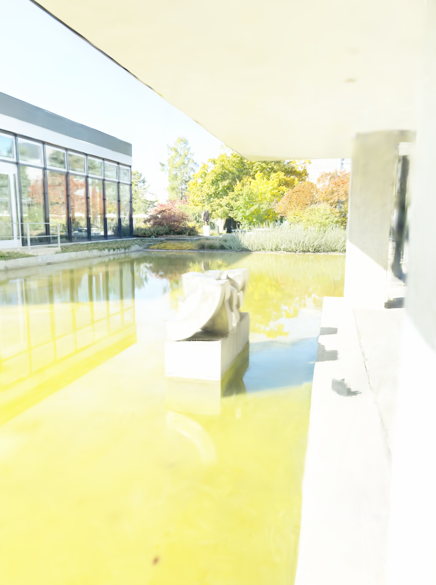
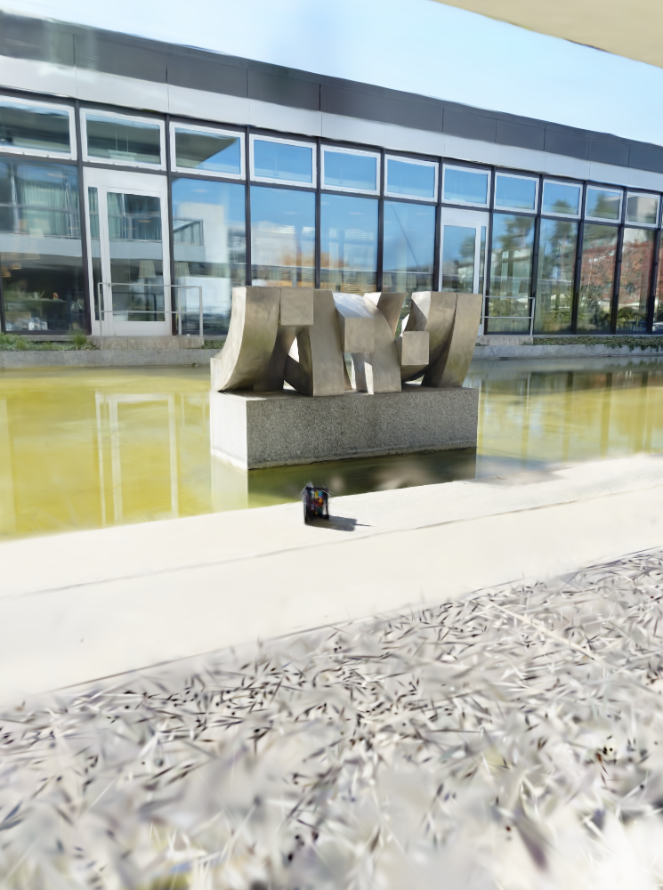

# Fixed-index native PNG gallery

First, integer-middle and last RGB frames from each complete camera population. Selection is independent of quality scores, with original encoded bytes preserved. Reconstruction global IDs and novel-view camera-local IDs are not capture timestamps. These independent photographic views do not establish a continuous temporal trajectory.

## reconstruction/val/pred_rgb/cam_00/000000.png

SHA-256: `66924616c90b8d0497b96c4d9f927d8ca3f4068320ccabbdacf8d72099013c6a`.

## reconstruction/val/pred_rgb/cam_00/000133.png

SHA-256: `c5306feee07b0fc0ac6df438c2b78ad06d7a9b4bf6ecb66ac7748eaaadf4ef0e`.

## reconstruction/val/pred_rgb/cam_00/000266.png

SHA-256: `1356ee4918374798f8198ddd4b5edfb301b7e9cae8e7bd0d40755f4a5bb66d7d`.

## reconstruction/val/pred_rgb/cam_01/000267.png

SHA-256: `a00db29d5236479bbfa5af657a1f754a710c32f7e3d7775670042aa3993263c6`.

## reconstruction/val/pred_rgb/cam_01/000297.png

SHA-256: `17f927e3a0fbb7e6218487c73a50f3f4460e85a804f928576c33344cde111fda`.

## reconstruction/val/pred_rgb/cam_01/000326.png

SHA-256: `db26a564bd1748fad6a0c353affb74251dda2e46d267c5c4610aaed74113da1b`.

## reconstruction/val/pred_rgb/cam_02/000327.png

SHA-256: `8e530e00d9039233fb53a09bf6900eb28a19255ac8e97098087212ec6ceb6c11`.

## reconstruction/val/pred_rgb/cam_02/000422.png

SHA-256: `5204108545f1ae4b8585f94d2fe6ce71f42c9cbe27be8bb6924800c77de6db75`.

## reconstruction/val/pred_rgb/cam_02/000517.png

SHA-256: `3f4d7b6c582abdcdc85d7a007b901b523699047db7cb75b2fbba91724bdef755`.

## novel_views/camera1/000000.png

SHA-256: `95eefa0c3ea7339389d377b936fb49a2e988a2fbe87b23fd89ac77b4d3a3ad19`.

## novel_views/camera1/000133.png

SHA-256: `6d3092cc13f6098a5dd04610dbf5795a83deefe9df8d4d532fcc40edabc05dd6`.

## novel_views/camera1/000266.png

SHA-256: `450b949103b0cd6a3378a8cf692e86ecc1f94fd04705d2efdd387eebbb8c096d`.

## novel_views/camera2/000000.png

SHA-256: `cf4a871dc9dd186ee706e1d1881e7c8f46a7d2e467172527a56ce89e193e27cc`.

## novel_views/camera2/000030.png

SHA-256: `6603e2f2568f67b818cf35c779c4f17456566ac39747701b933ad0ef35c0b395`.

## novel_views/camera2/000059.png

SHA-256: `9d4d8111803518e770d44328a477f60e2c4b1d8f392637925e1a80aab4c92089`.

## novel_views/camera3/000000.png

SHA-256: `7de45b7ba09c5b8a479a9b0c45a7b8fb9d44f6fddabeb5f603812a5e0b6a42cd`.

## novel_views/camera3/000095.png

SHA-256: `70b7466a2a22c26625a8d23fecb88dc4cc1cdf351410c25741c5c7db64b36d35`.

## novel_views/camera3/000190.png

SHA-256: `38ec913f329d4f16d2aefc589dfba5d6af822d6c4d7744668a5cbdc12b01d7c8`.
