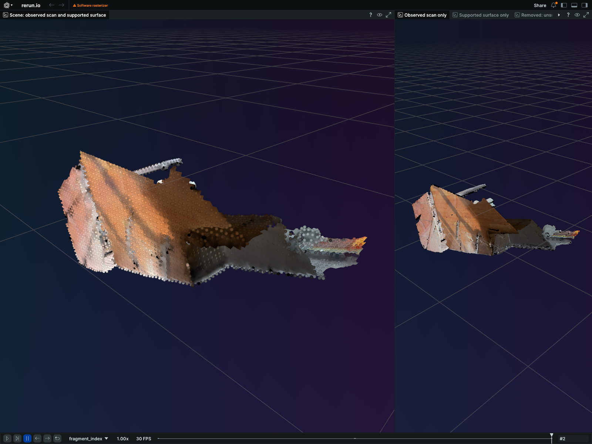

# Open3D: inspected CPU execution and interactive scene

Six shipped Open3D CLI stages ran successfully in private CPU containers. The recording below lets a reviewer compare the registered points, the supported surface, and the surface removed by the frozen support-distance test. The resulting mesh has holes and is not suitable for a physics-ready claim.

[Download the Rerun recording](scene.rrd) · [Independently recomputed measurements](measurements.json) · [Hosted visual-review answers](VLM-REVIEW.md) · [Prompts and response provenance](vlm-review.json) · [Recording verification](recording-review.json) · [File hashes](SHA256SUMS)

## What executed

`stage-demo → register → multiway → reconstruct → validate → visualize` each exited zero. All stages used the same immutable image on CPU. This proves the local CLI/container path; the SkyPilot workflow recovery path remains a separate unresolved qualification.

The input is the public Open3D DemoICPPointClouds benchmark: three fragments from the Redwood augmented ICL-NUIM synthetic living-room scene, with modeled sensor noise. It is not a fresh sensor capture. The input archive SHA-256 is `b94e0146c1d48c5edfc11af71b4af39ffca604485668c55a127c3b43203a6bd5`.

| Measurement | Result | Meaning |
| --- | ---: | --- |
| Input / fused samples | 528,065 / 6,341 | The fused cloud is downsampled |
| Pose graph | 3 nodes, 3 edges | All three fragments participate |
| Pairwise ICP fitness | 0.6211–0.7460 | Correspondence agreement, not ground-truth accuracy |
| Pairwise ICP inlier RMSE | 0.00656–0.00724 m | Inlier residuals, not absolute pose error |
| Supported mesh | 14,736 vertices, 28,206 triangles | Retained reconstruction |
| Triangle area removed by support test | 52.7346% | Removed area fails the frozen distance criterion; this does not prove it was fabricated |
| Fused samples within one 0.05 m voxel of mesh | 99.2746% | Applies to the 6,341 downsampled samples, not the whole scene |
| Sample-to-surface p95 distance | 0.02218 m | Independently recomputed |
| Watertight / edge-manifold / vertex-manifold | No / No / No | Open boundaries and topology limitations remain |

Independent validation passed 24 checks over input/output hashes, rigid transforms, correspondence fractions, residuals, sample distances and surface metrics. [The measurement report](measurements.json) contains the full values and their scopes.

## What the recording changes

The shareable recording preserves the retained run's 17 geometry component arrays, their types, static status and per-entity timelines. It replaces operational provenance with allowlisted public metadata and sets an explicit review layout. The native screenshot is an actual viewer capture; no generated or retouched geometry is used. The removed surface has a separate tab so reviewers can inspect the consequence of the support test.

## Hosted visual review

Four real Nebius Token Factory calls requested and returned `MiniMaxAI/MiniMax-M3`: the final capture, an empty-geometry control with the same viewer labels, and two identity prompts over the identical final pixels. All requests completed successfully. The empty control was recognized as empty.

The subject response identified open boundaries and suggested inspecting the sparse right-hand region. Identity prompts changed the model's confidence about surfaces bridging gaps, despite identical pixels. This is useful inspection guidance with demonstrated prompt sensitivity; it is not a calibrated geometry score, a correctness gate, or proof of robot usefulness. All four final responses are retained, including the controls.

The original request freeze stated that thinking was disabled. The actual request omitted that setting and the provider reported reasoning tokens. The report preserves this protocol deviation rather than rewriting the frozen record. Provider reasoning text and private transport fields are excluded from the public report.

## Source and image binding

The image was built from `e62ab7073b8b8235decd7d8013ac58b7bba802b1`, with index SHA-256 `a6c05625dd796ed1c25f3192a5078a604da64e76d7a0d96531d88cc4954587c0` and runtime manifest SHA-256 `d7eaa4275bba783c504b4eeb8d66f5fac5bf8ae7e6c092db620e5e9d403a58e6`.

PR #602 subsequently reached `487a8c6da403d1a7fef63e8d26979d136004219d`. Independent review confirmed that the shipped runtime successor changes only a docstring, with equivalent executable AST; the other changes are nonshipped documentation and formatter-only tests. The image is not described as having been built from that later commit.

The full local suite passed at reviewed source `f916a73942a9156632a3b91c1f3f374bb91c9aa6`: 24,307 passed, 154 skipped, one non-strict xpass, zero failures/errors. Current-head hosted CI, workflow recovery, and PR readiness remain separate gates. No public image promotion is implied by this evidence pack.

## Attribution

The [attribution file](attribution.md) records the upstream dataset authors, source, license and transformations. Registration, downsampling, surface reconstruction, distance-based surface removal and viewer packaging are changes made for this evaluation. The original benchmark creators do not endorse these results.
