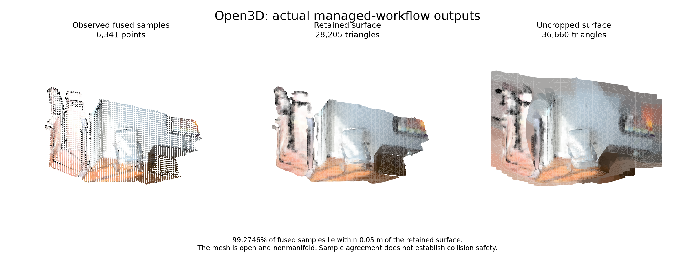

# Open3D: completed managed workflow and verified cleanup

All six stages completed through the standard managed workflow: **stage → register → validate → multiway → reconstruct → visualize**. Each actual task used the reviewed immutable CPU image. The owned workload, controller, services and pull secret were subsequently confirmed absent.

This figure renders the actual PLY bytes from this run, with all points and triangles included and measured vertex colors. It is a numeric rendering, not a viewer screenshot or generated scene. [Rendering provenance](rendering.json).

[Execution and cleanup evidence](execution.json) · [Recomputed measurements](measurements.json) · [Decoded recording lineage](recording-lineage.json) · [Attribution](attribution.md) · [File hashes](SHA256SUMS)

| Verified result | Measurement |
| --- | ---: |
| Successful managed stages / observed task identities | 6 / 6 |
| Durable outputs / declared outputs | 20 / 11 |
| Recomputed geometry checks | 24 passed |
| Runtime samples matching the baked image | 6, each with 8 modules and 123 package versions |
| Supported mesh | 14,736 vertices, 28,205 triangles |
| Fused samples within one 0.05 m voxel of the mesh | 99.2746% of 6,341 samples |
| Uncropped area outside the sample-support criterion | 52.7347% |
| Exact native absence responses after cleanup | 22 typed 404s |
| Complete final resource inventories | 43 Pods / 21 Services |
| Unrelated controller identities preserved | 6 / 6 |

The independent audit rehashed 808 retained files and all 20 output objects. The decoded recording preserves the checked fragment/fused positions and supported-mesh vertices/indices exactly. This does not certify every recording component. The durable workflow `status.json` still records submission; terminal success comes from the separate retained managed-queue response showing all six stages succeeded.

## Exact source and limits

The orchestration producer was `2a90905570d9cb134da527be78ebfecb0bd841c8`. The image was built from `e62ab7073b8b8235decd7d8013ac58b7bba802b1`, with index digest `a6c05625dd796ed1c25f3192a5078a604da64e76d7a0d96531d88cc4954587c0`. These are distinct identities; the image is not relabeled as built from the later orchestration source.

The input is Open3D DemoICPPointClouds, from the public Redwood augmented ICL-NUIM synthetic living-room benchmark with modeled sensor noise. This is the legacy CPU Open3D path, so a GPU is not used. The retained mesh remains non-watertight and nonmanifold. Support cropping reports zero remaining unsupported area by construction; it is not an independent quality score. Sample agreement does not establish whole-scene coverage, accurate poses, simulation readiness or robot usefulness.

The earlier [interactive scene, browser proof and visual-model responses](https://github.com/nebius/nebius-physical-ai/blob/3fa3d6246971cba310a4eb6e62ac53763d16e5de/docs/testing/evidence/open3d-inspectable-scene-a6c05625/README.md) belong to the separate local-container execution of the same image. They remain useful for inspection, but no new VLM call or visual acceptance gate is claimed for this managed replay. The figure and numerical measurements above are from this new replay.

Earlier failures remain recorded. One external verifier incorrectly expected Open3D0.19; source and baked-image evidence established0.20 before correcting that single verifier literal. Cleanup first refused an environment-selector mismatch, then encountered stale saved authentication. A supported same-cluster auth refresh preceded successful cleanup. The final native GETs are separately timed absence evidence, not reconstructed cleanup-time responses.

Current-main source integration and hosted CI are separate readiness checks. This pack does not publish the private image or mark the PR ready. Operational identifiers, endpoints, credentials and raw transport metadata remain private.
