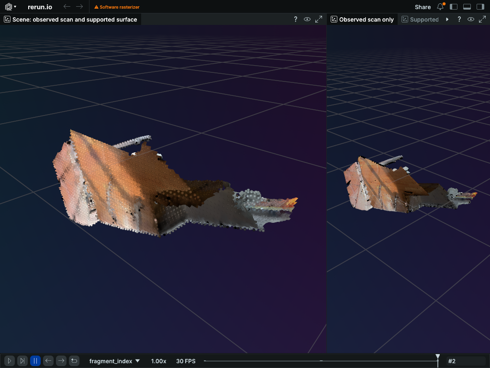

# Open3D: actual CPU workflow and native view

Input: three Open3D/Redwood living-room1 fragments from the augmented ICL-NUIM synthetic indoor benchmark.

Six standard workflow stages completed on the immutable image built from source `b18d7aef56bbe25a5b45290e0b705f20a59ad4da`. Independent checks tied the real input PCDs, registration poses, fused cloud, mesh and decoded RRD together. The full native view below is the actual shipped recording at voxel size 0.05, not the earlier aggregate preview.

The view is readable and preserves scan colors. It still shows a partial reconstruction with holes: the mesh is not watertight or manifold and is not accepted for collision or physics use. Software rendering is disclosed in the image; no GPU, performance or hosted VLM claim is made.

[Machine-readable measurements and provenance](report.json) give exact producing-source, image and original-artifact hashes. [Dataset attribution and license](ATTRIBUTION.md) identify the public Open3D/Redwood input and the transformations. [SHA256SUMS](SHA256SUMS) covers every supplied file.

The exact image fails qualification: the unchanged security policy reports four fixable CRITICAL glib/perl package findings, and the installed mcap package omits its required MIT notice. Package and notice corrections, a new image and fresh qualification are required; the full byte scan remains unfinished. The documentation privacy repair is accepted separately, and does not qualify the image or make the PR merge-ready. This is runtime and presentation evidence, not a release authorization. Raw operational files remain privately retained; this public report deliberately includes only reviewed measurements and hashes.
