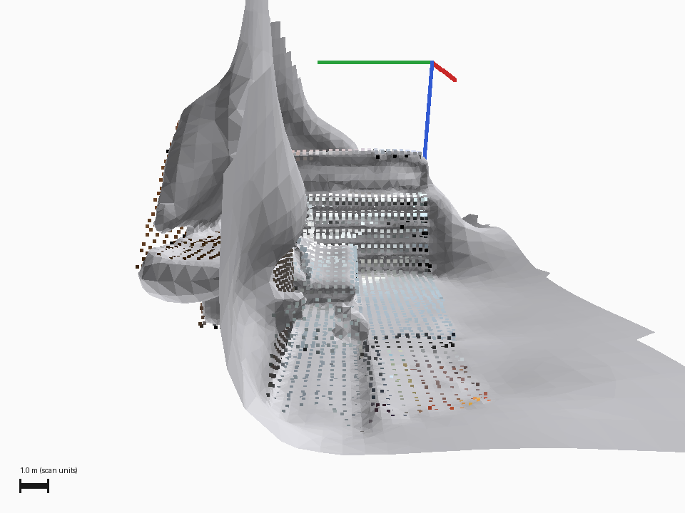
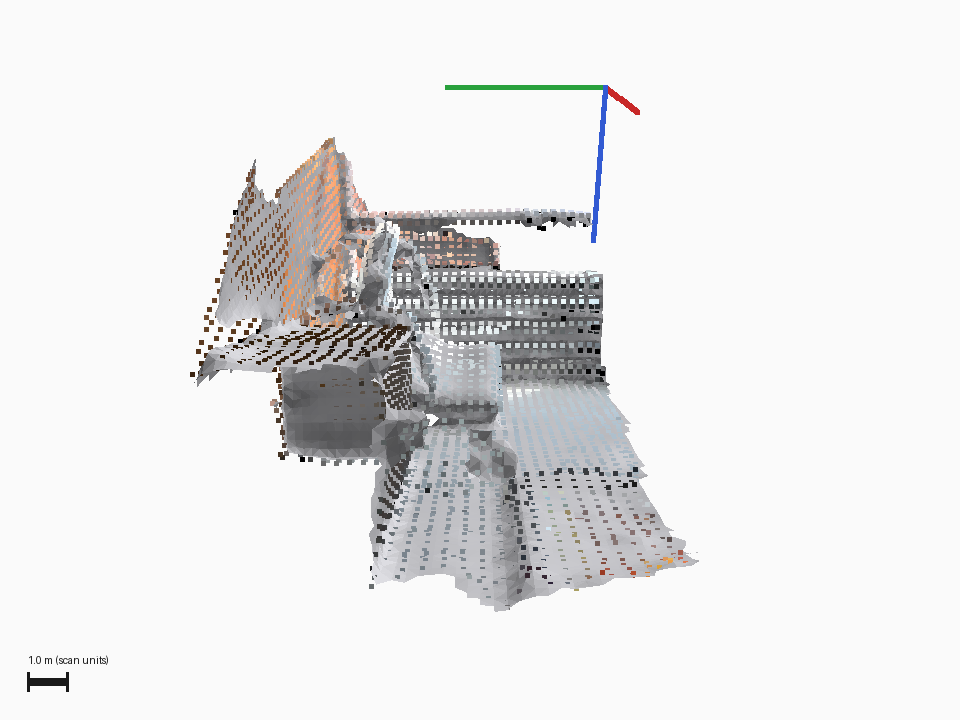

# Open3D retained evidence: before, after, and limitations

**Acceptance remains pending. This is a historical comparison, not proof of the current PR head.** Open `index.html` after extracting this pack, or view the PNGs and JSON files directly. Reviewing this pack requires no cloud access or customer credentials.

The images are **CPU renders of PLY outputs, not Rerun UI screenshots**. The candidate removes broad extrapolated surface sheets, but held-out scan fit worsens in all three fragments. This pack does not establish an overall accuracy improvement, simulation readiness, or physical AI task usefulness.

The retained candidate source hash is `8984b079d6b7fca1adacd3c3046f38e80e69b338423c9dbe0cc95f2300ee7ca4`. The current candidate file inspected during this audit has hash `131e9963abfcb66968a0b299413ff2cba19f60ccd266d8e77e945a4a1e7cc6fd`. Baseline and fused-input hashes still match. Fresh captures tied to the intended immutable commit and exact output bytes are needed for a current-head claim.

## Matched overview

| Baseline | Candidate |
| --- | --- |
|  |  |

The seven included original PNGs also contain matched opposite views, the observed scan, and two deliberately bad controls. All PNG SHA256 values match their original capture manifests. Their main-view source PLY hashes match the retained independent metrics report. Full source roles, hashes, and frame names are in `manifest.json`; `SHA256SUMS` lists the files in this pack.

## Objective downside

Held-out p95 point-to-surface distance, in source scan coordinate units; lower is better:

| Held-out fragment | Baseline | Candidate | Outcome |
| --- | ---: | ---: | --- |
| cloud_bin_0 | 0.133208 | 0.248509 | Worse |
| cloud_bin_1 | 0.037442 | 0.071962 | Worse |
| cloud_bin_2 | 0.058723 | 0.163619 | Worse |

The observed-scan unsupported-area fraction falls from 0.527324 to 0.000000 under the support rule. That rule does not measure held-out accuracy or downstream usefulness. The mesh loses area and coverage. Selected numeric evidence, including the regressions, is in `metrics.json`.

## Real VLM calibration failed

Eighteen retained calls evaluated one frozen rubric on six calibration cases from one scene. All responses parsed; none of the three judges qualified as an acceptance gate.

| Model | Correct cases | False accepts on three rejection controls |
| --- | ---: | ---: |
| MiniMaxAI/MiniMax-M3 | 4/6 | 2/3 |
| google/gemma-3-27b-it | 2/6 | 3/3 |
| openbmb/MiniCPM-V-4_5 | 2/6 | 3/3 |

All three accepted the misaligned and no-crop controls. These results are specific to this rubric and scene, not a general ranking of model capability. `vlm-calibration-summary.json` retains selected case labels, actual verdicts, frame hashes, response hashes, and rubric hashes. Raw requests, response prose, endpoint locations, and operational metadata are excluded. The blank control is not included as an image because it lacks an entry in the retained capture manifests.

## Public-data origin and publication scope

The three input PCD hashes were independently matched against the public Open3D `20220301-data/DemoICPPointClouds.zip` release. The data is the Redwood living-room1 demo, rather than customer capture data. See `ATTRIBUTION.md` for the dataset-specific CC BY 3.0 declaration, source links, credits, and changes made to the data. Retain that notice with the images.

The pack contains selected original images and newly written summaries. It intentionally excludes private run reports, raw provider exchanges, object-store locations, infrastructure identifiers, Rerun links, and deployment logs. Hash verification demonstrates identity and provenance; it does not establish quality or approval.
