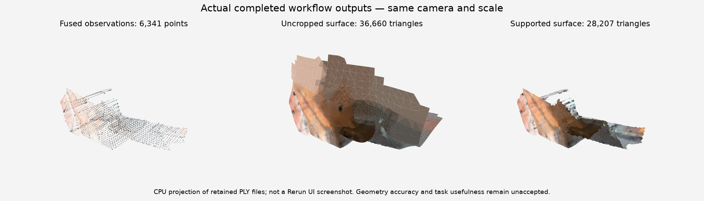

# Open3D: completed standard workflow, accuracy unaccepted

All six CPU workflow stages completed successfully. Independent durable-status readback found authoritative, nonconflicting stage records; four output files were downloaded and hashed. The Rerun recording passes structural verification, and all four decoded camera eye/up/target vectors match its producer manifest within 1e-6.

Left to right: **fused observations / uncropped surface / supported surface**. This new CPU projection uses the exact PLY outputs below, the same camera and scale, recorded vertex colors and depth-ordered triangles. **It is not a Rerun UI screenshot.** The large unsupported sheets disappear after cropping; holes and thin disconnected fragments remain. Actual Rerun UI capture is still outstanding.

Runtime source: `256c26bc915080934814789be6a41bbc253f0d1c`. Selected image: `sha256:6afe90e331b932666704858ae3ccc1e658ef7dea1d8343925dda0699c4b6310b`; its OCI revision matches that source. PR #602 subsequently advanced to `81fae3d514cc64042d338163583185ff1cc49f46` through one documentation/evidence-only commit. Generic source-bootstrap setup remained present; this audit did not retain an independent hash of every executing Python file. These receipts establish the stated execution and artifact scope, not universal byte attestation or final PR acceptance.

| Stage | Authoritative outcome |
| --- | --- |
| stage | SUCCEEDED |
| register | SUCCEEDED |
| validate | SUCCEEDED |
| multiway | SUCCEEDED |
| reconstruct | SUCCEEDED |
| visualize | SUCCEEDED |

The workflow ran without a durable filesystem mount; **durable-mount recovery/resume was not demonstrated**. Terminal object-store status and stage receipts were independently verified. No accelerator was requested, and this pack makes no GPU execution claim.

Cropping reduces the measured unsupported-area fraction from 0.527325 to zero, but this is measured against the same observed samples. The supported mesh is **not watertight, edge manifold or vertex manifold**. Prior held-out p95 scan distances worsened from **0.133208→0.248509**, **0.037442→0.071962** and **0.058723→0.163619**; that experiment is retained as a historical limitation, not relabeled as a fresh test of these bytes. No overall accuracy, VLM quality, collision-safety, planning or robotics-usefulness approval is claimed.

[Runtime/source receipts](runtime-proof.json), [exact output hashes](artifact-hashes.json), [objective measurements and retained regressions](objective-summary.json), and [independent camera verification](camera-verification.json) are downloadable without credentials. The camera projection uses the manifest's 55-degree field of view; EyeControls3D does not encode that value, so this does not verify the actual viewer's field of view or viewport layout. The point panel shows the downsampled 6,341-point fused cloud, not all 528,065 logged fragment points. Raw operational receipts and the RRD remain private because they include infrastructure provenance.

Data: Open3D DemoICPPointClouds / Redwood living-room1 / underlying ICL-NUIM scene contributors, [CC BY 3.0](https://creativecommons.org/licenses/by/3.0/). [Full attribution, source and transformation details](ATTRIBUTION.md). No endorsement is implied. [SHA256SUMS](SHA256SUMS) binds every published file.
