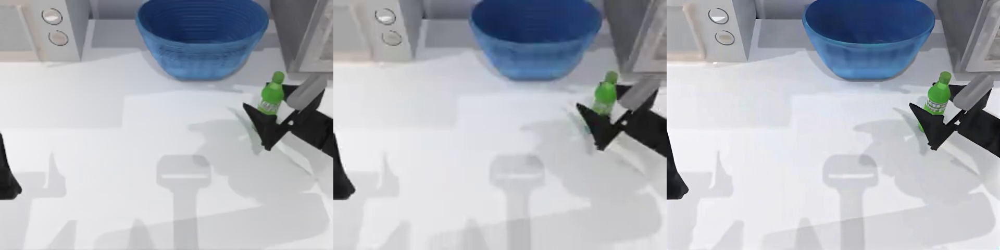
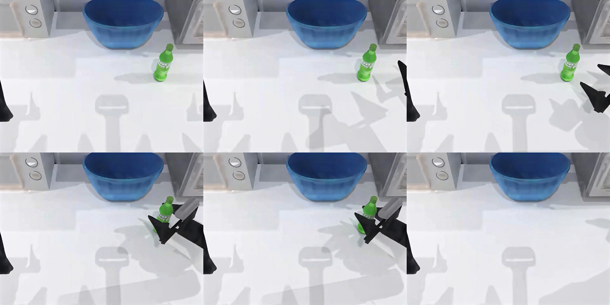

# SeedVR2-7B H100 diagnostic: functional pass, quality fail

One predeclared official SeedVR2-7B candidate ran on the same frozen main and
unchanged-light inputs used for the failed 3B result. Both official inference
processes completed on one full-memory H100, all outputs were read back and
hash-verified, and no repeat candidate was submitted.

This is a controlled source-overlay diagnostic, not shipped 7B support. The
reviewed 3B image supplied the runtime and exact upstream source; only the
pinned 7B entrypoint's unavailable TorchVision video import was replaced with
the already reviewed PyAV adapter.

| Identity | Value |
| --- | --- |
| Upstream source | `e4de8c24441a67e1b7df56abea10645059bb1185` |
| 7B model revision | `eb0c4281d41ba3767d4f14370f0e37e9e9180c16` |
| 7B checkpoint SHA-256 | `e1b2ae25505607e61f2a7dc7967ba778aaf3e3626d9969ce6e24c52d9ddebfcd` |
| Runtime image digest | `sha256:5b4258c7a3be29962c928237fa2d46bcc9667db02757349ad114033df21db7ca` |
| Hardware | NVIDIA H100 80GB HBM3, compute capability 9.0, non-MIG |
| Main output | 100 unique 640×480 frames; SHA-256 `55f360f78105390607ea71d93fea4e9b1bc2207d29ac728bd782a265b99b7b70` |
| Light output | 25 unique 640×480 frames; SHA-256 `b84813dc9438964e09c55e6dda4fa3e41a63d3bcae9f353c7a2abeba26bfdc9a` |

## Frozen objective result

The unchanged revision-15 gates still reject the candidate:

| Main metric | Bicubic baseline | SeedVR2-7B | Requirement / result |
| --- | ---: | ---: | --- |
| Median LPIPS ↓ | 0.11442816 | 0.10026307 | Improvement 0.01416509; needs ≥0.01: **PASS** |
| Median temporal warp error ↓ | 0.00156515 | 0.00244091 | Ratio 1.5595×; maximum 1.15×: **FAIL** |
| Median SSIM ↑ | 0.95937142 | 0.94616300 | Regression 0.01320842; within 0.08 limit: **PASS** |
| Median mask IoU ↑ | 0.86574586 | 0.91309071 | **PASS** |
| Median mask centroid error, px ↓ | 2.01676585 | 0.95332806 | **PASS** |

Compared with the [independently published exact 3B result](https://github.com/nebius/nebius-physical-ai/blob/0db7db260bbc526061a26c3a16999f94e92b705f/docs/testing/evidence/seedvr-h100-exact-b8d9c9c5/objective-metrics.json),
7B lowers median LPIPS by 0.01113 and temporal error by 0.000126, but it does
not close the frozen temporal gate. The unchanged-light output also has a
5.741× median edge-overshoot ratio, worse than 3B's 4.423× diagnostic value.
The exact source metrics and public/private report hashes are embedded in
[objective-metrics.json](objective-metrics.json). No threshold was relaxed.

The complete per-frame, per-pair, mask, stratum, and light-input measurements
are in [objective-metrics.json](objective-metrics.json).

## Matched media

Frame 60, left to right: source reference → bicubic baseline → generated 7B
restoration. Every panel was verified against the exact decoded frame:

Generated 7B frames 0, 20, 40 / 60, 80, 99:

Open [restored-7b.mp4](restored-7b.mp4) and [bicubic.mp4](bicubic.mp4) for the
matched two-second, 100-frame clips. The source and unchanged-light clips remain
private.

## Hosted review

The blinded downstream annotation run retained 20 real MiniMax-M3 responses.
All responses were schema-valid and both controls passed. Candidate exact task
tuples improved to 2/9 from bicubic's 1/9, and field accuracy improved to 15/27
from 8/27. It nevertheless **failed** because it introduced four new critical
contradictions: motion at frames 60 and 76, plus visibility and grasp state at
frame 96.

Nine non-gating Kimi-K2.6 comparisons preferred the candidate in seven cases
and called two equivalent. They reported no unsupported detail or critical
failure. This is presentation evidence only: the model was disqualified as an
acceptance judge before candidate bytes existed, and visual preference cannot
override the objective or annotation failures.

Selected scored rows, all 29 exact submitted-image hashes, raw-response hashes,
and limitations are in [hosted-review.json](hosted-review.json).

## Scope and limits

This result supports only the claim that the pinned official 7B path can run in
the controlled diagnostic environment. It does not qualify a 7B CLI, SDK,
container, or workflow, and it does not establish recovery of unobserved truth,
task success, temporal faithfulness, or generalization. Generated detail is a
review aid, never sensor truth, geometry, calibration evidence, policy-success
evidence, or training ground truth.

Model weights were fetched at runtime from pinned public Apache-2.0
repositories and were not baked into the image or this evidence. The optional
third-party color-fix implementation was not used.

Derived from **Li, Zhiyuan / Hoshipu, RoboPro**, revision
`90ec789bf4018eb9c0f75da9f69aab5c185f0fd0`, under
[CC BY 4.0](https://creativecommons.org/licenses/by/4.0/). See
[attribution.json](attribution.json), [provenance.json](provenance.json), and
[sanitized workload evidence](workload-evidence.json).

[Independent audit](independent-audit.json) verified five retained artifact hashes, terminal platform receipts, ten saved metric medians, both output videos and the selected scored-review fields. [Independent comparison-pixel audit](independent-pixel-audit.json) reproduced all three frame-60 panels and six sampled tiles using the originally bound Linux decoder. A separate macOS FFmpeg8.1 check differed by1–2 channel values due to decoder output rounding and was retained as non-exact; no tolerance was substituted for the exact comparison. The independent audit did not rerun LPIPS/flow inference or rescore raw hosted provider envelopes.

[SHA256 file manifest](SHA256SUMS).

Correction: the original attachment omitted the submitted-image hash fields that its README referenced. This revision supplies all 29 bindings, explicitly distinguishes image hashes from response-record hashes, and pins the 3B comparison and media hashes. Retained image bytes and completed-response bindings were independently rechecked; the failed objective and annotation verdicts are unchanged.
