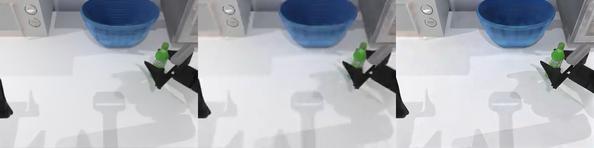
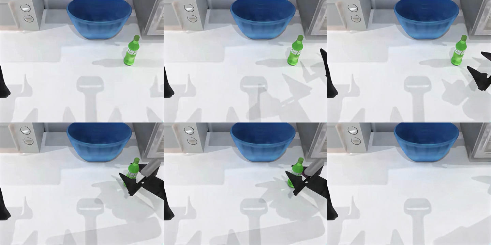

# SeedVR2 H100 diagnostic: quality gates failed

**Objective acceptance: FAIL.** Real official SeedVR2 3B inference completed on an H100 for the 100-frame main clip and 25-frame light-input control. The generated video decodes correctly, but the main result misses the frozen LPIPS improvement and temporal-consistency requirements. **PR #593 is not qualified by this diagnostic.**

| Frozen main metric | Bicubic baseline | SeedVR2 diagnostic | Requirement / result |
| --- | ---: | ---: | --- |
| Median LPIPS ↓ | 0.11442816 | 0.11139644 | Improvement 0.00303172; needs ≥0.01: **FAIL** |
| Median temporal warp error ↓ | 0.00156515 | 0.00256723 | Ratio 1.6402×; maximum 1.15×: **FAIL** |
| Median SSIM ↑ | 0.95937142 | 0.94102454 | Declines by 0.01834688; within the allowed 0.08 regression, **not an improvement** |
| Median mask IoU ↑ | 0.86574586 | 0.91832230 | Passes the narrow sampled-mask gate |
| Median mask centroid error, px ↓ | 2.01676585 | 1.05069107 | Passes the narrow sampled-mask gate |

All 100 frame measurements, 99 temporal pairs, nine sampled mask comparisons, strata and frozen thresholds are in [objective-metrics.json](objective-metrics.json). All remaining main gates pass, including no black frame and no critical outlier under the frozen definitions. Those individual passes do not override the two failed gates.

**Frame 60, left to right: source reference → bicubic baseline → SeedVR2 generated restoration.** Each panel was verified pixel-for-pixel against its decoded frame. The source is an upstream dataset reference, not independently verified sensor truth.

**Generated restoration, sampled frames 0, 20, 40 / 60, 80, 99:**

Open or download [restored.mp4](restored.mp4) (238KB) and [bicubic.mp4](bicubic.mp4) (82KB). Both are 640×480, 50 fps, 100 frames and 2 seconds. PNGs and MP4s are the original retained derivative bytes, without retouching for publication. The original source video remains private.

Independent visual inspection found sharper displayed contours and changed/smoothed fine texture in the bowl and countertop. It does not establish faithful physical state, successful manipulation, temporal consistency or overall improvement. A separate matching 100-frame FFmpeg SSIM diagnostic also worsens: 0.973306→0.961645 ([measurement scope](independent-ssim.json)). That uses YUV SSIM and does not replace the frozen metric implementation.

The light-input result also remains visible in the numeric report: 25 frames, median LPIPS 0.19684024, SSIM 0.90303087, temporal error 0.00355289, and edge-overshoot ratio 4.4231×. These are diagnostic oversharpening measurements, with no invented light-input acceptance threshold. Its generated artifact hash is retained in [provenance.json](provenance.json); that video is not included here. **Current candidate hosted VLM review is pending at this snapshot.** No final blinded preference, usefulness, physical-correctness or safety verdict is claimed.

This run used predecessor image `sha256:c34783b2aed18553cbbcb43d870e6658ba423c105db6f376c41e115efbf3e366` with reviewed adapter `b8d9c9c56d8adc2ec76a5a41fd37e97e0069e2f4` overlaid for diagnosis. The embedded image source remains `e2bae7ace62543b4f5d9c0cc97db6d563e381f1b`. It is **not exact-built-image or shipped-workflow acceptance**. The artifact verifier reports artifact/runtime consistency only and explicitly does not attest producer execution; separate operator platform evidence is retained privately. Full model/source identities and these limitations are in [provenance.json](provenance.json).

Derived from **Li, Zhiyuan / Hoshipu, RoboPro**, revision `90ec789bf4018eb9c0f75da9f69aab5c185f0fd0`, [this source asset](https://huggingface.co/datasets/Hoshipu/RoboPro/blob/90ec789bf4018eb9c0f75da9f69aab5c185f0fd0/lerobot/roboreal_all_80tasks/videos/chunk-000/observation.images.cam_high/episode_000000.mp4), under [CC BY 4.0](https://creativecommons.org/licenses/by/4.0/). The [pinned dataset card](https://huggingface.co/datasets/Hoshipu/RoboPro/blob/90ec789bf4018eb9c0f75da9f69aab5c185f0fd0/README.md) describes Aloha-Agilex demonstrations and maps this asset through its published layout; we do not independently verify real-world capture. These are modified and generated images: temporal selection, degradation, bicubic scaling, model restoration and contact-sheet arrangement. No endorsement by the dataset creators or model authors is implied. [Full attribution](attribution.json).

[File hashes](SHA256SUMS) · [Numeric metrics](objective-metrics.json) · [Media validation](media-validation.json) · [Pixel/source verification](pixel-and-source-verification.json). The retained original objective report SHA256 is `896caf266aae34e601e484b4378e61f304ee605719ac7144216ced184e427b05`; the public JSON is an explicit field selection, not the raw private report.
