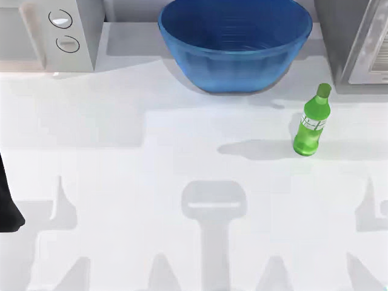
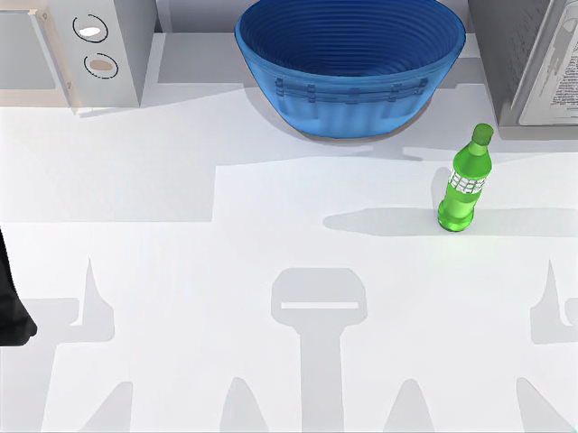

# SeedVR2 3B: actual baseline controls

These are the unedited official **sample-conditioning baseline outputs** from real inference on one B200. Independent review verified their identity and integrity. **This is not a candidate quality pass.**

| Actual output | Frames | Duration | Size |
| --- | ---: | ---: | --- |
| [Main baseline video](main-sample.mp4) | 100 | 2 seconds | 640×480, 50 fps |
| [Light baseline video](light-sample.mp4) | 25 | 0.5 seconds | 640×480, 50 fps |

The main input was spatially degraded to 320×240. The light control uses 25 source-resolution frames. Both invoke the same 3B model with seed 666, one diffusion step and the original sample-conditioning path. The PNGs below are exact pre-encode frames, so they can differ slightly from the lossy H.264 video.

The independent replay rehashed 173 actual artifacts (1,011,326,651 bytes), directly checked all 125 PNGs against preserved decoder RGB data, fully decoded all 125 MP4 frames, and verified the actual image, model, input, posterior selection and execution identities. It did not select controls by favorable quality. No posterior-mode candidate or heldout was executed in this control run.

The fixed quality comparison is separate and remains pending. Earlier quality failures are retained. These generated transformations of a synthetic robot-kitchen scene do not establish recovered sensor truth, restoration accuracy, robotics safety or policy improvement. Image publication/release readiness also remains separate from these private runtime controls.

[Results and provenance hashes](results.json) · [Attribution](attribution.md) · [File checksums](SHA256SUMS)
