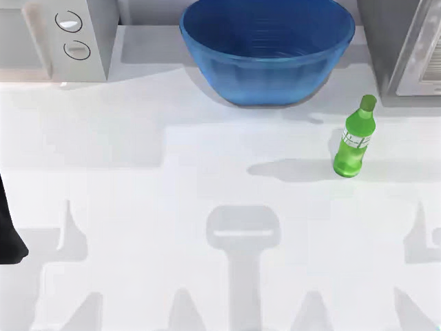
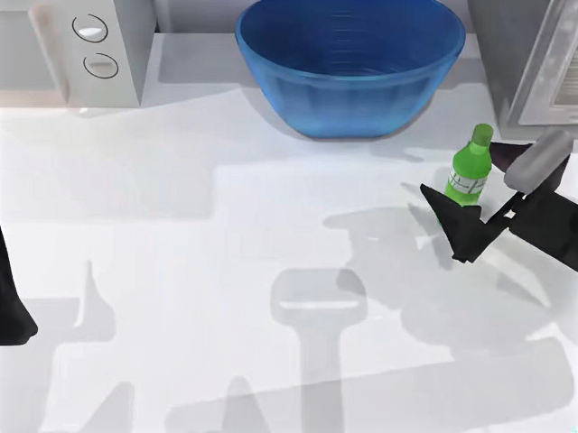
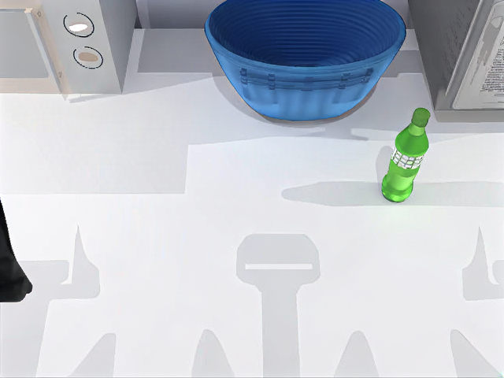

# SeedVR2 3B posterior-mode comparison: failed quality gate

These are the actual sample controls and posterior-mode candidate outputs from the fixed main/light tuning inputs. Both arms passed independent output, model, image, tensor and RNG identity review. The candidate failed the unchanged objective quality gate; heldout data remains sealed. H100/sample defaults remain unchanged.

| Measurement | Sample control | Posterior mode | Required |
| --- | ---: | ---: | --- |
| Main LPIPS improvement over bicubic | 0.00350978 | 0.00345450 | ≥ 0.010 |
| Main temporal error / bicubic | 1.71096× | 1.68860× | ≤ 1.15× |
| Light temporal error | 0.00337059 | 0.00346674 | No regression |

Detail retention passed (0.999373 overall), as did frame integrity and the other main objective checks. The codec control failed: preencode temporal error worsened, and the small encoded improvement was below the measured codec perturbation. No annotation or VLM acceptance was attempted after the objective failure, and neither could override it.

- Main: [sample control](main-sample.mp4) · [posterior-mode candidate](main-posterior-mode.mp4)
- Light: [sample control](light-sample.mp4) · [posterior-mode candidate](light-posterior-mode.mp4)
- [Full numeric results and immutable provenance](results.json) · [Attribution](attribution.md) · [File hashes](SHA256SUMS)

The sole intervention selects the posterior mean for conditioning while retaining the genuine posterior sample draw and equal RNG/noise. Actual inference used SeedVR2 3B, the frozen weights, BF16, one diffusion step, seed 666, 640×480 output, 50 fps, full-memory non-MIG B200 and the actual f1de/72a source/image. The separate physical GPU UUID was recorded privately; all frozen device/runtime properties matched. Media files are unchanged copies of the reviewed outputs.

This is synthetic RoboPro robot-kitchen footage. Generated pixels are not recovered sensor truth or evidence of robot safety or policy improvement. Earlier failed experiments remain valid. The later 3ea service image has separate build/qualification requirements; no GPU result is transferred to that image. Two pre-metric invocation failures were retained before the unchanged evaluator produced this result; no result-based rerun or threshold change occurred.

## Exact preencode frame pairs

These images are unmodified frame files from the two reviewed arms, with the same input/time index.

| Frame | Sample control | Posterior mode |
| --- | --- | --- |
| Main 0 |  |  |
| Main 50 |  |  |
| Light 0 |  |  |
