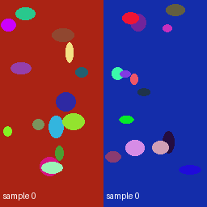

# Edit a GPU application with Ray Jobs

Build an image-retrieval dataset with Workbench's real CLIP embedding function.
You will see rendered images, a Parquet file of 512-dimensional vectors, and a
searchable Lance table. Then change one Python line and submit it again with
**Ray Jobs, without rebuilding the container**.

Here is one input and the two crops from the verified GPU run:

| Input | Baseline crop | Edited crop |
| --- | --- | --- |
|  |  |  |

SkyPilot creates your development workers. Ray schedules the Python tasks and
GPU actors, transfers your source, and owns application job control. You keep the
workers while editing, download the results, then remove the workers.

## What you need

Use a Linux NPA development host with this repository, Python 3.12, `kubectl`,
OpenSSH and `rsync`. Your platform operator supplies a **healthy SkyPilot API
configured for a dedicated namespace on Nebius GPU Kubernetes**, plus the
matching private kubeconfig. The namespace's NetworkPolicy must be enforced by
the cluster's network plugin. Each basic run reserves one RTX PRO 6000 GPU;
the optional distributed check reserves two.

If you operate the host yourself, install the clients below, then complete the
[one-time platform setup](../../npa/workflows/workbench/ray-clip-development/platform/README.md).
That checked-in Compose contract creates and verifies the private API and
namespace, defines their owner and cleanup, and reuses them across development
clusters. It does not create the underlying Kubernetes cluster or GPU capacity.
A pre-existing API is usable only after the same backend/permission/dry-run
checks pass; a healthy HTTP response alone is insufficient.

The example uses the public, MIT-licensed
[CLIP model](https://huggingface.co/openai/clip-vit-base-patch32). It needs no
Hugging Face token. The worker downloads pinned weights and Python packages;
allow access to Docker Hub, PyPI and Hugging Face. Its pinned PyTorch image runs
as root **inside an unprivileged pod**, so your pod policy must permit that user.
No customer dataset or storage credential is needed.

From the repository root, prepare the two client tools. If NPA is already
installed in this checkout's `npa/.venv`, keep that environment and begin at the
first `export` below:

```bash
python3.12 -m venv npa/.venv
npa/.venv/bin/python -m pip install -e npa
export SKYPILOT_DISABLE_USAGE_COLLECTION=1
npa/.venv/bin/npa skypilot bootstrap
export NPA_SKYPILOT_BIN="$(npa/.venv/bin/npa skypilot status --bin-path)"

python3.12 -m venv "$HOME/.venvs/ray-clip"
"$HOME/.venvs/ray-clip/bin/pip" install 'ray[default]==2.58.0'
source "$HOME/.venvs/ray-clip/bin/activate"
```

SkyPilot is NPA's isolated **0.12.2** installation; the application and Jobs
client use **Ray 2.58.0**. They are different runtimes. Do not install Ray into
SkyPilot's environment.

## Start your development cluster

Keep the platform setup's `KUBECONFIG` and `SKYPILOT_API_SERVER_ENDPOINT` in
this terminal. If an operator prepared the host, set those two standard variables
to the private kubeconfig path and API URL they supplied. The API must already
be configured for that same context and namespace; changing only the client
kubeconfig does not retarget this fixed backend. Keep access configuration
outside the source directory.

From the repository root, choose a fresh cluster name and a durable local result
location. Then copy the canonical Workbench UDF into the example:

```bash
CLUSTER="clip-dev-$(date +%s)"
RESULTS="$HOME/ray-clip-results/$CLUSTER"
KUBE_CONTEXT="$(kubectl config current-context)"
cd npa/workflows/workbench/ray-clip-development
cp ../../../src/npa/workbench/lancedb/bdd100k_udfs.py npa_lancedb_bdd100k_udfs.py
"$NPA_SKYPILOT_BIN" check kubernetes \
  --config "kubernetes.allowed_contexts=[\"$KUBE_CONTEXT\"]" -o json
"$NPA_SKYPILOT_BIN" launch cluster.yaml -c "$CLUSTER" \
  --infra "k8s/$KUBE_CONTEXT" \
  --config "kubernetes.allowed_contexts=[\"$KUBE_CONTEXT\"]" --dryrun --yes
"$NPA_SKYPILOT_BIN" launch cluster.yaml -c "$CLUSTER" \
  --infra "k8s/$KUBE_CONTEXT" \
  --config "kubernetes.allowed_contexts=[\"$KUBE_CONTEXT\"]" --detach-run --yes
```

Require the check to report `"Kubernetes": ["compute"]` and the dry run to
complete for the intended backend. The example's accelerator name is
`RTXPRO-6000-BLACKWELL-SERVER-EDITION:1`, as reported by the tested SkyPilot
GPU catalog. If your backend uses a different label, inspect it with
`"$NPA_SKYPILOT_BIN" gpus list --infra "k8s/$KUBE_CONTEXT"` and
set the matching compatible accelerator in `cluster.yaml`; do not relabel
shared nodes to fit the example.

`cluster.yaml` requests one GPU and starts an application Ray service. Its small
`cluster/` directory prepares dependencies and public weights once. It does
**not** copy application source: the later `ray job submit --working-dir .`
command does that. The copied UDF is a snapshot of the actual Workbench implementation. If you
edit that implementation in `npa/src`, repeat the copy before submitting.

A first launch includes image pulling, SkyPilot bootstrap, package installation,
model download and Ray startup. Subsequent source jobs reuse this prepared
worker. After SkyPilot reports the task submitted, open the private Jobs connection:

```bash
ssh -fN -o ExitOnForwardFailure=yes -o ControlMaster=yes \
  -S "$HOME/.ssh/$CLUSTER.sock" -L 8265:127.0.0.1:8265 "$CLUSTER"
ray job list --address http://127.0.0.1:8265
```

SSH runs the tunnel in the background; its control socket lets you close this
exact connection later. Stay in the same terminal and application directory. A successful `ray job list`
is the Jobs readiness check. If Ray is still starting, inspect the service with
`"$NPA_SKYPILOT_BIN" logs "$CLUSTER" 1`, wait for “Ray runtime started,”
press Ctrl-C to leave log following, and repeat `ray job list`. Log following
does not cancel the service. This uses SkyPilot's generated SSH alias and Kubernetes-authenticated forwarding;
there is no public Jobs port. The namespace policy permits Ray traffic only
between its trusted pods. Ray 2.58 offers optional token authentication; this
recipe does not enable it. Access is protected by SSH and network policy, and a
Ray namespace is not a security boundary.

## Embed images and see the result

Submit a normal Python application:

```bash
ray job submit --address http://127.0.0.1:8265 \
  --submission-id clip-baseline --working-dir . -- \
  python embed.py --output-path /tmp/ray-clip-results/baseline
ray job status --address http://127.0.0.1:8265 clip-baseline
ray job logs --address http://127.0.0.1:8265 clip-baseline
```

Submission streams logs and returns after the application exits. Expect
`SUCCEEDED`, “Embedded 4096 RGB images on 1 CUDA actor(s),” and retrieval IDs.
The essential computation in [embed.py](../../npa/workflows/workbench/ray-clip-development/embed.py)
is ordinary Ray Core:

```python
clip_actor = ray.remote(num_gpus=1, num_cpus=1)(ClipModel)
model = clip_actor.remote("/tmp/npa-clip-model")
prepare = ray.remote(num_cpus=1)(worker.preprocess_shard)
shard = prepare.remote(list(range(64)))
result = ray.get(model.infer.remote(shard))
```

Inside that actor, inference calls the real Workbench function:

```python
images = [row["image_bytes"] for row in shard["rows"]]
batch = pyarrow.record_batch({"image_bytes": images})
vectors = self.workbench.udf_clip_embedding(
    batch, device="cuda:0", precision="float32",
)
```

`ClipModel` loads Workbench's CLIP function once into its CUDA actor and reuses
those weights for subsequent batches. The driver combines results and writes
`embeddings.parquet`, `lance/embeddings.lance`, `retrieval.json`, `preview.png`
and `report.json`. Retrieval queries use vectors from known rows and verify
that the matching row is returned. These procedural images prove execution and
retrieval consistency; **they do not measure semantic model accuracy**.

After submission finishes, download the result:

```bash
mkdir -p "$RESULTS"
rsync -az "$CLUSTER:/tmp/ray-clip-results/" "$RESULTS/"
(cd "$RESULTS/baseline" && sha256sum -c SHA256SUMS)
cat "$RESULTS/baseline/retrieval.json"
```

Open `$RESULTS/baseline/preview.png` in your image viewer: each row shows the
original RGB image and the crop that CLIP actually embedded. The local directory
is the persistent copy; worker `/tmp` disappears at teardown. `SHA256SUMS`
verifies the downloaded Parquet, Lance data, images and report against the
worker's manifest. Keep the local results on durable storage; upload them to
your usual artifact store if another workflow must consume them.

## Change one line and run again

In `worker.py`, change:

```python
CROP_POLICY = "left"
```

to `CROP_POLICY = "right"`. This changes the pixels sent to CLIP from the red
half of each image to its blue half. Submit the edited directory:

```bash
ray job submit --address http://127.0.0.1:8265 \
  --submission-id clip-changed --working-dir . -- \
  python embed.py --output-path /tmp/ray-clip-results/changed
```

Ray hashes and uploads the changed source package. You do not run `sky launch`,
`sky exec`, `pip install` or an image build for this edit. The new Job creates a
new actor and reloads model weights; this is source redeployment, not hot reload
of a resident model. `report.json` records the imported source hashes on the
GPU actor and CPU workers, CUDA version and stage timings.

Restore that line to `CROP_POLICY = "left"` and submit once more:

```bash
ray job submit --address http://127.0.0.1:8265 \
  --submission-id clip-restored --working-dir . -- \
  python embed.py --output-path /tmp/ray-clip-results/restored
```

Download and verify all three results, then compare the actual vectors using
NPA's already installed NumPy and PyArrow:

```bash
rsync -az "$CLUSTER:/tmp/ray-clip-results/" "$RESULTS/"
for run in baseline changed restored; do
  (cd "$RESULTS/$run" && sha256sum -c SHA256SUMS)
done
../../../.venv/bin/python - "$RESULTS" <<'PY_COMPARE'
from pathlib import Path
import sys
import numpy
import pyarrow.parquet
root = Path(sys.argv[1])
vectors = []
for revision in ("baseline", "changed", "restored"):
    table = pyarrow.parquet.read_table(root / revision / "embeddings.parquet")
    vectors.append(numpy.asarray(table["vector"].to_pylist()))
changed = numpy.linalg.norm(vectors[0] - vectors[1], axis=1) > 0.01
print(f"Meaningfully changed vectors: {changed.sum()}/{len(changed)}")
assert changed.mean() >= 0.99
numpy.testing.assert_allclose(vectors[0], vectors[2], rtol=0, atol=1e-5)
print("Restored vectors match baseline within 1e-5.")
PY_COMPARE
```

The [validation record](../architecture/ray-fast-development-audit.md) includes
measurements and the tested runtime boundary.

## Finish

Use `ray job stop --address http://127.0.0.1:8265 <submission-id>` to cancel a
specific running application; inspect `ray job status` until it says `STOPPED`.
Do this before closing the tunnel if a job is still running. Completed Jobs need
no separate finish command.

Once your artifacts are downloaded and verified:

```bash
ssh -S "$HOME/.ssh/$CLUSTER.sock" -O exit "$CLUSTER"
"$NPA_SKYPILOT_BIN" queue "$CLUSTER"
# The queue shows the ID of the one Ray service task launched above.
"$NPA_SKYPILOT_BIN" cancel "$CLUSTER" 1 --yes
"$NPA_SKYPILOT_BIN" down "$CLUSTER" --yes
rm npa_lancedb_bdd100k_udfs.py
```

For a fresh cluster the service task is Job 1; use the actual queue ID if you
restarted that service. `sky down` removes only this named development cluster.
It does not destroy the platform namespace/API, underlying Kubernetes cluster,
GPU nodes, or another customer's resources. Keep `$RESULTS`. If you also own
the platform and are finished with all its development clusters, follow the
[platform cleanup](../../npa/workflows/workbench/ray-clip-development/platform/README.md#finish-the-platform)
after this cluster cleanup.

## Distributed and failure checks

The [advanced recipe](../../npa/workflows/workbench/ray-clip-development/README.md)
adds two workers, concurrent GPU actors, committed-shard replay after an actor
restart, and exact Jobs cancellation. It uses the same native Jobs connection;
it is optional for ordinary source editing.

The [comparison and ownership assessment](../architecture/ray-development-guide-design.md)
explains which responsibilities belong to Ray, SkyPilot and Workbench. This is a
guarded tool-specific development example, not another workflow catalog.
`npa.workflow` remains the durable production composition contract.
