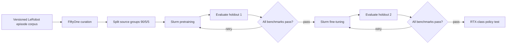

# Operator Slurm policy adapter contracts

The single shipped turnkey pipeline is
[`robot-policy-train-and-serve.yaml`](../../../workflows/testing/robot-policy-train-and-serve.yaml),
with its [operator cookbook](robot-policy-train-and-serve.md). It uses managed
Kubernetes and torchrun and includes native training, measured gates, serving
and standalone HTML/MP4 proof.

This page documents the existing Slurm adapter for operator-owned model scripts.
It is not another turnkey recipe. It requires a privately authored workflow,
real training and evaluation scripts, and access to the selected Slurm or
Soperator allocation. The adapter does not bundle a model, simulator or robot
controller. Its contract tests retain a JSON fixture under `npa/tests/fixtures/`;
the NumPy planar teaching worker cannot pass production validation or gates.
See [training design and batch adapters](foundation-training.md) for distributed
launch recipes, data mixtures and checkpoint hooks.



Both holdouts remain evaluation-only. Fine-tuning uses the training partition;
it never trains on either evaluation holdout. Repeated decisions on a holdout
make it a development evaluation set, so reserve a separate untouched dataset
for any final generalization claim. The split operates on source-lineage groups,
not frames. Related synthetic variants must carry the same group as their real
source. Approximately 90/5/5 of groups are assigned to training and the two
holdouts: each holdout gets `floor(groups / 20)`, with the remainder in training.
Unequal group sizes can produce different episode percentages.

Each failed gate repeats only its own training phase. Later attempts resume the
previous candidate; the first fine-tuning attempt starts from the checkpoint
approved by the first gate. Each attempt has distinct candidate, evaluation,
request, and decision artifacts. All required evaluation systems must meet their
configured success-rate thresholds. There is no automatic retry-count or time
limit, and no invented success score.

## Prepare private inputs

Use non-customer data for validation. Keep all runtime manifests, script paths,
checkpoints, endpoints, and raw logs in access-controlled storage outside Git.
The source presentation is not a pipeline input and must not be staged.

Populate the four input URIs under the selected run prefix before submission.
Override them with `--var` when inputs already exist elsewhere. `bucket` and
`prefix` choose the run's private artifact destination; `split_seed` fixes group
assignment. `slurm_service_account` selects the service account for Slurm client
pods, defaulting to the generic name `policy-batch-client`.

1. `episodes_uri`: a `npa.policy.episodes.v1` JSON manifest. Each episode needs
   `dataset_uri`, integer `episode_index`, stable `group_id`, `source` (`real` or
   `synthetic`), `preview_uri`, `detections` (provided detector label strings),
   and boolean `inhouse_keep` (the existing review result).
2. `curation_policy_uri`: numeric `min_brightness`, `max_brightness`,
   `min_sharpness`, and integer `min_detections`. Brightness is mean grayscale in
   `[0,1]`; sharpness is the variance of the four-neighbor Laplacian on that
   normalized preview. Supply thresholds appropriate to the camera and task.
3. `gate_policy_uri`: phase-to-system threshold maps, for example
   `{"pretrain":{"spatial_tasks":0.8,"goal_tasks":0.9},"finetune":{"simulation":0.9}}`.
   These values illustrate the format; the operator chooses the real systems
   and thresholds. Empty policies, invalid probabilities and missing systems fail.
4. `batch_settings_uri`: private Slurm transport and script selection, described
   below. No credentials belong in this JSON.

The curation stage invokes real FiftyOne dataset queries. Where supplied, it
compares its selection with the optional boolean `inhouse_keep` review and
reports the reviewed and disagreement counts. Without review labels, the
disagreement count is null; public data does not fabricate an in-house review.
It checks
LeRobot `meta/info.json` for `codebase_version: v3.0` and episode-count bounds.
It retains references to the source dataset, rather than rewriting LeRobot
Parquet/video shards. Training scripts must load precisely the listed episode
indices. Missing source files and source-version incompatibility remain errors
for the consuming trainer.

Curation records every episode's quality flag and measurements independently of
selection. Set `selection: all` to retain flagged episodes for an ablation;
`selection: quality-pass` is the default. The report preserves quality decisions
for rejected episodes, and source datasets are never deleted.

Quality checks cover the supplied preview frame. Object detections are supplied
labels, not a detector run by this stage. A full-video quality or detection
pipeline should produce those reviewed inputs upstream. Curation fails if
FiftyOne is missing or selects no episodes; splitting fails with fewer than
twenty independent groups. There is no fallback selection engine.

## Slurm runtime and script contract

For Soperator, use `transport: soperator` and set `namespace`, `login_pod`, and
`login_container` in the private settings. The worker uses the Kubernetes Python
client and its service account to execute `chroot /mnt/jail sbatch` in that login
container. Grant only the needed pod access and `pods/exec` permissions. An
optional `context` selects a mounted kubeconfig for a separate cluster. Without
it, the client uses in-cluster authentication. The workflow does not create or
change clusters, service accounts, RBAC, or credentials.

For execution on an existing Slurm login host, `transport: local` invokes the
installed Slurm clients directly. In either mode, `scripts` must map all five
names to absolute script paths on the login host:

```json
{
  "transport": "local",
  "scripts": {
    "pretrain": "/shared/jobs/pretrain.sh",
    "evaluate-pretrain": "/shared/jobs/evaluate-pretrain.sh",
    "finetune": "/shared/jobs/finetune.sh",
    "evaluate-finetune": "/shared/jobs/evaluate-finetune.sh",
    "deploy": "/shared/jobs/test-policy.sh"
  }
}
```

Scripts own their `#SBATCH` resource requests, model environment, evaluation
implementations and storage credentials. Pretraining can request multiple Slurm
nodes; the policy-test script should request the intended RTX-class partition
and operator-configured robot or simulator. The Workbench pods request only CPU
resources. Slurm burst capacity is managed by the existing cluster configuration;
this workflow does not substitute a SkyPilot GPU job for a Slurm batch job.

Each script receives `--request-uri URI`. The JSON request supplies `run_id`,
`stage`, `iteration`, `partition`, a `dataset` manifest URI and digest, an input
`checkpoint` where applicable, and a unique `result_uri`. Retrieve input data
explicitly: Slurm does not transfer dataset files for the script. The adapter
uses [`sbatch --parsable`](https://slurm.schedmd.com/sbatch.html) to obtain a job
ID immediately, then short `squeue` and `sacct` calls to monitor that exact job.
This requires Slurm accounting and ordinary, non-array jobs on one cluster.
Each iteration keeps an immutable request and a durable `submission.json` under
its private `attempts/` directory. The submission reservation uses conditional
S3 creation (or exclusive local file creation), so another invocation cannot
submit a duplicate. Resume with the same run and output paths to adopt the job.

A lost connection leaves the job running. When the submission response was lost,
resume reconciles its unique name against queue and accounting records. Missing,
ambiguous or changed identity evidence stops without cancellation or resubmission;
an operator must resolve that uncertainty before starting a replacement run.
SIGINT/SIGTERM while monitoring requests cancellation of the recorded job ID.
Cancellation failure preserves the original interruption and private diagnostics.
Script stdout/stderr belong in the script's private `#SBATCH --output`/`--error`
files. Client failures, terminal accounting and stage tracebacks are retained in
private `diagnostics/` JSON artifacts beside the attempt or stage output. Keep
those prefixes access controlled; never publish their raw contents. If diagnostic
storage itself fails, the console reports that fact without masking the stage error.

Until-only loops have no default duration, spending or iteration limit. A training
result that repeats the input checkpoint SHA-256 fails immediately, even if its
URI changed. This detects unchanged weights, not eventual convergence; operators
can cancel a run whose changing checkpoints continue to miss the fixed threshold.

Write a result only after the work and artifact uploads complete:

```json
{
  "schema": "npa.policy.batch-result.v1",
  "status": "completed",
  "engine": "operator-trainer",
  "request_sha256": "<canonical-request-sha256>",
  "checkpoint": {"uri": "<private-checkpoint-uri>", "sha256": "<checkpoint-sha256>"},
  "systems": {
    "spatial_tasks": {"successes": 8, "trials": 10},
    "goal_tasks": {"successes": 9, "trials": 10}
  }
}
```

Compute `request_sha256` with `npa.workflows.policy_training.contracts.digest`.
The hash binds the full JSON request, including its unique result destination.
All results must name the actual execution `engine`; missing engines and the
planar reference engine are rejected by production validation and gates.
Training results require the checkpoint identity. Evaluation results additionally
require each configured system's integer task-success counts and must identify
the exact requested checkpoint. The deployment test additionally requires
`policy_test_report_uri`. Batch scripts must compute the actual checkpoint hash
and report measurements honestly; the adapter verifies the result contract and
provenance, not model correctness or the semantics of arbitrary external code.

Source scripts, weights, datasets, benchmark access, image validation, and robot
execution permission are operator prerequisites. Staging NPA source does not
stage these dependencies. The existing FiftyOne workbench image serves curation;
use a validated immutable image override when required by the deployment.

## Using operator scripts

Private workflows that call these adapters must use runtime submission for
condition-only promotion loops. Validate and plan the private spec with the
standard Workbench commands, then verify its storage, access, worker images,
service account and scripts before submission. A successful plan proves neither
training nor model quality. These contracts have no separately shipped YAML or
live-matrix recipe; the public train-and-serve workflow is the canonical entry.

## Tests and cleanup

Focused unit tests exercise split isolation, failure handling, request binding,
checkpoint identity, thresholds, and independent retry loops:

```bash
npa/.venv/bin/python -m pytest npa/tests/workflows/test_policy_training.py \
  npa/tests/orchestration/npa_workflow/test_policy_training_spec.py -q
```

The real curation test uses locally generated images and a generated metadata
fixture. It does not prove model training or complete dataset ingestion. Install
the same FiftyOne runtime used by the worker; the local validation environment
used FiftyOne 1.22.0 with `graphql-core<3.3` for Strawberry compatibility.

```bash
NPA_INTEGRATION_E2E=1 FIFTYONE_DO_NOT_TRACK=1 npa/.venv/bin/python -m pytest \
  npa/tests/e2e/test_policy_training_live.py -q
```

The second test submits the real Slurm pipeline only when
`NPA_E2E_POLICY_TRAINING_SPEC`, `NPA_E2E_POLICY_TRAINING_RUN_ID`, and
`NPA_E2E_POLICY_TRAINING_RESULT_URI` identify a privately prepared spec and run.
It checks the terminal policy-test result. These operator-owned inputs are not
shipped; the general submit matrix registers only the canonical public workflow.

Cancel the workflow before deleting its artifacts or changing the cluster.
Confirm any submitted Slurm job has stopped, especially after a disconnected
client. Preserve checkpoints and decision evidence needed for review; remove
only the selected run's private output prefix when it is no longer needed.
The workflow neither destroys the shared cluster nor publishes model artifacts.
