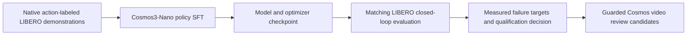

# Cosmos 3 policy model factory

[Workbench docs](README.md)

The new [workflow](../../workflows/testing/cosmos3-policy-model-factory.yaml)
runs one native LIBERO-10 policy learning round. It adds actual supervised
training and simulator evaluation to the workbench. The existing
`paidf-cosmos3` workflow generates and grades appearance variants; it does not
train or measure a robot policy.

**Status:** experimental implementation. Local contract tests and workflow
planning are separate from GPU qualification; consult the adjacent
[readiness record](../../workflows/testing/cosmos3-policy-model-factory.readiness.json)
for the current execution evidence. A successful video run of `paidf-cosmos3`
does not qualify this workflow.

The [live validation report](cosmos3-policy-model-factory-live-20260916.md)
records real eight-GPU training, checkpoint reload, simulator evaluation,
failure feedback, and candidate generation, including the unsuccessful task outcomes.

## What executes



| Stage | Real component | Durable result |
| --- | --- | --- |
| `train` | Native `action_policy_libero_nano`, torchrun and FSDP | DCP model, optimizer, scheduler and trainer state; resolved config; dataset/model revisions; content hashes |
| `evaluate` | Native action-policy server and LIBERO simulator | Per-episode success, per-task success rates, rollout GIFs, server checkpoint identity |
| `feedback` | Validation and reduction of the native evaluation | Absolute qualification decision and prompts derived from failed task descriptions |
| `generate_candidates` | Existing guarded Cosmos3-Nano text-to-video inference | Real generated video candidates linked to those failures |

All stages are ordinary catalog toolRefs. CLI and SDK call the same Python
implementation. The standard workflow engine handles submission and artifact
handoffs; there is no separate factory controller.

## Training and evaluation contract

Training uses the pinned `nvidia/LIBERO_LeRobot_v3` **20 Hz LIBERO-10** data.
The native loader supplies frame-wise-relative actions, rot6d orientation,
native coordinates, `quantile_rot` normalization, and concatenated third-person
and wrist cameras. The matching server and simulator preserve those choices,
including gripper conversion and image orientation. A generated appearance
video alone does not establish any of these action labels.

The default is one eight-GPU node, 2,000 optimizer iterations, per-rank sample
batch 128, gradient accumulation 2, and checkpoint cadence 500. This adapts the
native recipe's two-node topology to one node while preserving nominal global
sample batch 2,048. It is not evidence of identical numerical behavior or
training quality. Native tokenizer durations and optimizer/head selection stay
unchanged. The public base has no LIBERO-trained action heads.

Evaluation runs 50 native initial states for each of all ten tasks. The default
absolute qualification threshold is 0.90, configurable with
`minimum_success_rate`. Qualification requires the entire 500-episode protocol;
a short functional smoke cannot qualify a checkpoint. A selected checkpoint is
an artifact reference, not an automatic service deployment. No matched incumbent
evaluation is implemented, so the report always states `improvement_proven: false`.

The policy server binds to loopback within the evaluation worker. It serves the
verified trained checkpoint, not the public generation base. Checkpoint handoffs
verify every artifact's size and SHA-256. Missing checkpoint components, missing
episodes, repeated episode IDs, invalid rates and incompatible action semantics
fail the stage. Simulator or policy-server errors and episodes with no completed
steps also fail validation; they cannot become policy-failure targets.

The native converter resolves processor metadata through an upstream registry
entry using `main`. The adapter verifies that this lookup resolved the same
pinned revision as the model weights, failing before training if it drifted.
Completed checkpoints move within the private worker workspace before upload,
avoiding a second full disk copy of model and optimizer state.

## Runtime and access

The existing `cosmos3` container supplies CUDA and bootstrap tools. Its baked
inference environment is not a training environment. Each training/evaluation
worker fetches the pinned framework into a separate directory and runs
`uv sync --frozen --extra train --group cu130-train` with `COSMOS_TRAINING=1`.
This selects the native Torch 2.10 stack. The simulator uses a separate Python
3.10 environment and CPU OSMesa rendering, while the policy model uses the GPU.
Evaluation also selects the native `guardrail` extra and checks its imports.
Runtime setup completes before the large checkpoint download. The server's
identity check uses its resolved DCP `model` directory.
Native configuration resolution is also checked before download. Evaluation
clears the unused training-dataset root while preserving the dataloader's action
and prompt settings and the native EMA checkpoint loader.

Workers need network access, git, uv, sufficient local disk for model, dataset,
environment and DCP staging, and a compatible CUDA driver. In disposable
containers, evaluation installs missing OSMesa libraries and the CMake/C++ build
tools required by LIBERO's native dependencies. Public model,
VAE and dataset payloads are runtime-fetched into the operator's scope. Enabled
video guardrails require the operator's existing Hugging Face entitlement.
No new public container or vendor payload is published by this change.

| Training/evaluation payload | Pinned source | Terms |
| --- | --- | --- |
| Cosmos framework | `2a8339d46a6e10e96f26c98509e6080d04ead490` | [OpenMDW-1.1](https://github.com/NVIDIA/cosmos-framework/blob/2a8339d46a6e10e96f26c98509e6080d04ead490/LICENSE) |
| Cosmos3-Nano | `7a312c868bcce8e40b3eb40861300a9d0ba3fde1` | [Model card](https://huggingface.co/nvidia/Cosmos3-Nano) |
| LIBERO LeRobot data | `e5907374380b8f96511957e6ba5582be52a1e179` | [Dataset card and OpenMDW-1.1 terms](https://huggingface.co/datasets/nvidia/LIBERO_LeRobot_v3) |
| Wan VAE | `921dbaf3f1674a56f47e83fb80a34bac8a8f203e` | [Apache-2.0 model card](https://huggingface.co/Wan-AI/Wan2.2-TI2V-5B) |
| LIBERO simulator | `8f1084e3132a39270c3a13ebe37270a43ece2a01` | [MIT license](https://github.com/Lifelong-Robot-Learning/LIBERO/blob/8f1084e3132a39270c3a13ebe37270a43ece2a01/LICENSE) |

The bootstrap follows NVIDIA's [native LIBERO training/evaluation recipe](https://github.com/NVIDIA/cosmos-framework/blob/2a8339d46a6e10e96f26c98509e6080d04ead490/docs/action_policy_libero_posttrain.md).
Runtime caches, learned weights, data and logs remain private operator artifacts.
Review their applicable terms before redistribution. The
[architecture assessment](../architecture/cosmos3-model-factory.md#design-provenance)
credits the original design article.

## Validate and submit

Use the normal [workflow submission](npa-workflow-guide.md) procedure with a configured
project, storage and GPU cluster:

```bash
npa workbench workflow validate-spec workflows/testing/cosmos3-policy-model-factory.yaml
npa workbench workflow plan-spec workflows/testing/cosmos3-policy-model-factory.yaml --run-id policy-plan
npa workbench health preflight --project "$NPA_PROJECT" --checks s3,nebius
npa workbench health access --capability cosmos3
```

The default resource profiles request B200:8 for training and B200:1 for model
evaluation/generation. Retarget using the standard workflow GPU routing only
after qualifying the target's training kernels and memory requirements.
`config.source_overlay: true` is required while the new adapters are supplied
from the submitted checkout. Use unique run-scoped storage prefixes.

`training_settings_uri` should point to an S3 JSON object available to the worker
(direct CLI calls also accept an absolute local path), with the typed keys
`processes`, `iterations`, `save_every`, `samples_per_rank`,
`gradient_accumulation`, and `seed`. Process count must match the allocated
training GPUs. Unknown fields are rejected. A reduced functional validation
recipe is not a claim of native-scale training or model improvement.
Reducing the sample batch does not remove the model and optimizer's memory
requirements. The five-iteration live training check completed on the reserved
eight-GPU RTX shape; single-GPU training is not qualified by this implementation.

CLI primitives are `npa workbench cosmos3 policy-train`, `policy-eval`,
`policy-feedback`, and `failure-candidates`. Their SDK counterparts are
`npa.sdk.workbench.cosmos3.policy_train`, `policy_eval`, `policy_feedback`, and
`failure_candidates`. Native failures publish private diagnostics beneath the
stage's `failure/` prefix, without a success manifest.

## Scope of the feedback loop

This workflow completes **one learning round through failure-targeted generation**.
It does not automatically validate action labels on generated video, retrain on
that video, prove relative improvement, or keep a persistent GPU pool warm.
Generated candidates remain explicitly ineligible for policy training. A further
learning round requires validated action-labeled demonstrations and a deliberate
training-data update; checkpoint optimizer state is retained for future native
resume support, but cross-run resume is not exposed by this adapter yet.

These boundaries prevent a data-generation demo from being reported as a
continuous model-improvement factory. The new implementation's training and
evaluation stages are the substantive addition.
