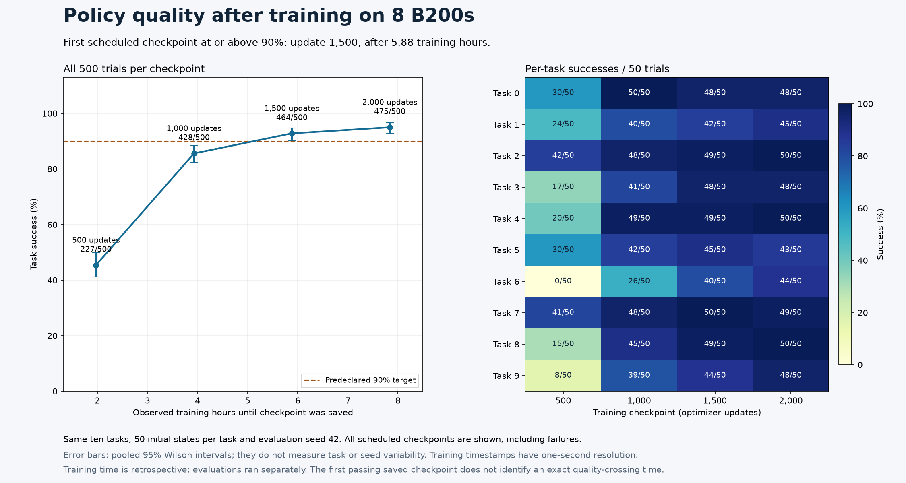

# How long does Cosmos 3 Nano WAM post-training take on Nebius B200s?

**Editorial draft — eight-GPU training, profiling and all four quality checkpoints are measured; the multi-node comparison remains pending.**

On one reserved Nebius node with **eight B200 GPUs**, Cosmos 3 Nano WAM
completed the full LIBERO-10 post-training schedule of 2,000 optimizer updates
in **7 hours, 50 minutes, 33 seconds**, consuming **62.74 training-process
GPU-hours**. The first scheduled checkpoint to meet the predeclared 90%
benchmark target was update 1,500: **464 successes in 500 trials, or 92.8%**.
Those weights were saved after approximately **5 hours, 53 minutes of
training**. Their quality was verified afterward; the actual training run
continued to update 2,000.
The final checkpoint scored **475/500, or 95.0%**. All 2,000 evaluation trials
across the four scheduled checkpoints completed without infrastructure errors.

This answers the partner question for a concrete dataset, configuration and
success criterion. It does not establish the minimum GPU count, performance
on a partner's own tasks, or how much faster two nodes will be. The two-node
comparison remains unmeasured.

The [Workbench recipe](cookbooks/cosmos3-wam-slurm.md) covers data preparation,
native Slurm launch, matched one-node and two-node plans, profiling, and
checkpoint-linked evaluation. Its evidence includes native training logs,
complete checkpoint hashes, repeated timing runs, CUDA traces, GPU telemetry
and actual trained-policy videos. The measurements below separate completed
training, steady iteration time and the time when qualifying weights became
available.

## The question public launch recipes leave open

The premise needs a small update: public recipes no longer stop universally at
one node. NVIDIA's current [LIBERO action-policy example](https://github.com/NVIDIA/cosmos-framework/blob/cf5d68c00d97ccd2480a2320ed652b92dec63102/docs/action_policy_libero_posttrain.md)
already describes a two-node configuration. What partners still need is an
operational recipe for their cloud and hardware, together with measured
training duration, scaling behavior and a matched policy evaluation.

Workbench also has an experimental [single-node policy model factory](cosmos3-policy-model-factory.md).
Its existing execution evidence establishes that native training and evaluation
can be connected, including unsuccessful task outcomes. It does not establish
this new Slurm recipe's B200 performance or convergence. We keep those scopes
separate so that a successful launch never becomes an unsupported performance
claim.

## Start with a real world action model dataset

A WAM learns to predict actions and future visual observations together. For
this baseline we use LIBERO-10 robot demonstrations, with the pinned NVIDIA
LeRobot v3 conversion. The inspected dataset contains 379 episodes and 101,469
frames spanning ten manipulation tasks at 20 Hz.

Each sample joins task language, timestamps, robot trajectories and two camera
views. The stored actions already contain per-frame translation and rotation
deltas. The native loader combines the third-person and wrist images,
re-encodes the rotation into six values, and applies the matching quantile
normalization. Each window contains sixteen actions and seventeen paired video
frames. The raw action has seven values; the transformed action has ten.
Confusing the two can produce a training run with incorrect policy semantics.
The two 256×256 camera images form a 256×512 paired view, mapped to the
192×320 model canvas for training; dimensions here are height × width.

The [reproducible figure](evidence/cosmos3-wam-data/README.md) uses actual native
loader output. Its deterministic split retains 375 episodes and 94,250 training
windows. LIBERO-10 closed-loop evaluation later measures behavior on the same
ten task types; it does not establish generalization to unseen tasks.

The recipe validates real Parquet contents and both camera streams before
training. Model weights, data, tokenizer and framework source are pinned to
immutable revisions. The model checkpoint is converted once into PyTorch's
distributed checkpoint format and placed with the dataset on shared storage.
This separates preparation time from training time and lets each topology
start from the same artifacts.

## What the first B200 run established

We ran the pinned environment on a reserved B200 with driver 580.173.02,
PyTorch 2.10.0 and CUDA 13.0. BF16 attention matched an FP32 reference, backward
gradients were finite and nonzero, and the native fused Adam implementation
updated FP32 parameters successfully. The native converter produced a 31.5 GB
base checkpoint. The trainer accepted all three proposed distributed
configurations. The [evidence record](evidence/cosmos3-wam-b200-runtime.json)
preserves versions, hashes and the scope of each check.

We also attempted actual WAM training on that GPU with one sample per step,
FP32 parameter storage and EMA enabled. It exhausted GPU memory at the first
optimizer-state allocation: the process occupied 178.31 GiB of the 178.35 GiB
available to PyTorch. No optimizer step completed. This is evidence that this
specific configuration does not fit on one B200, even at that small batch;
it does not determine the minimum GPU count under other memory settings.

The failed process lasted about 96 seconds. That is diagnostic startup and
failure time, **not training duration or time to quality**. A dedicated
eight-GPU worker passed the Slurm/NCCL preflight and completed the full
2,000-step schedule. The two-node comparison awaits sufficient free reserved
capacity; its performance is still unmeasured.

This [live snapshot](evidence/cosmos3-wam-live-training/README.md), taken shortly
after update 1,200, attributes all eight GPU processes to the native training
command and its Slurm job. Reported utilization was 88–100% and device memory
use was 55.85–58.55 GiB per GPU. A single utilization sample establishes live
execution; the completed timing runs and evaluations answer performance and
quality questions.

The [full-run telemetry](evidence/cosmos3-wam-full-gpu-activity/README.md)
adds 225,576 device samples spanning the complete native training process.
Sampled memory maxima ranged from 55.85 to 58.55 GiB per GPU. The pale
utilization bands align with checkpoint saves; the per-minute averages show
why an instantaneous 100% utilization reading cannot describe the whole run.
The recorder targeted one-second sampling, with an observed maximum gap of
8.7 seconds. These are sampled device-memory maxima, not allocator peaks.

The live preparation test also found an operational issue: the native converter
could resolve a moving processor revision. The recipe now selects the staged
processor and VAE explicitly and pins the training tokenizer separately.

The first eight-GPU attempt exposed a host setting that a short launch check
missed. After an SSH logout, systemd-logind deleted a PyTorch data loader's
shared-memory file. Training continued after the worker-thread exception, so
we stopped and excluded that 302-step partial run. A separate background probe
reproduced deletion after 10.3 seconds; with `RemoveIPC=no`, the same probe and
the public recipe's probe both survived the full thirty-second observation
window. Both worker bootstraps now apply this setting, and the reporter rejects
thread tracebacks. The [before-and-after evidence](evidence/cosmos3-wam-slurm-ipc.json)
records this operational failure separately from the fresh benchmark run.

## See what the prepared model generates

Before training, we also rendered a [visual preview on the prepared B200](evidence/cosmos3-wam-b200-visual/README.md):
the complete two-camera demonstration and a base-model image-to-video generation
from its first front-camera frame.

The generated MP4 contains 121 frames at 640×640 and 24 fps. Its native generation
batch took 21.97 seconds after model setup; the whole process took 279.10 seconds,
including guardrail downloads and checkpoint loading. Sampled GPU utilization
reached 100% and memory reached 42.10 GiB. These are single-sample inference
observations, with diffusion caching enabled, not WAM post-training timings.
The generated arm has geometry and contact errors. This is a useful illustration
of why a visually recognizable scene is not evidence of a successful robot
policy. The linked record includes the videos, settings, hashes and actual GPU
telemetry; the complete trained-policy benchmark is reported below.

## Watch the final trained checkpoint act

The completed 2,000-update checkpoint has an actual
[closed-loop visual record](evidence/cosmos3-wam-final-visual/README.md).
Eight B200 policy servers ran one simulator environment each. Each trial used
one server's predicted actions while CPU MuJoCo rendered the resulting motion.
Native comparison videos place the WAM's predicted camera sequence beside the
actual simulator sequence, with front and wrist views in both panels.

The completed visual pass succeeded on nine tasks and failed on one, with no
infrastructure errors. It used one initial state per task and illustrates
execution; it does not qualify the policy under the required 500-trial protocol.
The linked record includes every outcome, both successful and unsuccessful
basket-task videos, exact final-checkpoint hashes and 2,288 GPU telemetry samples.
All eight GPU processes were attributed to the expected policy command and
checkpoint, and the native servers completed 173 policy requests.

The visual process took 428.222 seconds, including hashing, server setup,
parallel simulation and media writing. This is evaluation time, separate from
training duration. The [earlier update-500 videos](evidence/cosmos3-wam-trained-visual/README.md)
remain available with all of their outcomes. The full fifty-trial-per-task
measurements determine the quality curve; the illustrative videos do not.

## Change GPU count while preserving the experiment

The measured campaign starts with one eight-GPU B200 node, then moves to two
nodes. Within each node, fully sharded data parallel training
distributes model state across eight GPUs. Between nodes, hybrid sharded data
parallel training replicates those groups and synchronizes their updates.

| Configuration | GPUs | Per-rank sample cap | Gradient accumulation | Nominal global batch |
| --- | --- | --- | --- | --- |
| One node | 8 | 64 | 4 | 2,048 |
| Two nodes | 16 | 64 | 2 | 2,048 |

Both configurations use BF16 computation, FP32 parameter storage and EMA,
with learning rate 5e-5, 500 warmup updates and a 16,000-update scheduler cycle.
The measured LIBERO-10 schedule stops at 2,000 updates; the scheduler cycle
does not imply that we trained for 16,000 updates.

The launcher also supports a four-node, 32-GPU plan with accumulation one.
That configuration is outside this campaign's measurement protocol.

The launcher derives accumulation from the requested batch and GPU count and
rejects configurations that cannot preserve it exactly. Learning rate,
precision, action representation and source revisions stay fixed. Native
packing can still change actual sample and token work, so the final analysis
must inspect those counters as well as the nominal settings.

The pinned upstream preset uses 128 samples per rank on sixteen GPUs with
one accumulation step. This campaign uses 64 on both topologies and adjusts
accumulation to retain the same nominal batch of 2,048. Its performance results
apply to that recorded batch layout; a different per-rank cap needs its own
measurement.

Slurm starts one launch process per node. Each process starts eight training
ranks, using a single rendezvous address from the allocation. Before training,
the recipe checks the device type, verifies rank placement and performs an
actual NCCL all-reduce across the allocation. Reserved capacity is bound
explicitly; an unavailable reservation does not silently become an on-demand
run.

## Measure the whole run and the steady part

There are several different answers to “how long?”:

1. **Preparation time:** download, environment setup and base-checkpoint conversion.
2. **Training-process time:** model loading, training and final checkpoint writing.
3. **Steady optimizer-step time:** measured after warmup, with checkpoint stalls identified.
4. **Time to quality:** elapsed training time to a checkpoint that passes a predeclared evaluation.

The reporting tool checks all worker completion records and the final model,
optimizer, scheduler and trainer checkpoint components. It then produces
mean, median and p95 optimizer-step times, training-process duration, GPU-hours,
and a hash identifying the checkpoint contents. Missing workers, failed jobs,
non-finite losses and incomplete evidence prevent a measured report.

For comparable runs, speedup is the eight-GPU mean step time divided by the
larger configuration's mean step time. Scaling efficiency divides that speedup
by the GPU-count ratio. We also report Slurm allocation time: idle time,
startup and preparation can matter to a partner even when kernel throughput
looks strong. A projection from a short timing window must be labeled as an
estimate; it cannot substitute for an observed complete training run.

The [pinned native trainer](https://github.com/NVIDIA/cosmos-framework/blob/cf5d68c00d97ccd2480a2320ed652b92dec63102/cosmos_framework/trainer/__init__.py#L391)
places its periodic checkpoint writes inside the iteration timing window. The
full schedule therefore includes four checkpoint-bearing iterations. For the
200-update repetitions, the final save happens after the timed loop; the
report contains 149 steady iterations, from update 52 through 200. These
separate repetitions provide the primary scaling comparison.
The fifty-update timing exclusion is separate from the 500-update learning-rate
warmup. The repeated timing windows therefore run during learning-rate warmup;
they describe stable iteration duration, not a fully warmed-up optimizer schedule.

The full eight-GPU run reused runtime and filesystem caches from preparation.
Its temporary visualization worker also accessed shared storage during part of
training. Its complete process duration describes those recorded campaign
conditions. The timing repetitions and profiling runs are scheduled separately
from evaluation and archival I/O. Each run starts from the same base checkpoint.

The [completed eight-GPU evidence](evidence/cosmos3-wam-full-8/README.md)
contains the unmodified report, all 1,949 measured iteration records, final
checkpoint hashes, checkpoint-ready times and NCCL proof. The native process
took 28,233.477 seconds; Slurm recorded 28,266 seconds of allocation time,
or 62.81 allocated GPU-hours. Neither number includes preparation, archival
or policy evaluation.

Across updates 52–2,000, the median iteration was 13.29 seconds and p95 was
13.43 seconds. Including the four checkpoint-bearing iterations raised the
mean to 14.098 seconds. The final checkpoint contains 177.28 GB across all
36 model, optimizer, scheduler and trainer files. Successful process exit,
complete checkpoints and finite updates establish completed training; the
full policy evaluations determine whether those weights meet the task target.

The [three separate timing runs](evidence/cosmos3-wam-timing-8/README.md)
completed 200 updates each without errors. Their mean step times were
13.3236, 13.2985 and 13.3019 seconds. The average was **13.3080 seconds**, with
an across-run sample standard deviation of **0.0136 seconds**. Across all 447
recorded iterations, pooled throughput was **68,652.78 tokens/s**. Measured
token totals were almost identical, while all raw counters remain available
for the later topology comparison. The standard deviation describes three
run means, not 447 independent trials or policy variation across seeds.

## Profile the bottleneck before increasing the allocation

The completed eight-GPU run exposes a substantial checkpoint pause.
Updates 1,000 and 1,500 took 404.54 and 404.40 seconds, respectively; their
neighboring updates took 13.25–13.39 seconds. Each completed checkpoint contains
177.28 GB of model, optimizer, scheduler and trainer state.

The [recorded timeline and numeric CSVs](evidence/cosmos3-wam-checkpoint-io/README.md)
show mostly idle GPUs while the storage host writes these checkpoints. The
gray interval includes training computation as well as saving, so its duration
is not pure write time. Storage throughput belongs in the training-time
discussion alongside GPU count. The completed full-run report includes all
four periodic saves, including the 404.61-second final iteration.

The separate 110-update profiling run also completed on eight B200s. Its
[actual CUDA trace](evidence/cosmos3-wam-profile-8/README.md) captures two host
steps on rank zero over 29.352 seconds. It contains 397,612 CUDA kernels,
whose overlapping intervals cover 15.131 seconds on that device.

The analyzer links kernels to their CPU operators instead of relying only on
Blackwell kernel names. It also separates host step boundaries from duplicate
GPU annotations. The 906 NCCL kernel events sum to 2.306 seconds, but that is
not exposed communication overhead: their execution overlaps other kernels.
The figure merges intervals within each row; rows still must not be stacked.
This is one instrumented rank, not an all-GPU utilization or throughput result.

Separately, the full-run native logs measured mean VAE encoding of 3.01 seconds
per update across ranks, included within the 3.05-second data-preparation
timer. These timers overlap. Together with the trace, they identify areas to
inspect before increasing the allocation without claiming that every gap is
CPU-bound or that more GPUs will remove it.

Input stalls suggest improving data access or decoding. A large difference
between rank-average and rank-maximum time suggests imbalance. Communication
gaps call for checking the actual NCCL transport and fabric bandwidth. Memory
pressure may require adjusting activation checkpointing or batch layout.
These are hypotheses to test against traces, not conclusions from GPU
utilization alone. Profiled runs are excluded from the throughput comparison
because instrumentation changes their timing.

## A checkpoint is useful only after evaluation

The native LIBERO-10 schedule runs for 2,000 optimizer updates. That number is
the training recipe's duration, not a guarantee of convergence. To answer the
partner question, checkpoints must also be evaluated on all ten tasks with
50 initial states per task, using the matching action-policy server and
simulator configuration.

Each evaluation records task-level and aggregate success, checkpoint identity,
training duration and evaluation compute. The target success rate must be chosen
before training; Workbench's current absolute qualification convention is
90%. The first saved checkpoint to reach the selected target defines time to
quality. A lower training loss alone does not. A partner's own manipulation
tasks may require a different dataset and acceptance criterion.

Here, time to quality means the training time when a checkpoint became
available, with its success rate verified afterward. It excludes the later
evaluation time and campaign queue delay. We report those separately and
identify the first passing scheduled checkpoint, without inferring an exact
threshold crossing between saves. The target applies to the observed success
rate; pooled Wilson intervals describe sampling uncertainty and do not measure
variation across tasks or independently trained seeds.

All four full evaluations completed without infrastructure errors:

| Saved checkpoint | Training time when saved, approximately | Successes / trials | Overall success | Evaluation process time |
| --- | --- | --- | --- | --- |
| 500 | 1 h 58 m 23 s | 227 / 500 | 45.4% | 45.95 min |
| 1,000 | 3 h 55 m 47 s | 428 / 500 | 85.6% | 39.22 min |
| 1,500 | 5 h 52 m 57 s | 464 / 500 | 92.8% | 36.58 min |
| 2,000 | 7 h 50 m 18 s | 475 / 500 | 95.0% | 37.33 min |

The [complete quality evidence](evidence/cosmos3-wam-quality-8/README.md)
preserves every trial, model-component hash and evaluation duration. The reducer
rehashes all four trained models and joins their native checkpoint-completion
events to the corresponding evaluations. Update 1,500 is the first passing
scheduled checkpoint. Individual task results there range from 40/50 to
50/50; the 90% target applies to the aggregate. At update 2,000 the range is
43/50 to 50/50. This is absolute qualification on the recorded benchmark,
with one training seed; it does not establish improvement over a separately
evaluated control policy or generalization to unseen task types.

Checkpoint-ready timestamps have one-second resolution. The final checkpoint
was saved about fifteen seconds before the training process exited, explaining
the difference between its table entry and the complete training duration.

The passing checkpoint's evaluation used eight B200 policy servers with eight
simulator environments per server. Its complete process took **2,194.578
seconds**, including model hashing, loading and parallel simulation. This
36.6-minute evaluation is separate from the recorded training duration.
All four evaluation processes together took **2 h 39 m 5 s**, or **21.21
evaluation-process GPU-hours** at eight GPUs each. These durations include
startup and simulation, and exclude campaign queue delay. They are not
steady inference latency or the complete campaign's resource usage.

## Measured results and remaining campaign work

| B200 GPUs | Complete training time | Full-run median / p95 step | Repeated step mean / across-run SD | Training GPU-hours | LIBERO-10 success | Time to quality |
| --- | --- | --- | --- | --- | --- | --- |
| 8 | 7 h 50 m 33 s | 13.29 / 13.43 s | 13.3080 / 0.0136 s | 62.74 | 95.0% at update 2,000 | About 5 h 53 m at update 1,500, verified afterward |
| 16 | Pending | Pending | Pending | Pending | Pending | Pending |

The completed eight-GPU row answers how long this particular full schedule
took, and the separate trace establishes actual eight-GPU profiling evidence.
Three verified timing repetitions establish the eight-GPU baseline, and the
complete checkpoint evaluations establish the first observed time to the
benchmark target and the final checkpoint's 95.0% result. A matched two-node
run is still needed to answer how well it scales. Sixteen GPUs cannot yet be
recommended as faster or more efficient from this evidence.

The [recipe and runbook](cookbooks/cosmos3-wam-slurm.md) provide the source pins,
data checks, native Slurm setup, launch commands and evidence reducers needed
to repeat the experiment. The linked records preserve failures as well as
successes and regenerate each figure from actual numeric data or rollout
frames. Repeating the protocol does not promise identical learned weights or
trial outcomes; preserve those new results with their own checkpoint hashes.
