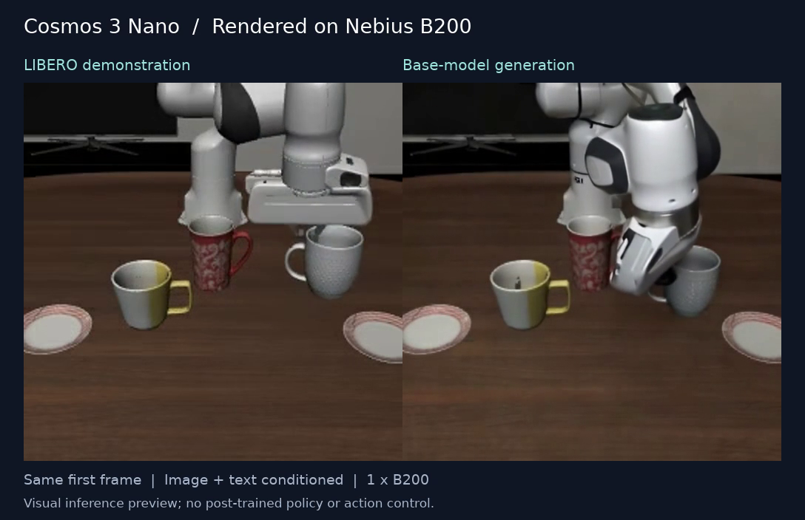

# How long does Cosmos 3 Nano WAM post-training take on Nebius B200s?

**Editorial draft — measurements pending; not ready for publication as a performance result.**

Partners evaluating world action models tend to ask two practical questions:
how many GPUs should they allocate, and how long will it take to get a useful
policy? A training launch command answers neither. The answer depends on the
data, the action representation, the distributed configuration, and what
“useful” means for the task.

We have prepared a [Workbench recipe](cookbooks/cosmos3-wam-slurm.md) to measure
Cosmos 3 Nano WAM post-training on reserved Nebius B200 nodes under Slurm. It
covers data preparation, native training, one-node to multi-node scaling,
profiling, and the evidence needed to connect training time to policy quality.
The current implementation has passed local launch and reporting tests, real
dataset inspection, native checkpoint conversion and B200 runtime checks. An
actual one-GPU WAM attempt exposed a memory limit described below.
Slurm training is now running on eight B200s; completed training duration,
multi-node scaling and policy measurements remain pending.

## The question public launch recipes leave open

The premise needs a small update: public recipes no longer stop universally at
one node. NVIDIA's current [LIBERO action-policy example](https://github.com/NVIDIA/cosmos-framework/blob/cf5d68c00d97ccd2480a2320ed652b92dec63102/docs/action_policy_libero_posttrain.md)
already describes a two-node configuration. What partners still need is an
operational recipe for their cloud and hardware, together with measured
training duration, scaling behavior and a matched policy evaluation.

Workbench also has an experimental [single-node policy model factory](cosmos3-policy-model-factory.md).
Its existing execution evidence establishes that native training and evaluation
can be connected, including unsuccessful task outcomes. It does not establish
this new Slurm recipe's B200 performance or convergence. We keep those scopes
separate so that a successful launch never becomes an unsupported performance
claim.

## Start with a real world action model dataset

A WAM learns to predict actions and future visual observations together. For
this baseline we use LIBERO-10 robot demonstrations, with the pinned NVIDIA
LeRobot v3 conversion. The inspected dataset contains 379 episodes and 101,469
frames spanning ten manipulation tasks at 20 Hz.

Each sample joins task language, timestamps, robot trajectories and two camera
views. The native loader combines the third-person and wrist images, converts
the trajectories into 16-step chunks of relative position, 6D rotation and
gripper commands, and applies the matching quantile normalization. The raw
dataset action vector has seven values; the transformed training action has
ten. Confusing the two is enough to produce an apparently healthy training
run with the wrong policy semantics.

The recipe validates real Parquet contents and both camera streams before
training. Model weights, data, tokenizer and framework source are pinned to
immutable revisions. The model checkpoint is converted once into PyTorch's
distributed checkpoint format and placed with the dataset on shared storage.
This separates preparation time from training time and lets each topology
start from the same artifacts.

## What the first B200 run established

We ran the pinned environment on a reserved B200 with driver 580.173.02,
PyTorch 2.10.0 and CUDA 13.0. BF16 attention matched an FP32 reference, backward
gradients were finite and nonzero, and the native fused Adam implementation
updated FP32 parameters successfully. The native converter produced a 31.5 GB
base checkpoint. The trainer accepted all three proposed distributed
configurations. The [evidence record](evidence/cosmos3-wam-b200-runtime.json)
preserves versions, hashes and the scope of each check.

We also attempted actual WAM training on that GPU with one sample per step,
FP32 parameter storage and EMA enabled. It exhausted GPU memory at the first
optimizer-state allocation: the process occupied 178.31 GiB of the 178.35 GiB
available to PyTorch. No optimizer step completed. This is evidence that this
specific configuration does not fit on one B200, even at that small batch;
it does not determine the minimum GPU count under other memory settings.

The failed process lasted about 96 seconds. That is diagnostic startup and
failure time, **not training duration or time to quality**. A dedicated
eight-GPU worker now passes the Slurm/NCCL preflight and is executing the full
2,000-step schedule. The two-node comparison awaits sufficient free reserved
capacity. Completed performance answers remain pending.

The live preparation test also found an operational issue: the native converter
could resolve a moving processor revision. The recipe now selects the staged
processor and VAE explicitly and pins the training tokenizer separately.

The first eight-GPU attempt exposed a host setting that a short launch check
missed. After an SSH logout, systemd-logind deleted a PyTorch data loader's
shared-memory file. Training continued after the worker-thread exception, so
we stopped and excluded that 302-step partial run. A separate background probe
reproduced deletion after 10.3 seconds; with `RemoveIPC=no`, the same probe and
the public recipe's probe both survived the full thirty-second observation
window. Both worker bootstraps now apply this setting, and the reporter rejects
thread tracebacks. The [before-and-after evidence](evidence/cosmos3-wam-slurm-ipc.json)
records this operational failure separately from the fresh benchmark run.

## See what the prepared model generates

Before training, we also rendered a [visual preview on the prepared B200](evidence/cosmos3-wam-b200-visual/README.md):
the complete two-camera demonstration and a base-model image-to-video generation
from its first front-camera frame.

The generated MP4 contains 121 frames at 640×640 and 24 fps. Its native generation
batch took 21.97 seconds after model setup; the whole process took 279.10 seconds,
including guardrail downloads and checkpoint loading. Sampled GPU utilization
reached 100% and memory reached 42.10 GiB. These are single-sample inference
observations, with diffusion caching enabled, not WAM post-training timings.
The generated arm has geometry and contact errors. This is a useful illustration
of why a visually recognizable scene is not evidence of a successful robot
policy. The linked record includes the videos, settings, hashes and actual GPU
telemetry; the trained-policy evaluation remains pending.

## Change GPU count while preserving the experiment

The measured campaign starts with one eight-GPU B200 node, then moves to two
nodes. Within each node, fully sharded data parallel training
distributes model state across eight GPUs. Between nodes, hybrid sharded data
parallel training replicates those groups and synchronizes their updates.

| Configuration | GPUs | Per-rank sample cap | Gradient accumulation | Nominal global batch |
| --- | --- | --- | --- | --- |
| One node | 8 | 64 | 4 | 2,048 |
| Two nodes | 16 | 64 | 2 | 2,048 |

The launcher also supports a four-node, 32-GPU plan with accumulation one.
That configuration is outside this campaign's measurement protocol.

The launcher derives accumulation from the requested batch and GPU count and
rejects configurations that cannot preserve it exactly. Learning rate,
precision, action representation and source revisions stay fixed. Native
packing can still change actual sample and token work, so the final analysis
must inspect those counters as well as the nominal settings.

Slurm starts one launch process per node. Each process starts eight training
ranks, using a single rendezvous address from the allocation. Before training,
the recipe checks the device type, verifies rank placement and performs an
actual NCCL all-reduce across the allocation. Reserved capacity is bound
explicitly; an unavailable reservation does not silently become an on-demand
run.

## Measure the whole run and the steady part

There are several different answers to “how long?”:

1. **Preparation time:** download, environment setup and base-checkpoint conversion.
2. **Training-process time:** model loading, training and final checkpoint writing.
3. **Steady optimizer-step time:** measured after warmup, with checkpoint stalls identified.
4. **Time to quality:** elapsed training time to a checkpoint that passes a predeclared evaluation.

The reporting tool checks all worker completion records and the final model,
optimizer, scheduler and trainer checkpoint components. It then produces
mean, median and p95 optimizer-step times, training-process duration, GPU-hours,
and a hash identifying the checkpoint contents. Missing workers, failed jobs,
non-finite losses and incomplete evidence prevent a measured report.

For comparable runs, speedup is the eight-GPU mean step time divided by the
larger configuration's mean step time. Scaling efficiency divides that speedup
by the GPU-count ratio. We also report Slurm allocation time: idle time,
startup and preparation can matter to a partner even when kernel throughput
looks strong. A projection from a short timing window must be labeled as an
estimate; it cannot substitute for an observed complete training run.

## Profile the bottleneck before increasing the allocation

More GPUs help only if the work can use them. A separate profiling run captures
PyTorch traces from a representative rank on each node. The analysis follows
the path from loading and decoding data, through VAE encoding and model
computation, to communication and checkpoint writes.

Input stalls suggest improving data access or decoding. A large difference
between rank-average and rank-maximum time suggests imbalance. Communication
gaps call for checking the actual NCCL transport and fabric bandwidth. Memory
pressure may require adjusting activation checkpointing or batch layout.
These are hypotheses to test against traces, not conclusions from GPU
utilization alone. Profiled runs are excluded from the throughput comparison
because instrumentation changes their timing.

## A checkpoint is useful only after evaluation

The native LIBERO-10 schedule runs for 2,000 optimizer updates. That number is
the training recipe's duration, not a guarantee of convergence. To answer the
partner question, checkpoints must also be evaluated on all ten tasks with
50 initial states per task, using the matching action-policy server and
simulator configuration.

We will report task-level and aggregate success, checkpoint identity, training
duration and evaluation compute. The target success rate must be chosen
before training; Workbench's current absolute qualification convention is
90%. The first saved checkpoint to reach the selected target defines time to
quality. A lower training loss alone does not. A partner's own manipulation
tasks may require a different dataset and acceptance criterion.

## Results to publish after the campaign

| B200 GPUs | Complete training time | Median / p95 step | Speedup / efficiency | Training GPU-hours | LIBERO-10 success | Time to quality |
| --- | --- | --- | --- | --- | --- | --- |
| 8 | Pending | Pending | Baseline, unmeasured | Pending | Pending | Pending |
| 16 | Pending | Pending | Pending | Pending | Pending | Pending |

The publication package needs matched complete runs, observed sample/token
work, independent repetitions, scheduler accounting, representative traces and
the full checkpoint-linked evaluation protocol. Include unsuccessful outcomes
and uncertainty, and identify the tested driver, CUDA, PyTorch and source
revisions. No “hours to train,” GPU recommendation or scaling chart should be
published from the pending rows above.

The [recipe and runbook](cookbooks/cosmos3-wam-slurm.md) are the starting point
for collecting that evidence. Once measured, the useful answer will be specific:
this dataset, this quality target, this many B200 GPUs, and this observed time.
