# How long does Cosmos 3 Nano WAM post-training take on Nebius B200s?

**Measured on reserved Nebius B200s: two complete training schedules, six timing
repetitions, separate CUDA profiles, and 4,000 checkpoint-linked evaluation trials.**

Cosmos 3 Nano WAM completed 2,000 LIBERO-10 post-training updates in
**7 h 50 m 33 s on eight B200s** and **4 h 23 m 33 s on sixteen B200s**.
Three matched timing repetitions per topology measured **1.93× steady-step
speedup**, or **96.7% scaling efficiency**. The complete sixteen-GPU run used
**70.28 training-process GPU-hours**, versus **62.74** on eight GPUs: it finished
44.0% sooner while consuming 12.0% more training GPU-hours under the recorded
storage and startup conditions.

The first saved checkpoint above the predeclared 90% LIBERO-10 success target
was update 1,500 on both topologies. Those weights were ready after
**5 h 52 m 57 s on eight GPUs** and **3 h 18 m 46 s on sixteen GPUs**.
Evaluation happened afterward; both training runs continued to update 2,000.
Final policies passed **475/500 (95.0%)** and **479/500 (95.8%)** trials,
respectively. One training seed does not establish that sixteen GPUs improve
policy quality. These results answer the duration and scaling questions for
this pinned dataset and protocol, not the minimum GPU count or performance
on a partner's own tasks.

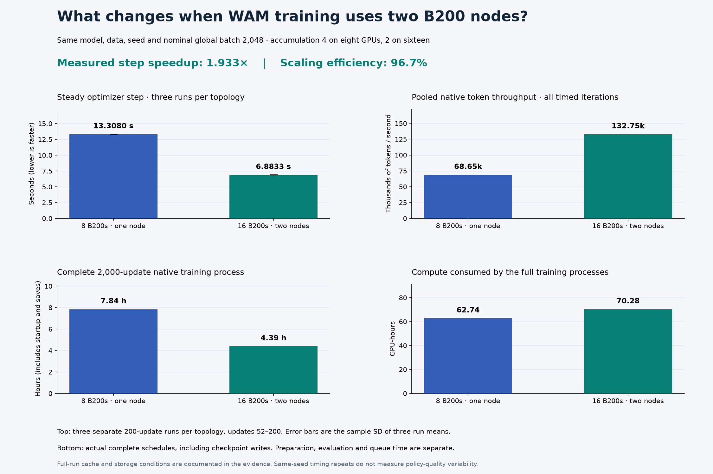

The [Workbench recipe](cookbooks/cosmos3-wam-slurm.md) covers data preparation,
native Slurm launch, matched one-node and two-node plans, profiling, and
checkpoint-linked evaluation. Its evidence includes native training logs,
complete checkpoint hashes, repeated timing runs, CUDA traces, GPU telemetry
and actual trained-policy videos. The measurements below separate completed
training, steady iteration time and the time when qualifying weights became
available.

## The question public launch recipes leave open

The premise needs a small update: public recipes no longer stop universally at
one node. NVIDIA's current [LIBERO action-policy example](https://github.com/NVIDIA/cosmos-framework/blob/cf5d68c00d97ccd2480a2320ed652b92dec63102/docs/action_policy_libero_posttrain.md)
already describes a two-node configuration. What partners still need is an
operational recipe for their cloud and hardware, together with measured
training duration, scaling behavior and a matched policy evaluation.

Workbench also has an experimental [single-node policy model factory](cosmos3-policy-model-factory.md).
Its existing execution evidence establishes that native training and evaluation
can be connected, including unsuccessful task outcomes. It does not establish
this new Slurm recipe's B200 performance or convergence. We keep those scopes
separate so that a successful launch never becomes an unsupported performance
claim.

## Start with a real world action model dataset

A WAM learns to predict actions and future visual observations together. For
this baseline we use LIBERO-10 robot demonstrations, with the pinned NVIDIA
LeRobot v3 conversion. The inspected dataset contains 379 episodes and 101,469
frames spanning ten manipulation tasks at 20 Hz.

Each sample joins task language, timestamps, robot trajectories and two camera
views. The stored actions already contain per-frame translation and rotation
deltas. The native loader combines the third-person and wrist images,
re-encodes the rotation into six values, and applies the matching quantile
normalization. Each window contains sixteen actions and seventeen paired video
frames. The raw action has seven values; the transformed action has ten.
Confusing the two can produce a training run with incorrect policy semantics.
The two 256×256 camera images form a 256×512 paired view, mapped to the
192×320 model canvas for training; dimensions here are height × width.

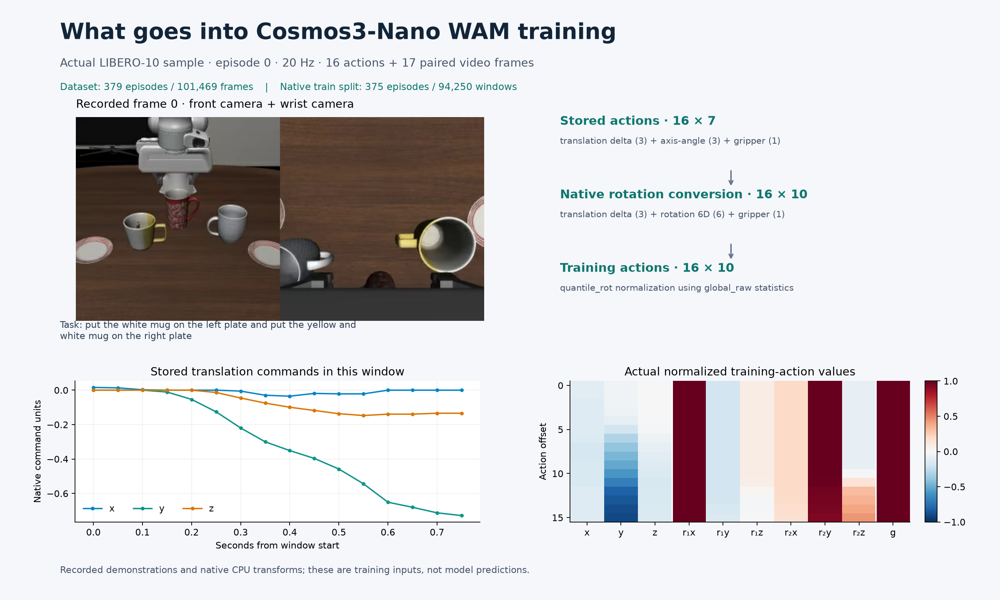

The [reproducible figure](evidence/cosmos3-wam-data/README.md) uses actual native
loader output. Its deterministic split retains 375 episodes and 94,250 training
windows. LIBERO-10 closed-loop evaluation later measures behavior on the same
ten task types; it does not establish generalization to unseen tasks.

The recipe validates real Parquet contents and both camera streams before
training. Model weights, data, tokenizer and framework source are pinned to
immutable revisions. The model checkpoint is converted once into PyTorch's
distributed checkpoint format and placed with the dataset on shared storage.
This separates preparation time from training time and lets each topology
start from the same artifacts.

## What the first B200 run established

We ran the pinned environment on a reserved B200 with driver 580.173.02,
PyTorch 2.10.0 and CUDA 13.0. BF16 attention matched an FP32 reference, backward
gradients were finite and nonzero, and the native fused Adam implementation
updated FP32 parameters successfully. The native converter produced a 31.5 GB
base checkpoint. The trainer accepted all three proposed distributed
configurations. The [evidence record](evidence/cosmos3-wam-b200-runtime.json)
preserves versions, hashes and the scope of each check.

We also attempted actual WAM training on that GPU with one sample per step,
FP32 parameter storage and EMA enabled. It exhausted GPU memory at the first
optimizer-state allocation: the process occupied 178.31 GiB of the 178.35 GiB
available to PyTorch. No optimizer step completed. This is evidence that this
specific configuration does not fit on one B200, even at that small batch;
it does not determine the minimum GPU count under other memory settings.

The failed process lasted about 96 seconds. That is diagnostic startup and
failure time, **not training duration or time to quality**. A dedicated
eight-GPU worker passed the Slurm/NCCL preflight and completed the full
2,000-step schedule. The two-node run also completed all 2,000 updates on sixteen reserved B200s.
Two- and four-GPU capacity were not tested; the minimum remains undetermined.

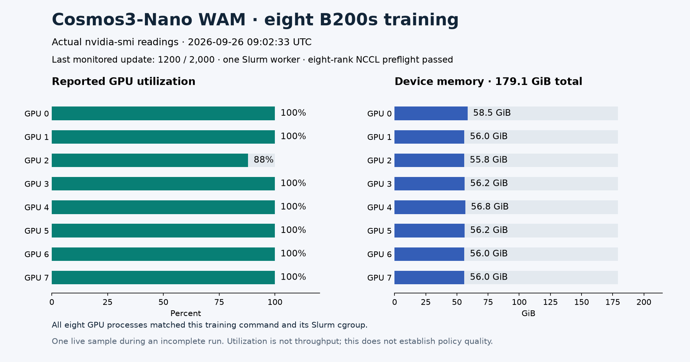

This [live snapshot](evidence/cosmos3-wam-live-training/README.md), taken shortly
after update 1,200, attributes all eight GPU processes to the native training
command and its Slurm job. Reported utilization was 88–100% and device memory
use was 55.85–58.55 GiB per GPU. A single utilization sample establishes live
execution; the completed timing runs and evaluations answer performance and
quality questions.

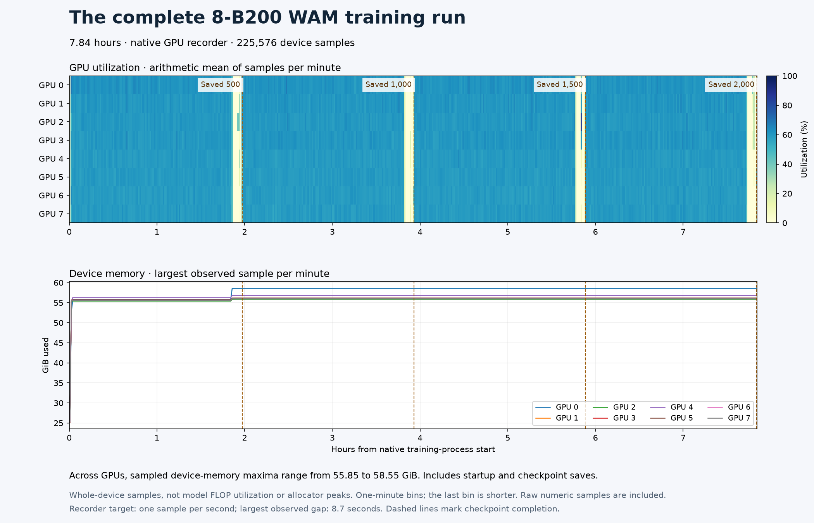

The [full-run telemetry](evidence/cosmos3-wam-full-gpu-activity/README.md)
adds 225,576 device samples spanning the complete native training process.
Sampled memory maxima ranged from 55.85 to 58.55 GiB per GPU. The pale
utilization bands align with checkpoint saves; the per-minute averages show
why an instantaneous 100% utilization reading cannot describe the whole run.
The recorder targeted one-second sampling, with an observed maximum gap of
8.7 seconds. These are sampled device-memory maxima, not allocator peaks.

The live preparation test also found an operational issue: the native converter
could resolve a moving processor revision. The recipe now selects the staged
processor and VAE explicitly and pins the training tokenizer separately.

The first eight-GPU attempt exposed a host setting that a short launch check
missed. After an SSH logout, systemd-logind deleted a PyTorch data loader's
shared-memory file. Training continued after the worker-thread exception, so
we stopped and excluded that 302-step partial run. A separate background probe
reproduced deletion after 10.3 seconds; with `RemoveIPC=no`, the same probe and
the public recipe's probe both survived the full thirty-second observation
window. Both worker bootstraps now apply this setting, and the reporter rejects
thread tracebacks. The [before-and-after evidence](evidence/cosmos3-wam-slurm-ipc.json)
records this operational failure separately from the fresh benchmark run.

Adding the second node exposed a different dependency boundary: the shared
Python environment could import TorchCodec, but its new host lacked FFmpeg's
shared libraries. That attempt failed before any recorded optimizer update.
The [decoder failure and corrected two-host proof](evidence/cosmos3-wam-decoder-preflight/README.md)
show both camera streams decoding to identical frame hashes after installation.
Both bootstrap scripts now install FFmpeg, and each node decodes real front
and wrist frames before loading the model. The failed attempt is excluded;
the retry starts from the same base weights.

## See what the prepared model generates

Before training, we also rendered a [visual preview on the prepared B200](evidence/cosmos3-wam-b200-visual/README.md):
the complete two-camera demonstration and a base-model image-to-video generation
from its first front-camera frame.

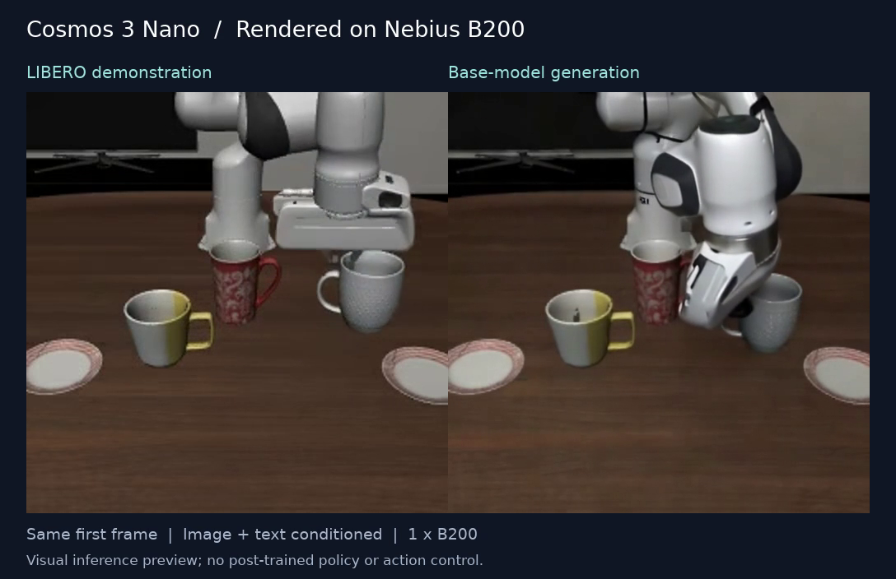

The generated MP4 contains 121 frames at 640×640 and 24 fps. Its native generation
batch took 21.97 seconds after model setup; the whole process took 279.10 seconds,
including guardrail downloads and checkpoint loading. Sampled GPU utilization
reached 100% and memory reached 42.10 GiB. These are single-sample inference
observations, with diffusion caching enabled, not WAM post-training timings.
The generated arm has geometry and contact errors. This is a useful illustration
of why a visually recognizable scene is not evidence of a successful robot
policy. The linked record includes the videos, settings, hashes and actual GPU
telemetry; the complete trained-policy benchmark is reported below.

## Watch the final trained checkpoint act

The sixteen-GPU run's final checkpoint has an actual
[closed-loop visual record](evidence/cosmos3-wam-final-visual-16/README.md).
Eight B200 policy servers ran one simulator environment each. Each trial used
one server's predicted actions while CPU MuJoCo rendered the resulting motion.
Native comparison videos place the WAM's predicted front and wrist views
beside the actual simulator views.

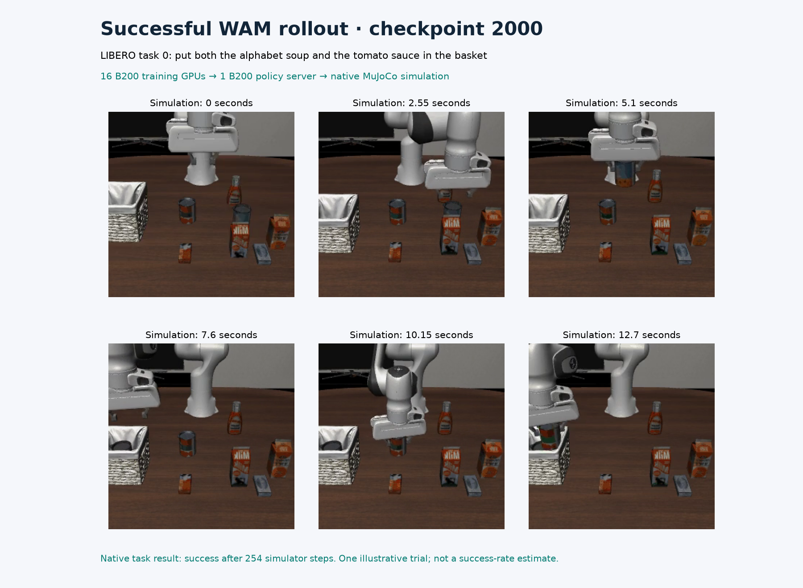

[Play the success](evidence/cosmos3-wam-final-visual-16/task-000.mp4) ·
[Play the failure](evidence/cosmos3-wam-final-visual-16/task-005.mp4) ·
[Predicted views versus simulator views](evidence/cosmos3-wam-final-visual-16/task-000-comparison.mp4)

This visual pass had nine successes, one failure and zero infrastructure errors.
The illustrated trials are the first success and first failure, with complete
recordings and all ten outcomes retained. The final model hash matches the
500-trial quality evaluation. The eight native servers completed 176 policy
requests; 1,928 GPU samples cover their request interval. Native commands,
server logs, Slurm completion and telemetry establish the execution record;
no live policy-process snapshot was captured during this particular visual pass.
The separate training record below attributes all sixteen training processes.

The visual process took 407.071 seconds, including hashing, setup, parallel
simulation and media writing. Video playback at 20 Hz is simulation time,
not inference latency. The [eight-GPU final videos](evidence/cosmos3-wam-final-visual/README.md)
and [earlier update-500 videos](evidence/cosmos3-wam-trained-visual/README.md)
remain available. These ten-trial illustrations do not replace the full evaluations.

## Change GPU count while preserving the experiment

The measured campaign starts with one eight-GPU B200 node, then moves to two
nodes. Within each node, fully sharded data parallel training
distributes model state across eight GPUs. Between nodes, hybrid sharded data
parallel training replicates those groups and synchronizes their updates.

| Configuration | GPUs | Per-rank sample cap | Gradient accumulation | Nominal global batch |
| --- | --- | --- | --- | --- |
| One node | 8 | 64 | 4 | 2,048 |
| Two nodes | 16 | 64 | 2 | 2,048 |

Both configurations use BF16 computation, FP32 parameter storage and EMA,
with learning rate 5e-5, 500 warmup updates and a 16,000-update scheduler cycle.
The measured LIBERO-10 schedule stops at 2,000 updates; the scheduler cycle
does not imply that we trained for 16,000 updates.

The launcher also supports a four-node, 32-GPU plan with accumulation one.
That configuration is outside this campaign's measurement protocol.

The launcher derives accumulation from the requested batch and GPU count and
rejects configurations that cannot preserve it exactly. Learning rate,
precision, action representation and source revisions stay fixed. Native
packing can still change actual sample and token work, so the final analysis
inspects those counters as well as the nominal settings.

The pinned upstream preset uses 128 samples per rank on sixteen GPUs with
one accumulation step. This campaign uses 64 on both topologies and adjusts
accumulation to retain the same nominal batch of 2,048. Its performance results
apply to that recorded batch layout; a different per-rank cap needs its own
measurement.

Slurm starts one launch process per node. Each process starts eight training
ranks, using a single rendezvous address from the allocation. Before training,
the recipe checks the device type, verifies rank placement and performs an
actual NCCL all-reduce across the allocation. Reserved capacity is bound
explicitly; an unavailable reservation does not silently become an on-demand
run.

The measured deployment puts Slurm control, accounting and the shared
filesystem on the first GPU host. Both hosts belong to one InfiniBand fabric.
The controller role does not determine Slurm node rank; the launcher derives
rank placement from each allocation.

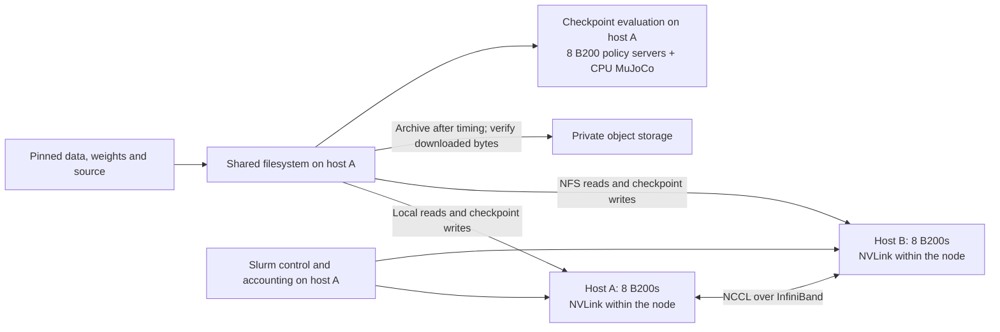
```mermaid
flowchart LR
    P["Pinned data, weights and source"] --> D["Shared filesystem on host A"]
    S["Slurm control and accounting on host A"] --> A["Host A: 8 B200s<br/>NVLink within the node"]
    S --> B["Host B: 8 B200s<br/>NVLink within the node"]
    D -->|Local reads and checkpoint writes| A
    D -->|NFS reads and checkpoint writes| B
    A <-->|NCCL over InfiniBand| B
    D -->|Archive after timing; verify downloaded bytes| O["Private object storage"]
    D --> E["Checkpoint evaluation on host A<br/>8 B200 policy servers + CPU MuJoCo"]
```

The storage path is part of the experiment. Checkpoint pauses count toward
the full training duration. Archive traffic and evaluation are scheduled
outside the separate timing repetitions.

The [separate sixteen-rank collective diagnostic](evidence/cosmos3-wam-collective-16/README.md)
completed with correct results on every device and actual InfiniBand transport
on all sixteen ranks. For a 1 GiB buffer per rank, the mean synchronized
operation took 3.345 ms. This custom PyTorch check includes host dispatch and
CUDA synchronization. Its bandwidth normalization is documented with every
raw duration; it is not a NIC line-rate measurement or a training-speed result.

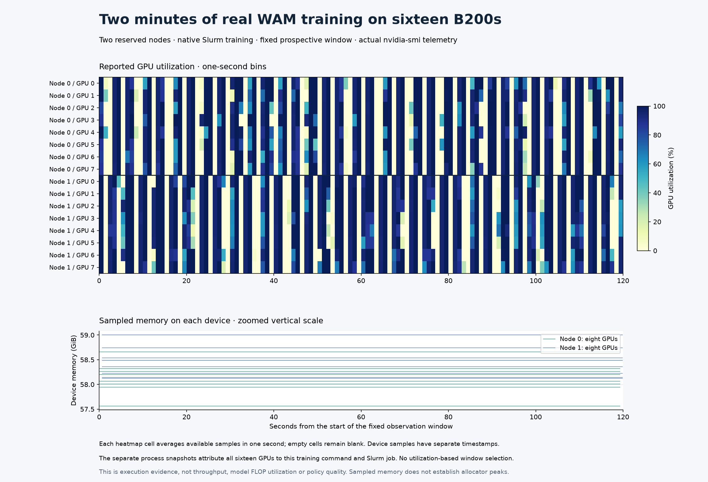

The [two-node live execution record](evidence/cosmos3-wam-live-training-16/README.md)
attributes all sixteen GPU processes to the actual Slurm training job. A
prospectively selected two-minute window contains 1,920 readings, with all
sixteen devices reaching 100% utilization and sampled memory spanning
57.56–59.01 GiB. The periodic low-utilization intervals remain visible. These
readings establish execution and its sampled activity pattern; the completed
timing runs determine scaling.

## Measure the whole run and the steady part

There are several different answers to “how long?”:

1. **Preparation time:** download, environment setup and base-checkpoint conversion.
2. **Training-process time:** model loading, training and final checkpoint writing.
3. **Steady optimizer-step time:** measured after warmup, with checkpoint stalls identified.
4. **Time to quality:** elapsed training time to a checkpoint that passes a predeclared evaluation.

The reporting tool checks all worker completion records and the final model,
optimizer, scheduler and trainer checkpoint components. It then produces
mean, median and p95 optimizer-step times, training-process duration, GPU-hours,
and a hash identifying the checkpoint contents. Missing workers, failed jobs,
non-finite losses and incomplete evidence prevent a measured report.

For comparable runs, speedup is the eight-GPU mean step time divided by the
larger configuration's mean step time. Scaling efficiency divides that speedup
by the GPU-count ratio. We also report Slurm allocation time: idle time,
startup and preparation can matter to a partner even when kernel throughput
looks strong. A projection from a short timing window must be labeled as an
estimate; it cannot substitute for an observed complete training run.

The [pinned native trainer](https://github.com/NVIDIA/cosmos-framework/blob/cf5d68c00d97ccd2480a2320ed652b92dec63102/cosmos_framework/trainer/__init__.py#L391)
places its periodic checkpoint writes inside the iteration timing window. The
full schedule therefore includes four checkpoint-bearing iterations. For the
200-update repetitions, the final save happens after the timed loop; the
report contains 149 steady iterations, from update 52 through 200. These
separate repetitions provide the primary scaling comparison.
The fifty-update timing exclusion is separate from the 500-update learning-rate
warmup. The repeated timing windows therefore run during learning-rate warmup;
they describe stable iteration duration, not a fully warmed-up optimizer schedule.

The full eight-GPU run reused runtime and filesystem caches from preparation.
Its temporary visualization worker also accessed shared storage during part of
training. Its complete process duration describes those recorded campaign
conditions. The timing repetitions and profiling runs are scheduled separately
from evaluation and archival I/O. Each run starts from the same base checkpoint.

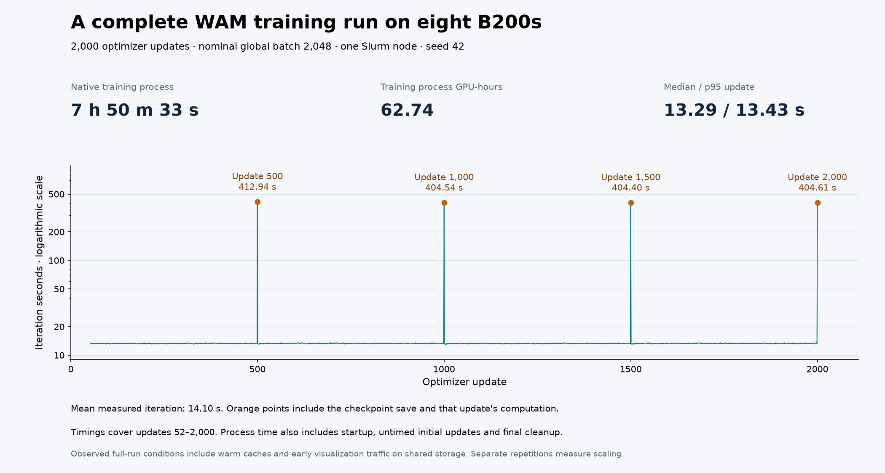

The [completed eight-GPU evidence](evidence/cosmos3-wam-full-8/README.md)
contains the unmodified report, all 1,949 measured iteration records, final
checkpoint hashes, checkpoint-ready times and NCCL proof. The native process
took 28,233.477 seconds; Slurm recorded 28,266 seconds of allocation time,
or 62.81 allocated GPU-hours. Neither number includes preparation, archival
or policy evaluation.

Across updates 52–2,000, the median iteration was 13.29 seconds and p95 was
13.43 seconds. Including the four checkpoint-bearing iterations raised the
mean to 14.098 seconds. The final checkpoint contains 177.28 GB across all
36 model, optimizer, scheduler and trainer files. Successful process exit,
complete checkpoints and finite updates establish completed training; the
full policy evaluations determine whether those weights meet the task target.

The [complete sixteen-GPU run](evidence/cosmos3-wam-full-16/README.md) took
15,813.018 native-process seconds; Slurm recorded 15,906 allocated seconds,
or 70.69 allocated GPU-hours. Its median/p95 iteration was 6.86/6.95 seconds.
Including checkpoint-bearing iterations raised the mean to 7.766 seconds.
Both nodes returned zero, all four checkpoints completed, and the final
checkpoint contains 68 component files totaling 177.28 GB. Checkpoint sharding
changes the file count, not the logical model.

The [three eight-GPU repetitions](evidence/cosmos3-wam-timing-8/README.md)
had mean step times 13.3236, 13.2985 and 13.3019 seconds. The
[three sixteen-GPU repetitions](evidence/cosmos3-wam-timing-16/README.md)
measured 6.8740, 6.8942 and 6.8817 seconds. Mean ± across-run sample standard
deviation was **13.3080 ± 0.0136 s** and **6.8833 ± 0.0102 s**.
Each topology contributes 447 measured iterations, across three independent
restarts from the same base checkpoint and seed. The standard deviation
summarizes three run means, not policy variation across training seeds.

The [executed scaling reducer](evidence/cosmos3-wam-scaling/README.md)
reports **1.9334× speedup and 96.6685% efficiency**. Pooled token throughput
increased from **68,652.78 to 132,745.58 tokens/s**. Actual token work on
sixteen GPUs was 1.000108× the eight-GPU total, about 0.0108% higher due to
native packing. Nominal global batch stayed fixed; the raw work counters
make this small difference explicit. The full-run wall-time speedup was
1.7855×, lower than steady-step speedup because setup and checkpoint I/O
also count. Neither GPU-hour measure is a bill or total campaign cost: preparation,
archival, evaluation and idle reservations are outside these training totals.

## Profile compute, communication and checkpoint I/O

Each saved checkpoint occupies about 177.3 GB. On eight GPUs, the four
checkpoint-bearing iterations took 412.94, 404.54, 404.40 and 404.61 seconds.
The [recorded disk and GPU windows](evidence/cosmos3-wam-checkpoint-io/README.md)
at updates 1,000 and 1,500 show sustained writes during training pauses.
On sixteen GPUs, the
four checkpoint-bearing iterations took **444.94, 459.33, 434.85 and 439.85
seconds**. These are complete iteration durations, not isolated write times.
The controller-local SSD and its NFS export are part of the measured setup;
more GPUs did not eliminate these storage pauses.

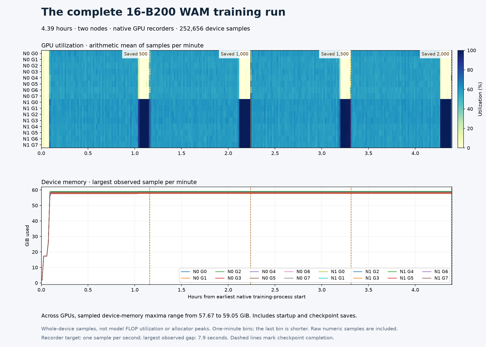

The [complete two-node telemetry](evidence/cosmos3-wam-full-gpu-activity-16/README.md)
contains 252,656 device samples. Sampled memory maxima range from 57.67 to
59.05 GiB, with a maximum observed sampling gap of 7.9 seconds. During saves,
one node reports low utilization while the other remains active. Utilization
alone cannot show whether that activity is useful compute or synchronization.
These are whole-device samples, not model FLOP utilization or allocator peaks.

Separate 110-update profiling jobs completed on both topologies. The
[eight-GPU trace](evidence/cosmos3-wam-profile-8/README.md) captures two steps on
rank zero over 29.352 seconds, with 397,612 kernels and 15.131 seconds of
observed kernel-interval union. The
[sixteen-GPU trace](evidence/cosmos3-wam-profile-16/README.md) captures ranks zero
and eight, one per host, over approximately 15.074 seconds each. Each has
198,042 kernels; observed interval unions are 8.005 and 7.957 seconds.

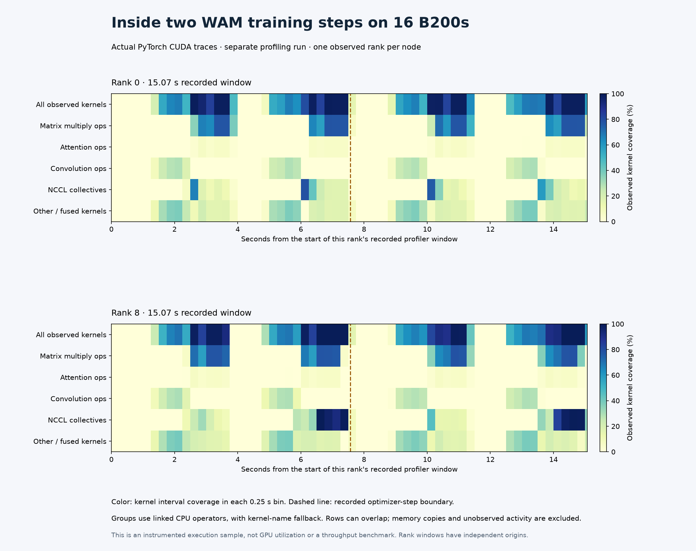

Kernel classification uses linked CPU operators where available and separates
host step boundaries from duplicate GPU annotations. The sixteen-GPU traces
contain 540 NCCL events per observed rank; summed durations are 1.722 and
3.214 seconds. Those sums are **not exposed communication overhead** because
kernel intervals overlap. The figure merges intervals within each row;
rows cannot be stacked into a wall-time breakdown. Two profiled ranks do not
represent all sixteen devices. Profiled runs are excluded from throughput results.

Native full-run logs measured mean VAE encoding of 3.01 seconds per update on
eight GPUs and 1.50 seconds on sixteen, included within data-preparation timers
of 3.05 and 1.52 seconds. These timers overlap and must not be added. Input
stalls, rank imbalance, fabric transport and checkpoint throughput are distinct
hypotheses to investigate with these records; a utilization percentage alone
does not identify a bottleneck.

## A checkpoint is useful only after evaluation

The native LIBERO-10 schedule runs for 2,000 optimizer updates. That number is
the training recipe's duration, not a guarantee of convergence. To answer the
partner question, checkpoints must also be evaluated on all ten tasks with
50 initial states per task, using the matching action-policy server and
simulator configuration.

Each evaluation records task-level and aggregate success, checkpoint identity,
training duration and evaluation compute. The target success rate must be chosen
before training; Workbench's current absolute qualification convention is
90%. The first saved checkpoint to reach the selected target defines time to
quality. A lower training loss alone does not. A partner's own manipulation
tasks may require a different dataset and acceptance criterion.

Here, time to quality means the training time when a checkpoint became
available, with its success rate verified afterward. It excludes the later
evaluation time and campaign queue delay. We report those separately and
identify the first passing scheduled checkpoint, without inferring an exact
threshold crossing between saves. The target applies to the observed success
rate; pooled Wilson intervals describe sampling uncertainty and do not measure
variation across tasks or independently trained seeds.

All eight full evaluations completed, totaling 4,000 trials with zero
infrastructure errors. Each cell below is a separate 500-trial checkpoint
measurement, not a pooled accuracy across evolving policies.

| Checkpoint | Eight-GPU checkpoint ready | Eight-GPU successes | Sixteen-GPU checkpoint ready | Sixteen-GPU successes |
| --- | --- | --- | --- | --- |
| 500 | 1 h 58 m 23 s | 227/500 · 45.4% | 1 h 9 m 38 s | 245/500 · 49.0% |
| 1,000 | 3 h 55 m 47 s | 428/500 · 85.6% | 2 h 14 m 23 s | 407/500 · 81.4% |
| 1,500 | 5 h 52 m 57 s | 464/500 · 92.8% | 3 h 18 m 46 s | 471/500 · 94.2% |
| 2,000 | 7 h 50 m 18 s | 475/500 · 95.0% | 4 h 23 m 17 s | 479/500 · 95.8% |

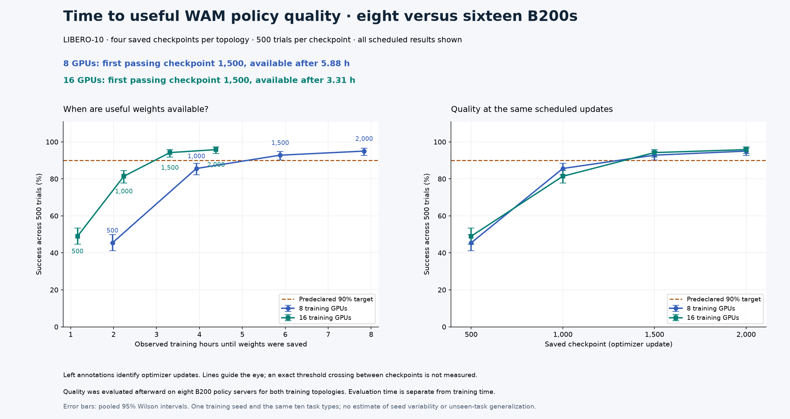

The complete [eight-GPU](evidence/cosmos3-wam-quality-8/README.md) and
[sixteen-GPU](evidence/cosmos3-wam-quality-16/README.md) evidence retains every
trial, task outcome, model-component hash and evaluation duration. The reducer
rehashes each model and joins actual checkpoint-completion events to its
evaluation. Checkpoint times have one-second resolution. Final weights were
saved roughly fifteen to sixteen seconds before process exit, explaining the
difference from complete training duration.

At update 1,500, the sixteen-GPU model passed 471/500 trials; that checkpoint's
evaluation took **2,239.108 seconds (37.32 minutes)** on eight B200 policy
servers, each with eight simulator environments. This is separate from its
3 h 18 m 46 s training-to-checkpoint time. All four sixteen-GPU checkpoint
evaluations together took **2 h 39 m 46 s**, consuming **21.30 evaluation-process
GPU-hours**. The corresponding eight-GPU policy evaluations took **2 h 39 m
5 s**, or **21.21 GPU-hours**. Queue delay is excluded; checkpoint hashing,
server startup and simulation are included. These are not steady inference latencies.

Both topologies reached the aggregate 90% target at the same saved update.
The 95.0% versus 95.8% final results do not establish an improvement caused by
GPU count: only one training seed was used, and packing and floating-point
reduction order can change trajectories. Neither result establishes
performance on unseen task types, transfer to a physical robot, or improvement
over a separately evaluated control policy.

## Answers for partners

| B200 GPUs | Complete training time | Full-run median / p95 step | Repeated step mean / across-run SD | Training GPU-hours | Final LIBERO-10 success | First saved checkpoint above 90% |
| --- | --- | --- | --- | --- | --- | --- |
| 8 | 7 h 50 m 33 s | 13.29 / 13.43 s | 13.3080 / 0.0136 s | 62.74 | 475/500 · 95.0% | Update 1,500 after 5 h 52 m 57 s |
| 16 | 4 h 23 m 33 s | 6.86 / 6.95 s | 6.8833 / 0.0102 s | 70.28 | 479/500 · 95.8% | Update 1,500 after 3 h 18 m 46 s |

- **Can Workbench run it on Nebius?** Yes: the standalone recipe completed native Slurm training on one and two reserved B200 nodes in us-central1, with pinned real Cosmos Framework components. Soperator is a documented deployment alternative, not a tested deployment in this campaign.
- **What data format and pipeline?** Pinned LIBERO-10 LeRobot v3 Parquet metadata and paired MP4 cameras, finite action/state validation, native rotation conversion and normalization, deterministic split, and seventeen-frame/sixteen-action training windows. Replace the dataset only with an equivalent validated action/camera contract.
- **How is Slurm launched?** One task per node starts eight torchrun ranks; FSDP shards within a node and HSDP synchronizes replicas across nodes. The recipe checks reservation, source identity, real decoding, device placement and NCCL before training.
- **How long and how many GPUs?** Both eight and sixteen B200s completed the fixed 2,000-update schedule. Sixteen reduced full training time by 44.0% here; eight used fewer training GPU-hours. The tested one-GPU FP32-plus-EMA configuration exhausted memory before its first update. Two and four GPUs were not measured; 32 GPUs remain a static plan.
- **How well does it scale?** Three matched repeats per topology measured 1.93× steady-step speedup and 96.7% efficiency, with actual token work differing by only 0.0108%. Full-run speedup is reported separately because it includes setup and saves.
- **What did profiling show?** Actual CUDA timelines on both topologies, NCCL over InfiniBand, VAE/data timers, full GPU telemetry and approximately 177 GB checkpoints. Saves remained long; overlapping CUDA categories cannot be interpreted as exposed communication overhead.
- **When does it reach useful quality?** The first saved checkpoint above the declared 90% aggregate target was update 1,500: about 5 h 53 m on eight GPUs and 3 h 19 m on sixteen. Quality was measured afterward, not used for online early stopping.
- **Where is the GPU and visual proof?** Linked process-attributed sixteen-rank telemetry, complete Slurm receipts, checkpoint hashes, raw numeric records, CUDA trace exports and successful/unsuccessful native policy videos substantiate each claim. No synthetic timing or illustrative image substitutes for execution.
- **How can another team reproduce it?** Follow the [runbook](cookbooks/cosmos3-wam-slurm.md), pinned [recipe](../../npa/workflows/workbench/cosmos3-wam-slurm/README.md) and [measurement protocol](../../npa/workflows/workbench/cosmos3-wam-slurm/benchmark-protocol.json). Retain failures, logs, complete checkpoints and all trial outcomes; run the report, scaling, profile and quality reducers; then regenerate the figures from their committed source data. New runs may produce different weights and outcomes.
