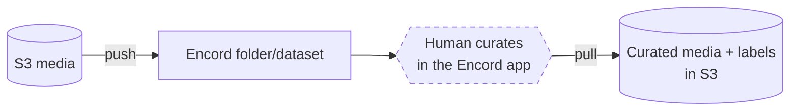
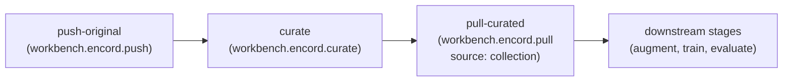
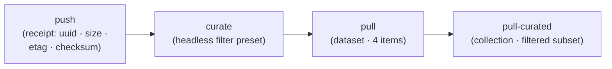

# Encord Headless Curation

Design note and live evidence for the `curate` verb of the Encord workbench
tool. Operator usage lives in [encord.md](encord.md); this page records why the
verb exists, the mechanism, and what the live spike against the real SaaS
pinned. It is tool-specific by design, which is why it sits next to the tool's
operator doc rather than under `docs/architecture/`.

Status: **implemented**. The `npa workbench encord curate` verb, the
`workbench.encord.curate` toolRef, the curate stage in
`encord-roundtrip-smoke.yaml`, and the live spike that pinned the filter shape
are all in the tree.

Review feedback on the original push/pull proposal (#339):

> "My main workflow comment is that a user should be able to leverage headless
> encord capabilities from workbench. It makes sense to have the ability to
> operate in Encord, but we should think from how an agent would drive this and
> minimize human in the loop."

## Problem

With only `push` and `pull`, the Encord workbench tool is a transport layer:
`push` registers or uploads S3 media into Encord, `pull` materializes curated
media and labels back to S3. Everything between the two verbs is a human
working in the Encord app, and the shipped specs say so explicitly:

- `encord-push.yaml` is terminal at the push receipt.
- `encord-pull.yaml` starts *after* curation — it requires the
  Collection/Dataset id that a human produced in the app.



An agent composing an `npa.workflow` cannot cross the dashed box. This design
removes it for the common case — quality-based selection — while keeping the
human path available for judgment calls the metrics cannot make.

## Design: `npa workbench encord curate`

A third verb that performs curation server-side in Encord using Encord's
built-in data quality metrics (brightness, sharpness, area, aspect ratio — the
Index ships 40+), driven entirely by values the user or agent declares from
workbench. No custom metadata, embeddings, or models are involved.

```bash
npa workbench encord curate \
  --folder npa-original-<run-id> \
  --filter brightness:0.2:0.8 \
  --filter sharpness:0.35:1.0 \
  --collection npa-curated-<run-id> \
  --output-path s3://<bucket>/encord/curate/ \
  --workflow-run <run-id> --output json
```

### Inputs

- `--folder <title-or-uuid>` (required): the Index storage folder that scopes
  the filters — resolved by the existing `resolve_folder` seam (never created
  by curate).
- `--filter <metric>:<min>:<max>` (repeatable, at least one): an allowlisted
  Encord built-in quality metric with a normalized range. Initial allowlist:
  `brightness`, `sharpness`, `area`, `aspect-ratio`; extensible per metric as
  its filter shape is pinned (see the schema risk below). Unknown metric names
  fail closed before any Encord mutation.
- `--collection <title-or-uuid>` (required): the target Collection. Created
  when absent, mirroring `push --folder/--dataset` title semantics; a
  UUID-shaped value must already exist.
- `--output-path s3://…` (required): where the curation receipt lands.
- `--workflow-run`, `--output text|json`: standard tool contract.

### Mechanism

All selection is evaluated server-side by Encord; no media bytes move.

1. Map the `--filter` flags onto a filter-preset payload of the exact shape
   the live spike pinned (see below): `{"global_filters": {"filters": [...]}}`,
   one `{"include", "values": [min, max], "domain": "data", "metric",
   "type": "metric"}` entry per filter. Evaluation is scoped by the Collection's
   top-level folder, so no `local_filters` block is sent.
2. `user_client.create_preset("npa-curate-<run-id>", filter_preset_json)` — a
   run-scoped preset (an ad-hoc CLI run without a run id gets a UTC timestamp
   plus a random suffix, so two ad-hoc curates never share a title). The receipt
   records its uuid and exact JSON (the reproducibility record); the
   server-side preset itself is transient scaffolding, deleted in a `finally`
   block whether the selection landed or the run crashed after creation, and
   the receipt's `preset_deleted` flag says whether that delete succeeded.
3. Resolve or create the Collection
   (`user_client.create_collection(top_level_folder_uuid, name)`).
4. `collection.add_preset_items(preset)` — Encord evaluates the preset and
   populates the Collection server-side.
5. `collection.list_items()` to count the selection. **Zero selected items
   fails closed (exit 1)**, mirroring `workbench.dataset.curate`: an empty
   curated set silently feeding a training stage is a bug, not a result.
6. Write `curate_receipt.json` (`npa.encord.curate_receipt.v1`): the full
   filter definition as given, preset uuid and `preset_deleted`, collection
   uuid/name/created flag, folder lineage, `items_total` (storage items in the
   folder when evaluated) and `items_selected`, and `workflow_run`. As with the
   push receipt and pull manifest, a write-ahead `status: planned` copy lands
   before the first Encord mutation and the final receipt is written before any
   failure exit; crashes after Encord was mutated land in the artifact's
   `error` field.

The existing `pull --source collection` consumes the result unchanged, so the
loop closes with no new pull surface.

### Code placement

Follows the three-access pattern already in `npa/src/npa/workbench/encord/`:

- `curate.py`: `run_curate(...) -> CurateReceipt` next to `run_push`/`run_pull`,
  with the pure filter-mapping function separated from SaaS glue (the
  `data_factory_curate.select_curated` shape).
- `client.py`: `resolve_collection(..., create_in_folder_uuid=)` — a
  non-empty folder uuid both scopes the title search and is where a missing
  title is created (pull passes none, so a missing title is an error). Every
  resolver returns a `ResolvedRef(obj, id, title, created)` and shares one
  0/1/many title contract: unique resolves, missing is the caller's decision,
  several same-titled objects fail closed. Injection stays `user_client=` only —
  the existing `FakeUserClient` test harness extends naturally.
- `schemas.py`: `CurateReceipt` (`npa.encord.curate_receipt.v1`).
- CLI `curate` command in `npa/src/npa/cli/workbench/encord.py`; SDK
  passthrough `curate(**kwargs)` in `npa/src/npa/sdk/workbench/encord.py`.

### toolRef

`workbench.encord.curate` in the catalog, alongside push/pull:

```text
npa workbench encord curate
  --folder {{config.encord_folder}}
  --filter {{config.encord_filters}}          # rendered per repeated value
  --collection {{config.encord_collection}}
  --output-path {{config.encord_curate_receipt_uri}}
  --workflow-run {{run.id}} --output json
```

CPU-only; no container image — SkyPilot default image with the `npa[encord]`
extra; `ENCORD_SSH_KEY_B64` secret-env and the existing bash preflight guard,
identical to push/pull wiring in `skypilot_render.py`.

## How an agent drives it

With curate as a toolRef, the previously human-gated loop becomes one
unattended `npa.workflow` run:



Concretely, a spec inserts `curate` between its push and its pull, and the
pull switches from the dataset it just pushed to the curated Collection the
receipt names — replacing a pull-what-we-pushed placeholder with a real,
declared quality gate.

The live evidence loop (`encord-roundtrip-smoke.yaml`) proves every hop in one
submit:



The human path is not removed: an operator can still curate in the app and
hand a Collection id to `pull`, or start from an agent-curated Collection and
refine it. The two paths are complementary; the default agent-composed
pipeline simply no longer requires a person.

## Filter vocabulary and the schema risk (resolved by live spike)

The Encord SDK types the preset payload only down to `filters: List[Dict]`;
the per-metric filter dict is undocumented. A live spike (run-scoped
`npa-spike-*` folder/presets/collections against the real SaaS, deleted
afterwards) pinned the shape empirically:

```json
{"include": true, "values": [<min>, <max>], "domain": "data",
 "metric": "<metric_id>", "type": "metric"}
```

Spike findings the implementation encodes:

- `create_preset` stores any JSON unvalidated; semantics live entirely in
  `add_preset_items`, which is **asynchronous server-side** with no job handle
  — hence the verb polls the Collection until its count is stable.
- An **unpinned filter shape makes the evaluation request block
  indefinitely** (observed >100s, no error), while a valid filter that matches
  nothing returns fast and cleanly. This is why the metric allowlist fails
  closed before any Encord call — a guessed shape is not a recoverable error.
- Intrinsic metrics (`metric_width`, `metric_height`, `metric_area`,
  `metric_aspect_ratio`) evaluate immediately on a fresh SDK-created folder;
  computed quality metrics (`metric_brightness`, `metric_sharpness`,
  `metric_file_size`) are accepted but match nothing until quality metrics
  have been computed for the folder — a one-time action in the Encord app for
  which neither the SDK nor the public API exposes a trigger. The
  zero-selection failure names this cause when a computed metric is in play.
- Evaluation is scoped to the Collection's top-level folder, and
  `domain: "frame"` (the Active-side domain) blocks at Index level —
  `domain: "data"` is the Index form.
- The evaluation is **one-shot**: items pushed moments earlier may not be
  metric-indexed when it runs and are then missed by that call (observed live
  — an immediate post-push curate selected nothing; the same filter selected
  correctly ~50s later). While the selection is empty the verb re-issues
  `add_preset_items` every 15s until items appear or `--poll-seconds` runs
  out, which makes the push → curate composition reliable.

This is the same honest-boundary posture as the MCAP `experimental_error` gate
in push: no guessed schemas are ever sent to Encord, and the allowlist grows
only with re-run live verification (`METRIC_FILTERS` in
`npa/src/npa/workbench/encord/curate.py`).

## Boundaries / non-goals (this phase)

- No custom metadata (`clientMetadata`) import or filtering, no custom
  embeddings, no similarity/NL search.
- No pre-labeling / label import (`LabelRowV2.save()`), no annotation-workflow
  task automation (submit/approve/reject, agent stages).
- The `encord-agents` package (Apache-2.0) is an acceptable future dependency
  for task automation, but headless curation needs only the already-pinned
  core `encord` SDK — no new dependency in this phase.

## Test plan

- Unit (`npa/tests/workbench/test_encord_curate.py` on the shared
  `encord_fakes.py`): `FakeUserClient`/`FakeCollection` carry
  `create_collection`, `create_preset`, `add_preset_items`; cover filter
  mapping against the pinned fixtures, zero-selection fail-closed,
  receipt-before-raise, collection title-vs-uuid resolution, and
  unknown-metric rejection.
- CLI: `CliRunner` with the SDK wrapper monkeypatched, matching
  `test_encord_cli.py`.
- Workflow: argv-render assertions for the new toolRef, matching
  `test_encord_workflow.py`.
- Live: `encord-roundtrip-smoke.yaml` runs `push → curate → pull →
  pull-curated` on fixture media, keeping the run-scoped `npa-e2e-*` cleanup
  contract.
