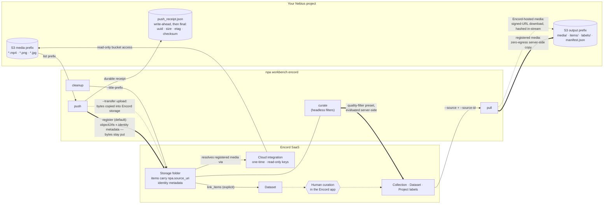

# Encord: push data for curation, pull curated data back

[Encord](https://encord.com/) is a data curation and annotation platform. The
Workbench integration is a round trip your data makes around a human curation
step:

1. **`npa workbench encord push`** — your S3 media becomes an Encord dataset.
   In the default *register* mode the bytes never leave your bucket; Encord
   references them through a cloud integration you create once. An *upload*
   mode copies the bytes into Encord-hosted storage instead.
2. **Curation** — either **`npa workbench encord curate`** selects a
   Collection headlessly with declared quality filters that Encord evaluates
   server-side, or you curate in the Encord app: filter, review, build a
   Collection, or annotate in a Project.
3. **`npa workbench encord pull`** — the curated Collection, Dataset, or a
   Project's labels come back to S3 as media + per-item JSON + a lineage
   manifest that downstream stages consume.

> **TL;DR:** create an Encord API key and an S3-compatible integration (both
> one-time, in the Encord app), point `~/.npa/credentials.yaml` at the key,
> run `npa workbench health preflight --checks encord`, then `push` → `curate`
> (or curate in the app) → `pull`.

Verbs: `push`, `curate`, `pull`, `cleanup`, and `system-info` (SDK pin, API
domain, configured credential names). Every verb takes `--output json` and then
prints exactly one JSON document on stdout, including on failure; diagnostics
go to stderr. Design rationale and the live evidence behind the
headless-curation filter shape:
[encord-headless-curation.md](encord-headless-curation.md).

## File-format support in this integration

This table describes the formats supported by **NPA's Encord integration**, not
every format Encord itself can store or annotate.

| Data | NPA Encord support | Details |
|---|---|---|
| Video | Supported: `.mp4` | `push` registers or uploads it; `pull` materializes it. |
| Images | Supported: `.png`, `.jpg`, `.jpeg` | `push` registers or uploads individual images; `pull` materializes them. |
| MCAP / LiDAR / point clouds | Not supported | Encord supports scene and point-cloud modalities, including `.mcap`, but this integration does not yet construct the required per-stream scene payload. `--media mcap` or `--media all` records each MCAP as `experimental_error` and fails closed. |
| ROS bags / other sensor data | Not supported | No scene, calibration, timestamp, or multi-stream ingestion path is implemented. |
| Composite Encord items | Pull not supported | Image groups and DICOM series have no single signed URL, so pull records a per-item error. |

Do not use an unsupported suffix as a generic file transport. The tool skips
unknown formats by default so a successful receipt always means the registered
items used a supported ingestion path.

## The integration at a glance



Solid heavy arrows are the default register-mode and headless-curation paths;
dashed arrows are the upload-mode variants and the optional human step. All verbs authenticate with your
Encord API key (`ENCORD_SSH_KEY_B64` or `ENCORD_SSH_KEY_FILE`); the cloud
integration is a separate, Encord-side credential that only ever grants *read*
on the media bucket. The receipt and manifest are written before any failure
exit, so lineage survives fail-closed runs.

## One-time setup

### 1. Create an Encord API key

1. In the Encord app go to **Settings → Public keys → New key**.
2. Download the generated **private key** file (an Ed25519 PEM, a few hundred
   bytes) and keep it somewhere private, e.g. `~/.ssh/encord-private-key.ed25519`.

### 2. Create the S3-compatible cloud integration (register mode)

Register mode needs Encord to be able to *read* your bucket. In the Encord app
create an integration following Encord's **MinIO / S3-compatible** pattern:

- **Endpoint**: your Nebius storage endpoint, `https://storage.<region>.nebius.cloud`
  (the `s3 endpoint` line of `npa configure --show`).
- **Access key pair**: a key pair with **read** access to the media bucket. A
  dedicated read-only pair is best practice.
- Prefer **strict client-only access** so Encord signs URLs client-side rather
  than copying media server-side. If the Encord viewer will load media directly
  in your browser, add a bucket CORS rule allowing `*.encord.com`.

Note the integration's **title** (for example `nebius-s3`) — the CLI takes it
directly; you never need to copy UUIDs. Upload mode needs no integration.

### 3. Point npa at the key

Add the key **file path** to `~/.npa/credentials.yaml` (the least error-prone
option — pasting multi-line PEMs into YAML is easy to truncate):

```yaml
tokens:
  ENCORD_SSH_KEY_FILE: /Users/<you>/.ssh/encord-private-key.ed25519
```

The only other accepted transport is `ENCORD_SSH_KEY_B64` — the base64 of the
PEM, and the form you forward into workflow pods (see below):

```bash
base64 < ~/.ssh/encord-private-key.ed25519 | tr -d '\n'
```

(A raw multi-line PEM pasted into YAML or an env var is deliberately not
accepted: truncated pastes were an observed live failure mode.)

US-hosted Encord orgs: also `export ENCORD_DOMAIN=https://api.us.encord.com`.

### 4. Verify before doing anything else

```bash
npa workbench health preflight --checks encord
```

`PASS ... Encord authenticated` means the key parses and the API accepts it.
This gate catches a truncated key paste or an unregistered key in seconds
instead of mid-push. `npa workbench encord system-info` shows, without calling
Encord, which credential transport is configured (by name, never the value),
the SDK version, the API domain, and the supported media and curate metrics.

## Push: S3 → Encord

```bash
npa workbench encord push \
  --input-path s3://<bucket>/raw-media/ \
  --integration nebius-s3 \
  --folder my-batch --dataset my-batch \
  --output-path s3://<bucket>/encord/push/
```

- Discovers `.mp4`, `.png`, `.jpg`/`.jpeg` under the prefix (`--media` filters).
  MCAP is visible only through the experimental `--media mcap|all` filters and
  is deliberately recorded as an error; see the support table above.
- `--folder`/`--dataset` accept a title or id; unique titles are created when
  absent, so a fresh batch needs no clicking around first.
- Items are registered in place and **explicitly linked** into the dataset.
- `--transfer upload` copies bytes into Encord-hosted storage instead
  (no integration needed). In the default register mode `--integration` is
  required and checked before anything is listed, authenticated, or uploaded.
- A durable receipt (`push_receipt.json`, `npa.encord.push_receipt.v1`) records
  every file, its Encord item uuid, and per-file errors. The receipt is written
  **before** any failure exit, and any unit error fails the command closed. If
  a step throws after Encord was mutated, the receipt still lands with the
  exception recorded in its `error` field.
- Re-pushing the same prefix is **idempotent in both modes, as our own
  invariant**: before transferring anything, push resolves each object's exact
  identity (`npa.source_uri` metadata / objectUrl) against the folder and
  re-sends only what is absent. A retried stage registers nothing twice and —
  in upload mode — copies no duplicate bytes. Every item is registered with
  `npa.source_uri` clientMetadata; identity never rests on a filename.
- The receipt lands twice: a write-ahead copy (`status: planned`) before the
  first Encord mutation — so even an uncatchable kill leaves a record of
  intent — then the final receipt with per-item uuids, sizes, ETags, and
  checksums.

## Curate headlessly: quality filters, no human in the app

`curate` closes the push → curate → pull loop without anyone opening Encord.
You declare filters over Encord's **built-in data quality metrics**; the tool
creates a run-scoped Encord filter preset from them, creates (or reuses) the
target Collection, and Encord evaluates the selection **server-side** into it.
No media bytes move, and the transient preset is deleted once the selection
lands (the receipt keeps its exact JSON).

```bash
npa workbench encord curate \
  --folder my-batch \
  --filter brightness:0.2:0.8 --filter width:640:4096 \
  --collection my-batch-keepers \
  --output-path s3://<bucket>/encord/curate/
```

- `--filter metric:min:max` is repeatable, and one value may carry several
  filters comma-separated (`brightness:0.2:0.8,sharpness:0.3:1`) — that is the
  workflow-template form.
- Supported metrics (allowlisted; unknown names fail closed before any Encord
  call): `width`, `height`, `area`, `aspect-ratio` are **intrinsic** and work
  on any folder immediately; `brightness`, `sharpness`, `file-size` are
  **computed** quality metrics and match nothing until quality metrics have
  been computed for the folder — a one-time action in the Encord app (open the
  folder → upgrade/compute metrics; Encord exposes no API for it). Filter
  ranges use Encord's own metric scales.
- `--folder` is never created by curate (an absent folder means there is
  nothing to curate); a `--collection` title is created when absent. An
  existing Collection is reused only while it is empty: Encord's evaluation
  only ever adds items, so curate refuses a populated Collection rather than
  report a stale selection as this run's. Use run-scoped titles (the shipped
  specs do) or `cleanup` the old one first.
- Selection is asynchronous in Encord; curate polls until the Collection is
  stable (`--poll-seconds`, default 300). **Zero selected items fails closed**
  (exit 1) — an empty curated set silently feeding a training stage is a bug,
  not a result.
- The transient preset is titled `npa-curate-<run-id>` (an ad-hoc CLI run
  without `--workflow-run` gets a UTC timestamp plus a random suffix) and is
  deleted whether the run succeeded or crashed after creating it; the receipt's
  `preset_deleted` flag records whether that delete went through, so a `false`
  means `cleanup --title-prefix npa-curate-` is owed.
- A durable receipt (`curate_receipt.json`, `npa.encord.curate_receipt.v1`)
  records the parsed filters, the exact preset JSON sent to Encord, the preset
  and Collection uuids, `items_total` (storage items in the folder when the
  filters were evaluated) and `items_selected` — a write-ahead `status:
  planned` copy lands before the first Encord mutation, and the final receipt
  is written **before** any failure exit, like push and pull.
- Pull the result with `--source collection --source-id <collection>`.

## Or curate in the Encord app

Human judgment still beats a brightness threshold for some batches. Work
exactly as you normally do; the two paths compose (start from an
agent-curated Collection and refine it, or skip `curate` entirely). When
you're done, the pull source is one of:

| You curated with… | Pull with |
|---|---|
| A **Collection** (Index/Curate) | `--source collection --source-id <uuid-or-name>` |
| The **Dataset** itself (deleting bad items) | `--source dataset --source-id <hash-or-title>` |
| An Annotate **Project** (labels) | `--source project --source-id <hash-or-title>` |

## Pull: Encord → S3

```bash
npa workbench encord pull \
  --source collection --source-id keepers \
  --output-path s3://<bucket>/encord/pull/
```

Output layout under `--output-path`:

```text
media/<item_uuid>__<name>     # the curated media files
items/<item_uuid>.json        # per-item Encord metadata
labels/<label_hash>.json      # project source only (LabelRowV2 JSON)
manifest.json                 # npa.encord.pull_manifest.v1 lineage + counts
```

Media registered from your own bucket returns as **zero-egress server-side
copies**; Encord-hosted (uploaded) media streams back through signed URLs (the
download is hashed in-stream, and its sha256 lands in the manifest). If a
same-bucket copy fails (an access-policy gap, say) the item falls back to the
signed-URL download and the manifest row's `copy_error` says why egress was
paid. Transfers run in a bounded parallel pool, so pulling thousands of curated
clips does not pay a serial round-trip each. The manifest is written before any
failure exit; any failed item fails the command closed.

## Cleanup: tear down run-scoped Encord state

Everything the tool creates in Encord carries a run-scoped title whose run id
embeds a UTC timestamp (`npa-e2e-*`, `npa-curate-*`), so nothing accumulates
anonymously. Tear a namespace down with:

```bash
npa workbench encord cleanup --title-prefix npa-e2e- [--dry-run]
```

This deletes matching storage folders (items first), Collections, and filter
presets, and **reports** matching datasets — the Encord SDK exposes no dataset
deletion, so those need one click in the app (the folder cleanup already
removed their items). Prefixes shorter than four characters are refused.

## Python SDK

The CLI is a thin wrapper over the same functions:

```python
from npa.sdk.workbench import encord

receipt = encord.push(
    input_path="s3://<bucket>/raw-media/",
    integration="nebius-s3",
    folder="my-batch",
    dataset="my-batch",
    output_path="s3://<bucket>/encord/push/",
)
curated = encord.curate(
    folder="my-batch",
    filters=["brightness:0.2:0.8", "width:640:4096"],
    collection="my-batch-keepers",
    output_path="s3://<bucket>/encord/curate/",
)
manifest = encord.pull(
    source="collection",
    source_id="my-batch-keepers",
    output_path="s3://<bucket>/encord/pull/",
)
summary = encord.cleanup(title_prefix="npa-e2e-", dry_run=True)
```

All three return the Pydantic models (`PushReceipt` / `CurateReceipt` /
`PullManifest`) that are also persisted to S3, and raise `EncordToolError` on
the same fail-closed conditions as the CLI.

## Workflows

The shipped specs wrap the same tool
(`npa/workflows/workbench/npa-workflows/`):

- `encord-push.yaml` — production push, terminal at the receipt (for the
  human-curation path between workflows).
- `encord-pull.yaml` — production pull, run after curation.
- `encord-roundtrip-smoke.yaml` — live e2e proof: push fixture media into a
  fresh `npa-e2e-<run-id>` folder + dataset, curate a run-scoped Collection
  headlessly through a filter preset, then pull both the dataset and the
  Collection straight back, no human step. Add `--var encord_transfer=upload`
  for the byte-copy variant.

Forward the credential to pods **by name only** — the base64 form survives the
secret transport:

```bash
export ENCORD_SSH_KEY_B64="$(base64 < ~/.ssh/encord-private-key.ed25519 | tr -d '\n')"
npa workbench workflow submit npa/workflows/workbench/npa-workflows/encord-roundtrip-smoke.yaml \
  --runtime --var bucket=<bucket> --var encord_integration=nebius-s3 \
  --secret-env ENCORD_SSH_KEY_B64 \
  --secret-env AWS_ACCESS_KEY_ID --secret-env AWS_SECRET_ACCESS_KEY
```

(Storing `ENCORD_SSH_KEY_B64` under `tokens:` in `~/.npa/credentials.yaml`
works too — submit resolves secret names from there when they are not in the
environment.)

## Troubleshooting

| Symptom | Cause and fix |
|---|---|
| `Encord authentication failed: Incorrect padding` | The pasted PEM was truncated or its newlines were mangled by YAML. Use `ENCORD_SSH_KEY_FILE` with the downloaded key file instead. |
| Push receipt shows per-file `error` rows (403/404 from Encord) | The integration's access keys cannot read that bucket/prefix, or the endpoint in the integration is wrong. Fix the integration in the Encord app; the receipt names each failing file. |
| `No Encord cloud integration titled '...'` | Title mismatch — the error lists the titles your key can see. |
| `.mcap` files land as `experimental_error` in the receipt | MCAP cloud registration has no supported upload format in the pinned SDK yet; the receipt-visible error is intentional. Push videos/images with the default `--media`. |
| Pull error `item has no signed URL (composite items...)` | Image groups / DICOM series expose no single signed URL and are not supported by pull. |
| `Encord curate selected 0 items` with brightness/sharpness/file-size filters | Those are computed quality metrics: they match nothing until metrics have been computed for the folder (one-time, in the Encord app). Use intrinsic metrics (width, height, area, aspect-ratio), or compute the folder's metrics once and re-run. |
| `Unknown filter metric '...'` | Only allowlisted metrics with a live-verified Encord filter shape are accepted — an unverified shape would hang Encord's server-side evaluation. The error lists the supported names. |
| `curate` fails with `already holds items` | The `--collection` title resolved to a populated Collection; curate never adds to one. Use a fresh run-scoped title or `cleanup --title-prefix`. |
| US-hosted org, auth fails with a valid key | Set `ENCORD_DOMAIN` (the SDK default is the EU endpoint). |
| `health preflight` warns `encord SDK is not installed` | An Encord credential is configured but the optional extra is missing; `pip install 'npa[encord]'` only if you use the tool. |
| A `--output json` command printed diagnostics you expected on stdout | stdout carries exactly one JSON document per verb (also on failure: `{"result": "error", ...}`); human-readable errors and progress go to stderr. |

The CLI reference is generated at [docs/cli/encord.md](../cli/encord.md).
