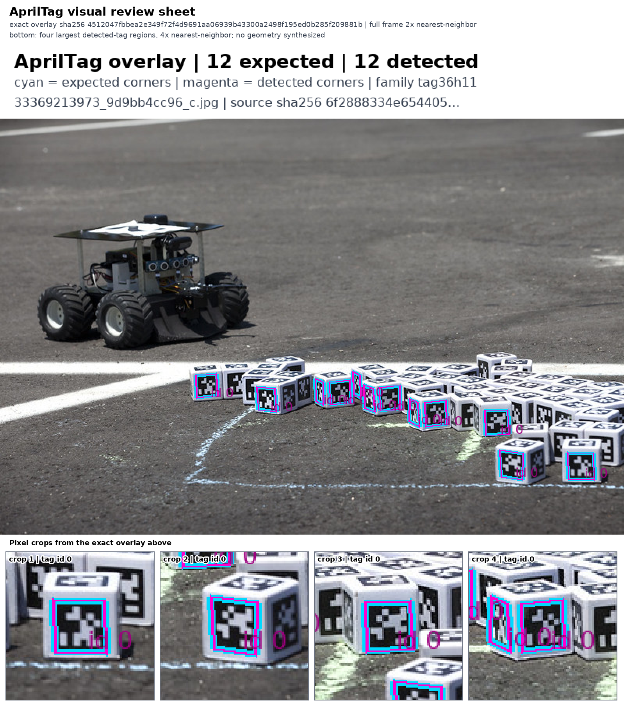
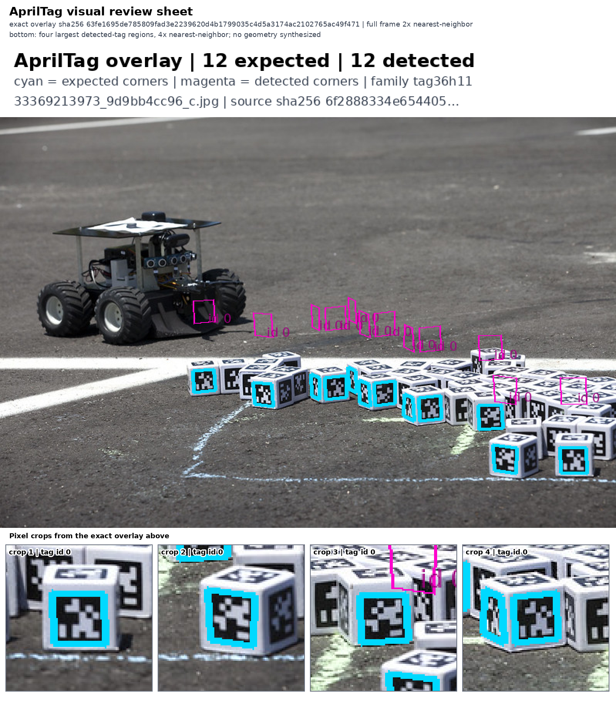

# AprilTag fiducial detector — CPU workload proof

This pack is the public-safe reviewer summary for implementation commit
`0bcfa853f8e0da21c91fa778032bdc36390371bc`. It omits cloud resource names,
registry locations, object-storage locations, credentials, and raw operational
logs. Exact private evidence remains access-controlled.

The objective workload passed. Hosted visual-judge calibration did not, so no
final VLM acceptance is claimed and the pull request remains a draft.

## Hardware and acceptance matrix

| Gate | Applicability | Result | Evidence |
| --- | --- | --- | --- |
| Source snapshot | Required | PASS | NPA implementation commit `0bcfa853…`; AprilTag `v3.4.5` at `94be783…` |
| Executed image | Required | PASS | Digest-pinned index `sha256:05c43f…ced58`; scanned platform manifest `sha256:a2f0bd…c8da5` |
| CPU | Required | PASS | Real Kubernetes workload, 2+ CPU / 4+ GiB profile, no accelerator requested |
| GPU | Not applicable | N/A | The admitted detector path is CPU-only; allocating a GPU would not prove an additional capability |
| Container smoke | Required, separately reported within the same runtime invocation | PASS | Upstream native CTest: 3/3 real-image cases; log SHA-256 `89481c…f4898` |
| Actual full workload | Required | PASS | Complete pinned upstream labeled real-image set: 3 images, 47/47 detections, 47 consumer records |
| Upstream regression parity | Required | PASS | Reproduced all 47 recorded IDs/corners; 0 FP/FN; residual RMSE `0.0000273889 px` is the four-decimal reference rounding quantum, against upstream's `0.1 px` tolerance |
| Failure controls | Required | PASS | Blank: 0 detections; fixed-seed noise: 0 detections |
| Restricted-payload scan | Required | PASS | Complete filesystem/layer-history traversal: 18,926 entries, zero payload/history hits |
| Hosted visual review | Applicable to overlay presentation only | FAIL (retained) | Every image-capable judge failed at least one disclosed control; final VLM call was gated off |
| Independent review | Required | PASS with two low notes | Read-only reviewer checked metrics, hashes, media, licensing, and sanitization; the fresh-pod rerun limitation is disclosed below |
| Current-head CI | Required | PENDING | Run after the sanitized proof commit is pushed |

`objective-summary.json` contains the exact public metrics and hashes.
`vlm-calibration-summary.json` retains every judge failure instead of selecting
a favorable run.

## Objective results

| Source | Expected / detected | Precision / recall | Corner RMSE (px) | Annotation SHA-256 |
| --- | ---: | ---: | ---: | --- |
| `33369213973_9d9bb4cc96_c` | 12 / 12 | 1.0 / 1.0 | `0.0000266543` | `4512047f…9881b` |
| `34085369442_304b6bafd9_c` | 25 / 25 | 1.0 / 1.0 | `0.0000279020` | `fac47dcc…943c` |
| `34139872896_defdb2f8d9_c` | 10 / 10 | 1.0 / 1.0 | `0.0000269606` | `6df49800…285` |

These are parity measurements against upstream's recorded detector output,
recomputed after artifact download from the retained arrays. The labels store
corners to four decimal places, so the roughly `2.74e-5 px` residual is their
rounding floor, not detector localization accuracy. Precision/recall 1.0 and
zero FP/FN likewise mean exact ID-set parity on this regression set. Visible
labels are review aids, not the task outcome.

## Review media

The sheets enlarge exact annotation pixels with nearest-neighbor sampling and
add four nearest-neighbor crops; they synthesize no detector geometry.

- [12-detection review sheet](33369213973_9d9bb4cc96_c_review.png)
- [25-detection review sheet](34085369442_304b6bafd9_c_review.png)
- [10-detection review sheet](34139872896_defdb2f8d9_c_review.png)
- [Deliberately shifted negative control](shifted-detections_review.png)





The photographs and these derivatives are CC BY-SA 2.0. See
[ATTRIBUTION.md](ATTRIBUTION.md) for creator credits, source links,
modifications, and license.

## Reproduce

Validate and plan the declarative wrapper without infrastructure:

```bash
npa/.venv/bin/npa workbench workflow validate-spec \
  workflows/testing/byof-apriltag.yaml --json
npa/.venv/bin/npa workbench workflow plan-spec \
  workflows/testing/byof-apriltag.yaml \
  --run-id apriltag-review --json
```

The shipped spec is plan-only in the submit matrix because it describes a
nested BYOF build/push/run operation. Execute that operation through the
supported direct BYOF runner with operator-owned aliases:

```bash
export NPA_E2E_PROJECT='<configured project alias>'
export NPA_RUN_ID='apriltag-review'
export NPA_BYOF_IMAGE='<operator-built image>@sha256:05c43f838da6bd96dcb41e0ca48816a56b3d0859a4ab39b3941f799f5e8ced58'
export NPA_OUTPUT_ROOT='s3://<configured artifact bucket>/oss-solutions/apriltag'
export SPEC='workflows/testing/byof-apriltag.yaml'

BUILD_COMMAND="$(
  npa/.venv/bin/python -c \
    'import sys,yaml; print(yaml.safe_load(open(sys.argv[1]))["config"]["build_command"])' \
    "$SPEC"
)"
SMOKE_COMMAND="$(
  npa/.venv/bin/python -c \
    'import sys,yaml; print(yaml.safe_load(open(sys.argv[1]))["config"]["smoke_command"])' \
    "$SPEC"
)"

npa/.venv/bin/python npa/scripts/run_byof_repo.py \
  --repo-url https://github.com/AprilRobotics/apriltag.git \
  --repo-ref 94be783968e5091bcc9972c72c84fd63efce2935 \
  --base-profile ubuntu \
  --base-image ubuntu:22.04 \
  --image "$NPA_BYOF_IMAGE" \
  --build-command "$BUILD_COMMAND" \
  --workload solution-smoke \
  --smoke-command "$SMOKE_COMMAND" \
  --solution-name apriltag \
  --capability-name apriltag_real_image_fiducial_detection \
  --smoke-artifact-name apriltag_fiducial_evaluation.json \
  --project "$NPA_E2E_PROJECT" \
  --run-id "$NPA_RUN_ID" \
  --output-root "$NPA_OUTPUT_ROOT" \
  --skip-build \
  --skip-push \
  --cleanup
```

This digest-reuse command intentionally contains no concrete project, tenant,
bucket, registry, or credential value. The operator supplies the pullable
full image reference and configured artifact root.

## Limitations

- Three upstream photographs do not prove generalization to arbitrary cameras,
  lighting, blur, occlusion, or tag families.
- The sub-millipixel residual is reference quantization, not corner-localization
  accuracy; upstream itself accepts coordinate differences up to `0.1 px`.
- Corner parity does not prove camera-pose accuracy without calibrated
  intrinsics and known tag geometry.
- The direct runner uses one fresh pod per invocation. Repeating the embedded
  smoke command in the same container requires removing its fixed temporary
  CTest copy first.
- This does not prove navigation success, robot safety, or sensor calibration.
- Visual models were not reliable enough on the disclosed controls. No
  held-out or final VLM verdict was run after that gate failed.
